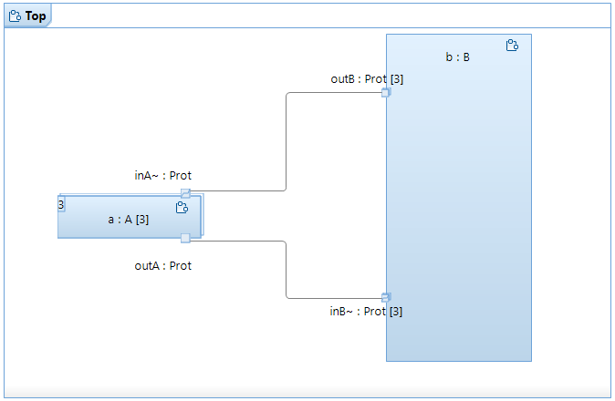

# Multiplicity2

This sample model is contributed by Queen's University [here](https://research.cs.queensu.ca/home/dingel/cisc844_F23/sampleModels/sampleModels.html).

* illustrates port replication and capsule instance replication

Part `b : B` is connected to replicated part `a : A [3]` via `outB` and `inB` ports with multiplicity `3`.
Part `b : B` sends message `m()` to a concrete instance connected on port with index `2`.
Part `a` sends message back.
In part `b : B` we are checking that a single message is received on port with index `2`.

This is the structure of capsule Top:

