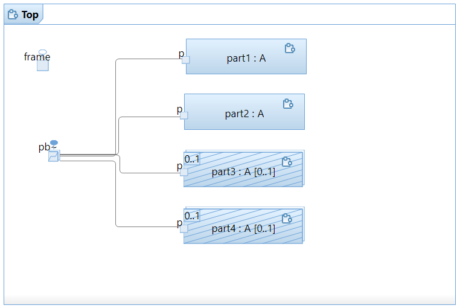

# port_multiplicity_03

There are 4 instances of capsule `A`, two of them are fixed, others are optional and created from `Top` statemachine.
Port `pb` is defined with multiplicity `4` and is connected to all parts.
Port `pb` is also defined as `Notification` and it will get `rtBound` events when a new instance is connected.

After all 4 instances of capsule `A` are properly bound, test case exits with PASS. 

This is the structure of capsule `Top`:

