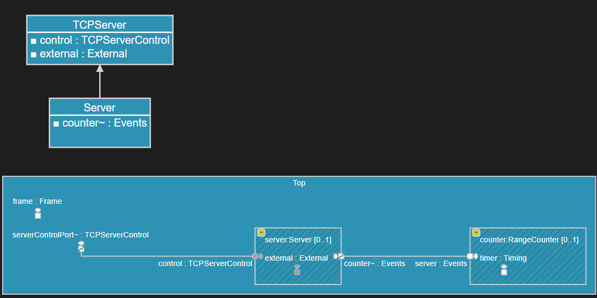

# TcpServer Library
A library for [DevOps Code RealTime](https://secure-dev-ops.github.io/code-realtime) which allows a realtime application to communicate over TCP with other applications.

## Usage

This library contains a capsule [TCPServer](TCPServer.art) which allows external applications to communicate with a Code RealTime application over TCP. Create a capsule in your application that inherits from [TCPServer](TCPServer.art), and then create a capsule part typed by your capsule. This capsule part (referred to as the "TCPServer capsule part" below) acts as the connection point to the remote application(s) that your application now can communicate with.

It's possible to implement a custom handling of incoming messages, but the default implementation supports messages on a certain JSON format. It allows external applications to, for example, send events on the ports of your TCPServer capsule. Here is an example (refer to the picture above):

`
{ "command": "sendEvent", "port" : "counter", "event" : "setMax", "data" : "int 15" }
`

To implement your own custom handling of received messages, override the operation `TCPServer::handleReceivedMessageCustom()` and set the config property `defaultHandlingOfReceivedMessages` to false.

## Build the Library
To make use of this library add the TC [tcpServerLib.tcjs](tcpServerLib.tcjs) as a prerequisite of the executable TC for your Code RealTime application.

Note that the TC [tcpServerLib.tcjs](tcpServerLib.tcjs) is designed to be built only as a prerequisite of an executable TC. It will automatically reuse some of the TC properties from the top executable by calling `TCF.getTopTC()`. Here is an example of such a TC property:

`
tc.targetRTSLocation = TCF.getTopTC().eval.targetServicesLibrary;
`

## Configuration Properties
Configuration properties are defined as member variables of the `TCPServer_Config` struct. You can programmatically override the property values you want to change by overriding the operation `init()` in your capsule that inherits from `TCPServer`. For example:

`
config.remotePort = 2235;
`

The following configuration properties are available:

- **defaultHandlingOfReceivedMessages**:boolean 
If true, all incoming TCP messages are assumed to be string-encoded JSON objects according to the format described below. Set to false if you wish to implement your own custom handling of incoming messages.
- **maxWaitForReply**:integer
The max number of milliseconds to wait for the Code RealTime application to reply to a request for sending or invoking an event to it. If the TCPServer doesn't get a confirmation from the application within the specified time limit, it will assume that the Code RealTime application failed to receive the event and return an error message.
- **maxSupportedClient**:integer
The maximum number of supported clients.
- **port**:integer
The TCP port in the Code RealTime application used for incoming messages.
- **remoteHost**:string
The name or IP address of the machine where the remote application (that will receive outgoing messages) runs.
- **remotePort**:integer
The TCP port on which the remote application (that will receive outgoing messages) listens.
- **logToStdOut**:boolean
By default various log message are printed to stdout. This can help troubleshooting while developing. Set this property to false to disable such printouts.

## JSON Format of Incoming Messages
The default implementation (in `TCPServer::handleReceivedMessageDefault()`) expects incoming TCP messages to be a string encoded JSON object. The object must have the property `command` set to one of the commands listed below. Which other properties on the JSON object that are expected depends on the command.

### sendEvent
Send an event into the application through a port on the TCPServer capsule part.
Example:  

`
{ "command": "sendEvent", "port" : "trafficLight", "event" : "test_int", "data" : "int 15" }
`

- **port**:string *[mandatory]*
The name of a port on the TCPServer capsule part through which to send the event.
- **event**:string *[mandatory]*
The name of an event defined in the protocol that types the port specified above. The event should be an "outEvent" if the port is not conjugated. If it is conjugated the event should be an "inEvent".
- **data**:string *[optional]*
The ASCII encoding of the data object to pass with the event.
- **portIndex**:integer *[optional]*
If the port is replicated (i.e. its multiplicity is > 1) you can specify the index of the port instance you want to send the message to. Omitting the portIndex on a replicated port means that the event will be broadcasted through all port instances. Port indices are zero-based.
- **priority**:string *[optional]*
The priority at which the event should be sent. The default priority is "General". Valid priorities are (from highest to lowest) "Panic", "High", "General", "Low" and "Background". 
- **incomingEvent**:boolean *[optional]*
By default an event that is sent to the Code RealTime application will be sent as an outgoing event on the specified port. This means it will be routed via the connector that is connected to that port and eventually be received by another capsule instance at the other end of the connector path. However, sometimes you may instead want the event to be received by the TCPServer capsule instance itself. In this case you should set the "incomingEvent" property to "true" and make sure the TCPServer capsule is prepared for handling the received event.

The response is a JSON object with the following properties:

- **status**:string 
'ok' if the command was successful, otherwise 'error'.
- **msg**:string
A message clarifying the status (especially if the status is 'error').

### invokeEvent
Invoke an event into the application through a port on the TCPServer capsule part. The reply message(s) are returned.
Example:  

`
{ "command": "invokeEvent", "port" : "tester", "portIndex" : 6, "event" : "inv", "data" : "int 12" }
`

- **port**:string *[mandatory]*
The name of a port on the TCPServer capsule part through which to invoke the event.
- **event**:string *[mandatory]*
The name of an event defined in the protocol that types the port specified above. The event should be an "outEvent" if the port is not conjugated. If it is conjugated the event should be an "inEvent".
- **data**:string *[optional]*
The ASCII encoding of the data object to pass with the event. This encoding is on the same format as you for example see if tracing the event during a model debug session.
- **portIndex**:integer *[optional]*
If the port is replicated (i.e. its multiplicity is > 1) you can specify the index of the port instance you want to invoke the event to. Omitting the portIndex on a replicated port means that the event will be broadcasted through all port instances. Port indices are zero-based.
. 

The response is a JSON object with the following properties:

- **status**:string 
'ok' if the command was successful, otherwise 'error'.
- **msg**:string
A message clarifying the status (especially if the status is 'error').
- **result**:array
An array of JSON objects representing the reply messages. There will be one object for each reply. The objects have the following properties.
  - **event**:string
  Name of the reply event.
  - **type**:string
  Data type of the reply event.
  - **data**:string *[optional]*
  The ASCII encoding of the data object attached to the reply event. This encoding is on the same format as you for example see if tracing the event during a model debug session.
  - **isValid**:boolean *[optional]*
  This property is only present (and set to false) if the JSON object represents an invalid reply event. This for example happens if the receiver did not make an explicit reply, even if the reply event contains data. No other properties will be present for an invalid reply event.

### getPorts
Get a list of all ports of the TCPServer capsule part and the events that can be sent through them.
Example:  

`
{ "command": "getPorts" }
`

The response is a JSON object with the following properties:

- **status**:string 
'ok' if the command was successful, otherwise 'error'.
- **msg**:string
A message clarifying the status (especially if the status is 'error').
- **result**:array
An array of JSON objects representing the ports of the TCPServer capsule part. There will be one object for each port. The objects have the following properties.
  - **name**:string
  Name of the port.
  - **events**:array
  The names of the events that can be sent through this particular port.

NOTE! This command can also be performed as an HTTP request. This makes it easy to quickly check with a web browser if a Code RealTime application is running and listening on a certain TCP port. For example: http://localhost:9911/getPorts

## JSON Format of Outgoing Messages
All messages that are not handled by the TCPServer capsule part are considered to be outgoing messages and will be sent to a remote application. Note that the remote application to which outgoing messages are sent does not have to be the same remote application that sends incoming messages to the Code RealTime application.

Outgoing messages are string encoded JSON objects on the same form as the `sendEvent` or `invokeEvent` objects described above. This makes it possible to wire together multiple Code RealTime applications to build a distributed system of communicating applications. The output of one executable can be consumed by another executable, and the applications become logically connected through the names of the TCPServer capsule ports.

- **command**:string
Set to "sendEvent" if the outgoing message was sent, or "invokeEvent" if the outgoing message was invoked.
- **event**:string
Name of the event.
- **type**:string
Data type of the event.
- **data**:string *[optional]*
The ASCII encoding of the data object attached to the event. This encoding is on the same format as you for example see if tracing the event during a model debug session.
- **port**:string
The name of a port on the TCPServer capsule part on which the event arrived.
- **portIndex**:integer
The zero-based index of the port instance on which the event arrived. If the port is not replicated (i.e. its multiplicity is 1) then this property is always 0.
- **priority**:string
The priority at which the event is sent. It defaults to "General". Possible priorities are (from highest to lowest) "Panic", "High", "General", "Low" and "Background". This property is only present if the event was sent. Invoked events do not have it.

The remote application can make a reply on an invoked event by sending a response for the received TCP string. The response string should be a string encoded JSON object representing a reply command, i.e. the "command" property should be set to "reply".
Example:  

`
{ "command": "reply", "port" : "camera", "event" : "imageFilename", "data" : "StdString \"D:/temp/test.jpg\"" }
`

- **port**:string
The name of a port on the TCPServer capsule part on which the reply will be made (should be the same port on which the invoked event arrived).
- **event**:string
The name of the reply event.
- **data**:string *[optional]*
The ASCII encoding of the data object to be attached to the reply event. This encoding is on the same format as you for example see if tracing the event during a model debug session.

Note that the remote application must always send a response for a TCP request it receives, even if it doesn't want to reply on an invoked event. The Code RealTime application will wait until it has received a response. You can simply send back an empty JSON object to let it proceed its execution: 

`
{ }
`
