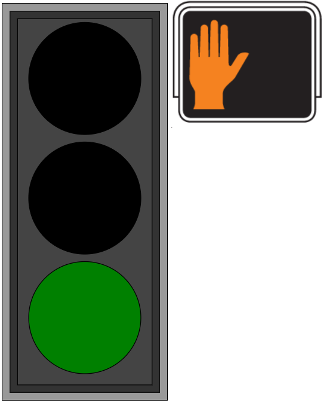

# traffic-light-web

This sample implements a traffic light system consisting of two lights (one for traffic and one for pedestrians) and a push button (for pedestrians to push when they want to safely cross the street). The realtime application uses the [TCPServer library](../TcpServer/README.md) in order to communicate with a Node.js web application. Information about current states of the lights are updated on the web page in real time, and pushing the button on the web page will inject the request from the pedestrian to cross the street. 

To be able to intercept the outgoing messages about light changes, the Node.js application embeds a simple TCP server. Hence, this sample implements bi-directional communication using two separate TCP servers (one in the Node.js application and one in the realtime C++ application).

## Starting the web server
`cd webapp`

`npm install`

`node app.js`

Open [http://localhost:4000/](http://localhost:4000/) in a web browser

## Launch the realtime application
`TLSystem.exe -URTS_DEBUG=quit -port=
 -remotePort=<RP> -remoteHost="<RH>"` 

All arguments are optional and have default values:
* port: 9911 (TCP port used by realtime app)
* remotePort: 2234 (TCP port used by web app)
* remoteHost: `127.0.0.1` (IP address or hostname where the web app runs)

## How the application works
When the application starts the top capsule `TLSystem` incarnates the optional `server` part with a `WebServer` capsule instance. This capsule inherits from the `TCPServer` capsule which is responsible for the communication with the Node.js application. The `WebServer` runs in its own thread to avoid that the TCP communication affects the performance of the rest of the application. 

The other capsules `TrafficLight` and `PedLight` represent the two lights and have state machines that implement the switching of the lights based on timers. The `TrafficLight` controls the `PedLight` so that pedestrians can safely cross the street when they request to do so. Note that both light capsule state machines have to wait initially for the `WebServer` to become available, and they do this by means of notification ports.

The Node.js application makes a "pedestrian" request when the button is pushed on the web page. From the realtime application's point of view this becomes an incoming TCP request which is mapped to the injection of the `pedestrian` event on the `trafficLight` port of `WebServer`. In the other direction, outgoing events about light changes become TCP requests which the TCP server in the Node.js application will handle. It then uses web sockets for updating the web time accordingly.

The application also supports a `pedestrianCustomTime` event which has a parameter the specifies how many seconds the pedestrians will get for crossing the street. There is no user interface on the web page for sending this event, but you can use the Art Debugger for injecting it. This emulates a situation where a new feature has been implemented in a realtime application for which no user interface (or hardware) is yet available.
