Art is a language for developing stateful and event-driven realtime applications. By **stateful** we mean that the application consists of objects whose behavior can be described with state machines. By **event-driven** we mean that these objects communicate with each other by sending events, which can cause their state machines to transition from one state to another. 

The Art language is an extension of C++, that provides high-level concepts not directly found in the C++ language. All these high-level concepts are transformed into C++ code by the [Art compiler](building/art-compiler.md). Generated code uses a run-time library known as the **TargetRTS** ([Target RunTime System](../target-rts)). The TargetRTS is a C++ library that acts as a layer between the generated code and the underlying platform (hardware, operating system etc) on which the realtime application runs. 


Art is well suited for describing both the behavior and structure of a realtime application, but it uses C++ as expression and action language. C++ is also used for declaring types, variables, functions etc. As a rule of thumb, Art uses C++ for everything where C++ is a good fit, and only provides new language concepts where no appropriate constructs exist in C++. This means that if you already know C++, you can quickly learn Art too, and existing C++ code you may have already written can still be used.

## Concepts and Terminology
In Art the concept of a **capsule** is central. A capsule is like a C++ class, but with a few differences and extensions. A C++ class is **passive** in the sense that a caller can access its public member functions and variables at any time. Hence a C++ object always executes in the context of the caller, and when a member function is called, the caller is blocked until it returns. A capsule, however, is **active** and has its own execution context. This means that we never call a capsule member function or access a capsule member variable from outside the capsule itself. Instead we communicate with the capsule by sending **events** to it. Each capsule has a queue of events it has received and the events will be dispatched to the capsule one by one. The sender of the event is not blocked, as the event will be handled by the capsule asynchronously when it is later dispatched.

The picture below shows 3 capsule instances each holding a queue with events that have been received, but not yet dispatched. Note that this picture is conceptual. In a real implementation several performance optimizations are applied, for example it's common to let a single thread drive more than one capsule instance, and several capsule instances can share a common event queue. But from a conceptual point of view each capsule has its own queue of events that are waiting to be dispatched to it. Events have a **priority** which determines how they are ordered in the queue. Events with high priority are placed before events with lower priority, and if two events have the same priority they are ordered according to when they arrive.


A capsule may have ports. A **port** is typed by a **protocol** which defines the events that may be sent in to the port (these are known as **in-events**), as well as the events the capsule itself may send out through the port for others to receive (these are called **out-events**). Ports can be used both for internal and external communication. A port used for external communication is called a **service port**. Together the service ports constitute the communication interface of the capsule, and decides what "services" the capsule provides for other capsules to use.

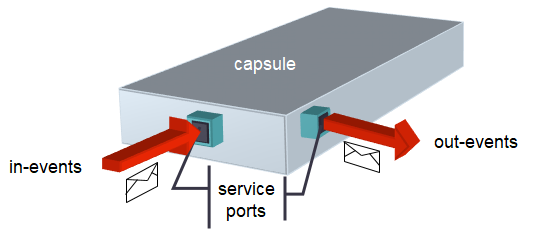

A simple capsule which only handles a small number of events, may be able to handle all these events using a single state machine. However, when new ports are added (or new events in protocols typing existing ports), the capsule interface grows and the state machine has to grow with it, since there will be more events for it to handle. Eventually a point is reached where it will not be practical for a capsule to handle any more events in its own state machine, because it has grown too large or complex. If not before, this is the time to define a **composite structure** for the capsule. 

A composite structure is created by decomposing a capsule using capsule parts. A **capsule part** (or for simplicity just **part**) is typed by another capsule and is a way for a capsule to delegate some of its responsibilities to other capsules. Such a decomposition is purely an implementation detail that is not visible from the outside of the capsule. When you send an event to a capsule you cannot know if the capsule will handle the event itself, or if it will forward the event to another capsule typing one of its capsule parts. The ability to decompose a capsule into parts is important for managing complexity. When a capsule has grown too big and complex you can decompose it into capsule parts without changing the communication interface of the capsule. 

Ports of capsules typing capsule parts are connected to each other by means of connectors. A **connector** is a conceptual construct for showing how events are routed in the internal structure of a capsule. At run-time connectors don't exist, and ports are directly connected to each other. Because of this, it's not mandatory to use connectors. You can also choose to dynamically connect (and disconnect) ports at run-time. Although this provides for more flexibility, it has the drawback of making it impossible to statically visualize the communication paths of a capsule. Ports that connect statically to other ports via connectors are called **wired** ports. Ports that are connected dynamically without use of static connectors are called **unwired** ports. 

The picture below shows the structure of a capsule `Top` which consists of two capsule parts `ping` and `pong` each holding a capsule instance (a `Pinger` capsule and a `Ponger` capsule respectively). The connector between the wired ports `p` on these capsules makes it possible for these capsules to communicate with each other. Communication can also happen using the unwired ports `q1` and `q2` if they are connected at run-time. The picture also shows that the capsule `Ponger` is further decomposed using a capsule part `inner`. All events sent to port `p` of `Ponger` will be further routed to port `i` of the `Internal` capsule. 


Regardless if ports are statically connected by connectors (wired ports), or dynamically connected at run-time (unwired ports), they must be compatible with each other. This means that the out-events of one port must match the in-events of the other port, for the ports to be possible to connect. This constraint ensures that events are never lost when traveling between two connected ports. To make it possible to describe the events that may travel between two connected ports using a single protocol, it's possible to make one of the ports **conjugated**. For a conjugated port the meaning of in-events and out-events are swapped, so that the in-events are the events that may be sent out through the port, and the out-events are the ports that may be sent to the port. In the picture above port `q1` is non-conjugated () while port `q2` is conjugated ().

Both capsule parts and ports may have multiplicity. You can think about a capsule part with multiplicity > 1 as an array that holds capsule instances at run-time. In the same way you can think about a port with multiplicity > 1 as an array that holds connections to port instances at run-time. The multiplicity of ports and parts must match when connecting two ports with each other. Once again, this constraint ensures that events will not be lost when traveling between the connected ports at run-time. The picture below shows a capsule with a part and a port that both have multiplicity > 1. In structure diagrams such parts and ports are shown as "stacked boxes".

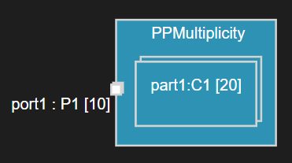

In addition to regular C++ member functions a capsule may have a **state machine** as its behavior. A state machine describes how an instance of the capsule may move between different **states** through its life-time. A **transition** that connects a source state with a target state may be **triggered** when an event from a capsule's event queue is dispatched. Several conditions must hold true for the transition to trigger. For example, the event must match a **trigger** that specifies the expected type of event and the port on which it was received. It's also possible to associate a boolean **guard** condition with the transition and/or with the trigger which must be true for the transition to trigger. A transition may have an **effect**, which is a piece of C++ code that executes when the transition gets triggered.

The picture below shows a state machine containing three states and three transitions. The presence of transition guard code is shown with a yellow dot and the presence of transition effect code is shown with a blue dot. Both these are C++ code snippets that are embedded in the Art file.   

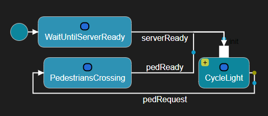

When a capsule instance is created (this is sometimes referred to as capsule **incarnation**), it's state machine starts to execute by triggering the transition that goes out from the **initial** state (the big blue circle in the above diagram). Each state machine must have exactly one such initial state with an outgoing transition. Since this **initial transition** is triggered automatically when the capsule instance is created it cannot have any constraints like mentioned above. The initial transition is an example of a **non-triggered transition** since it cannot have triggers. 

The path from the source state to the target state can sometimes consist of more than one transition. In that case only the first of these is a **triggered transition** that may have triggers that specify when it will trigger. Once the first transition in this path has triggered, subsequent non-triggered transitions will always execute, one by another according to how they are connected in the state machine. However, also non-triggered transitions (with the exception of the initial transition) may have guards. Such guards are usually evaluated before the triggered transition triggers to ensure that they all are enabled, so that it's guaranteed that the target state can be reached. There is one exception to this rule, for transitions that leave a **choice**. Such guards are only evaluated once the choice has been reached to dynamically decide which outgoing transition to take next. This also means that guards of such transitions must be mutually exclusive, or there is a risk that the state machine will get stuck in the choice.

In the state machine shown below the transitions `t2` and `t5` are triggered transitions, while other transitions are non-triggered. Transition `t5` can only be triggered if either the guard of `t7` or `t6` is true, while `t2` can be triggered even if neither the guard of `t3` nor `t4` is true. The target of transition `t5` is a **junction** which is used for either splitting or merging transition paths depending on evaluated guard conditions.

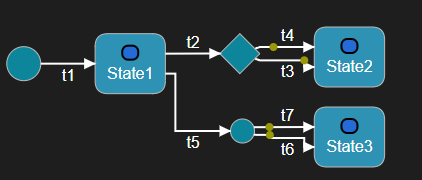

A state may be decomposed by a sub state machine. Such a state is called a **composite state** and a state machine that has composite states is called a **hierarchical state machine**. Transitions enter a composite state through an **entry point** and exit it through an **exit point**. 

Usually an entry point is connected to a nested state inside the state machine of the composite state, but it can also connect to a **deep history**. Reaching the deep history of a composite state means that all sub states that were previously active will become active again. Hence, deep history is a way to restore a composite state so all its nested states will be reactivated again recursively.

The picture below shows a state machine with a composite state `Composite` containing two nested states `S1` and `S2`. When this state machine starts to execute state `S1` first becomes active since `Composite` is entered using the `ep1` entry point. Later, when leaving `S2` through the `ex1` exit point, state `X` becomes active. Then when leaving `X` through the transition that connects to the `ep2` entry point the state `S1` once again becomes active since `ep2` is connected to the deep history. Of course, whenever a nested state is active, the enclosing composite state is also active. At any point in time a state machine has an active **state configuration**, which consists of the set of currently active states.

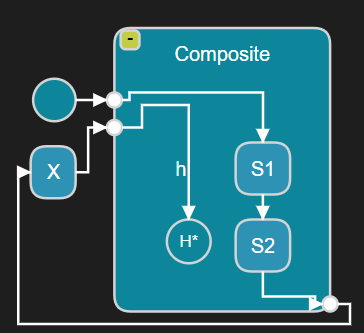

A state may have an **entry action** and/or **exit action** which is a C++ code snippet that gets executed whenever the state is entered or exited. Note that state entry actions for nested states also run when those states are entered because of a deep history. In state diagrams the presence of entry and/or exit actions are shown by icons just below the state name. In the state machine shown below state `S1` has an entry action, state `S2` has an exit action and state `S3` has both an entry and an exit action.

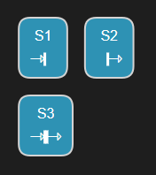

A transition where the source and target state is the same state is called a **self-transition**. A special kind of self-transition is an **internal transition**, which is a transition that when triggered doesn't leave the current state. Hence, when an internal transition is triggered the active state configuration remains unchanged, and neither the entry nor exit action of the state gets executed. In the state machine shown below the state has two self-transitions; `t` which is a regular self-transition (a.k.a. **external self-transition**) and `it` which is an internal transition. Since a state may have a large number of internal transitions they are not shown inside the state symbol, but if you select the state symbol you can see them in the Properties view.

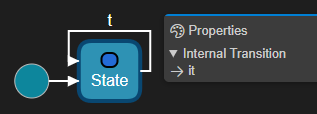

State machines can not only be defined for capsules but also for regular classes. This can be useful if you want a plain passive C++ class to have a state machine. Contrary to a capsule a **class** may not have ports and doesn't execute in its own context. It's therefore common to associate such a class with a capsule that it can use for sending events through its ports. Transitions of a passive class state machine are triggered by calling **trigger operations** on the class. Such operations have no code, but just trigger transitions in the class state machine.

The realtime application needs to designate one capsule as the **top capsule**. This is done in the **transformation configuration**, which is a file containing all the properties used for building the application (e.g. code generator options, compiler settings etc.). There is no language construct in Art for defining a top capsule; any capsule that you define can act as the top capsule. However, in practise you typically decide at an early stage which capsule that will be the top capsule.

If you build a library rather than an executable you don't have a top capsule.

The top capsule is the entry point of the realtime application. When it starts to execute one instance of the top capsule will be automatically created, and its state machine starts to execute.

## Embedded C++ Code
Art uses C++ as action and expression language. It also uses C++ for defining types, variables and functions. A C++ code snippet can be embedded into Art at many places by enclosing it with backticks. Here is an example of how to write the code that should execute when a transition triggers:

``` art
S1 -> S2 on timer.timeout
`
    std::cout << "Hello World!" << std::endl;
`;
```

Here is another example that shows how to include some C++ code as the header preface of a capsule:

``` art
capsule BrewControl {
    [[rt::impl_preface]]
    `
        #include <iostream>
    `
};
```

Code snippets can not only be associated with Art language constructs as in the above two examples, but can also be placed at the Art file level. There are two such file-level code snippets:

* **Declarations (rt::decl)**

May contain arbitrary C++ declarations. All these code snippets will be generated into a C++ header file with the same name as the Art file.

* **Implementations (rt::impl)**

May contain arbitrary C++ implementations. All these code snippets will be generated into a C++ implementation file with the same name as the Art file.

As an example, assume we have an Art file `sample.art` with the following contents

``` art
[[rt::decl]]
`
    typedef C* Cptr;
    Cptr func1();
`
[[rt::impl]]
`
    Cptr func1() {
        return nullptr;
    }
`
```
Two C++ files will be generated from this Art file:  

`sample.h`
``` cpp
typedef C* Cptr;
Cptr func1();
```

`sample.cpp`
``` cpp
#include "sample.h"

Cptr func1() {
    return nullptr;
}
```

File-level code snippets are useful whenever you need to include some C++ code in your application that doesn't naturally belong to any particular Art element. They can for example be used for declaring and implementing utility functions or types that are needed by many different Art elements. All C++ files that are generated from Art elements in an Art file that contains file-level code snippets will automatically include the header file that is generated for those code snippets. If you want to use the C++ declarations also from another generated file, you need to manually add an `#include` for that header file using a code snippet on the Art element that corresponds to that generated file.

For example, a protocol defined in `sample.art` can use the type `Cptr` directly without adding an `#include`.

``` art
protocol MyEvents {      
      out alert(`Cptr`);
};
```

However, a capsule defined in `sample2.art` needs to include `sample.h` to make that type available.

``` art
capsule Cx {
    [[rt::header_preface]]
    `
        #include "sample.h"
    `
    [[rt::decl]]
    `
        protected:
            Cptr m_ptr;  
    `
    // ...
};
```

Here an rt::header_preface code snippet is used for making the generated capsule header file include `sample.h` while an rt::decl code snippet is used for declaring a member variable `m_ptr` for the capsule. See the documentation of the different Art elements in the [Art Language Reference](#art-language-reference) to learn about what code snippets that are available for each kind of Art element.

## Textual and Graphical Notations
The Art language is a textual language, but many parts of it also have a graphical notation. For example, a state machine can be shown using a graphical state diagram, and the composite structure of a capsule can be shown in a structure diagram. Relationships between capsules, protocols and classes, such as inheritance, can be shown in class diagrams.

Below are examples of these three kinds of diagrams:

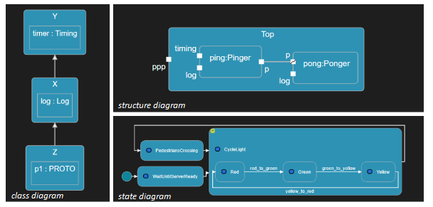

## Syntax
Art uses a syntax that should look familiar to developers with knowledge about languages like C++ and Java. 

* Declarations are terminated with a semicolon `;`
* Multiple elements declared in the same language construct uses comma `,` for separating the elements
* Curly brackets `{}` are used for grouping nested elements
* Square brackets `[]` are used for specifying cardinality (i.e. multiplicity) of elements
* A dot (`.`) is used as scope resolution operator
* Line `//` and block `/* */` [comments](#comments) may be freely used for commenting

### Names and Keywords
Names of Art elements must be valid C++ identifiers since they will be used as names of C++ definitions in generated code. Names also must not clash with names used in the TargetRTS. Don't worry. The Art language editor will let you know if you choose a name that won't work. 

Just like any language, Art has certain keywords that are reserved and which cannot be used as names. These keywords are listed below:

| Art keywords | | |  |  |
|----------|:-------------|:-------------|:-------------|:-------------|
|behavior|capsule|choice|class|connect
|entry|entrypoint|exclude|exclude|exit
|exitpoint|fixed|history|in|initial
|junction|notify|on|optional|out|
|part|plugin|port|protocol|publish
|redefine|service|state|statemachine|subscribe
|template|trigger|typename|unwired|when
|with

Art is a case-sensitive language and names may use any capitalization. However, just like with most languages, there are conventions for how to capitalize names. Those conventions are described below where each Art language construct is described in detail.

### Comments
The same kinds of comments as in C++ can be used, i.e. line and block comments.

``` art
// line comment

/* block comment */

/* multi-line
   block comment */
```

## Capsule
A capsule defines an active class with its own execution context. It may have [ports](#port) through which it can receive [events](#protocol-and-event). A capsule has a [state machine](#state-machine) that describes how instances of the capsule transitions between different states in the response to received events.

Names of capsules are typically nouns, often describing something that performs some form of activity. For example "Controller", "TrafficLight" or "FaultHandler". By convention names of capsules start with uppercase.

[Embedded C++ code](#embedded-c-code) can be used for declaring member variables, member functions, nested types etc for the capsule. 

Here is an example of a capsule with a simple state machine and a member variable.

``` art
capsule Elevator {
    [[rt::decl]]
    `
        unsigned int currentLevel = 0;
    `
    statemachine {
        state Waiting;
        initial -> Waiting;
    };
};
```

!!! note 
    Capsule member variables and member functions may be private or protected, but should usually not be public. To avoid threading issues all communication with a capsule should be done using events, and therefore public members are not recommended. An exception is [capsule constructors](#capsule-constructor) which need to be accessible from other capsules that create instances of the capsule using a capsule factory. If you anyway let a capsule have public members you need to ensure they are only accessed from the same thread that runs the capsule.

The example above uses an `rt::decl` code snippet for declaring a capsule member variable. Here is the list of all code snippets that can be used for a capsule:

<p id="capsule_code_snippets"/>
| Code snippet |C++ mapping |Example of use |
|----------|:-------------|:-------------|
| rt::header_preface |Inserted at the top of the capsule class header file |Adding #includes
| rt::header_ending |Inserted at the bottom of the capsule class header file |Declaring a type alias for the capsule class
| rt::impl_preface |Inserted at the top of the capsule class implementation file |Adding #includes
| rt::impl_ending |Inserted at the bottom of the capsule class implementation file |Undefining a macro only used in a capsule implementation
| rt::decl |Inserted into the capsule class header file (inside the class) |Declaring a capsule member variable or function
| rt::impl |Inserted into the capsule class implementation file |Implement a capsule member function

### Capsule Constructor
Just like a regular class a capsule may have constructors. A capsule constructor is declared using an `rt::decl` code snippet and defined using an `rt::impl` code snippet. All capsule constructors have two mandatory parameters:

* **rtg_rts** This is the controller (`RTController*`) which will execute an instance of the capsule
* **rtg_ref** This is the part (`RTActorRef*`) into which the capsule instance will be inserted

After these parameters you can add your own parameters, to pass arbitrary initialization data to the capsule instance. Below is an example where a capsule `MyCap` has a reference variable `m_c`. To initialize this variable a capsule constructor is used.

``` art
capsule MyCap {
    [[rt::decl]]
    `
        public:
            MyCap(RTController*, RTActorRef*, MyClass&);
        private:
            MyClass& m_c;
    `
    [[rt::impl]]
    `
        MyCap(RTController* rtg_rts, RTActorRef* rtg_ref, MyClass& c) 
            :RTActor(rtg_rts, rtg_ref), m_c(c) { }
    `

    // ...
};
```

Note that a capsule constructor must call the `RTActor` constructor in its initializer..

## Protocol and Event
A protocol defines events that may be sent in to a [port](#port) (so called in-events) and events that may be sent out from the same port (so called out-events). By grouping events into protocols, and then typing ports with such protocols, we can precisely define which events the capsule may send and receive through that port.

By convention names of protocols start with uppercase, while names of events start with lowercase and use camelCase if the name consists of multiple words.

A protocol event may have a parameter, which enables it to carry data. You declare a parameter for an event by specifying the C++ type of the data to be carried by the event.

!!! note 
    An event can have at most one parameter. If you need to send multiple data objects with an event you can declare an event parameter of struct or class type.

Here is an example of a protocol that defines some in-events and some out-events:

``` art
protocol MachineEvents {
    in start();
    in startDeferred(`unsigned long` /* milliseconds */);
    
    out success();
    out error(`std::string` /* error message */);

    in relayEvent(); out relayEvent();
};
```

The event `relayEvent` above is both an in-event and an out-event. Such **symmetric events** are useful in protocols typing ports the may receive and send the same events (for example a port that just forwards received events to another port). By convention a symmetric event is declared on a single line.

At run-time we often talk about a **message** rather than an event. A message is an instance of an event, similar to how a capsule instance is an instance of a capsule. In other words, a message is a run-time concept while an event is a design-time concept. 

## Port
A port defines a named point of communication for a capsule. A port is typed by a [protocol](#protocol-and-event) which defines the events that may be sent in to (in-events) and out from (out-events) the port. A port may be conjugated in order to swap the meaning of in-events and out-events. That is, a capsule may send out-events on its non-conjugated ports, but in-events for its conjugated ports. A port becomes conjugated if you add a tilde (~) after its name.

Ports are often named to describe the role or purpose of the communication that takes place on them. Note that when a capsule wants to send an event to another capsule it's the port name that is referenced, rather than the name of the receiver capsule (which the sender capsule shouldn't need to know about). By convention names of ports start with lowercase and use camelCase if the name consists of multiple words. 

Here is an example of a capsule with a few ports. Note that {$product.name$} provides several predefined protocols that can be used right away, for example `Timing`. Also note that you can declare multiple ports on a single line if the ports are of the same kind (`p1` and `p2` below are both service ports).

``` art
capsule Machine {
    service port control : MachineEvents;
    behavior port timer : Timing; // predefined Timing protocol
    service behavior port control2 : CtrlEvents;
    service port p1~ : MoreEvents, p2~ : OtherEvents;  

    // ...
};
```

Service ports constitute the externally visible communication interface for a capsule, and together they define which events can be sent to the capsule, and which events the capsule can send out for other capsules to receive. In a structure diagram the service ports are shown on the border of a capsule or part symbol.

A **behavior port** is logically connected to the behavior (i.e. [state machine](#state-machine)) of a capsule. This means that an event that a capsule receives on a behavior port will be handled by the state machine of that capsule. A non-behavior port, however, will simply route an event to another port to which it is connected. Every sent event will ultimately reach a behavior port (provided ports are properly connected), and the state machine of the capsule owning that behavior port will handle the event. In a structure diagram, behavior ports are connected to a small ellipse which represents the capsule state machine.


Note that ports can also be shown in a class diagram.

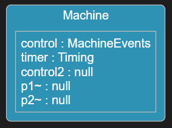

### Port Multiplicity
At run-time an instance of a port can be connected to a port instance on another capsule. Such connections is what make a sent event be routed from the port on which it is sent, through a number of non-behavior ports, until it finally reaches a behavior port. By default a port has single multiplicity (1) meaning that at most one such connection can be established. However, you can specify a non-single multiplicity for a port to allow for more connections to be created at run-time. 

In the example below a `Server` capsule has a port with multiplicity 100. At run-time an instance of that `Server` capsule can be connected to 100 different client ports, each of which can send events to the server.

``` art
capsule Server {
    service port clients : ComEvents[100];

    // ...
};
```

In a structure diagrams a port is shown as "stacked" if it has non-single multiplicity.


You can also use a C++ expression to specify the port multiplicity. This can for example be useful if the multiplicity is defined in C++ as a macro, a template parameter or a constexpr. For example:

``` art
capsule Server {
    service port clients : ComEvents[`NBR_CLIENTS`];

    // ...
};
```

### Notification Port
Every protocol contains two implicit events rtBound and rtUnbound. A port can choose to receive those events whenever a connection for the port is established (rtBound) or dropped (rtUnbound) at run-time. Declare a port as a notification port to receive these events. 

``` art
capsule Server {
    service notify port clients : ComEvents[100];

    // ...
};
```

Port notifications are useful in dynamic systems when capsules need to wait until other capsules are ready, before they can start to communicate with those capsules. For example, a client may need to wait until a server is ready before it sends a request to that server. In the same way it's often useful to get notified when a connection is dropped, since that means communication on that port should no longer take place.

### Unwired Port
Ports are by default wired, meaning that they should be connected with [connectors](#connector) to specify statically how events will be routed. Having a static connector structure defined has the benefit that it becomes possible to look at a capsule's structure diagram to see how events received by the capsule will be routed at run-time. However, in some dynamic systems it's not possible to describe this statically. Ports may be connected and disconnected dynamically and the run-time connections between port instances may hence vary over time. If you need this flexibility you can declare ports as unwired.

Here is an example of an application where a client capsule can connect to different kinds of server capsules. Sometimes it may be connected to `server1` and sometimes to `server2`. It is therefore not possible to describe the connections of Top statically using connectors, and we can instead declare the ports as unwired.

``` art
capsule Top {
    part client : Client;
    part server1 : Server;
    part server2 : Server;

    // ...
};

capsule Client {
    service behavior unwired port p : Protocol;
    
    // ...
};

capsule Server {
    service behavior unwired port p~ : Protocol;
    
    // ...
};
```

!!! note 
    Only use unwired ports when required. It's strongly recommended to use wired ports whenever possible to enable the visualization of the connector structure in a structure diagram. When unwired ports are required you should write a comment that describes how they will be connected at run-time, since this often cannot easily be concluded by looking at the C++ code of the capsule.

An unwired port is always a behavior port. In a structure diagram an unwired port is drawn with a hollow ellipse, while a wired behavior port is drawn with a filled ellipse. In the structure diagram below port `q` is wired while port `p` is unwired.


An unwired port is either a **service access point** (SAP) or a **service provision point** (SPP) depending on the role it plays in a dynamic connection with another unwired port. The capsule that owns the SAP port uses it to subscribe to a service that is published by another capsule by means of an SPP port. The capsule with the SAP port is often called "client" or "subscriber" while the capsule with the SPP port is often called "server" or "publisher".

Unwired ports get connected by means of registering them under a service name that should be unique in the application. Registration of unwired ports can either happen automatically when the container capsule instance is created, or programmatically at a later point in time. It's also possible to deregister unwired ports in order to disconnect them. You can specify how an unwired port should be registered by means of the following properties:

* [registration](#registration) specifies when an unwired port should be registered
* [registration_name](#registration_name) specifies the service name with which the port should be registered

If you choose to register an unwired port programmatically (using the TargetRTS functions `registerSPP` and `registerSAP`) you decide at registration time whether the port should be an SAP or SPP port. However, if you choose to instead let the port be registered automatically you need to declare the port as either a `subscribe` (SAP) or `publish` (SPP) port. Here is the same example again, but now with automatic registration of the unwired ports using the service name `myService`:

``` art
capsule Client {
    subscribe behavior port sap [[rt::properties(
registration_name = "myService")
]] : Protocol;
    
    // ...
};

capsule Server {
    publish behavior port spp~ [[rt::properties(
registration_name = "myService")
]] : Protocol;
    
    // ...
};
```

Note that the keyword `unwired` is implicit when you declare a port as either a `subscribe` or `publish` port.

## Connector
Connectors describe how events are routed within a capsule by connecting ports in its composite structure. They make it possible to see in a structure diagram which parts of a capsule that can communicate with each other. Each connector connects exactly two ports with each other. A connected port may either be a port of the capsule itself, or a port of a capsule that types one of its capsule parts. A few constraints decide if it's possible to connect two ports:

1) The ports must be wired. [Unwired ports](#unwired-port) cannot be connected.
   
2) The ports must be typed by the same protocol.

3) The ports' conjugations must match. If the ports are at the same level in the capsule's structure (e.g. both ports belong to capsules typing capsule parts owned by the same capsule), then the connected ports must have the opposite conjugation. This is because events that are sent out from one of the ports must be able to be received by the other port. However, if the ports are at different levels in the capsule's structure (e.g. one of them belongs to a capsule typing a capsule part owned by the capsule and the other belongs to the capsule itself), then the ports must have the same conjugation. This is because in this case events are simply delegated from one capsule to another.

The example below shows the structure diagram of a capsule `Top` where we can see two connectors. 

``` art
capsule Top {    
    part ping : Pinger, pong : Ponger;  
    connect ping.p1 with pong.p2;       
    // ...
};
  
capsule Internal {
    service behavior port i~ : PROTO;  
    // ...
};

capsule Pinger {
    service behavior port p1 : PROTO;      
    // ...
};

capsule Ponger {    
    service behavior port p2~ : PROTO;    
    part inner : Internal;
    connect p2 with inner.i;
    // ...
};
```


The connector between `p1` and `p2` goes between two ports on the same level which is why these ports must have opposite conjugation. The connector between `p2` and `i` goes between two ports at different levels which is why these ports must have the same conjugation. The non-behavior port `p2` is a so called **relay port** (it just relays all events it receives to another port) and the connector between `p2` and `i` is sometimes called a **delegation connector** to describe the fact that capsule `Ponger` uses it for delegating some of its responsiblities to the capsule `Inner`. Note that relay ports can be optimized away so they don't exist at run-time (i.e. at run-time port `p1` can be directly connected to `i`).

A connector doesn't have a direction, so it doesn't matter in which order it connects the two ports. That is, connecting X with Y is equivalent to connecting Y with X.

## Part
A capsule can be decomposed by means of parts (also called "capsule parts" to emphasize that they are parts of a capsule). A part is a container that at run-time may hold one or many capsule instances. The part has a multiplicity that specifies the maximum number of capsule instances it can contain at run-time, and it has a type which is another capsule. All capsule instances must either be of that specific capsule type, or of a capsule type that inherits from it.

It's common to name parts according to the capsule that types them. For example, a part typed by a capsule `Controller` may be called `controller`, `ctrl` or perhaps `theController`. By convention part names start with lowercase and use camelCase if the name consists of multiple words. 

There are three kinds of parts which determine how and when they will be populated with capsule instances.

1) **Fixed part**
   
In a fixed part capsule instances are created automatically when the container capsule is created, and destroyed when the container is destroyed. Fixed parts by default have multiplicity 1. Such a part will always contain one and only one instance of the capsule that types the part.

2) **Optional part**
   
In an optional part capsule instances don't have a strong lifetime relationship with the container capsule as is the case for fixed parts. The capsule instances can be created programmatically using the Frame service of the TargetRTS at some point after the container capsule has been created, and they can be destroyed before the container capsule is destroyed. However, at the latest they will be automatically destroyed when the container is destroyed. Optional parts by default have multiplicity 0..1. This means that it may either contain zero or one capsule instance at any point in time. The presence of zero in the multiplicity is what makes the part optional.
   
3) **Plugin part**
   
A plugin part is similar to an optional part in that it is populated by capsule instances programmatically. However, the capsule instances are not created in the plugin part but instead imported into the plugin part from another part. Typically such a capsule instance is first created into an optional part, and then at some later point in time imported into a plugin part. Later it can be deported (i.e. removed) from the plugin part and perhaps imported into another plugin part. This makes it possible to create very dynamic composite structures where the same capsule instance can play different roles in different parts over time. Moving a capsule instance by deporting it from one plugin part and then importing it in another plugin part is more efficient than destroying the capsule instance in one optional part and then creating another capsule instance in another optional part. Plugin parts are typically used together with [unwired ports](#unwired-port). In general it's possible to import a capsule instance into more than one plugin part at the same time, but it can only be imported if its ports are not already bound in its current location. Plugin parts by default have multiplicity 0..1.

In the example below the capsule `C` contains a few parts of different kinds and multiplicities. Note that you may declare multiple parts on the same line if they are of the same kind (both `c` and `d` below are optional parts).

``` art
capsule C {
    part a : D;
    fixed part b : D[4];
    optional part c : D, d : D[0..5];
    plugin part e : D;
    part f : D[`COUNT`];

    // ...
};
```

Part `a` is fixed with multiplicity 1 since neither kind nor multiplicity is specified for it. Part `b` is also fixed (using the "fixed" keyword for more clarity) and with multiplicity 4. When an instance of capsule `C` is created 5 instances of capsule `D` will be automatically created. One of these instances will be inserted into part `a` and the others into part `b`. These instances will remain there until the `C` capsule instance is destroyed.

Part `c` is optional with multiplicity 0..1. At run-time it can contain at most one instance of capsule `D`. Part `d` is also optional but can contain up to 5 instances of `D` as specified by its multiplicity 0..5.

Part `e` is plugin with the default multiplicity 0..1. At run-time at most one instance of capsule `D` can be imported into it. That instance must already have been created in another part, for example part `c`.

Part `f` uses a C++ expression for specifying the multiplicity. This can for example be useful if the multiplicity is defined in C++ as a macro, a template parameter or a constexpr.

Parts can be shown in a structure diagram:

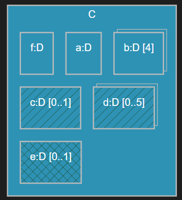

Parts are shown as "stacked" if they have non-single multiplicity. Optional parts are shown with a "diagonal" background pattern, while plugin parts are shown with a "double diagonal" background pattern.

Parts can also be shown in a class diagram:

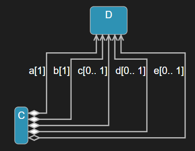

In the above diagram the filled diamonds show that there is a strong life-time relationship between a `C` instance and the instances of `D` that are located in the fixed and optional parts `a`, `b`, `c` and `d`, while this is not the case for the instance located in the plugin part `d` as shown by the hollow diamond.

### Part with Capsule Factory
If the capsule that types a part has a [capsule constructor](#capsule-constructor) with custom constructor parameters, you can define a capsule factory for the part. Such a capsule factory consists of two code snippets that define how an instance of that capsule should be created and destroyed. 

* `rt::createFunction` Defines how to create an instance of the capsule. For example, which constructor arguments to pass, which thread to use for running the created capsule instance, at which index to insert the capsule instance into the part (in case it has multiplicity > 1) etc.
* `rt::destroyFunction` Defines how to destroy an instance of the capsule. By default it's destroyed using the `new` operator.
 
Here is an example where a part defines a capsule factory that specifies a create function. The create function gets the mandatory constructor parameters `rtg_rts` and `rtg_ref` as arguments, as well as an `index` argument that specifies the index where the created capsule instance would be inserted by default.

``` art
part engine : Engine [[rt::createFunction]]
`
    return new Engine(rtg_rts, rtg_ref, true /* custom constructor arg */);
`;
```

Note that you may want to create a capsule factory for a part also for other reasons than passing custom constructor parameters. For example, you may want to change the default thread (`RTController*`) that should execute the created capsule instance, or you may want to instantiate an inherited capsule rather than the capsule that types the part.

## State Machine
State machines are used for specifying the behavior of [capsules](#capsule). It is also possible to provide a state machine for a passive class; see [Class with State Machine](#class-with-state-machine) for more information about that. In this chapter we focus on state machines in capsules. 

A state machine consists of states and transitions. During its lifetime a capsule instance transitions between the various states of its state machine, as a consequence of receiving messages on its behavior ports. When transitioning between two states one or several code snippets may execute. Such code may for example send messages to other capsule instances, something that may cause transitions to execute in their state machines. 

A state machine may also have **pseudo states**, which just like states may be connected with transitions, but that unlike states are not places where the state machine should stay for some time. For example, most pseudo states like junctions and entry/exit points merely act as connection points that make it possible to execute more than one transition when transitioning between two states. The notable exception is the choice in which actually the state machine may get stuck for ever, but this is something that should not happen in a correctly designed state machine.

### State
The states of a state machine are the places where the state machine may stay for some time while waiting for another message to arrive. States should have names that describe what is happening while the state machine stays there, or what has happened for the state machine to arrive there. For example, "WaitForInit", "Processing" or "Terminated". By convention state names start with uppercase.

You can declare multiple states on the same line using a comma-separated list of state names. It can be good to write a comment in front of the state name, if you want to elaborate more on its meaning that what is possible in the name itself. Here is an example of a state machine with some states:

``` art
capsule TrafficLight {      
    statemachine {
        state WaitUntilServerReady, CycleLight;
        state /* pedestrians are crossing the street */ PedestriansCrossing;
        initial -> WaitUntilServerReady;
        WaitUntilServerReady -> CycleLight;
        CycleLight -> PedestriansCrossing;
    };
};
```

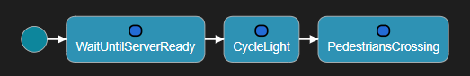

A state comment is not visible in a state diagram, but show up in a tooltip when putting the cursor on a reference to the state. They can thereby make it easier to understand a state machine.

States may be nested to create a [hierarchical state machine](#hierarchical-state-machine).

#### Entry and Exit Action
A state may have an entry and/or exit action which is a code snippet that runs whenever the state is entered and/or exited.

``` art
state Walk {
    entry
    `
        server.walk().send();
    `;
    exit
    `
        server.stop().send();
    `;
};
```

### Transition
A transition connects a source state (or pseudo state) to a target state (or pseudo state). When a capsule instance handles a message that was received on one of its behavior ports, one or several transitions may execute.

It's not required to give a name to a transition, but it's possible and often makes the state machine easier to understand. At least triggered transitions (i.e. transitions where the source is a state) should have a name. A transition name can be choosen to describe what needs to have happened for the transition to execute, for example "requestReceived", "timeout" etc. By convention transition names start with lowercase and use camelCase if the name consists of multiple words.  

A triggered transition has one or several triggers which define when the transition can be triggered. Each trigger specifies a port and an event. The trigger can only trigger its transition if the received message is an instance of the specified event, and was received on the specified port. In addition it's possible to provide guard conditions that must be fulfilled for the trigger to trigger its transition. Such a guard condition can be specified for the transition, but also for each individual trigger.

Here is an example of a capsule state machine with two triggered transitions `requestReceived` and `timeout`. It also contains an [initial transition](#initial-transition) that has no name.

``` art
capsule MyCap {
    statemachine {
        state Waiting, Processing;
        initial -> Waiting;        
        requestReceived: Waiting -> Processing on com1.request, com2.request when
        `
            return canHandleNow();
        `
        `
            log.log("Handling request");
            log.commit();
            handle(msg);
        `;
        timeout: Waiting -> Waiting on timer.timeout[`return zCount < 10;`];
    };
};
```

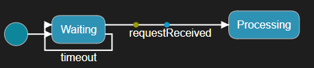

Note the following:

* Triggers are specified as `PORT.EVENT` after the keyword `on`. You may specify multiple triggers separated by comma (`,`).
* A guard condition for the transition is specified after the `when` keyword, while a guard condition for an individual trigger is specified in square brackets (`[]`) after the trigger.
* A guard condition is actually a C++ statement that returns the boolean guard condition.

!!! note 
    Guard conditions should execute fast and have no side-effects. They are called frequently to decide which transition to execute when a message has arrived.

#### Initial Transition
Every state machine needs exactly one initial transition. When the state machine starts to run, the first thing that happens is that the initial transition executes and takes the state machine to its first state. Therefore, an initial transition is a non-triggered transition and also cannot have a guard condition. But it can of course have an effect code snippet. 

The source of the initial transition is the initial pseudo state which is declared using the `initial` keyword. Just like for any transition it's optional to give a name to the initial transition (in fact it's often left unnamed).

For capsule instances that are programmatically created (i.e. located in optional capsule parts) you can provide initialization data at the time of creation. This is a data object that can be accessed in the effect code of the initial transition. Here is an example:

``` art
initial -> WaitForServerInit
`
    RTpchar str = *((RTpchar*) rtdata);
`;
```

!!! note 
    Any type of data object can be passed as initialization data which means that `rtdata` is an untyped pointer that has to be casted to the expected type. A more type-safe way of passing initialization data is to define a constructor for a capsule. A [capsule constructor](#capsule-constructor) can take any number of arguments, while with `rtdata` only one data object can be passed (even if you of course can group several data objects into a struct or class to circumvent this limitation). With capsule constructors you can pass initialization data also for capsule instances that are located in fixed parts.
    
By default `rtdata` cannot be modified (it has type `const void*`). However, by setting the `const_rtdata_param` [property](#property) to false on the initial transition, you can make it non-const. One reason for doing this could be that the initial transition effect code wants to pass some data back to the code that creates the capsule instance. However, you must be very careful if you do this since this will only work if the creating code runs in the same thread that runs the initial transition. A more legitimate reason could be that you want to move the initialization data into a capsule variable, so you can access it later. Moving data can be  more efficient than copying it.

``` art
[[rt::properties(const_rtdata_param=false)]] initial -> Waiting 
`
    pC = std::move(*((MyClass*) rtdata));
`;
```

#### Internal Transition
An internal transition doesn't change the active state and therefore doesn't have a target state. An internal transition is always a triggered transition. You define an internal transition inside the state to which it belongs. Here is an example:

``` art
state Done {
    unexpected: on myPort.*
    `
        std::cout << "Unexpected event received! << std::endl; 
    `;
};
```

Note the usage of an asterisk (`*`) to specify that any event received on `myPort` will trigger the internal transition when the state machine is in the `Done` state. Such "receive-any" events can of course be used for a trigger of any transition, but can in particular be useful for internal transitions that should handle all messages received on a port that are not handled by other triggered transitions leaving substates of the state. If another event is added to the port's protocol in the future, such a trigger will handle the new event too without a need for being updated.

Internal transitions are examples of so called self-transitions. To learn about other types of self-transitions see [this chapter](#local-transition).

#### Frequent Transition
Sometimes you may have a state where one or a few outgoing transitions can be expected to execute much more frequently than others. You can then set a `frequent` [property](#property) on the transition trigger that you expect will trigger the transition frequently. The Art compiler uses this information to optimize generated C++ code so that such transition triggers are evaluated before other triggers that are expected to trigger the transition less frequently. 

``` art
interrupted: Working -> Stopped on [[rt::properties(
            frequent=true
        )]] external.interrupt
        `
            // Interrupted while working...
        `;
```

!!! note 
    The frequent property relies on optimization features in the C++ compiler that may or may not be available depending on which target compiler that is used. Only use frequent transitions if profiling has shown that you have a need to do this optimization.

### Choice and Junction
Choices and junctions are pseudo states that make it possible to split transition flows in a state machine. That is, one incoming transition may be split into multiple outgoing transitions. Which of the outgoing transitions that will execute is decided by evaluating their guard conditions.

For a junction the guard conditions are evaluated already *before* leaving the currently active state. Only if there exists a path of transitions where all guards are fulfilled, will the active state be exited and the transitions can execute. Otherwise the state machine stays in its current state and attempts to find another path of transitions to execute. For a choice the guard conditions are evaluated *after* leaving the current state, when reaching the choice itself. The outgoing transition which has a fulfilled guard will execute next.

!!! note 
    It's important that there always is an outgoing transition for a choice with a fulfilled guard condition. Otherwise the state machine will get stuck in the choice without any chance of getting out of it. 

Choices and junctions must have names, so they can be referenced as the source or target of transitions. You can choose to use a name that gives a hint about what conditions that are checked in the guards of the outgoing transitions. For example, `isEnabled` for a choice that checks a boolean condition and `checkValue` when the condition has some other type. If you follow this approach you can then name the outgoing transitions accordingly. For example `true` and `false` for a choice that checks a boolean condition. By convention choice and junction names start with lowercase and use camelCase if consisting of multiple words. Sometimes it may be difficult to come up with a good name and in that case you can choose something short and "technical" like `j1`, `check1` etc. 

Below is an example of a state machine containing a choice and a junction.

``` art
statemachine {
    state First, Second, Third;
    t1: initial -> First;
    choice isEnabled;
    junction checkThreshold;
    switchTurned: First -> isEnabled;    
    true: isEnabled -> Second when
    `
        return isEnabled(); 
    `;    
    false: isEnabled -> Second when
    `
        else 
    `; 
    timeout: First -> checkThreshold; 
    low: checkThreshold -> Third when
    `
        return t < LIMIT1; 
    `;
    medium: checkThreshold -> Third when
    `
        return t >= LIMIT1 && t < LIMIT2; 
    `;
    high: checkThreshold -> Third;
};
```


Note the use of the keyword `else` for defining an else-guard. An else-guard will be fulfilled when no other guard of other outgoing transitions is fulfilled. For choices it's good practise to always have exactly one transition with an else-guard to ensure that at least one guard condition will be fulfilled. Thereby we avoid the risk of the state machine getting stuck in the choice. Else-guards can also be useful for junction transitions, but there they are more optional.

You can also define an else-transition for a choice or junction by simply omitting the guard condition. This is consistent with triggered transitions where the absense of a guard condition is equivalent to a guard condition that always is fulfilled. See the transition `high` in the above example.

Guard conditions should be mutually exclusive so that the order in which they are evaluated doesn't matter.

Junctions can also be used for merging multiple incoming transition flows into a single outgoing transition. This can for example be useful if you want to reuse a transition path in the state machine for several triggered transitions. 

``` art
statemachine {
    state S1, S2;
    junction j1;
    initial -> S1;
    t1: S1 -> j1 on port1.e1 
    `
        // handle e1
    `;
    t2: S1 -> j1 on port2.e2
    `
        // handle e2
    `;
    t3: S1 -> j1 on port3.e3
    `
        // handle e3
    `;
    common: j1 -> S2 
    `
        // common code here
    `;
};
```


Of course, in the above simple example the same code reuse could also be obtained by putting the common code in a capsule member function which is called by each of the incoming transitions. But if the common transition is followed by more non-triggered transitions the above approach is more feasible.

### Hierarchical State Machine
A state machine is hierarchical if it contains at least one composite state, i.e. a state with a nested state machine. A transition that is triggered in the enclosing state machine (i.e. the state machine that contains the composite state) should enter a composite state by specifying an entry point of the composite state as the target. In the nested state machine another transition can connect that entry point to a state in the nested state machine. A transition in the nested state machine may specify an exit point of the composite state as the target. In the enclosing state machine another transition can connect that exit point to a state in the enclosing state machine.

Entry and exit points are pseudo states that need to be named. The names can be chosen to give a hint about when the composite state is entered or exited through them, for example `systemStarted` or `errorDetected`. If you want you can prefix the names with `ep` or `ex`. It's also common to use short and "technical" names like `ep1` or `ex1` if a more descriptive name doesn't make sense. By convention entry and exit point names start with lowercase and use camelCase if consisting of multiple words.

It's also possible to directly enter a composite state without using an entry point. In this case the behavior will depend on whether the composite state is entered for the first time or not. If it is for the first time, the initial transition of the nested state machine will execute after the transition that targets the composite state has executed. Otherwise the composite state will instead be entered using [deep history](#deep-history), i.e. by activating the state in the nested state machine that was most recently active (and recursively if that state again is a composite state).

!!! note 
    It's recommended to always enter a composite state using an entry point as the behavior then doesn't depend on if the state was previously entered or not.

Below is an example of an hierarchical state machine with a composite state `CompositeState` that contains a nested state machine. Note that you can declare multiple entry or exit points on the same line.

<p id="hierarchical_sm_sample"/>
``` art
statemachine {        
    initial -> CompositeState.ep1;
    state CompositeState {
        state Nested;
        entrypoint ep1, ep2;
        exitpoint ex1;
        initial -> Nested;
        ep1 -> Nested;
        Nested -> ex1;
        ep2 -> history*;
    };
    state Other;
    CompositeState.ex1 -> Other;
    Other -> CompositeState.ep2;
};
```

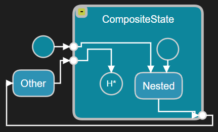

Note that a dot (`.`) is used as scope resolution operator, to make it possible to reference an entry or exit point from the enclosing state machine. Inside the nested state machine the entry and exit points are directly accessible without use of the scope resolution operator (using it there would be an error).

It is possible to only connect an entry point on the "outside". Entering such an entry point will behave in the same way as entering the composite state without using an entry point (see above). It's therefore not recommended. In the same way it's possible to exit a composite state using an exit point that only is connected on the "inside". In this case the composite state is not exited and instead the previously active substate again becomes active (recursively, just like for [deep history](#deep-history)). This is also not recommended, unless the transition is a [local transition](#local-transition).

#### Deep History
Every nested state machine has an implicit pseudo state with the name `history*` (in state diagrams it's shown as `H*` to save space). It can be used as a target for any transition inside the nested state machine. When it is reached, the state machine will restore the previously active substate. If that state again is a composite state, its previously active substate will also be restored. This goes on recursively for all nested state machines (which is why it's called a *deep* history). 

In the [example above](#hierarchical_sm_sample) we can see that the transition from `ep2` targets the deep history pseudo state. This means that if the `Nested` substate is active and then the transition to `ex1` gets triggered, the state `Other` becomes active. If then the transition to `ep2` gets triggered the `CompositeState` will be entered using deep history so that the `Nested` substate will again become active.

#### Local Transition
A transition in a nested state machine where the source is an entry point and the target is an exit point, and these entry/exit points only are connected on the "inside", is a **local transition**. A local transition is a self-transition that behaves something in between an [internal transition](#internal-transition) and a regular (a.k.a. external) self-transition. An [internal transition](#internal-transition) defined on a composite state handles a message without exiting neither that composite state, nor any of its substates. However, a local transition will exit the composite state and then enter it again, but it will not do this for the substate that is active in the composite state. Hence, if a composite state has an [exit action](#entry-and-exit-action) it will be called for the composite state, but not for the active substate. An external self-transition on the other hand will exit both the composite state and all active substates recursively, and then enter these states again. Exiting happens bottom-up which means that the deepest nested substate will first be exited, then its parent state, and so on until the top composite state is exited. Entering happens in the opposite order, i.e. in a top-down fashion.

Let's look at an example to understand the difference between these three kinds of self-transitions:
``` art
statemachine {        
    initial -> SelfTransitionExample;
    state SelfTransitionExample {
        state Nested1 {
            state Nested2;
        };
        internal: on port1.e1
        `
            // Internal transition
        `;
        entrypoint e1;
        exitpoint e2;
        local: e1 -> e2 
        `
            // Local transition
        `;
    };
    external: SelfTransitionExample -> SelfTransitionExample on port2.e2
    `
        // External transition
    `;
};
```
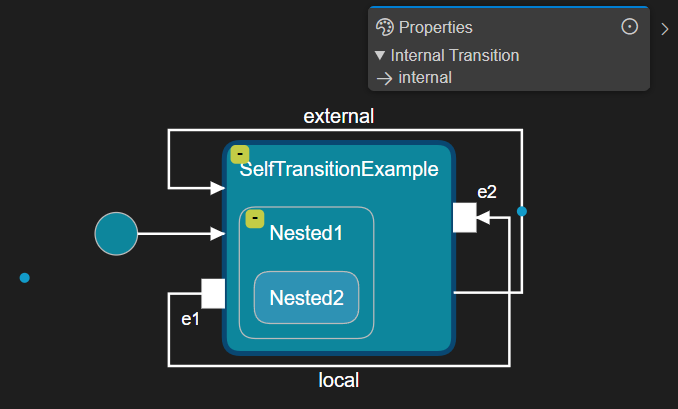

Assume the currently active state configuration is {`SelfTransitionExample`, `Nested1`, `Nested2`} when one of the self-transitions get triggered:

* **Internal transition** (`internal`)

No state is exited and the active state configuration remains unchanged.

* **Local transition** (`local`)
  
1) `Nested2` is exited. 
   
2) `Nested1` is exited. 
   
3) `local` executes. 
   
4) `Nested1` is entered. 
   
5) `Nested2` is entered.
   
* **External transition** (`external`)

1) `Nested2` is exited. 
   
2) `Nested1` is exited. 
   
3) `SelfTransitionExample` is exited.

4) `external` executes. 
   
5) `SelfTransitionExample` is entered.
   
6) `Nested1` is entered. 
   
7) `Nested2` is entered.

## Class with State Machine
Art allows you to create passive classes with state machines. This can be an alternative to using a [capsule](#capsule) in case you only need a passive stateful data object, and don't need the ability to send events to it, or to let it execute in its own context. A class with a state machine is more lightweight than a capsule at runtime. 

Transitions in a class state machine are triggered by calling trigger operations on the class. A trigger operation is similar to a regular member function in C++, but does not have a code behavior of its own. Instead, when you call a trigger operation on an object of a class with a state machine it may trigger a transition in the class' state machine. That transition may have an effect code snippet that will execute.

A trigger operation can have parameters which allows you to pass data when calling them. Those parameters can be accessed in the transition that is triggered by it.

Below is an example of a class with a state machine with two trigger operations `initialize` and `finalize`. Note that you can define multiple trigger operations on the same line.

``` art
class DataObject {
    /* Trigger Operations */
    trigger initialize(`int` data), finalize();
    /* State Machine */
    statemachine {
        state Initial, Initialized, Finalized;
        initial -> Initial;
        init: Initial -> Initialized on initialize(`int`)
        `
            // Initialized
            int i = data;
        `;
        Initialized -> Finalized on finalize()
        `
            // Finalized
        `;
    };
};
```


Just like for C++ member functions, trigger operations support overloading. That is, you can have many trigger operations with the same name as long as their full signatures are unique. The signature of a trigger operation consists of its name and the types of all its parameters. When you reference a trigger operation with parameters as a transition trigger, you need to include the types of the parameters (see the trigger for the `init` transition above).

The same transition can be triggered by multiple trigger operations (just like a transition in a capsule state machine can be triggered by multiple events). However, in that case those trigger operations should agree on the names and types of their parameters so that the transition effect code can access them in a way that works regardless of which of the trigger operations that will trigger the transition.

Names of classes with state machines by convention start with uppercase, while names of trigger operations and their parameters by convention start with lowercase and use camelCase if the name consists of multiple words. 

A common design pattern is to let a class-with-statemachine instance be managed by a single capsule instance. This means that the capsule instance is responsible both for creating, using and finally destroying the class-with-statemachine instance. If you follow this pattern it is thread-safe to for example call public member functions defined on the capsule from a transition in the class state machine. This can for example be used as a means for the class state machine to send events through the ports of the capsule (i.e. it can call a capsule member function that sends the event). However, to avoid exposing the full capsule functionality to the class state machine it's recommended to define an interface (i.e. abstract C++ class) which the capsule can implement. This interface can contain only those member functions which the class needs to access from its state machine.

A class state machine can use the same constructs as a capsule state machine with a few exceptions:

* The initial transition cannot access initialization data as can a capsule's [initial transition](#initial-transition). Instead you can define one or several constructors for the class with parameters needed for passing initialization data when the class-with-statemachine instance is created. See [Constructor](#constructor) for more information.

* [Frequent transitions](#frequent-transition) are not supported.

* The state machine can be hierarchical but the [deep history](#deep-history) pseudo state is not supported. Instead the [shallow history](#shallow-history) pseudo state can be used.

* Even if it's possible for a class with a state machine to inherit from another class with a state machine, this doesn't mean that the state machines will be inherited as is the case for capsule inheritance. Read more about this in [Inheritance](#inheritance).

A class with state machine can have the [same code snippets](#capsule_code_snippets) as a capsule.

### Constructor
By default the initial transition of a class state machine executes at the time of constructing the class-with-statemachine instance. This happens because the generated default constructor will call an operation `rtg_init1()` which contains the code from the initial transition. If you want to wait with "starting" the state machine until a later point in time you need to define your own parameterless constructor which doesn't call this function.

You can define any constructors you need on a class with a state machine. They are regular C++ constructors and allow to pass initialization data when creating a class-with-statemachine instance. Remember to call the `rtg_init1()` function in all such constructors, if you want the state machine to start at the time of creating the class-with-statemachine instance.

Here is an example of a class with a state machine that has a user-defined constructor:
``` art
class PC {
    [[rt::decl]]
    `
        private:
        double m_data;

        public:
        PC(double data);
    `    

    [[rt::impl]]
    `
        PC::PC(double data) : m_data(data) {
            rtg_init1();
        }
    `
    
    statemachine {
        state First;
        initial -> First
        `
            // State machine started
        `;
    };
};
```

### Shallow History
Every nested state machine has an implicit pseudo state with the name `history` (in state diagrams it's shown as `H` to save space). It can be used as a target for any transition inside the nested state machine. When it is reached, the state machine will restore the previously active substate. However, if that state again is a composite state it's previously active substate will not be restored. This is in contrast to the [deep history](#deep-history) for capsule state machines, and is why for a class state machine this pseudo state is referred to as a shallow history.

Here is an example:

``` art
class MyClass {
    
    statemachine {
        state First {
            entrypoint ep1;
            ep1 -> history;
        };
        initial -> First.ep1;
    };
};
```
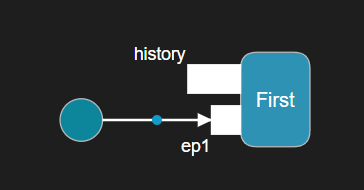

## Inheritance
By using inheritance you can reuse and customize generic (**base**) Art elements into more specific (**derived**) Art elements. An Art element can inherit either from one or several other Art elements, and/or it can inherit from one or several C++ classes. The derived Art element can **redefine** elements of the base element. The redefining element (located in the derived element) can change one or several properties of the redefined element (located in the base element). This is very similar to how inheritance works in C++, with the difference that in C++ a redefining element has more restrictions on what properties that can be changed in the redefined element. For example, a redefining member function (known as an overridden member function in C++ terminology) must keep the same signature as the redefined member function (known as a virtual base member function in C++ terminology), and can only (in fact, must) change its implementation.

In some cases Art inheritance not only allows to redefine inherited elements, but also to completely **exclude** them. An excluded element is not present in the derived element, so exclusion can be seen as a special form of redefinition where the whole element is removed in the derived element. In C++ it's not possible to exclude any inherited members.

### Capsule Inheritance
A [capsule](#capsule) can inherit from another capsule. Only one base capsule is allowed; multiple inheritance is not supported for capsules. In addition a capsule can inherit from any number of C++ classes (or structs).

The derived capsule is type compatible with the base capsule in the sense that if you have a capsule [part](#part) typed by the base capsule, you can at runtime incarnate it with instances of the derived capsule. 

Capsule inheritance has multiple dimensions. One dimension is the usual C++ inheritance between classes (remember that a capsule is an active class). In this dimension it is for example possible to redefine (a.k.a override) a virtual member function defined in the base capsule or in another base C++ class. But there is also a second dimension where the state machine of the derived capsule will implicitly inherit from the state machine of the base capsule. This makes it possible to redefine transitions and states. For example, a redefining transition in a derived capsule can change the effect code, the guard condition or the target state or pseudo state. And a redefining state in a derived capsule can change the entry or exit action, as well as any substate or subtransition in case the state is composite and has a nested state machine. It's also possible to completely exclude a state or a transition, either in the top capsule state machine, or in a nested state machine.

Below is an example of a capsule `D` that inherits from another capsule `B`. In addition the capsule `D` inherits from two C++ classes `IDataManager` and `IController`.

``` art
capsule B {    
    statemachine {
        state BS, BS2;
        Initial: initial -> BS;
    };
};

capsule D : B, `IDataManager`, `IController` { 
    [[rt::decl]]
    `
        // IDataManager impl
        public:
        void manageData() override;

        // IController impl
        public:
        void control() override;
    `

    [[rt::impl]]
    `
        // impl of manageData() and control()
    `

    statemachine {
        state DS;
        state exclude BS2;
        redefine Initial: initial -> DS;
    };
};
```

In the example we can see that `D` overrides functions from the base C++ classes that are assumed to be virtual (or pure virtual). For brevity the implementations of these functions have been omitted but would be placed in the `rt::impl` code snippet. We can also see an example of a state machine redefinition. The initial transition `Initial` of `B`'s state machine is redefined in `D`'s state machine so that it targets state `DS` instead of state `BS`. In the state diagram of `D` the state `BS` and the initial pseudo state are drawn with gray color and dashed outline, to show that they are inherited. The transition `Initial` is also drawn in grayed with dashed outline but with a blue label to show that it's redefining the inherited initial transition. The state `BS2` is excluded in `D`'s state machine. In state diagrams excluded elements are by default shown with a "crossed" background, but by setting a diagram preference it's also possible to completely hide them from the diagram.

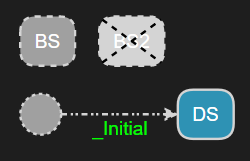

Note that to be able to redefine the initial transition of `B` it is necessary to give it a name (so that it can be referenced as redefined from `D`). This is yet another reason why it's good practise to give names to transitions, even if it's not mandated. But, of course, if you want to prevent anyone from creating a derived capsule with a state machine that redefines a certain transition, you can accomplish that by not giving a name to that transition. In effect, an unnamed transition is **final**, i.e. cannot be overridden or excluded.

The rule that a capsule state machine must have exactly one initial transition also applies to a derived capsule. Therefore, when you introduce inheritance between two existing capsules, you typically first get an error saying that the derived capsule has two initial transitions (one inherited, and one locally defined). You then need to decide if you want to either remove the initial transition in the derived capsule, or (like in the above example) instead redefine the initial transition.

Capsule inheritance also has a third dimension, which relates to its structure. [Parts](#part) and [ports](#port) defined in the base capsule are inherited by the derived capsule. Just like for states and transitions, it's possible to redefine or exclude a part or a port. A redefining port can change the type (i.e. [protocol](#protocol-and-event)), [multiplicity](#port-multiplicity) and the [notification property](#notification-port) of the redefined port. A redefining part can change the type, multiplicity and kind (fixed, optional or plugin) of the redefined part. 

Below is an example of a capsule `DPPI` that inherits from another capsule `BPPI`. The port `port1` and the part `part1` is redefined, while the port `port2` and part `part2` are excluded.

``` art
capsule BPPI {    
    service port port1 : PR1;    
    port port2 : PR1;    
    part part1 : Cap1;
    part part2 : Cap1;
    statemachine {
        state State;
        initial -> State;
    };
};

capsule DPPI : BPPI {
    service notify port redefine port1 : PR2[10];
    optional part redefine part1 : Cap2[0..20];
    part exclude part2;
    port exclude port2;
    statemachine {
        state State2;        
    };
};
```
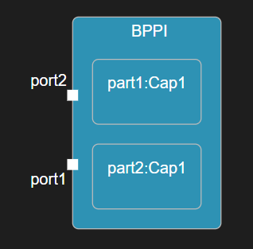

### Class Inheritance
A [class with state machine](#class-with-state-machine) can inherit from other classes with state machines, or from C++ classes (or structs). Multiple inheritance is supported.

Contrary to [capsule inheritance](#capsule-inheritance), class inheritance does not imply inheritance between the state machines in the derived and base classes. This means it's not possible to redefine or exclude states and transitions in an inherited class state machine. Nor is it possible to redefine trigger operations. In fact, the derived class will have two state machines (its own, plus the one inherited from the base class) and these two state machines will execute independently of each other. That is, class inheritance is more a way of aggregating state machines rather than reusing and redefining them. Because of this, it's rather unusual to let two classes with state machines inherit each other. It's more useful to let a class with state machine inherit from other C++ classes.

Below is an example of a class with state machine that inherits from two C++ classes `DataContainer<CData>` and `IDisposable`. 

``` art
class DataClass : `DataContainer<CData>`, `IDisposable` {
    [[rt::decl]]
    `
        void dispose() override; // From IDisposable
    `
    [[rt::impl]]
    `
        void DataClass:dispose() {
            // impl
        }
    `
    statemachine {
        state State;
        initial -> State;
    };
};
```

### Protocol Inheritance
A [protocol](#protocol-and-event) may inherit events from another protocol. Only one base protocol is allowed; multiple inheritance is not supported for protocols. Inherited events can be redefined, but not excluded. A redefining event in a derived protocol can change the type of the event parameter as defined in the base protocol.

In the example below, the protocol `ExtendedMachineEvents` adds one more in-event `stop` to the inherited `MachineEvents` protocol. It also redefines the `startDeferred` event to change its parameter type.

``` art
protocol MachineEvents {
    in start();
    in startDeferred(`unsigned long` /* milliseconds */);

    out success();
    out error(`std::string` /* error message */);
};

protocol ExtendedMachineEvents : MachineEvents {
    in stop();
    in redefine startDeferred(`unsigned long long`);
};
```

## Template
A template is a type that is parameterized by means of template parameters to make it more generic. When a template is used (a.k.a. instantiated), actual template parameters must be provided that match the formal template parameters defined in the template. Both [capsules](#capsule) and [classes](#class-with-state-machine) can have template parameters. Just like in C++ two kinds of template parameters are supported:

* **Type template parameter**

Replaced with a type when the template is instantiated.

* **Non-type template parameters**

Replaced with a non-type, for example a constant value, when the template is instantiated.

Template parameters may have defaults that will be used if a matching actual template parameter is not provided when instantiating the template.

Below is an example of a capsule and a class with template parameters, some of which have defaults specified. The keywords `typename` and `class` can both be used for defining a type template parameter. A non-type template parameter is defined by specifying its type as a C++ code snippet.

``` art
template <typename T = `int`, `int` p1 = `5`>
capsule TemplateCapsule { 
    [[rt::decl]]
    `
        void func(T arg1) {
            // impl
        }
    `

    service port mp : MachineEvents[`p1`];

    statemachine {
        state State;
        initial -> State;
    };
};

template <typename T, class U, `int` p1>
class TemplateClass : `Base<T,U,p1>` {
    statemachine {
        state State;
        initial -> State;
    };
};
```
Template parameters can only be used from C++ code snippets, and above you see some examples of how they can be used. It's not possible to instantiate a template in Art itself. For example, even if class `Base` above was defined as an Art class, a C++ code snippet has to be used since it has template parameters.

## Property
Properties are name-value pairs that provide a generic mechanism for augmenting Art elements with extra data. Such data can be utilized by tools that operate on a parsed Art file, such as the code generator and semantic checker. Most Art elements can have properties and the syntax for specifying properties is the same regardless of the kind of element. However, different kinds of Art elements can have different properties.

For Art elements that have a name, properties are specified right after the name. For elements without name, properties are specified before the element itself. In both cases the syntax looks like this:

``` art
[[rt::properties(
<property name>=<property value>,
<property name>=<property value>,
...
<property name>=<property value>
)]]
```

All properties have a default value, so you only need to specify a property if you want to set it to something else. The default values have been chosen so that you in most cases don't need to specify any properties at all.

A property has a type, and its value must conform to that type. The following property types are supported:

* **Boolean**

Boolean properties have a value that is either `true` or `false`. If you want to set a boolean property to `true` you can use a shorthand syntax where you just specify the property name. For example:

``` art
capsule CapProp 
[[rt::properties(
generate_file_impl=false,
generate_file_header
)]]
{
    // ...
};
```
Writing `generate_file_header` is equivalent to writing `generate_file_header=true`. However, this particular property has the default value `true` and hence doesn't need to be set at all.

* **Integer**
  
Integer properties have a numeric value (>= 0). Here is an example:

``` art
protocol XProtocol [[rt::properties(
    version=1
)]]{
    // ...
};
```

* **String**

String properties have a string value, enclosed in double quotes. Here is an example:

``` art
class MC [[rt::properties(
    rule_config="E0022"
)]]{
    // ...
};
```

* **Enumeration**

A property of enumeration type has a value that references a literal of the enumeration. There are different enumerations used for different properties. The best way to learn about what enumeration literals that are available for a certain property is to use the Content Assist feature in the Art file editor. Place the cursor after the equal sign, and press ++ctrl+space++. Here is an example of defining a property of enumeration type:

``` art
class MC [[rt::properties(
    kind=struct
)]]{
    // ...
};
```

Note that in some cases the name of an enumeration literal starts with underscore (`_`) to prevent it from clashing with the set of Art [keywords](#names-and-keywords).

Below is a table that lists all properties that can be used on different kinds of Art elements. Each property is described in a section of its own below the table.

<p id="art_properties"/>

| Art Elements | Property | Type | Default | 
|----------|:-------------|:-------------|:-------------|
| [Capsule](#capsule), [Class](#class-with-state-machine) | [generate_file_header](#generate_file_header) | Boolean | true 
| [Capsule](#capsule), [Class](#class-with-state-machine) | [generate_file_impl](#generate_file_impl) | Boolean | true
| [Capsule](#capsule), [Class](#class-with-state-machine), [Protocol](#protocol-and-event), [Port](#port), [Initial transition](#initial-transition), [Triggered transition](#transition) [Trigger](#transition) | [rule_config](#rule_config) | String | ""
| [Class](#class-with-state-machine), [Protocol](#protocol-and-event) | [version](#version) | Integer | 0
| [Class](#class-with-state-machine) | [generate_descriptor](#generate_descriptor) | Enumeration (true, false, manual) | true
| [Class](#class-with-state-machine) | [kind](#kind) | Enumeration (_class, struct, union) | _class
| [Class](#class-with-state-machine) | [generate_class](#generate_class) | Boolean | true
| [Class](#class-with-state-machine) | [generate_statemachine](#generate_statemachine) | Boolean | true
| [Class](#class-with-state-machine) | [const_target_param_for_decode](#const_target_param_for_decode) | Boolean | false
| [Class](#class-with-state-machine) | [default_constructor_generate](#default_constructor_generate) | Boolean | true
| [Class](#class-with-state-machine) | [default_constructor_explicit](#default_constructor_explicit) | Boolean | false
| [Class](#class-with-state-machine) | [default_constructor_inline](#default_constructor_inline) | Boolean | false
| [Class](#class-with-state-machine) | [default_constructor_default](#default_constructor_default) | Boolean | false
| [Class](#class-with-state-machine) | [default_constructor_delete](#default_constructor_delete) | Boolean | false
| [Class](#class-with-state-machine) | [default_constructor_visibility](#default_constructor_visibility) | Enumeration (public, protected, private) | public
| [Port](#port) | [registration](#registration) | Enumeration (automatic, automatic_locked, application) | automatic
| [Port](#port) | [registration_name](#registration_name) | String | ""
| [Initial transition](#initial-transition), [Triggered transition](#transition) | [const_rtdata_param](#const_rtdata_param) | Boolean | true
[Trigger](#transition) | [frequent](#frequent) | Boolean | false


### generate_file_header
By default a [capsule](#capsule) or [class](#class-with-state-machine) is translated to one header file (`.h`) and one implementation file (`.cpp`). Set this property to `false` to prevent generation of the header file, for example if you prefer to write it manually.

### generate_file_impl
By default a [capsule](#capsule) or [class](#class-with-state-machine) is translated to one header file (`.h`) and one implementation file (`.cpp`). Set this property to `false` to prevent generation of the implementation file, for example if you prefer to write it manually.

### rule_config
This property is used for configuring validation rules for an Art element. Read more about this [here](../validation#configuring-validation).

### version
TODO

### generate_descriptor
By default a type descriptor will be generated for each [class](#class-with-state-machine). The TargetRTS uses the type descriptor to know how to initialize, copy, move, destroy, encode or decode an instance of that class. Set this property to `false` for classes that don't need a type descriptor. Set it to `manual` if the class needs a type descriptor but you want to implement it manually rather than using the implementation that is generated by default. Note that even if you set this property to `true` so that a default type descriptor is generated, you can still override individual type descriptor functions for the class.

### kind
By default a [class](#class-with-state-machine) is translated to a C++ class. You can use this property to instead translate it to a `struct` or `union`.

### generate_class
If set to `false` no C++ code will be generated for the class.

### generate_statemachine
If set to `false` code generation for the class' state machine will be suppressed. You can use this if the state machine is informal, and you prefer to implement it manually in another way.

### const_target_param_for_decode
By default a decode function uses a non-const `target` parameter. This is because usually a decode implementation must call non-const functions on the decoded object to populate it with data from the decoding. However, if it doesn't need to call such functions you can set this property so that the `target` parameter is declared as const.

### default_constructor_generate
If set to `false` a default (i.e. parameterless) constructor will not be generated for the class.

### default_constructor_explicit
If set to `true` the default (i.e. parameterless) constructor will be declared as explicit.

### default_constructor_inline
If set to `true` the default (i.e. parameterless) constructor will be declared as inline. It's implementation will then be generated into the header file.

### default_constructor_default
If set to `true` the default (i.e. parameterless) constructor will be declared as defaulted. This tells the compiler to synthesize a default constructor even if one normally would not be synthesized (for example because there is a user-defined constructor with parameters).

### default_constructor_delete
If set to `true` the default (i.e. parameterless) constructor will be declared as deleted? This will cause the compiler to generate an error if it is invoked. This can be used for preventing objects of the class to be created.

### default_constructor_visibility
This property can be used for setting the visibility of the default (i.e. parameterless) constructor. By default it will be `public` but you can change it either to `protected` or `private`.

### registration
This property specifies how to register an unwired port at runtime. The default is `automatic` which means the port will be registered automatically when the container capsule instance is initialized. The value `automatic_locked` has the same meaning but the registration will be "locked" so that any future attempt to deregister it, or register it under a different name, will fail. Set the property to `application` to programmatically register the port using the functions `registerSPP()` and `registerSAP()` respectively.

### registration_name
This property specifies the name to use when registering a port at runtime. By default the port name is used, but it can be overridden using this property.

### const_rtdata_param
If set to `false` the rtdata parameter in the transition function will be non-const. It can therefore be modified, which for example can avoid copying received message data and instead move it using its move constructor or move assignment operator.

### frequent
Triggers for which this property is `true` will lead to generated code that handles these triggers faster than other triggers. This is done by placing their if-statements early in the `rtsBehavior` function to ensure that as little code as possible needs to execute when dispatching a message for a frequent trigger.