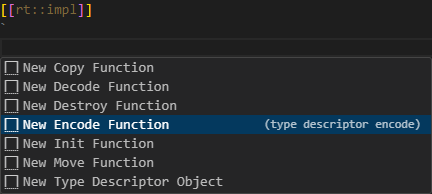
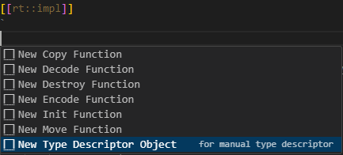

An Art file may contain code snippets at various places, where the C++ code within these snippets takes the form of expressions (e.g., guard conditions), statements (e.g., transition effects), or declarations (e.g., types, functions, variables, etc.). While most code snippets are copied directly to the generated C++ files during the translation process from an Art file to C+, certain snippets containing declarations (specifically, those marked as `rt::decl` and `rt::impl`) undergo parsing and analysis by the code generator. The code generator identifies and processes certain C+ extensions, such as attributes applied to the declarations in these snippets, translating them into additional C++ code. This capability enables the code generator to enhance the C++ code you write by incorporating additional boilerplate code. This chapter provides details on the applicable C++ extensions and the corresponding generated code for each.

## Type Descriptor
A type descriptor is meta data about a C++ type. The [TargetRTS](../target-rts/index.md) uses the type descriptor to know how to initialize, copy, move, destroy, encode and decode an instance of the type. Type descriptors for all primitive C++ types are included in the TargetRTS, but for other types you need to ensure type descriptors are available if you plan to use them in a way where the TargetRTS needs it.

!!! note 
    Most types in your application may not need a type descriptor, and for some types it will be enough to provide a partial implementation of the type descriptor. Only implement what is necessary for how the type actually will be used. For example, if you send an instance of a type in an event between two capsules, and the instance is copied rather than moved, then the type descriptor needs a copy function but doesn't need a move function. And if you don't encode instances to strings (or decode them from strings) then the type descriptor doesn't need encode and decode functions. Always think about how a type will be used before deciding if it needs a type descriptor or not.

### C++ Implementation
The C++ implementation of a type descriptor consists of four parts. In the code shown below we assume the type descriptor describes a type called "MyType".

**1) A type descriptor object**

This is a variable typed by `RTObject_class` with a name that has the prefix "RTType_". It will be declared in the header file:

``` cpp
extern const RTObject_class RTType_MyType;
```

and implemented in the implementation file:

``` cpp
const RTObject_class RTType_MyType =
{
    // Initialization of RTObject_class corresponding to properties of MyType
};
```

Member variables of RTObject_class store all information about the type, such as its name and byte size. Some of the member variables store pointers to type descriptor functions which the TargetRTS will call when it needs to do something with an instance of the type, for example copy or encode it.

**2) Type descriptor functions**

These are functions with a certain prototype, each of which performs a specific action on an instance of the type. The type descriptor object stores pointers to these functions. For a partial type descriptor, some of these pointers will be `nullptr` and then the corresponding type descriptor function does not exist. Below is the list of type descriptor functions that can be part of a type descriptor:

<p id="art_type_descriptor_functions"/>

| Name | Prototype | Purpose | 
|----------|:-------------|:-------------|
| init | `void rtg_MyType_init(const RTObject_class* type, MyType* target)` | Initializes an instance of the type|
| copy | `void rtg_MyType_copy(const RTObject_class* type, MyType* target, const MyType* source)` | Copies one instance of the type (source) to another (target)|
| move | `void rtg_MyType_move(const RTObject_class* type, MyType* target, MyType* source)` | Moves one instance of the type (source) to another (target)|
| destroy | `void rtg_MyType_destroy(const RTObject_class* type, MyType* target)` | Destroys an instance of the type|
| encode | `void rtg_MyType_encode(const RTObject_class* type, const MyType* source, RTEncoding* coding)` | Encodes an instance of the type|
| decode | `void rtg_MyType_decode(const RTObject_class* type, MyType* target, RTDecoding* coding)` | Decodes an instance of the type|

The encode function usually encodes the instance into a string representation, and the decode function usually parses the same string representation and creates an instance of the type from it. However, the functions use interface classes `RTEncoding` and `RTDecoding` from the TargetRTS which can be implemented in many different ways. Note also that you can globally disable the support for encoding and/or decoding by unsetting the macros `OBJECT_ENCODE` and `OBJECT_DECODE` respectively. 

**3) A type installer object**

Decoding functions typically need to look up a type descriptor from the name of the type. For example, if it finds the type name "MyType" in the string that it parses, it needs to find the type descriptor object for "MyType" so it can allocate memory for an instance of "MyType" and then initialize it. To facilitate this lookup the TargetRTS keeps a type descriptor registry. The purpose of the type installer object is to add the type descriptor to this registry. The C++ code looks like this:

``` cpp
#if OBJECT_DECODE
RTTypeInstaller rtg_MyType_installer( RTType_MyType );
#endif
```

**4) A "typed value" struct**

This is a struct which encapsulates an untyped instance of the type and its type descriptor. Its name has the prefix "RTTypedValue_". The struct has constructors that enable construction from a reference to an instance of the type. The typed value struct is the glue between generated code and TargetRTS code. TargetRTS functions get an untyped instance together with the type descriptor, and the type descriptor provides all information it needs to know about the type.

The typed value struct will be declared and implemented in the header file:

``` cpp
struct RTTypedValue_MyType
{
    const void * data; // Untyped pointer to an instance of MyType
    const RTObject_class * type; // Type descriptor for MyType
    const bool rValueRef = false; // Was the typed value struct created from an rvalue or lvalue reference to MyType?
    inline RTTypedValue_MyType( const MyType & rtg_value )
        : data( &rtg_value )
        , type( &RTType_MyType )
    {
    }
    inline RTTypedValue_MyType( const MyType && rtg_value )
        : data( &rtg_value )
        , type( &RTType_Colors )
        , rValueRef( true )
    {
    }
    inline RTTypedValue_MyType( const MyType & rtg_value, const RTObject_class * rtg_type )
        : data( &rtg_value )
        , type( rtg_type )
    {
    }
    inline RTTypedValue_MyType( const MyType && rtg_value, const RTObject_class * rtg_type )
        : data( &rtg_value )
        , type( rtg_type )
        , rValueRef( true )
    {
    }
    inline ~RTTypedValue_MyType( void )
    {
    }
};
```

### Automatically Generated
The code generator will automatically generate a type descriptor for a type if you mark it with the **rt::auto_descriptor** attribute. The generated type descriptor functions will get a default implementation that depends on the kind of type. If the default implementation is not appropriate for your type you can simply provide your own implementation of one or many type descriptor functions in an `rt::impl` code snippet. 

!!! note 
    If you write your own type descriptor function it's important that its prototype exactly matches what is listed in [this table](#art_type_descriptor_functions). It's recommended to use [Content Assist](../working-with-art/art-editor.md#content-assist) within the `rt::impl` code snippet to avoid typos and reduce typing effort.

    

Here are some examples of using the `rt::auto_descriptor` attribute on different kinds of types:

``` cpp
enum [[rt::auto_descriptor]] Status {
    Error, OK
};

enum class [[rt::auto_descriptor]] Colors { 
    Red, Green, Yellow 
};

struct [[rt::auto_descriptor]] Point {
    int x;
    int y;
};

#include <string>
typedef std::string [[rt::auto_descriptor]] MyString;
    
#include <vector>
using MyVector [[rt::auto_descriptor]] = std::vector<int>; 
```

An automatically generated type descriptor behaves like this:

* The `init` function for an enum will initialize it to the value of its first literal. For other types it will initialize the instance by invoking the parameterless constructor.
* The `copy` function for an enum just assigns the `source` parameter to the `target` parameter. For other types it will invoke the copy constructor.
* The `move` function is not available for an enum. For other types it will invoke the move constructor.
* The `destroy` function for an enum does nothing. For other types it will invoke the destructor.
* The `encode` function for an enum encodes it into an integer representation (0 for the first literal, 1 for the second, etc). For a typedef or type alias there is no default encode implementation. A structured type (struct or class) is encoded by calling `put_struct` on the `RTEncoding`. The TargetRTS provides encoding implementations that produce either JSON or a compact ASCII format.
* For types that have a default `encode` implementation, the `decode` implementation will read the encoded representation and create a corresponding instance of the type. For a typedef or type alias there is no default decode implementation.

Here is an example of how to override the default implementation of a type descriptor (for an enum), and to provide a missing type descriptor function (for a typedef):

``` art
[[rt::decl]]
`
    enum class [[rt::auto_descriptor]] Colors { 
        Red, Green, Yellow 
    }; 

    #include <string>
    typedef std::string [[rt::auto_descriptor]] MyString;
`

[[rt::impl]]
`
    static void rtg_Colors_init( const RTObject_class * type, Colors * target )
    {
        *target = Colors::Green; // Make Green the default color instead of Red
    }

    #if OBJECT_ENCODE
    static int rtg_MyString_encode(const RTObject_class* type, const MyString* source, RTEncoding* coding )
    {
        return coding->put_string(source->c_str()); // Encode as string literal
    }
    #endif
`
```

Note that the default implementation of a type descriptor for a typedef or type alias makes the assumption that the typedefed or aliased type is a structured type which has both a parameterless constructor, a copy constructor and a move constructor. If this assumption is not correct, you need to write your own type descriptor functions, or even [implement the whole type descriptor manually](#manually-implemented).

!!! example
    You can find sample applications that use automatically generated type descriptors here:
    
    * [Automatically generated type descriptor for an enum](https://github.com/secure-dev-ops/code-realtime/tree/main/art-comp-test/tests/enum_type_descriptor)
    * [Automatically generated type descriptor for an enum class with a custom encode function](https://github.com/secure-dev-ops/code-realtime/tree/main/art-comp-test/tests/enum_type_descriptor_custom_encode)
    * [Automatically generated type descriptor for a struct](https://github.com/secure-dev-ops/code-realtime/tree/main/art-comp-test/tests/struct_type_descriptor)
    * [Automatically generated type descriptor for a struct that contains another struct](https://github.com/secure-dev-ops/code-realtime/tree/main/art-comp-test/tests/struct_type_descriptor_nested)
    * [Automatically generated type descriptor for a typedef and type alias](https://github.com/secure-dev-ops/code-realtime/tree/main/art-comp-test/tests/typedef_type_descriptor)

### Manually Implemented
If a type needs a type descriptor but the default implementation is not appropriate, and it's also not enough to simply override one or a few of the type descriptor functions with custom implementations, you can choose to implement the type descriptor manually. To do so you need to mark the type with the **rt::manual_descriptor** attribute. The code generator will then skip generation of the following parts of the type descriptor:

* The implementation of the type descriptor object. The variable will be declared in the header file, but no implementation will be generated.
* The type descriptor functions. If your type descriptor needs any of the functions you can implement them and reference them from the implementation of the type descriptor object.

As an example assume we have a type alias for the Colors enum from the previous example. We only plan to use this type for standard enum encoding/decoding, but we want the Yellow color to be the default. Since the default type descriptor implementation for a type alias assumes the aliased type to be a structured type, we choose to do a manual implementation of the type descriptor instead of overriding several type descriptor functions (most of which we anyway won't need).

``` art
[[rt::decl]]
`
    using MyColors [rt::manual_descriptor] = Colors;
`

[[rt::impl]]
`
static void rtg_MyColors_init( const RTObject_class * type, MyColors * target )
{
    *target = Colors::Yellow; // Default color
}

// Manual type descriptor implementation
const RTObject_class RTType_MyColors =
{
    nullptr
    , nullptr
    , "MyColors"
    , 0 /* RTVersionId */
    , sizeof( MyColors )
    , reinterpret_cast< RTInitFunction > ( rtg_MyColors_init )
    , nullptr
#if RT_VERSION_NUMBER >= 7105
    , nullptr
#endif
#if OBJECT_DECODE
    , RTenum_decode
#endif
#if OBJECT_ENCODE
    , RTenum_encode
#endif
    , RTnop_destroy
    , 0
    , nullptr
};
`
``` 
Use the [Content Assist](../working-with-art/art-editor.md#content-assist) template "New Type Descriptor Object" to avoid typing all code manually. 



!!! example
    You can find a sample application that uses a manually implemented type descriptor [here](https://github.com/secure-dev-ops/code-realtime/tree/main/art-comp-test/tests/enum_type_descriptor_manual).

### Field Descriptor
A type descriptor for a structured type (class or struct) contains information about the member variables (a.k.a fields) of the type. This information is stored in a field descriptor object typed by the TargetRTS class `RTFieldDescriptor`. 

If the structured type only contains public member variables, the code generator can generate the field descriptor as a global object in the implementation file. However, if at least one member variable is either private or protected, you need to declare the type descriptor *inside* the type, as a public member variable. The reason is that the byte offset of each member variable is stored in the field descriptor, and computing this offset requires access to the member variable from the field descriptor.

Below is an example of a struct and a class. The struct only contains public member variables and hence it's not necessary to declare the field descriptor manually. However, since the class contains a private member variable, we need to declare a field descriptor for it.

``` art
[[rt::decl]]
`
    struct [[rt::auto_descriptor]] Point {
        int x;
        int y;
    };

    class [[rt::auto_descriptor]] DataPoint : public Point {
    private:
        long data;

    public: 
        static const RTFieldDescriptor rtg_DataPoint_fields[];
    };
`
```

A field descriptor member variable must have the name `rtg_<type>_fields`, where `<type>` is the name of the structured type.

Use [Content Assist](../working-with-art/art-editor.md#content-assist) to create a class or struct that contains a field descriptor.


!!! example
    You can find a sample application where a field descriptor is declared [here](https://github.com/secure-dev-ops/code-realtime/tree/main/art-comp-test/tests/type_descriptor_inheritance).

### Inheritance
If a class or struct inherits from another class or struct, as in the example above, then the type descriptor of the derived type will have a reference to the type descriptor of the base type. In this case both types need to have a type descriptor. A type descriptor can at most reference one base type descriptor (a.k.a. a super descriptor) which means that only single inheritance is supported for automatically generated type descriptors. If you use multiple inheritance you have to write a [manual type descriptor](#manually-implemented) for the derived type.

!!! example
    You can find a sample application that uses an automatically implemented type descriptor for a class that inherits from another class [here](https://github.com/secure-dev-ops/code-realtime/tree/main/art-comp-test/tests/type_descriptor_inheritance).