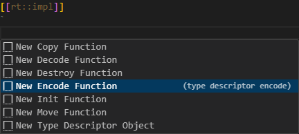
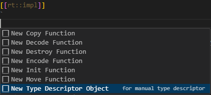
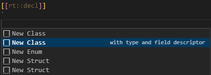
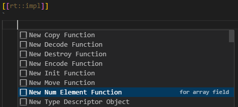

An Art file may contain code snippets at various places, where the C++ code within these snippets takes the form of expressions (e.g., guard conditions), statements (e.g., transition effects), or declarations (e.g., types, functions, variables, etc.). While most code snippets are copied directly to the generated C++ files during the translation process from an Art file to C++, certain snippets containing declarations (specifically, those marked as `rt::decl` and `rt::impl`) undergo parsing and analysis by the code generator. The code generator identifies and processes certain C+ extensions, in the form of attributes applied to the declarations in these snippets, and translates them into additional C++ code. This capability enables the code generator to enhance the C++ code you write by incorporating additional boilerplate code. 

An alternative to using `rt::decl` and `rt::impl` code snippets in an Art file is to directly [include C++ source files](../building/build-cpp-files.md) in your workspace folder. Code in such C++ files are also analyzed by the code generator, and extra code will be generated from attributes present in them. The main difference in this case is that the extra code will be placed in separate generated files, since there is no Art file that will be translated to C++ where it could be placed. See [Generated Files](#generated-files) for more information.

This chapter provides details on the applicable C++ extensions and the corresponding generated code for each.

## Type Descriptor
A type descriptor is meta data about a C++ type. The [TargetRTS](../target-rts/index.md) uses the type descriptor to know how to initialize, copy, move, destroy, encode and decode an instance of the type. Type descriptors for all primitive C++ types are included in the TargetRTS, but for other types you need to ensure type descriptors are available if you plan to use them in a way where the TargetRTS needs it.

!!! note 
    Most types in your application may not need a type descriptor, and for some types it will be enough to provide a partial implementation of the type descriptor. Only implement what is necessary for how the type actually will be used. For example, if you send an instance of a type in an event between two capsules, and the instance is copied rather than moved, then the type descriptor needs a copy function but doesn't need a move function. And if you don't encode instances to strings (or decode them from strings) then the type descriptor doesn't need encode and decode functions. Always think about how a type will be used before deciding if it needs a type descriptor or not.

### C++ Implementation
The C++ implementation of a type descriptor consists of four parts. In the code shown below we assume the type descriptor describes a type called "MyType".

**1) A type descriptor object**

This is a variable typed by [RTObject_class](../targetrts-api/struct_r_t_object__class.html) with a name that has the prefix "RTType_". It will be declared in the header file:

``` cpp
extern const RTObject_class RTType_MyType;
```

and implemented in the implementation file:

``` cpp
const RTObject_class RTType_MyType =
{
    // Initialization of RTObject_class corresponding to properties of MyType
};
```

Member variables of [RTObject_class](../targetrts-api/struct_r_t_object__class.html) store all information about the type, such as its name and byte size. Some of the member variables store pointers to type descriptor functions which the TargetRTS will call when it needs to do something with an instance of the type, for example copy or encode it.

**2) Type descriptor functions**

These are functions with a certain prototype, each of which performs a specific action on an instance of the type. The type descriptor object stores pointers to these functions. For a partial type descriptor, some of these pointers will be `nullptr` and then the corresponding type descriptor function does not exist. Below is the list of type descriptor functions that can be part of a type descriptor:

<p id="art_type_descriptor_functions"/>

| Name | Prototype | Purpose | 
|----------|:-------------|:-------------|
| init | `void rtg_MyType_init(const RTObject_class* type, MyType* target)` | Initializes an instance of the type|
| copy | `void rtg_MyType_copy(const RTObject_class* type, MyType* target, const MyType* source)` | Copies one instance of the type (source) to another (target)|
| move | `void rtg_MyType_move(const RTObject_class* type, MyType* target, MyType* source)` | Moves one instance of the type (source) to another (target)|
| destroy | `void rtg_MyType_destroy(const RTObject_class* type, MyType* target)` | Destroys an instance of the type|
| encode | `int rtg_MyType_encode(const RTObject_class* type, const MyType* source, RTEncoding* coding)` | Encodes an instance of the type|
| decode | `int rtg_MyType_decode(const RTObject_class* type, MyType* target, RTDecoding* coding)` | Decodes an instance of the type|

The encode function usually encodes the instance into a string representation, and the decode function usually parses the same string representation and creates an instance of the type from it. However, the functions use interface classes [`RTEncoding`](../targetrts-api/class_r_t_encoding.html) and [`RTDecoding`](../targetrts-api/class_r_t_decoding.html) from the TargetRTS which can be implemented in many different ways. Note also that you can globally disable the support for encoding and/or decoding by unsetting the macros [`OBJECT_DECODE` and `OBJECT_ENCODE`](../target-rts/build.md#object_decode-and-object_encode) respectively. Learn more about encoding and decoding [in this chapter](../target-rts/encoding-decoding.md).

**3) A type installer object**

Decoding functions typically need to look up a type descriptor from the name of the type. For example, if it finds the type name "MyType" in the string that it parses, it needs to find the type descriptor object for "MyType" so it can allocate memory for an instance of "MyType" and then initialize it. To facilitate this lookup the TargetRTS keeps a type descriptor registry. The purpose of the type installer object is to add the type descriptor to this registry. The C++ code looks like this:

``` cpp
#if OBJECT_DECODE
RTTypeInstaller rtg_MyType_installer( RTType_MyType );
#endif
```

**4) A "typed value" struct**

This is a struct which encapsulates an untyped instance of the type and its type descriptor. Its name has the prefix "RTTypedValue_". The struct has constructors that enable construction from a reference to an instance of the type. The typed value struct is the glue between generated code and TargetRTS code. TargetRTS functions get an untyped instance together with the type descriptor, and the type descriptor provides all information it needs to know about the type.

The typed value struct will be declared and implemented in the header file:

``` cpp
struct RTTypedValue_MyType
{
    const void * data; // Untyped pointer to an instance of MyType
    const RTObject_class * type; // Type descriptor for MyType
    const bool rValueRef = false; // Was the typed value struct created from an rvalue or lvalue reference to MyType?
    inline RTTypedValue_MyType( const MyType & rtg_value )
        : data( &rtg_value )
        , type( &RTType_MyType )
    {
    }
    inline RTTypedValue_MyType( const MyType && rtg_value )
        : data( &rtg_value )
        , type( &RTType_Colors )
        , rValueRef( true )
    {
    }
    inline RTTypedValue_MyType( const MyType & rtg_value, const RTObject_class * rtg_type )
        : data( &rtg_value )
        , type( rtg_type )
    {
    }
    inline RTTypedValue_MyType( const MyType && rtg_value, const RTObject_class * rtg_type )
        : data( &rtg_value )
        , type( rtg_type )
        , rValueRef( true )
    {
    }
    inline ~RTTypedValue_MyType( void )
    {
    }
};
```

### Automatically Generated
The code generator will automatically generate a type descriptor for a C++ type if you mark it with the `rt::auto_descriptor` attribute. The generated type descriptor functions will get a default implementation that depends on the kind of type. If the default implementation is not appropriate for your type you can simply provide your own implementation of one or many type descriptor functions in an `rt::impl` code snippet. 

!!! note 
    If you write your own type descriptor function it's important that its name exactly matches what is listed in [this table](#art_type_descriptor_functions). It's recommended to use [Content Assist](../working-with-art/art-editor.md#content-assist) within the `rt::impl` code snippet to avoid typos and reduce typing effort.

    

    While in most cases you would want the full prototype of each type descriptor function to match exactly what is listed in [this table](#art_type_descriptor_functions), in some cases you may want to do some minor changes. For example, the default prototype of the decode function declares the `target` parameter as non-const since usually a decode implementation has to call non-const functions on the decoded object to populate it with data from the decoding. If your custom decode function doesn't need to call such functions you can change the signature to make the `target` parameter const.

Here are some examples of using the `rt::auto_descriptor` attribute on different kinds of types:

``` cpp
enum [[rt::auto_descriptor]] Status {
    Error, OK
};

enum class [[rt::auto_descriptor]] Colors { 
    Red, Green, Yellow 
};

struct [[rt::auto_descriptor]] Point {
    int x;
    int y;
};

#include <string>
typedef std::string [[rt::auto_descriptor]] MyString;
    
#include <vector>
using MyVector [[rt::auto_descriptor]] = std::vector<int>; 
```

An automatically generated type descriptor behaves like this:

* The `init` function for an enum will initialize it to the value of its first literal. For other types it will initialize the instance by invoking the parameterless constructor.
* The `copy` function for an enum just assigns the `source` parameter to the `target` parameter. For other types it will invoke the copy constructor.
* The `move` function is not available for an enum. For other types it will invoke the move constructor.
* The `destroy` function for an enum does nothing. For other types it will invoke the destructor.
* The `encode` function for an enum encodes it into an integer representation (0 for the first literal, 1 for the second, etc). For a typedef or type alias there is no default encode implementation. A structured type (struct or class) is encoded by calling `put_struct` on the `RTEncoding`. The TargetRTS provides encoding implementations that produce either JSON or a compact ASCII format.
* For types that have a default `encode` implementation, the `decode` implementation will read the encoded representation and create a corresponding instance of the type. For a typedef or type alias there is no default decode implementation.

Here is an example of how to override the default implementation of a type descriptor (for an enum), and to provide a missing type descriptor function (for a typedef):

``` art
[[rt::decl]]
`
    enum class [[rt::auto_descriptor]] Colors { 
        Red, Green, Yellow 
    }; 

    #include <string>
    typedef std::string [[rt::auto_descriptor]] MyString;
`

[[rt::impl]]
`
    static void rtg_Colors_init( const RTObject_class * type, Colors * target )
    {
        *target = Colors::Green; // Make Green the default color instead of Red
    }

    #if OBJECT_ENCODE
    static int rtg_MyString_encode(const RTObject_class* type, const MyString* source, RTEncoding* coding )
    {
        return coding->put_string(source->c_str()); // Encode as string literal
    }
    #endif
`
```

Note that the default implementation of a type descriptor for a typedef or type alias makes the assumption that the typedefed or aliased type is a structured type which has both a parameterless constructor, a copy constructor and a move constructor. If this assumption is not correct, you need to write your own type descriptor functions, or even [implement the whole type descriptor manually](#manually-implemented).

If your `[[rt::auto_descriptor]]` marked type is defined in a C++ header file (see [C++ Source Files](../building/build-cpp-files.md)), and you want to customize its type descriptor, you need to declare the custom type descriptor functions in the header file, and then implement them in a C++ implementation file. Here is the above example again, but now using C++ source files `MyTypes.h` and `MyTypes.cpp` instead of an Art file.

*MyTypes.h*
``` cpp
    #ifndef MyTypes_h
    #define MyTypes_h

    #include "RTStructures.h"
    #include <string>

    enum class [[rt::auto_descriptor]] Colors { 
        Red, Green, Yellow 
    }; 

    void rtg_Colors_init(const RTObject_class * type, Colors * target);

    typedef std::string [[rt::auto_descriptor]] MyString;

    int rtg_MyString_encode(const RTObject_class* type, const MyString* source, RTEncoding* coding);

    #endif // MyTypes_h
```

*MyTypes.cpp*
``` cpp
    #include "MyTypes.h"

    void rtg_Colors_init(const RTObject_class * type, Colors * target)
    {
        *target = Colors::Green; // Make Green the default color instead of Red
    }

    #if OBJECT_ENCODE
    int rtg_MyString_encode(const RTObject_class* type, const MyString* source, RTEncoding* coding)
    {
        return coding->put_string(source->c_str()); // Encode as string literal
    }
    #endif
```

!!! example
    You can find sample applications that use automatically generated type descriptors here:
    
    * [Automatically generated type descriptor for an enum]({$vars.github.repo$}/tree/main/art-comp-test/tests/enum_type_descriptor)
    * [Automatically generated type descriptor for an enum class with a custom encode function]({$vars.github.repo$}/tree/main/art-comp-test/tests/enum_type_descriptor_custom_encode)
    * [Automatically generated type descriptor for a struct]({$vars.github.repo$}/tree/main/art-comp-test/tests/struct_type_descriptor)
    * [Automatically generated type descriptor for a struct that contains another struct]({$vars.github.repo$}/tree/main/art-comp-test/tests/struct_type_descriptor_nested)
    * [Automatically generated type descriptor for a typedef and type alias (with customized type descriptors)]({$vars.github.repo$}/tree/main/art-comp-test/tests/typedef_type_descriptor)
    * [Automatically generated type descriptor for a struct defined in a C++ header file]({$vars.github.repo$}/tree/main/art-comp-test/tests/struct_type_descriptor_header_file)
    * [Automatically generated type descriptor for an enum defined in a C++ header file]({$vars.github.repo$}/tree/main/art-comp-test/tests/enum_type_descriptor_header_file)
    * [Automatically generated type descriptor for a typedef and type alias defined in a C++ header file (with customized type descriptors)]({$vars.github.repo$}/tree/main/art-comp-test/tests/typedef_type_descriptor_header_file)

### Manually Implemented
If a type needs a type descriptor but the default implementation is not appropriate, and it's also not enough to simply override one or a few of the type descriptor functions with custom implementations, you can choose to implement the type descriptor manually. To do so you need to mark the type with the `rt::manual_descriptor` attribute. The code generator will then skip generation of the following parts of the type descriptor:

* The implementation of the type descriptor object. The variable will be declared in the header file, but no implementation will be generated.
* The type descriptor functions. If your type descriptor needs any of the functions you can implement them and reference them from the implementation of the type descriptor object.

As an example assume we have a type alias for the Colors enum from the previous example. We only plan to use this type for standard enum encoding/decoding, but we want the Yellow color to be the default. Since the default type descriptor implementation for a type alias assumes the aliased type to be a structured type, we choose to do a manual implementation of the type descriptor instead of overriding several type descriptor functions (most of which we anyway won't need).

``` art
[[rt::decl]]
`
    using MyColors [rt::manual_descriptor] = Colors;
`

[[rt::impl]]
`
static void rtg_MyColors_init(const RTObject_class* type, MyColors* target)
{
    *target = Colors::Yellow; // Default color
}

// Manual type descriptor implementation
const RTObject_class RTType_MyColors =
{
    nullptr
    , nullptr
    , "MyColors"
    , 0 /* RTVersionId */
    , sizeof( MyColors )
    , reinterpret_cast< RTInitFunction > ( rtg_MyColors_init )
    , nullptr
#if RT_VERSION_NUMBER >= 7105
    , nullptr
#endif
#if OBJECT_DECODE
    , RTenum_decode
#endif
#if OBJECT_ENCODE
    , RTenum_encode
#endif
    , RTnop_destroy
    , 0
    , nullptr
};
`
``` 
Use the [Content Assist](../working-with-art/art-editor.md#content-assist) template "New Type Descriptor Object" to avoid typing all code manually. 



!!! example
    You can find a sample application that uses a manually implemented type descriptor [here]({$vars.github.repo$}/tree/main/art-comp-test/tests/enum_type_descriptor_manual).

#### Versioning
Type descriptors support versioning by means of the field `RTObject_class::_version`. By default the version field is set to 0 which denotes the first version of the type described by the type descriptor. For types that are part of an API for which you need to maintain backwards compatibility, you can raise the version in case you need to modify the type in a way that is not backwards compatible. Use of versioning requires a manually implemented type descriptor, and the version information is for example used when you perform [encoding/decoding](../target-rts/encoding-decoding.md) using the [`RTVAsciiEncoding`](../targetrts-api/class_r_t_v_ascii_encoding.html) and [`RTVAsciiDecoding`](../targetrts-api/class_r_t_v_ascii_decoding.html) classes.

### Field Descriptor
A type descriptor for a structured type (class or struct) contains information about the member variables (a.k.a fields) of the type. This information is stored in a field descriptor object typed by the TargetRTS class [`RTFieldDescriptor`](../targetrts-api/struct_r_t_field_descriptor.html). 

If the structured type only contains public member variables, the code generator can generate the field descriptor as a global object in the implementation file. However, if at least one member variable is either private or protected, you need to declare the field descriptor *inside* the type, as a public member variable. The reason is that the byte offset of each member variable is stored in the field descriptor, and computing this offset requires access to the member variable from the field descriptor.

Below is an example of a struct and a class. The struct only contains public member variables and hence it's not necessary to declare the field descriptor manually. However, since the class contains a private member variable, we need to declare a field descriptor for it.

``` art
[[rt::decl]]
`
    struct [[rt::auto_descriptor]] Point {
        int x;
        int y;
    };

    class [[rt::auto_descriptor]] DataPoint : public Point {
    private:
        long data;

    public: 
        static const RTFieldDescriptor rtg_DataPoint_fields[];
    };
`
```

A field descriptor member variable must have the name `rtg_<type>_fields`, where `<type>` is the name of the structured type.

Use [Content Assist](../working-with-art/art-editor.md#content-assist) to create a class or struct that contains a field descriptor.



!!! example
    You can find a sample application where a field descriptor is declared [here]({$vars.github.repo$}/tree/main/art-comp-test/tests/type_descriptor_inheritance).

If you want to exclude a member variable from the field descriptor of a structured type you can do so by setting the `rt::no_descriptor` attribute on the member variable. One reason to do this can be to avoid that the value of a certain member variable is included in the encoding of a structured type.

!!! example
    [Here]({$vars.github.repo$}/tree/main/art-comp-test/tests/field_descriptor_properties) is a sample application where a member variable is excluded from the field descriptor by means of the `rt::no_descriptor` attribute.

#### Type Modifier
Field descriptors for member variables of pointer and array type contain additional information in a so called type modifier, represented by the TargetRTS class [`RTTypeModifier`](../targetrts-api/struct_r_t_type_modifier.html). For members of array type the type modifier object holds information about the number of elements in the array. By default this is the declared size of the array which means that the encoding of an array will contain all its elements. You can change this by defining a custom function that specifies the number of elements that should be included. Such a function must have a prototype that can be safely casted to an `RTNumberFunction`:

```cpp
typedef int (*RTNumberFunction)(const RTTypeModifier*, const void*);
```

There are at least three situations when a custom "number of elements" function is needed:

1. If you want to exclude some of the array elements from the encoding. By defining a "number of elements" function that returns a lower number than the size of the array, you can have some trailing elements in an array that will be skipped when encoding and decoding the array.
2. If the constant expression that defines the array size uses a name that is not visible in the generated type modifier (e.g. a static constexpr member). The code generator will by default generate a type modifier that specifies the number of array elements using exactly the same constant expression, so if this will lead to compilation errors you must provide a custom "number of elements" function.
3. A member variable of pointer type that points at the first element of an array. If you want to encode that member as an array you need to define a "number of elements" function to specify how many elements of the array that exists and that should be encoded.

Here is an example of how you can define a custom "number of elements" function for a member variable of array type. In this case it's needed for both reasons 1 and 2 mentioned above.

```art
[[rt::decl]]
`       
    struct [[rt::auto_descriptor]] S {
        static constexpr int SIZE = 8; // Not accessible without qualifier in the .cpp file
        char arr[SIZE];
    }; 
`

[[rt::impl]]
`
    // Custom "number of elements" function for S::arr
    static int rtg_nefb_S_arr(const RTTypeModifier* modifier, const S* source) {
        return 2; // Only include the first 2 elements in the encoding
    }
`
```

Just as for type descriptor functions it's recommended to use [Content Assist](../working-with-art/art-editor.md#content-assist) for implementing a custom "number of elements" function with the correct prototype.



!!! example
    You can find a sample application that uses a custom "number of elements" function for a type modifier [here]({$vars.github.repo$}/tree/main/art-comp-test/tests/field_descriptor_array_custom_num_func).

For member variables of pointer type, the type modifier has the `_indirect` flag set. This is used during encoding to know that the member variable's value is not directly stored in the member variable, but indirectly through a pointer. The indirection shows up in the ASCII encoding as an extra level of curly brackets.

!!! example
    Refer to [this sample application]({$vars.github.repo$}/tree/main/art-comp-test/tests/field_descriptor_indirect) to see the difference between a member variable that directly holds the value to be encoded, and one that indirectly references it through a pointer.

You can suppress the generation of a type modifier for a member variable by setting the `rt::no_type_modifier` attribute on the member variable. For an array member variable this has the same effect as implementing a custom "number of elements" function which returns 1, i.e. only the first element of the array will be included in the array's encoding.

!!! example
    [Here]({$vars.github.repo$}/tree/main/art-comp-test/tests/field_descriptor_properties) is a sample application which uses the `rt::no_type_modifier` attribute.

#### Field Descriptor Type
A field descriptor for a member variable contains a pointer to the type descriptor of the member variable's type. If that type doesn't have a type descriptor you need to either exclude that member variable from the field descriptor by means of the `[[rt::no_descriptor]]` attribute or specify a custom type descriptor to be used by means of the `[[rt::type_descriptor]]` attribute. The latter can also be useful in case the default type descriptor is not the one you want to use. For example, assume you have a struct with two boolean member variables. In the encoding of this struct you prefer the booleans to be represented as `1` or `0` instead of as `true` or `false` which is their default encoding. You can then [create your own type descriptor](#manually-implemented) which encodes the booleans to `1` or `0`.

For example, consider this struct defined in `LEDStatus.h`:

```cpp
extern const RTObject_class RTType_MyBool;

struct [[rt::auto_descriptor]] LEDStatus {
    [[rt::type_descriptor("RTType_MyBool")]] bool left = true;
    [[rt::type_descriptor("RTType_MyBool")]] bool right = false;
}; 
```

with a custom type descriptor implemented in `MyBool.cpp`:

```cpp
#if OBJECT_ENCODE
static int my_bool_encode( const RTObject_class *,
			const void           * source,
			RTEncoding           * coding )
{
    return coding->put_int( * static_cast<const bool *>(source) ? 1 : 0 );
}
#endif

const RTObject_class RTType_MyBool =
{
    nullptr
    , nullptr
    , "MyBool"
    , 0 /* RTVersionId */
    , sizeof( bool )
    , nullptr
    , nullptr
#if RT_VERSION_NUMBER >= 7105
    , nullptr
#endif
#if OBJECT_DECODE
    , nullptr
#endif
#if OBJECT_ENCODE
    , my_bool_encode
#endif
    , RTnop_destroy
    , 0
    , nullptr
};
```

The ASCII encoding of an instance of `LEDStatus` would then look like this: `LEDStatus{left 1,right 0}`

!!! example
    You can find a sample application that uses the `[[rt::type_descriptor]]` attribute [here]({$vars.github.repo$}/tree/main/art-comp-test/tests/field_descriptor_properties).


### Inheritance
If a class or struct inherits from another class or struct, as in the example above, then the type descriptor of the derived type will have a reference to the type descriptor of the base type. In this case both types need to have a type descriptor. A type descriptor can at most reference one base type descriptor (a.k.a. a super descriptor) which means that only single inheritance is supported for automatically generated type descriptors. If you use multiple inheritance you have to write a [manual type descriptor](#manually-implemented) for the derived type.

!!! example
    You can find a sample application that uses an automatically implemented type descriptor for a class that inherits from another class [here]({$vars.github.repo$}/tree/main/art-comp-test/tests/type_descriptor_inheritance).

### Class with State Machine
A [class with state machine](index.md#class-with-state-machine) is, except for its state machine, just like a regular C++ class (or struct if it has the [`kind`](index.md#kind) property set to `struct`). Hence, it may be useful for such a class to have a type descriptor too. However, since a class with state machine is defined in the Art language and not in C++, you cannot use the `[[rt::auto_descriptor]]` or `[[rt::manual_descriptor]]` attributes. Instead you need to set the [`generate_descriptor` property](index.md#generate_descriptor) on the class. Set it to `true` to use an [automatically generated type descriptor](#automatically-generated) and set it to `manual` if you prefer a [manually implemented type descriptor](#manually-implemented). Other than this, everything else w.r.t type descriptors works the same for a class with state machine as for a regular C++ class.

!!! example
    Refer to these samples that use type descriptors for classes with state machines:
    
    * [Automatically generated type descriptor for a class with state machine that has a non-public member]({$vars.github.repo$}/tree/main/art-comp-test/tests/passive_class_sm_typedescriptor)
    * [Type descriptor with a custom encode function which encodes the currently active state]({$vars.github.repo$}/tree/main/art-comp-test/tests/passive_class_sm_typedescriptor_custom)

### Generated Files
The code mentioned above related to type descriptors, which the code generator generates for the `[[rt::auto_descriptor]]` and `[[rt::manual_descriptor]]` attributes, will be placed in generated header and implementation files:

1. If the C++ type with the attribute is located in an `[[rt::decl]]` code snippet in an Art file, the generated files get the same name as the Art file, but with the extensions `.h` or `.cpp` appended. For example, if the Art file is called `MyTypes.art` the type descriptor code for a type contained in an `[[rt::decl]]` code snippet in that file will be placed in files `MyTypes.art.h` and `MyTypes.art.cpp`. To use the type you include the file `MyTypes.art.h`.
2. If the C++ type with the attribute is located in a C++ header file that is present in the workspace folder (see [C++ Source Files](../building/build-cpp-files.md)), the generated files get the same name as the C++ header file but prefixed with `RTType_`. For example, if your workspace folder contains a file `MyType.h` with a type that has a type descriptor attribute applied, two files `RTType_MyType.h` and `RTType_MyType.cpp` will be generated. Note that `RTType_MyType.h` will include the original header file `MyType.h` which means that if you need to use the type in a way that requires its type descriptor, you should include `RTType_MyType.h` rather than `MyType.h`.

For an Art [class with state machine that has a type descriptor](#class-with-state-machine) the code related to its type descriptor will be placed in the same header and implementation files that are generated for the class with state machine.