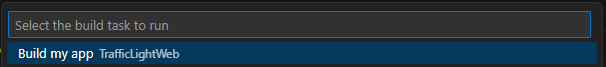
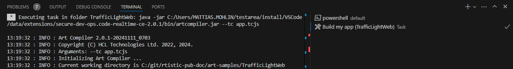
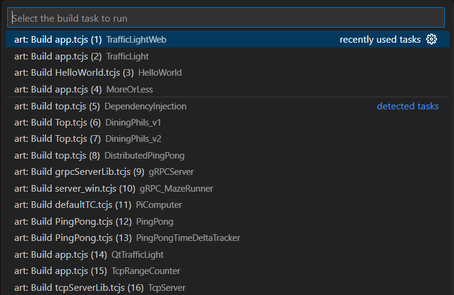

Both [Visual Studio Code](https://code.visualstudio.com/docs/editor/tasks) and [Eclipse Theia](https://theia-ide.org/docs/tasks/) allow you to define tasks in order to automate steps in your workflows. A task can basically do anything, but is often used for running scripts or command-line tools in order to build, test or deploy something. Tasks can be defined in a file `tasks.json` (placed in the `.vscode` subfolder of a workspace folder).

Here is an example of a `tasks.json` file that defines a task which will build a TC by means of the [Art Compiler](art-compiler.md):

<p id="build_task_sample"/>

```json
{
    "version": "2.0.0",
    "tasks": [
        {
            "label": "Build my app",
            "command": "java",
            "type": "shell",
            "args": [
                "-jar",
                "${command:code-rt.getCodeRTHome}/bin/artcompiler.jar",
                "--tc",
                "app.tcjs"
            ],            
            "group": "build"
        }
    ]
}
```
Setting the `group` attribute to `build` makes the task a **build task**. Such tasks can be run by means of the command **Terminal - Run Build Task** (default keybinding ++ctrl+shift+"B"++).

Assuming that the `tasks.json` in the example above is placed in a workspace folder `TrafficLightWeb` then the **Run Build Task** command will show this popup (other build tasks may also show up):



The build task will run in a new terminal:



By default a build task will run in the workspace folder where `tasks.json` is located, but you can customize that, and many other things, by means of attributes (for example `options`). Refer to the documentation of [Visual Studio Code](https://code.visualstudio.com/docs/editor/tasks) and [Eclipse Theia](https://theia-ide.org/docs/tasks/) for details.

## Art Compiler Build Tasks
{$product.name$} provides built-in build tasks for building TCs with the [Art Compiler](art-compiler.md). There is one such build task for each TC that is present in your workspace. This means that you can easily build every TC of your workspace by means of the **Terminal - Run Build Task** command, without first having to find the TC to build in the Explorer or [Art Build](transformation-configurations.md#art-build-view) views. Note, however, the differences between building a TC using an Art Compiler build task, and to build it using the **Build** command in the Explorer or [Art Build](transformation-configurations.md#art-build-view) views:

* The **Build** command will only generate the code if it has not already been generated, and if it generates the code it will do so in the language server without launching the Art Compiler. This is usually faster since the language server is already running, and there is no need to launch another process. An Art Compiler build task will, however, perform the build by launching the Art Compiler, just as when you perform a build from the command-line.
* When you build a TC with an Art Compiler build task, there is no integration with the IDE. The target folder is not automatically added as a workspace folder, and problems reported by the Art Compiler can be seen in the Terminal view, but will not appear in the Problems view. However, if you already have built the TC once using the **Build** command, and have set it as active, then the target folder is already present as a workspace folder, and the Problems view already contains problems found in the Art and TC files.

A built-in Art Compiler build task has the name `art: Build <TC-NAME>` where `<TC-NAME>` is the name of the TC it will build. When you use the **Run Build Task** command you will also see the workspace folder that contains the TC. This is the folder in which the Art Compiler will be launched. For example:



Of course you can also reference a built-in Art Compiler build task as the [`preLaunchTask`](../running-and-debugging/launch-configurations.md#prelaunchtask) of a launch configuration. For example:

```json
{
    "type": "art",
    "request": "launch",
    "name": "launchTC",
    "tc": "${workspaceFolder}/app.tcjs",    
    "buildBeforeLaunch": false,
    "preLaunchTask": "art: Build app.tcjs"
}
```

In this case it's useful to set the [`buildBeforeLaunch`](../running-and-debugging/launch-configurations.md#buildbeforelaunch) attribute to `false` to avoid that the TC gets built twice.

## Default Build Task
If you repeatedly want to run a certain build task, you can set it as the default build task by means of the command **Terminal - Configure Default Build Task**. If a default build task has been set the command **Terminal - Run Build Task** will not prompt you for which build task to run, but will directly run the default build task. 

The information about which build task that has been set as the default build task is saved in a `tasks.json` file (placed in the `.vscode` folder of the workspace folder to which the build task belongs). The `isDefault` attribute is used to mark the default build task. Here is an example:

```json
{
    "type": "tcBuild",
    "group": {
        "kind": "build",
        "isDefault": true
    },
    "problemMatcher": [],
    "label": "art: Build app.tcjs"
}
```

If you change the default build task using the command **Configure Default Build Task** the `isDefault` attribute will move to the build task that should become the new default. However, the rest of the JSON shown above will remain and you need to manually remove it (although there is no harm in keeping it). 

It's possible to manually edit `tasks.json` files to set more than one build task as the default. In that case the **Run Build Task** command will still prompt you but will only list those default build tasks. This can be useful if you have lots of build tasks in your workspace but mostly only run a few of them.