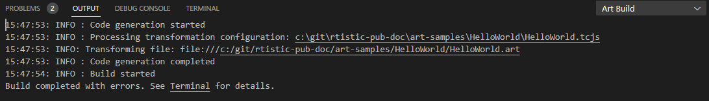

Art and C++ files can be built into applications or libraries. The build process consists of three steps:

1. **Generate source files**
In this step Art files are translated to C++ source files. 

2. **Generate a make file**
A make file for building generated C++ code (and possibly also other C++ code) is generated.

3. **Run make to generate binaries**
A make tool is invoked for building an executable or library from the generated make file.

All these steps require information which is stored in a [transformation configuration](transformation-configurations.md) (TC for short). It is a text file which contains various properties needed for translating Art elements to C++ code, for generating the make file, and finally for launching the make tool. You can have more than one TC in your workspace, but at most one TC in each workspace folder can be **active**. Set a TC as active by right-clicking on it and perform the command **Set as Active**. An active TC is marked with a checkmark.


Once there is an active TC in a workspace folder, the first and second steps (generation of C++ source files and make file) will happen automatically for all Art files contained in that workspace folder. The files that get generated are placed in its own workspace folder as specified by the [`targetFolder`](transformation-configurations.md#targetfolder) property of the TC. The C++ code in this target workspace folder is then incrementally and automatically updated as soon as any of these Art files are changed. Also the make file (which by default is placed in a subfolder called `default` in the target workspace folder) gets updated when needed. Below is an example of a simple target workspace folder.


To perform the third step (running make to generate binaries) you can simply go to the target folder in the Terminal and invoke the command `make`. 

To perform the third step (running make to generate binaries) you can simply go to the target folder in the Terminal and invoke the command `make`. Alternatively you can use the TC context menu command **Build** (see [below](#tc-context-menu-commands)).

## TC Context Menu Commands
The context menu of a TC provides a few useful commands that automate some of the steps mentioned above:

* **Build**
This command first generates C++ code and a make file for the TC, and then runs the make tool on the generated make file. Note, however, that this command does not set the TC as active. If you plan to change code snippets in generated code you must set the TC as active yourself.

* **Run**
First builds the TC, and then attempts to launch the executable that is produced. The executable is launched in a non-debug mode by specifying the launch argument `-URTS_DEBUG=quit`. If you instead want to launch the executable for debugging it you can go to the Terminal and manually launch it from there without any extra arguments. Note that if your TC creates a library rather than an executable, then this command will still build the TC, but will then give an error message since there is no executable to run.

* **Clean**
Removes the target workspace folder produced when building a TC. This means that all generated C++ code, the make file, as well as any produced binaries will be removed. If you only want to remove the binaries you can instead go to the Terminal and invoke `make clean` to clean using the make file.

## Build Messages
When you use the **Build** or **Run** commands on a TC, messages will be printed in two places depending on what kind of message it is:

1. The **Terminal** view. Messages produced when compiling and linking the generated C++ code will be printed here, for example compilation errors. In many cases such messages will have a reference to a generated C++ file which you can ++ctrl++-click to open. In case of **Run**, messages printed by the running executable will also be printed in the Terminal view. To terminate a running executable you can press ++ctrl+c++ in the Terminal view.
2. The **Art Build** output channel. All other build messages are printed here, for example messages emitted by the C++ code generator. In some cases these messages will have a reference to a file (e.g. an input TC or Art file), and sometimes even to an element within that file. You can ++ctrl++-click these to open the file and navigate to the element. In case the build fails (e.g. because of compilation errors) a hyperlink will be present for opening the Terminal view where the errors that caused the build to fail can be found.



## Navigation Between Art and Generated C++
You can navigate from an element in an Art file to the corresponding element in the C++ file that gets generated from that Art file. Use the context menu that appears when you right-click on an element in an Art file and invoke the command **Open Generated Code**. If C++ code has not yet been generated for the Art file, for example because no active TC has been set, navigation will fail with an error message.

When navigating to generated C++ code an attempt is made to put the cursor as close as possible to the relevant C++ element. However, when there is no C++ element that directly corresponds to the selected Art element, the cursor may instead be placed on a container C++ element. If there are more than one C++ element generated from a single Art element, you will be prompted for where to navigate. For example:


For C++ code snippets you can as an alternative perform the navigation using a tooltip that appears when you hover over the code snippet:


If the cursor is within the C++ code snippet when navigating, the cursor will be set at the same place in the generated C++ code. This is convenient if you start to edit a code snippet in an Art file but later realize that you want to edit it in the generated C++ code instead.

## Making Changes in Generated C++
C++ code snippets that are embedded in the Art file will be enclosed by special comments in the generated C++ file. You can edit such code snippets in a generated C++ file. When you save the file your changes will be automatically propagated back to the Art file. Here is an example of what a code snippet may look like in the generated C++ code:

``` cpp
//{{{USR file:///c:/rtistic/workspaces/demoWorkspace/HelloWorld.art#::HelloWorld::<TopStateMachine>::<TriggeredTransition_5>::<Effect>
    std::cout << "Hello World!" << std::endl;
    context()->abort();
//}}}USR
```

The comment contains information about the source Art file and the Art element in that file that contains the code snippet.

!!! warning 
    Only make edits on the lines within the special code snippet comments. If you edit outside the comment those edits will be lost the next time the file gets regenerated. And if you change the comment itself, the propagation of changes back to the Art file will no longer work correctly.

One very common scenario where it's useful to change a code snippet in a generated file is when there is a compilation error reported in the code snippet. Navigating from that compilation error will take you to the code snippet in the generated file, and it's convenient to directly fix the problem there.

Another scenario is when you write new code in such a code snippet and want to take advantage of the editing support for C++ that is provided by your IDE, and/or need to see the full C++ context of the edited code snippet. You can navigate from the code snippet in the Art file to the code snippet in the generated file as described [above](#navigation-between-art-and-generated-c).

You can make edits in multiple code snippets in a generated file. When the file is saved all edited code snippets will be automatically propagated back to the Art file.

!!! warning 
    Code snippets in Art files can only be updated when there is an active TC set. Changes made in generated code snippets will be lost the next time they are generated, unless you have set the TC as active. To prevent this, always make sure the TC is set as active before you make any changes in generated files. 
    
Pay attention to the status bar in the bottom left corner when you save a generated file. If you know at least one code snippet was modified, but still get the message shown below:


then you can know the changes failed to propagate to the Art file. If the update was successful you should instead get a message that tells how many code snippets that were updated. For example:


## Building from the Command Line
You can build a TC from the command line by using the [Art Compiler](art-compiler.md).
