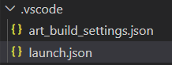

As described above you can launch a built executable using the [Run command](index.md#tc-context-menu-commands) in the TC context menu. This is a quick and easy way to run an executable, which is sufficient for simple applications. However, the simplicity comes with several limitations:

* You cannot specify any custom command-line arguments for the launched executable. In fact, the executable is always launched with one hard-coded argument `-URTS_DEBUG=quit` which means it will run in non-debug mode.
* You cannot set any custom environment variables for the launched executable.
* You cannot set the current working directory for the launched executable.

A more flexible way to launch an executable is to use a **launch configuration**. This is a JSON file that contains several attributes that control how to launch the executable. Using a launch configuration also gives additional benefits:

* Visual Studio Code and Eclipse Theia knows about launch configurations and provides a dedicated UI for working with them.
* You can easily manage multiple ways of launching the same application. Just create a launch configuration for each way of launching it.
* The output from the launched application is printed in the Debug Console rather than the Terminal view. The Debug Console colorizes printed output from the application (red for text printed to stderr and orange for text printed to stdout).
* You can terminate and relaunch the application using a toolbar instead of using the Terminal view.

## Creating a Launch Configuration
To create a launch configuration open the "Run and Debug" view from the activity bar and then click the **create a launch.json file** hyperlink.


You can choose to store the launch configuration either in a workspace folder or in the workspace file. In most cases it makes sense to store it in the same workspace folder that contains the TC that will be used for building the application to launch. However, if you want to share the same launch configuration for multiple applications you can choose to store it in the workspace file instead.

When you choose to store the launch configuration in a workspace folder it will be placed in the `.vscode` folder and get the name `launch.json`:



The created launch configuration looks like this:

``` json
{
   "type": "art",
   "request": "launch",
   "name": "runTC",
   "tc": "${workspaceFolder}/${command:AskForTC}"
}
```

You should change the `name` attribute to give the launch configuration a more meaningful name. 

You can have multiple launch configurations in the same `launch.json` file. Create new ones either by copy/paste of another one, or by pressing the **Add Configuration...** button. You can also create new launch configurations using the drop down menu in the "Run and Debug" view:


## Launching a Launch Configuration
The name of a launch configuration appears in the launch configuration drop down menu:


Launch the launch configuration by pressing the green arrow button that appears to the left of this drop down menu.

You can also perform the launch from the `Run` menu, using the command **Run without Debugging** (++ctrl+"F5"++). In that case the launch configuration that is selected in the "Run and Debug" view drop down menu will be used.

## Launch Configuration Attributes
Below is a table that lists all attributes that can be used in a launch configuration. Each attribute is described in a section of its own below the table.

<p id="launch_config_attributes"/>

| Attribute | Description | Mandatory |
|----------|:-------------|:-------------|
| [type](#type) | The type of launch configuration. Always "art". | Yes
| [request](#request) | What the launch configuration will do. Always "launch". | Yes
| [name](#name) | The name of the launch configuration | Yes
| [tc](#tc) | The TC file to use for building and launching the application. | Yes
| [args](#args) | Command line arguments to pass to the launched application. | No
| [environment](#environment) | Environment variables to set for the launched application. | No
| [cwd](#cwd) | Current working directory for the launched application | No

### type
This attribute specifies the type of launch configuration. It is mandatory and is always the string "art". 

### request
This attribute specifies what the launch configuration will do. It is mandatory and is always the string "launch".

### name
Specifies the name of the launch configuration. You should give a meaningful and unique name to each launch configuration that describes what it does. The chosen name appears in the drop down menu in the "Run and Debug" view. When you first create a launch configuration it gets the name "runTC". Make sure to change this default name.

### tc
This attribute specifies which TC file to use for building and launching. The specified TC must build an executable. You must use an absolute path to the TC file, but it can contain the `${workspaceFolder}` variable which expands to the location of the workspace folder. By default the `tc` attribute is set to `${workspaceFolder}/${command:AskForTC}` which means you will be prompted for choosing which TC to use when the launch configuration is launched.


For a list of other variables that can be used in this attribute see [this page](https://code.visualstudio.com/docs/editor/variables-reference#_settings-command-variables-and-input-variables).

### args
Specifies the command-line arguments for the launched executable. This is a list of strings, and by default it is set to `["-URTS_DEBUG=quit"]` which means that the executable will run in non-debug mode. You may add custom command-line arguments for your application as necessary. For example:

``` json
{
   "type": "art",
   "request": "launch",
   "name": "Let my exe listen to a port",
   "tc": "${workspaceFolder}/app.tcjs",
   "args": ["-URTS_DEBUG=quit", "--port=12345"]
}
```

### environment
Specifies environment variables to be set for the launched executable. This is a list of objects where each object has a property that specifies the name of an environment variable. The environment variable will be set to the value of that property. In the example below the environment variable `LD_LIBRARY_PATH` will be set to `/libs/mylibs` to tell a Linux system where to load shared libraries needed by the application.

``` json
{
   "type": "art",
   "request": "launch",
   "name": "Launch and load shared libraries",
   "tc": "${workspaceFolder}/app.tcjs",
   "environment": [{"LD_LIBRARY_PATH" : "/libs/mylibs"}]
}
```

### cwd
By default the launched application runs in the same folder as where the executable is located. By setting this attribute you can change the current working directory to something else. The value of this attribute must be an absolute path, but certain variables can be used. See [this page](https://code.visualstudio.com/docs/editor/variables-reference#_settings-command-variables-and-input-variables) for more information.

