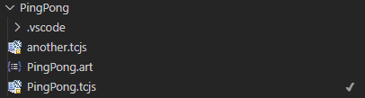
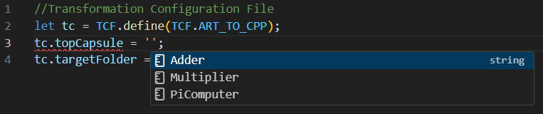
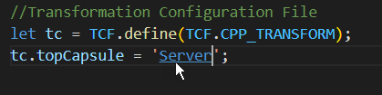
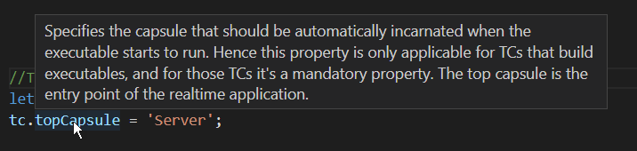
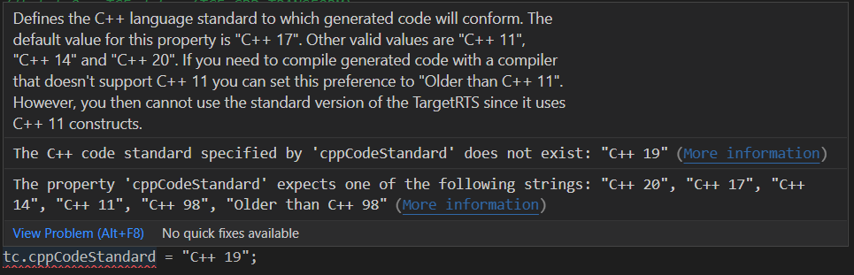
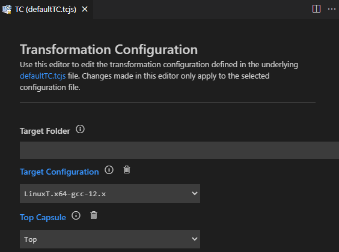
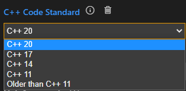
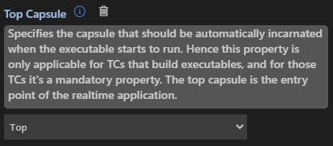
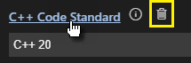
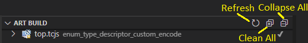

A transformation configuration (or TC for short) contains all properties needed for transforming Art files into C++ code and for building the generated code into an application or a library. It is a text file in JavaScript format with the file extension .tcjs. Using JavaScript for defining build properties has many advantages. For example, it allows for [dynamic properties](build-variants.md#dynamic-transformation-configurations) where the value is not a static value but computed dynamically by JavaScript code when the TC is built.

{$product.name$} provides a dedicated language server for TCs to make them just as easy to work with as Art files. A [form-based editor](#editing-transformation-configurations) is also provided as an alternative.

## Creating Transformation Configurations
To create a new TC select a file in the workspace folder that contains the Art files you want to transform to C++. Then invoke the command **File - New File - Transformation Configuration**. In the popup that appears specify the name of the TC or keep the suggested default name.


A .tcjs file will be created with the minimal contents. Specify the mandatory [topCapsule](#topcapsule) property (if you are building an executable) and any other [properties](#properties) needed.

## Setting a Transformation Configuration as Active
You can have more than one TC in your workspace, and also multiple TCs in the same workspace folder, but at most one TC in each workspace folder can be **active**. {$product.name$} uses the active TC in several ways:

* It controls how to automatically generate C++ code from the Art files in the workspace folder. In this respect it corresponds directly to the [`--tc`](art-compiler.md#tc) option for the [Art Compiler](art-compiler.md).
* It's used for automatically propagating changes you make in generated files back to the source Art files (see [Making Changes in Generated C++](index.md#making-changes-in-generated-c)).
* It affects how references in Art files are bound to Art elements in other Art files. More precisely, it's the [sources](#sources) and [prerequisites](#prerequisites) properties of the active TC that have an influence on the binding of references (since these properties control which Art files that are visible when building the active TC).

!!! note 
    If you don't set a TC as active none of the above will work (or will work incorrectly). It's therefore strongly recommended to create a TC and set it as active as early as possible when you start to work in a new Art workspace folder.

Set a TC as active by right-clicking on it and perform the command **Set as Active**. An active TC is marked with a checkmark.



If the active TC has [prerequisites](#transformation-configuration-prerequisites), those too will be set as active. This ensures that the results you get when working with Art files in the IDE will be the same as when you will build the TC using the [Art Compiler](art-compiler.md). 

## Editing Transformation Configurations
You can edit a TC directly as a JavaScript file in the text editor. Features such as content assist, navigation and hover tooltips work very similar to how they work for an Art file:

* Use content assist (++ctrl+space++) after typing `tc.` to get the list of all available TC properties that can be set. You can also use content assist in many places to get suggestions for valid TC property values, for example the list of available top capsules.



* Certain references in the TC can be navigated by ++ctrl++ + click. For example, you can navigate to the top capsule.
  


* Rest the cursor on a TC property name to get more information about the property.



* TC properties are validated when edited and found problems will be reported. Click the "More information" hyperlink for a more detailed description of a problem, including suggestions for how to fix it.



As an alternative to editing a TC as a JavaScript file {$product.name$} also provides a form-based editor which may be easier to use, especially until you are familiar with all TC properties that exist and what they mean.

To open the form-based TC editor, right-click on a TC file and invoke the context menu command **Edit Properties (UI)**. 



Each available TC property has its own widget for viewing and editing the value. The type of widget depends on the type of TC property. For example, an enumerated property like "C++ Code Standard" uses a drop down menu.



Click the info button to view documentation about a certain TC property. Click the button again to hide the documentation.



Certain TC properties have default values. Such values are not stored in the TC file, but the TC editor still shows them so you can know what value will actually be used unless you set a custom value for such a property.


You can tell which TC properties that have a custom (i.e. non-default) value set by looking at the color of the property name. Properties with custom values set have names shown in blue which are hyperlinks that will navigate to the value in the TC file. Such properties also have a "Delete" button which can be used for deleting the property value (i.e. to restore the property to use its default value).



You can freely choose if you want to edit TC files as text files or using the form-based TC editor, and you can even use both at the same time. The form-based TC editor is automatically updated as soon as you edit the TC file, and the TC file is automatically updated when a widget with a modified value loses focus. 

## Transformation Configuration Prerequisites
A TC can either build a library or an executable. This is controlled by the [topCapsule](#topcapsule) property. If this property is set the TC will build an executable, otherwise it will build a library. To ensure that a library gets built before an executable that links with it, you can set the [prerequisites](#prerequisites) property of the executable TC to reference the library TC. Doing so will also cause the executable to link with the library automatically (i.e. you then don't need to manually set-up necessary preprocessor include paths or linker paths using other TC properties).

If you change the prerequisites of a TC you should again [set it as active](#setting-a-transformation-configuration-as-active) so that the prerequisite TCs also become active.

## Art Build View
{$product.name$} provides a view called Art Build which makes several workflows related to TCs easier. The view shows all TCs that are present in the workspace so you don't have to find them in the Explorer view under each workspace folder. For each TC its prerequisites are shown below in a tree structure. This allows to quickly see which TCs a certain TC depends on through its prerequisites without having to open the TC editor.


The smaller gray text to the right of the TC name tells in which workspace folder the TC is located. This helps since it's common to have TCs with the same name in a workspace.

You can edit a TC by double-clicking on it. This will open the TC in a text editor.

When a TC is selected in the Art Build view you can use the toolbar buttons for building, cleaning and running it. 

!!! tip
    It's common to build the same TC many times when developing an Art application. By keeping that TC selected in the Art Build view you can quickly build it by just pressing its Build toolbar button. Building the TC from the Explorer view requires you to first find it which can be cumbersome since the Explorer view selection changes frequently.

There are also a few useful commands in the Art Build view toolbar:



* **Refresh** In most cases the Art Build view refreshes automatically when TCs are modified. However, if needed you can force a refresh by pressing this button.

* **Clean All** Cleans all TCs by removing all target folders in the workspace. Everything contained in the target folder will be deleted (generated code, makefiles, built binaries, etc). A message will be printed in the Art Server channel in case all target folders could be successfully removed, or if not, which ones that could not be deleted.

* **Collapse All** Collapses all TCs to not show any prerequisites.

## Properties
Below is a table that lists all properties that can be used in a TC. Note that many TC properties have default values and you only need to specify a value for a TC property if its different from the default value. Each property is described in a section of its own below the table.

<p id="tc_properties"/>

| Property | Type | Default Value | 
|----------|:-------------|:-------------|
| [commonPreface](#commonpreface) | String | N/A
| [compileArguments](#compilearguments) | String | N/A 
| [compileCommand](#compilecommand) | String | "$CC"
| [copyrightText](#copyrighttext) | String | N/A 
| [cppCodeStandard](#cppcodestandard) | Enum string | "C++ 17"
| [linkArguments](#linkarguments) | String | N/A
| [linkCommand](#linkcommand) | String | "$LD"
| [makeArguments](#makearguments) | String | N/A
| [makeCommand](#makecommand) | String | "$defaultMakeCommand"
| [prerequisites](#prerequisites) | List of strings | []
| [sources](#sources) | List of strings | ["*.art"]
| [targetConfiguration](#targetconfiguration) | String | Depends on current operating system
| [targetConfigurationName](#targetconfigurationname) | String | "default"
| [targetFolder](#targetfolder) | String | Name of TC with "_target" appended
| [targetRTSLocation](#targetrtslocation) | String | "${rtistic_home}/TargetRTS"
| [topCapsule](#topcapsule) | String | N/A
| [unitName](#unitname) | String | "UnitName"
| [userLibraries](#userlibraries) | List of strings | []

### commonPreface
This property allows you to write some code that will be inserted verbatimly into the header unit file (by default called `UnitName.h`). Since the header unit file is included by all files that are generated from the TC, you can use the common preface to define or include definitions that should be available everywhere in generated code.

### compileArguments
Specifies the arguments for the C++ compiler used for compiling generated C++ code. Note that some compiler arguments may already be specified in the TargetRTS configuration that is used, and the value of this property will be appended to those standard compiler arguments. 

### compileCommand
Specifies which C++ compiler to use for compiling generated C++ code. The default value for this property is `$(CC)` which is a variable that gets its value from the TargetRTS configuration that is used.

### copyrightText
This property may be used to insert a common comment block in the beginning of each generated file, typically a copyright text.

### cppCodeStandard
Defines the C++ language standard to which generated code will conform. The default value for this property is `C++ 17`. Other valid values are `C++ 98`, `C++ 11`, `C++ 14` and `C++ 20`. Note that the latest version of the TargetRTS requires at least C++ 11, so if you use an older code standard you have to set [TargetRTSLocation](#targetrtslocation) to an older version of the TargetRTS that doesn't contain any C++ 11 constructs. If you need to compile generated code with a very old compiler that doesn't even support C++ 98 you can set this preference to `Older than C++ 98`.

### linkArguments
Specifies the arguments for the C++ linker used for linking object files and libraries into an executable. This property is only applicable for TCs that build executables.

### linkCommand
Specifies which C++ linker to use for linking object files and libraries into an executable. The default value for this property is `$(LD)` which is a variable that gets its value from the TargetRTS configuration that is used. This property is only applicable for TCs that build executables.

### makeArguments
Specifies the arguments for the [make command](#makecommand) to be used.

### makeCommand
Specifies which make command to use for processing the generated make file. By default the make command is `$defaultMakeCommand` which gets its value from which TargetRTS configuration that is used.

### prerequisites
This property is a list of references to other TCs that need to be built before the current TC. It's typically used to express that a library TC is a prerequisite of an executable TC, which means the library TC needs to be built before the executable TC. Below is an example where an executable TC has a library TC as a prerequisite:

``` js
tc.prerequisites = ["../MyLibrary/lib.tcjs"]; 
```

Prerequisite TCs can either be specified using absolute or relative paths. Relative paths are resolved against the location of the TC that has the property set.

For more information about this property see [Transformation Configuration Prerequisites](#transformation-configuration-prerequisites).

### sources
By default all Art files that are located in the same folder as the TC will be transformed to C++. Sometimes you may want to exclude some Art files, for example because they are built with another TC, or they contain something you want to temporarily exclude from your application without having to delete the files or comment out their contents. In these cases you can set the `sources` property to specify exactly which Art files that should be built by the TC. The value of the property is a list of strings that specify glob-style patterns and anti-patterns. An Art file will be transformed if it matches at least one pattern and doesn't match any anti-pattern. Anti-patterns start with the `!` character. In both patterns and anti-patterns you can use the wildcards `*` (matches any sequence of characters) and `?` (matches a single character). Below are a few examples:

``` js
tc.sources = ["*.art"]; // Transform all Art files in the folder that contains the TC. This is the default behavior if the "sources" property is not set.
tc.sources = ["cap1.art", "cap2.art"]; // Only transform two specific Art files
tc.sources = ["*.art", "!rtist_gen.art"]; // Transform all Art files except one
tc.sources = ["source??.art", "!*_gen.art"]; // Transform all Art files with names starting with "source" and followed by two arbitrary characters. Art files with a name that ends with "_gen" are excluded.
```

!!! example
    You can find a sample application that has a TC with the "sources" property set [here](https://github.com/HCL-TECH-SOFTWARE/rtist-in-code/tree/main/art-comp-test/tests/tc_sources).

### targetConfiguration
Specifies which TargetRTS configuration to use. The TargetRTS location specified in the [targetRTSLocation](#targetrtslocation) property defines valid values for this property. If this property is not specified, and the default TargetRTS location from the {$product.name$} installation is used, then it will get a default value according to the operating system that is used. For Windows a MinGw-based configuration will be used, while for Linux a GCC-based configuration will be used.

### targetConfigurationName
This property maps to a subfolder of the [target folder](#targetfolder) where all generated files that are not source code will be placed. This includes for example makefiles and the files that are produced by these makefiles (typically binaries). The default value of this property is `default`.

### targetFolder
Specifies where files generated from the TC will be placed. This property is usually just set to a name, and then a target folder with that name will be created. When the build runs from the UI, that target folder is then added as a workspace folder, which will cause you to be prompted about if you trust the authors of the files in that folder. It's safe to answer yes since all files in that folder are automatically generated by {$product.name$}. 

You can specify an absolute path to a target folder if you prefer generated files to be placed in a certain location that is accessible to everyone in the team, for example a shared network drive. If you instead use a relative path it will get resolved relative to a desired output folder. For a UI build the output folder is set using the setting [`rtistic.build.outputFolder`](../settings.md#output-folder). When building with the Art Compiler the output folder is instead set using the [`--out`](art-compiler.md#out) option. If you haven't set the desired output folder, relative paths will instead be resolved against the folder that contains the TC where the `targetFolder` property is set. 

Use forward slashes as path separator in this property. 

If this property is not specified it defaults to the name of the TC, with `_target` appended. For example, if the TC is called `app.tcjs`, the target folder will default to `app_default`.

### targetRTSLocation
Specifies the location of the TargetRTS to use. If no value is set for this property the TargetRTS from the RTist in Code installation will be used. If you want to use another TargetRTS specify the full path to the `TargetRTS` folder (including that folder itself). Use forward slashes as path separator. For example:

``` js
tc.targetRTSLocation = "C:/git/rsarte-target-rts/rsa_rt/C++/TargetRTS";
```

### threads
Specifies the threads used by the application. If no value is set for this property the application will have two default threads:

* **MainThread**
Runs all capsule instances in the application. It's implemented in the TargetRTS by the [RTPeerController](../targetrts-api/class_r_t_peer_controller.html) class.

* **TimerThread**
Runs all timers in the application. It's implemented in the TargetRTS by the [RTTimerController](../targetrts-api/class_r_t_timer_controller.html) class.

Both these threads will have a stack size of 20kB and run at a normal priority.

If your application needs a different thread configuration, or threads with different properties, you need to set the `threads` property. Note that you cannot just specify threads in addition to the default ones mentioned above, but must always specify all threads. Here is an example where the default threads are present, plus one additional user-defined thread:

``` js
tc.threads = [
{
    name: 'MainThread',
    implClass: 'RTPeerController',
    stackSize: '20000',
    priority: 'DEFAULT_MAIN_PRIORITY'
},
{
    name: 'TimerThread',
    implClass: 'RTTimerController',
    stackSize: '20000',
    priority: 'DEFAULT_TIMER_PRIORITY'
},
{
    name: 'MyThread',
    implClass: 'RTPeerController',
    stackSize: '20000',
    priority: 'DEFAULT_MAIN_PRIORITY',
    logical: [
        'MyLogicalThread'
    ]
}
];
```

Note that for user-defined threads, like `MyThread` above, you need to specify one or many logical threads that are mapped to it. These are references to threads that your application use instead of refering directly to a physical thread. This indirection makes it possible to change how capsule instances of your application are run by threads by only modifying the `threads` property in the TC, without the need to change any application code.

Only executable TCs can define physical threads. A library TC can, however, define logical threads. An executable TC that has such a library TC as its prerequisite must map those logical threads to physical threads. Here is an example of a library TC that defines a logical thread. 

``` js
tc.threads = [ `LibraryThread` ];
```

Note that in this case the `threads` property contains a list of strings rather than a list of objects as is the case for an executable TC.

Read more about threads [here](../target-rts/threads.md).

### topCapsule
Specifies the capsule that should be automatically incarnated when the executable starts to run. Hence this property is only applicable for TCs that build executables, and for those TCs it's a mandatory property. The top capsule is the entry point of the realtime application.

If you don't specify a value for this property, the TC will build a library instead of an executable.

### unitName
Specifies the base name of the so called unit header and implementation files that are generated from the TC. By default the value of this property is `UnitName` which means that these unit files will be called `UnitName.cpp` and `UnitName.h`. The unit files contain certain information that applies to the whole unit of code that is generated from a TC. The header unit file is included by all files that are generated from the TC.

### userLibraries
This property is a list of user libraries that should be linked with the application. The property is only applicable for TCs that build executables.

``` js
tc.userLibraries = ["../..libs/libMyLib.a"];
```

Each library should be specified with a full or relative path so the linker can find it. If no path is provided you may need to provide a [link argument](#linkarguments) to specify the location(s) where the linker should look for the user libraries.