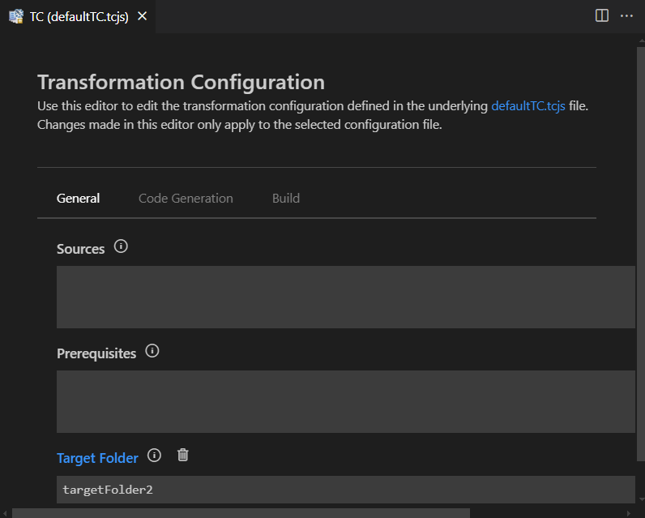

A transformation configuration (or TC for short) contains all properties needed for transforming Art files into C++ code and for building the generated code into an application. It is a text file in JavaScript format with the file extension .tcjs. Using JavaScript for defining build properties has many advantages. For example, it allows for dynamic properties where the value is not a static value but computed by JavaScript code.

{$product.name$} provides a dedicated language server for TCs to make them just as easy to work with as Art files. A [form-based editor](#editing-transformation-configurations) is also provided as an alternative.

## Creating Transformation Configurations
To create a new TC select a file in the workspace folder that contains the Art files you want to transform to C++. Then invoke the command **File - New File - Transformation Configuration**. In the popup that appears specify the name of the TC or keep the suggested default name.


A .tcjs file will be created with the minimal contents. Specify the mandatory [topCapsule](#topcapsule) property (if you are building an executable) and any other [properties](#properties) needed.

## Setting a Transformation Configuration as Active
You can have more than one TC in your workspace, and also multiple TCs in the same workspace folder, but at most one TC in each workspace folder can be **active**. {$product.name$} uses the active TC for knowing how to automatically generate C++ code from the Art files in the workspace folder.

Set a TC as active by right-clicking on it and perform the command **Set as Active**. An active TC is marked with a checkmark.


Automatic code generation for the active TC will start immediately.

## Editing Transformation Configurations
You can edit a TC directly as a JavaScript file in the text editor. Features such as content assist, navigation and hover tooltips work very similar to how they work for an Art file:

* Use content assist (++ctrl+space++) after typing `tc.` to get the list of all available TC properties that can be set. You can also use content assist in many places to get suggestions for valid TC property values, for example the list of available top capsules.


* Certain references in the TC can be navigated by ++ctrl++ + click. For example, you can navigate to the top capsule.
  


* Rest the cursor on a TC property name to get more information about the property.


* TC properties are validated when edited and found problems will be reported.


As an alternative to editing a TC as a JavaScript file {$product.name$} also provides a form-based editor which may be easier to use, especially until you are familiar with all TC properties that exist and what they mean.

To open the form-based TC editor, right-click on a TC file and invoke the context menu command **Edit Properties (UI)**. 



Each available TC property has its own widget for viewing and editing the value. The type of widget depends on the type of TC property. For example, an enumerated property like "C++ Code Standard" uses a drop down menu.


Click the info button to view documentation about a certain TC property. Click the button again to hide the documentation.


Certain TC properties have default values. Such values are not stored in the TC file, but the TC editor still shows them so you can know what value will actually be used unless you set a custom value for such a property.


You can tell which TC properties that have a custom (i.e. non-default) value set by looking at the color of the property name. Properties with custom values set have names shown in blue which are hyperlinks that will navigate to the value in the TC file. Such properties also have a "Delete" button which can be used for deleting the property value (i.e. to restore the property to use its default value).


You can freely choose if you want to edit TC files as text files or using the form-based TC editor, and you can even use both at the same time. The form-based TC editor is automatically updated as soon as you edit the TC file, and the TC file is automatically updated when a widget with a modified value loses focus. 

## Properties
Below is an alphabetic list of all properties that can be used in a TC. Note that many TC properties have default values and you only need to specify a value for a TC property if its different from the default value.

### commonPreface
This property allows you to write some code that will be inserted verbatimly into the header unit file (by default called "UnitName.h"). Since the header unit file is included by all files that are generated from the TC, you can use the common preface to define or include definitions that should be available everywhere in generated code.

### compileArguments
Specifies the arguments for the C++ compiler used for compiling generated C++ code. Note that some compiler arguments may already be specified in the TargetRTS configuration that is used, and the value of this property will be appended to those standard compiler arguments. 

### compileCommand
Specifies which C++ compiler to use for compiling generated C++ code. The default value for this property is `$(CC)` which is a variable that gets its value from the TargetRTS configuration that is used.

### copyrightText
This property may be used to insert a common comment block in the beginning of each generated file, typically a copyright text.

### cppCodeStandard
Defines the C++ language standard to which generated code will conform. The default value for this property is `C++ 17`. Other valid values are `C++ 11`, `C++ 14` and `C++ 20`. If you need to compile generated code with a compiler that doesn't support C++ 11 you can set this preference to `Older than C++ 11`. However, you then cannot use the latest version of the TargetRTS since it uses C++ 11 constructs.

### linkArguments
Specifies the arguments for the C++ linker used for linking object files and libraries into an executable. This property is only applicable for TCs that build executables.

### linkCommand
Specifies which C++ linker to use for linking object files and libraries into an executable. The default value for this property is `$(LD)` which is a variable that gets its value from the TargetRTS configuration that is used. This property is only applicable for executable TCs.

### makeArguments
Specifies the arguments for the [make command](#makecommand) to be used.

### makeCommand
Specifies which make command to use for processing the generated make file. By default the make command is `$defaultMakeCommand` which gets its value from which TargetRTS configuration that is used.

### targetConfiguration
Specifies which TargetRTS configuration to use. The TargetRTS location specified in the [targetRTSLocation](#targetrtslocation) property defines valid values for this property. If this property is not specified, and the default TargetRTS location from the {$product.name$} installation is used, then it will get a default value according to the operating system that is used. For Windows a MinGw-based configuration will be used, while for Linux a GCC-based configuration will be used.

### targetConfigurationName
This property maps to a subfolder of the target folder where all generated files that are not source code will be placed. This includes for example makefiles and the files that are produced by these makefiles (typically binaries). The default value of this property is `default`.

### targetLocation
When a TC is built all generated files (C++ code, make file, binaries etc) will be placed in a so called target folder. This property specifies the name and location of that folder. The target folder will be added as a workspace folder the first time the TC is built. You can choose any name that is a valid name of a folder, but it can be convenient to base the name on the workspace folder that contains the TC so that the target folder appears near it. For example, if the workspace folder that contains the TC is called "MyApp" you can use "MyApp_target" as the name of the target folder. In fact, if you don't specify a value for this property it will default to using the name of the TC and append "_target" to it.

The path can be either absolute or relative. Relative paths are resolved against the folder that contains the TC. Use forward slashes as path separator. 

### targetRTSLocation
Specifies the location of the TargetRTS to use. If no value is set for this property the TargetRTS from the RTist in Code installation will be used. If you want to use another TargetRTS specify the full path to the `TargetRTS` folder (including that folder itself). Use forward slashes as path separator. For example:

``` js
tc.targetRTSLocation = "C:/git/rsarte-target-rts/rsa_rt/C++/TargetRTS";
```

### topCapsule
Specifies the capsule that should be automatically incarnated when the executable starts to run. Hence this property is only applicable for TCs that build executables, and for those TCs it's a mandatory property. The top capsule is the entry point of the realtime application.

### unitName
Specifies the base name of the so called unit header and implementation files that are generated from the TC. By default the value of this property is `UnitName` which means that these unit files will be called `UnitName.cpp` and `UnitName.h`. The unit files contain certain information that applies to the whole unit of code that is generated from a TC. The header unit file is included by all files that are generated from the TC.