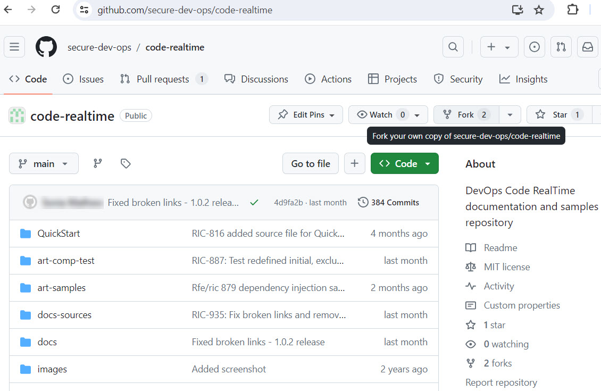
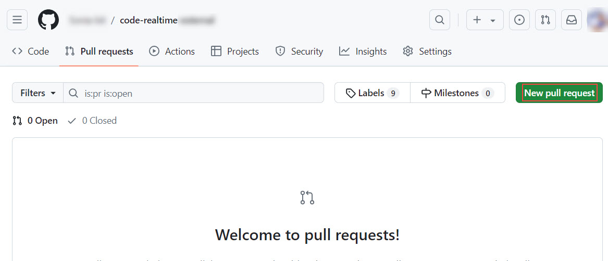

# Contributing


We appreciate your interest in contributing to Code RealTime. This article guides to propose changes in Code RealTime public repositories on GitHub, and join the development process.

!!! note 
    There are multiple GitHub repositories that contain sample applications, test cases, documentation source files, source code for the [Art Tutorial](learning/art-tutorial.md) and Art Tutorial exercises. Below we use the main GitHub repository [secure-dev-ops/code-realtime](https://github.com/secure-dev-ops/code-realtime), but the process is exactly the same for the others.

## Prerequisites

- **GitHub Account**: If you don't have an account on GitHub, create a free account at [GitHub Join](https://github.com/join).
- **Git Knowledge**: Familiarity with Git version control software is required. You can find learning resources on GitHub's learning platform [Git Guides](https://github.com/git-guides) to get started with Git.

## Making a Change

### Fork the Repository

1. Navigate to the Code RealTime repository: [secure-dev-ops/code-realtime](https://github.com/secure-dev-ops/code-realtime).
   
2. Click the "Fork" button in the top-right corner. This creates a copy of the repository in your GitHub account.
   

### Clone Your Fork

1. Open your terminal and use the `git clone` command to create a local copy of your forked repository in your workspace. Replace `<your-username>` with your GitHub username:  
  ``` 
   git clone https://github.com/<your-username>/code-realtime.git
   ```    
2. Navigate to the local directory:  
   ``` 
   cd <your-local-directory>
   ```

### Create a Branch and Push Your Changes

1. Create a new branch for your proposed changes. Use a descriptive branch name that reflects your contribution. Here's an example:     
   ``` 
   git checkout -b contribute-feature-x
   ```  
where contribute-feature-x is your new branch name.
2. Make your changes to the relevant files in your local repository.   
   ``` 
   git add <filename1> <filename2> ...
   ```  
3. Commit your changes.  
     ``` 
   git commit -m "Proposed a new change in feature X"
    ```  
4. Push your committed changes to your forked repository on GitHub:  
    ``` 
   git push origin contribute-feature-x
    ``` 

## Create a Pull Request

1. Visit your forked repository on GitHub (e.g., 'https://github.com/your-username/code-realtime').

2. Locate the **Pull requests** tab and click the **New pull request** button.
   

3. Select your branch containing the changes (e.g., `contribute-feature-x`) and compare it with the main branch of the upstream repository [secure-devops/code-realtime](https://github.com/secure-dev-ops/code-realtime).

4. Provide a clear and concise title and description for your pull request. In the description, explain the purpose of your changes and how they address an issue or improve the project.

5. Click **Create pull request**.

## Responding to Feedback and Merging

- Be patient and responsive about feedback from reviewers. Integrate their suggestions into your branch as needed.
- If your pull request gets approved, a reviewer will merge your changes into the main branch.

## Best Practices

- Follow coding style guides, if available, to ensure consistency across the codebase.
- If you make changes to documentation source files, make sure to review them in a web browser using the [mkdocs](https://www.mkdocs.org/) tool.
- If you are troubleshooting a problem which you suspect could be a bug in either the Art Compiler or the TargetRTS, feel free to create a new unit test in [art-comp-test/tests](https://github.com/secure-dev-ops/code-realtime/tree/main/art-comp-test/tests) to demonstrate the problem with a small sample.
- Stay updated about any changes to the contribution process.  
  
