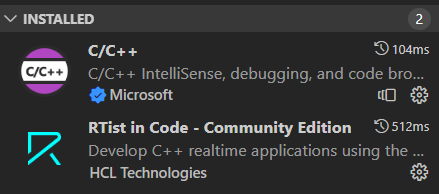
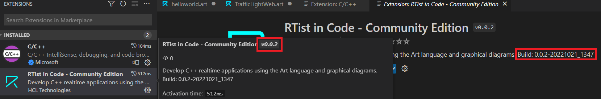
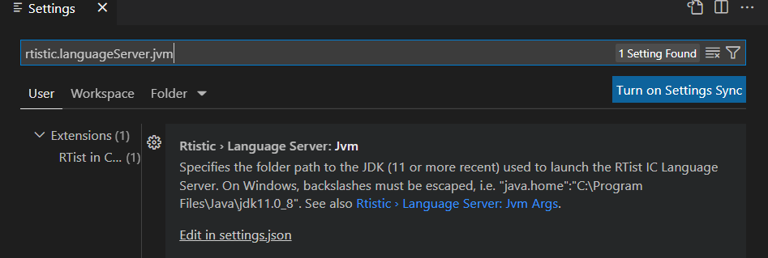
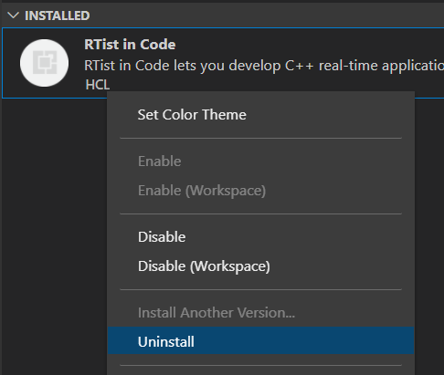

## Installing

{$product.name$} can be installed on top of Visual Studio Code or Eclipse Theia.

The latest version of {$product.name$} is available on the [Visual Studio Marketplace](https://marketplace.visualstudio.com/items?itemName=HCLTechnologies.code-realtime-ce) and on the [Open VSX Registry](https://open-vsx.org/extension/HCLTechnologies/code-realtime-ce). To install that version into Visual Studio Code or Eclipse Theia follow these steps:

1) Click "Extensions" in the activity bar to open the Extensions view.

2) Type "Code RealTime" in the search field.

3) Click the "Install" button to install the {$product.name$} extension

Once the installation is finished you will see {$product.name$} appear in the "Installed" section of the Extensions view:

The screenshot above also shows that an extension for working with C/C++ has been installed. See [Setup C++ Build Tools](#setup-c-build-tools) for more information.

After you have installed {$product.name$} it's recommended to restart Visual Studio Code or Eclipse Theia, or at least to perform the command `Developer: Reload Window` which is available in the Command Palette (++ctrl+shift+"P"++).

### Install from VSIX
Another way to install {$product.name$} is to use a .vsix file. This can be useful if you want to install another version than the latest. You can download .vsix files for all released versions of {$product.name$} from both the [Visual Studio Marketplace](https://marketplace.visualstudio.com/items?itemName=HCLTechnologies.code-realtime-ce) and the [Open VSX Registry](https://open-vsx.org/extension/HCLTechnologies/code-realtime-ce) (click "Version History"). Once you have downloaded the .vsix file follow these steps to install it:

1) If you already have a version of {$product.name$} installed, you can manually uninstall it first (see [Uninstalling](#uninstalling)). Note that this step is usually not required since the newly installed version of the extension will automatically replace the old one.

2) Open the menu of the Extensions view and select the command "Install from VSIX". 

3) In the file dialog that appears, select the .vsix file to install.

If the installation completes successfully you should see the following message:

If instead the installation fails, this message will tell you the reason. One common reason for failure is that your version of Visual Studio Code or Eclipse Theia is not compatible (i.e. too old) for {$product.name$}.

It should also be noted that it's possible to directly install any published version of {$product.name$} by using the "Install Another Version" command that is available in the context menu of an extension shown in the "Installed" section.

### Install from Docker Image
Yet another way to install {$product.name$} is to use the Docker image that is available on [DockerHub](https://hub.docker.com/r/baravich/theia-code-realtime). This image contains Eclipse Theia with the latest version of {$product.name$} installed. Run the docker image using this command:

`docker run -p <host-port>:<container-port> baravich/theia-code-realtime:1.0`

Replace `<host-port>` with a port that is available on your computer, and `<container-port>` with the port you want the Docker container to use. For example, if you run this command

`docker run -p 4000:3000 baravich/theia-code-realtime:1.0`

then after less than a minute you can access {$product.name$} from a web browser at [http://localhost:4000](http://localhost:4000).

### Viewing Installation Information
If you are unsure about which version of {$product.name$} you have installed, you can see the version in the extension's tooltip, and the full build version is available in the page that appears if you double-click the extension:

You can also see the version and the exact date of the installed {$product.name$} in the Changelog that is present on the extension's page. There you can also see what has been fixed and improved compared to older releases. Note that for Theia this information is not present on the extension's page, but you can see it if you double-click on the extension's name (the web page of the extension will then open).

### Portable Mode Installation
You can install multiple versions of {$product.name$} by using the portable mode of Visual Studio Code. See [Portable Mode](https://code.visualstudio.com/docs/editor/portable) for how to install Visual Studio Code in portable mode, which will allow you to install a version of {$product.name$} that won't affect other Visual Studio Code installations on the machine. Portable mode also allows to move or copy an installation from one machine to another, which makes it useful in scenarios where installs should be centralized in an organization.

### Post-Installation Configuration
After a successful installation you need to perform a few configuration steps before you can start to use {$product.name$}.

#### Setup Java
{$product.name$} uses a Java language server and hence needs a Java Virtual Machine (JVM). It's required to use a Java 17 JVM. If an appropriate JVM cannot be found when the {$product.name$} extension is activated (which for example happens the first time you open an Art file), you will receive an error message.

{$product.name$} follows the steps below in priority order when it looks for an appropriate JVM to use:

1) The setting [`code-rt.languageServer.jvm`](settings.md#jvm) is examined. If it specifies a path to a JVM it will be used. You can edit this setting by invoking **File - Preferences - Settings** and then type the setting id mentioned above in the filter box.

2) The environment variable `JAVA_HOME` is examined. If it specifies a path to a JVM it will be used.
   
3) An attempt is made to launch the `java` command without using a path. The first JVM found in the system path, if any, will be used.

You may also need to adjust the arguments for the JVM. By default the JVM is launched with the below argument:

`-Xmx4024m`

To change the JVM arguments set the setting [`code-rt.languageServer.jvmArgs`](settings.md#jvm-args) shown in the image above.

When the {$product.name$} extension is activated information about which Java that is used is printed to the Art Server output channel.

Here you will also see if the launching of the language server for some reason failed.

#### Setup C++ Build Tools
When {$product.name$} builds generated C++ code it uses C++ build tools such as a make tool, a C++ compiler, a C++ linker etc. These tools need to be in the path when you start Visual Studio Code or Eclipse Theia. If you have multiple C++ build tools installed, make sure the correct ones are present in the path before launching Visual Studio Code or Eclipse Theia. For example, if you use the Microsoft C++ compiler, it's recommended to launch from a Visual Studio native tools command prompt with the correct version (e.g. 32 bit or 64 bit). Build errors caused by inconsistent versions of C++ build tools being used can be tricky to find.

You also need to install an extension for C/C++ development into Visual Studio Code or Eclipse Theia. Even if you can use any such extension, {$product.name$} provides the best integration with either [C/C++ for Visual Studio Code](https://code.visualstudio.com/docs/languages/cpp) or [clangd](https://clangd.llvm.org/).

## Uninstalling
To uninstall {$product.name$} follow these steps:

1) Click "Extensions" in the left side-bar.

2) Find the {$product.name$} extension in the "Installed" section and invoke the "Uninstall" command (in Visual Studio Code the command is available in the context menu, while in Theia it shows up as a button to click).

Once the uninstallation is finished you will no longer see {$product.name$} in the "Installed" section.
