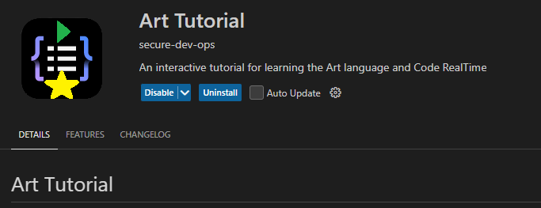
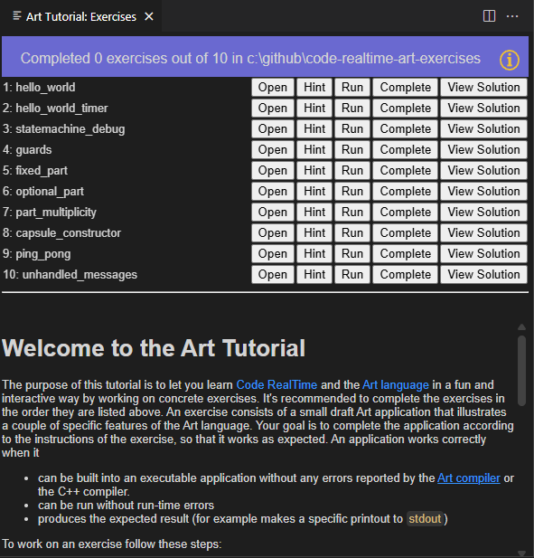

The Art Tutorial is an extension which you can install in your IDE together with {$product.name$}. It's available on the [Visual Studio Code](https://marketplace.visualstudio.com/items?itemName=secure-dev-ops.art-tutorial) and the [OpenVSX](https://open-vsx.org/extension/secure-dev-ops/art-tutorial) marketplaces, so you can easily install it from the Extensions view.

The extension provides a command **Art Tutorial: Exercises** which you can invoke from the Command Palette (++ctrl+shift+"P"++). It will ask you for a directory where exercises for the tutorial are located. You can find exercises in this [GitHub repository](https://github.com/HCL-TECH-SOFTWARE/code-realtime-art-exercises) which you can clone.

Follow the instructions on the Art Tutorial welcome page to work on the exercises. 

!!! note 
    The [source code for the Art Tutorial extension](https://github.com/HCL-TECH-SOFTWARE/code-realtime-art-tutorial) is open source. Feel free to use it for learning how you can create your own extensions for {$product.name$}.
    The [exercises](https://github.com/HCL-TECH-SOFTWARE/code-realtime-art-exercises) are also open source and you are welcome to [contribute](../contributing.md) your own exercises and solutions when you feel ready to do so. This can help others that want to learn {$product.name$} and the Art language.

