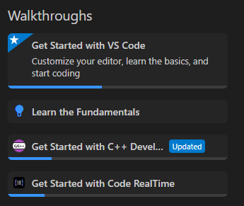

To use {$product.name$} efficiently you need to learn about several different technologies:

- The IDE with which you will use {$product.name$}. Refer to the documentation of your IDE, for example the [Visual Studio Code Documentation](https://code.visualstudio.com/docs).
- The C++ language. There are several online resources for learning C++, for example [Learn C++](http://www.learncpp.com/) and [C++ Language](http://www.cplusplus.com/doc/tutorial/).
- The [Art Language](../art-lang/index.md) and features that {$product.name$} provides for building realtime applications with it. Learn about them from this documentation and from the resources mentioned below.

As an introduction to the Art language and {$product.name$} watch this [video](https://www.youtube.com/watch?v=6kgg_oDGSQ8). 

On the Welcome page of {$product.name$} there are several step-by-step walkthroughs which demonstrate core workflows:

When you feel ready to start developing your first application with {$product.name$} you may use these additional resources for learning more:

- **[Samples](../samples.md)** These are complete sample applications which you can build, run and take inspiration from.
- **[Tests](https://github.com/secure-dev-ops/code-realtime/tree/main/art-comp-test/tests)** These are very small sample applications which also can be built and run. They are used for regression testing of {$product.name$} and are therefore usually focused on only one or a few concepts of the Art language or TargetRTS. Each test has a file `testcase.md` which describes the concepts that it uses.
- **[Art Tutorial](art-tutorial.md)** This is an interactive tutorial which lets you learn about {$product.name$} and the Art language by working on exercises.