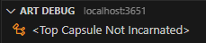
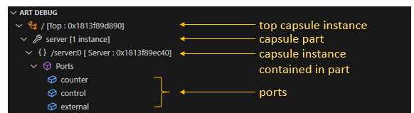
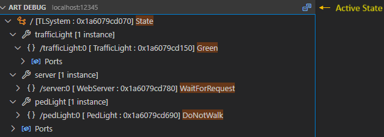
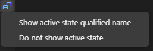
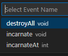
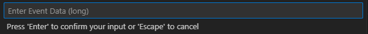
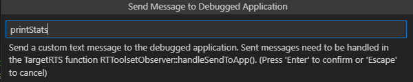

When something in your application doesn't behave as expected you need to troubleshoot it. For simple problems it may be enough to use [logging](../target-rts/logging.md) as the way to find out what is wrong. However, the main drawback with troubleshooting by logging is that it requires you to change and rebuild the application each time new log messages have been added. This takes time and can be tedious.

Using a C++ debugger is a much more powerful and efficient way of finding the root cause of problems in your application. By compiling both the TargetRTS and the generated code with debug symbols, as described [here](../target-rts/build.md#debug), you can debug your application with all  features provided by the C++ debugger (breakpoints, variable inspection etc). But while powerful, there can still be challenges:

- Debugging the generated code requires you to mentally map C++ code concepts back to Art concepts. For example, a state machine in Art becomes a set of functions in C++.
- You may not be so familiar with the TargetRTS code as you have not written this code yourself.
- Certain more complex tasks, such as sending events on ports for the purpose of debugging, can not be directly done from a C++ debugger and would require custom code to be written (which just like logging requires the application to be rebuilt).
- Remote debugging of an application that runs on another machine may require special tools (such as [gdbserver](https://en.wikipedia.org/wiki/Gdbserver)).

{$product.name$} provides an **Art Debugger** which adresses these challenges. It allows you to debug your application, locally or remotely, at a higher abstraction level than what a C++ debugger can do. It does not replace the need and usefulness of a C++ debugger, but works as a complement to it. If you want, you can debug your application at the same time both with the Art Debugger and the C++ debugger.

The Art Debugger uses a feature of the TargetRTS known as **target observability**. It includes code which lets the Art Debugger attach to your application at a TCP port (known as the **debug port**). Through this port the Art Debugger can both **control** and **observe** your application.


Target observability can be turned off by means of the [OBSERVABLE](../target-rts/build.md#observable) configuration setting. You can choose to do this when deploying the release version of your application if you don't need to debug it with the Art Debugger.

If target observability is not available, for example because your environment lacks support for TCP, you can instead use a command-line debugger known as the [RTS Debugger](rts-debugger.md).

## Start to Debug
There are two ways how you can start a new debug session.

1. [Launch](#launch) your application and start to debug it
2. [Attach](#attach) the debugger to an application that has already been launched

In both cases you need to start by creating a [launch configuration](launch-configurations.md).

### Launch
To launch your application and start to debug it use a [launch configuration](launch-configurations.md) where the [request](launch-configurations.md#request) attribute is set to "launch". 

```json
"configurations": [
    {
        "type": "art",
        "request": "launch",
        "name": "launch my app",
        "tc": "${workspaceFolder}/${command:AskForTC}"
    }
]
```

Then perform the command **Start Debugging** (++"F5"++).

As soon as the application has launched the Art Debugger will attach to it and pause the execution before the top capsule has been incarnated. The "Art Debug" view then looks like this:



Perform the command **Continue** (++"F5"++) to resume execution of the application. You can then [view the application run-time structure](#application-runtime-structure).

### Attach
Sometimes it's not feasible to launch the application to debug. For example

- you may not want to debug the application from the beginning, but start when it has already executed for some time
- you may want to run the application on a different machine and debug it remotely

In this case your [launch configuration](launch-configurations.md) should have the [request](launch-configurations.md#request) attribute set to "attach". 

```json
"configurations": [
    {
        "type": "art",
        "request": "attach",
        "name": "attach to local app"
    }
]
```

Before you perform the command **Start Debugging** (++"F5"++) the application must be started with appropriate command-line arguments. Here are some examples of starting an application `MyApp.EXE`:

```
./MyApp.EXE -obslisten=3650
```
*Start the application and pause execution while waiting for the Art Debugger to attach on the default debug port (3650).*

```
./MyApp.EXE -URTS_DEBUG=continue -obslisten=3652
```
*Start the application without initially pausing the execution. Later a debug session can start by attaching the Art Debugger on the debug port 3652.*

If you start the application on a different machine than where {$product.name$} runs, then your launch configuration must set the [hostname](launch-configurations.md#hostname) attribute to the IP address of that machine.

## Debug Toolbar
The debug toolbar appears as soon as the Art Debugger has launched or attached to an application to be debugged.


Use the toolbar to control the execution of the application through the Art Debugger.

* **Pause / Continue** When the application is paused you can press this button to continue the execution, and when the application is running you can press it for pausing the execution.
* **Restart** Restart the debug session by terminating and relaunching the application.
* **Disconnect** Stop the debug session without stopping the application. You can later attach to the application again if you want to resume debugging it.
* **Stop** Stop the application if it was launched, otherwise disconnect from it. In either case the debug session is stopped.

## Application RunTime Structure
At any time, even when the application is running, you can view the runtime structure of the debugged application in the **Art Debug** view. It shows the tree of capsule instances rooted at the top capsule instance, and grouped by the parts that currently contain at least one capsule instance. Here is a simple example of an application that has a top capsule `Top`, with a part `server` containing an instance of the capsule `Server` which has three ports `counter`, `control` and `external`.



Each capsule instance is uniquely identified by its path in the capsule instance tree. Read the path from right to left to interpret it. For example:

```
/part1:0/part2:3
```

*The capsule instance at index 3 in `part2`, which is a part of a capsule of which an instance is located at index 0 in `part1`, which is a part of the top capsule.*

A capsule instance is also uniquely identified by the memory address in the debugged application (printed within square brackets, after the capsule name). These memory addresses change every time you relaunch the application, but the capsule instance paths remain the same (as long as you don't change the application).

If a part has non-single multiplicity it can contain multiple capsule instances at runtime. The Art Debug view shows the current number of capsule instances in a part within square brackets, and if it's greater than zero you can expand the part to see those instances.


Note that capsule instances can reside at any index that is valid according to the multiplicity of the part, and there can be "gaps". In the example above the part `c2` has multiplicity 5 (this can only be seen in the Art file, not in the Art Debug view) and it contains 3 capsule instances at indices 0, 1 and 4. There are no capsule instances at index 2 and 3.

Also note that the capsule that is shown within square brackets for a capsule instance is its runtime type, which can be different from the part's type, but must be compatible with it. In the example above the capsule instance at index 4 has the type `Csub` while other instances have the type `C`. This can for example mean that the part `c2` is typed by the capsule `C` and that `Csub` is a capsule that inherits from `C`.

### Active State
For each capsule instance shown in the Art Debug view you can see which state of its state machine that is currently active. This information appears in highlighted text as shown in the image below:



By default the simple (i.e. unqualified) name of the active state is shown. If you have hierarchical state machines, where different sub states have the same name, you can click the **Active State** toolbar button and select **Show active state qualified name**. From there you can also turn off the display of active states.



## Send Event
You can send an event by clicking the **Send Event** arrow that appears when you hover the mouse over a port in the Art Debug view.


A popup appears where you can select the event you want to send on that port. All events defined in the protocol that types the port are shown, and if an event has a data parameter, the type of that parameter is also shown. You can send events both in to the port, and out from the port. If the selected port is not conjugated the in-events of the port's protocol will be sent in to the port, and the out-events will be sent out from the port. If the port is conjugated it becomes the other way around. The popup that lists the events shows icons that tell if the event will be sent in to the port (→◼) or out from the port (◼→).



If you choose to send an event with a data parameter, another popup appears where you can enter the data value to send with the event.



Data values are entered by using their ASCII encodings. See [Default Encoding/Decoding Rules](../target-rts/encoding-decoding.md#default-encodingdecoding-rules) to learn what the default encodings look like. Some common examples are listed below:

* `5`, `-14` : Integer value
* `true`, `false` : Boolean value
* `3.14` : Float value
* `"hello!"` String value (don't forget the enclosing double quotes)
* `'a'` Char value (don't forget the enclosing single quotes)
* `0`, `4` : Enum literal value (corresponds to the declaration index of the enum literal; 0 for the first literal)
* `{x 10, y 15}` : Struct or class value (with fields `x` and `y` of integer type)

Note that if the event parameter has a type with a custom decode function, then the data value needs to be entered on the form expected by that decode function.

If the entered data value cannot be correctly decoded by the decode function of the event parameter type, the message `BAD_MESSAGE` will be printed in the Debug Console (and the event is not sent).

For some events it's optional to provide data. For example, the `timeout` event on a `Timing` port can contain data, but doesn't have to. In this case you can simply press ++"Enter"++ to close the popup and send the event without a data value.

### Ports with Multiplicity
For ports with non-single multiplicity the Art Debug view shows the port multiplicity within square brackets:


When you perform the **Send Event** command on such a port, you will be prompted for a port index on which to send the event:


If you don't specify a port index, the event will be sent on all port indices. This is known as **broadcasting** the event.

## Custom Debug Commands
During a debug session you can use the command **Send to App** (available in the command palette) for sending a custom command to the debugged application. The command is received as a string by the application in the TargetRTS function [`RTToolsetObserver`](../targetrts-api/class_r_t_toolset_observer.html)`::handleSendToApp()`. This is a generic way of interacting with the debugged application during the debug session which can be tailored to your specific needs. Some examples when custom debug commands can be useful to implement:

* Log current memory usage and other interesting run-time statistics about the application
* Configure parts of the application which are not accessible by means of sending events to capsule ports
* Log some data from the application

The default implementation of [`RTToolsetObserver`](../targetrts-api/class_r_t_toolset_observer.html)`::handleSendToApp()` contains a few built-in commands (prefixed with `rt`) for logging certain internal data from the TargetRTS. They can serve as examples for how to create your own custom debug commands.

Below is an example of how to implement a debug command `printStats` which prints statistics for one of the [controllers](../targetrts-api/class_r_t_controller.html) in the debugged application:

```cpp
if (RTMemoryUtil::strcmp(myLogInfo->msgSendToApp, "printStats") == 0)
{
    RTController* controller = debugger->getTask(0); // Made getTask() public
    if (controller == nullptr) {
        std::cout << "No controllers" << std::endl;
        sendResultCode( RES_OTHER_ERROR );
    }
    else {
        controller->printStats();
        sendResultCode( RES_OK );
    }
}
```


