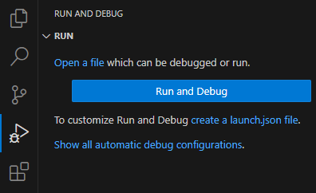
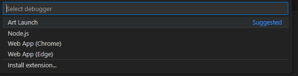
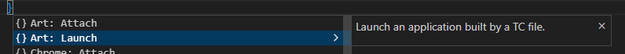
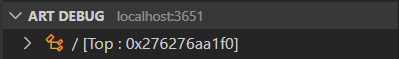

As described in [Building](../building/index.md) you can launch a built executable using the [Run command](../building/index.md#tc-context-menu-commands) in the TC context menu, of even without having a TC as described [here](../building/index.md#building-and-running-without-a-tc). These are quick and easy ways to run an executable, which may be sufficient for simple applications. However, the simplicity comes with several limitations:

* You cannot specify any custom command-line arguments for the launched executable. In fact, the executable is always launched with one hard-coded argument `-URTS_DEBUG=quit` which means it will run in non-debug mode.
* You cannot set any custom environment variables for the launched executable.
* You cannot set the current working directory for the launched executable.

A more flexible way to launch an executable is to use a **launch configuration**. This is a JSON file that contains several attributes that control how to launch the executable. Using a launch configuration also gives additional benefits:

* Visual Studio Code and Eclipse Theia knows about launch configurations and provides a dedicated UI for working with them.
* You can easily manage multiple ways of launching the same application. Just create a launch configuration for each way of launching it.
* The output from the launched application is printed in the Debug Console rather than the Terminal view. The Debug Console colorizes printed output from the application (<span style="color: red;">red</span> for text printed to stderr and <span style="color: orange;">orange</span> for text printed to stdout).
* You can terminate and relaunch the application using a toolbar instead of using the Terminal view.
* With few or no changes a launch configuration can also be used for [debugging the application with the Art Debugger](debugging.md).

## Creating a Launch Configuration
To create a launch configuration open the "Run and Debug" view from the activity bar and then click the **create a launch.json file** hyperlink.



You can choose to store the launch configuration either in a workspace folder or in the workspace file. In most cases it makes sense to store it in the same workspace folder that contains the TC that will be used for building the application to launch. However, if you want to share the same launch configuration for multiple applications you can choose to store it in the workspace file instead.

When you choose to store the launch configuration in a workspace folder it will be placed in the `.vscode` folder and get the name `launch.json`:


After you have chosen where to store the launch configuration, you will be prompted for which type of launch configuration to create. Select **Art Launch**.



This will create a `launch.json` file with two launch configurations, one for launching the executable and one for attaching a debugger to it:

``` json
{
   "type": "art",
   "request": "launch",
   "name": "launchTC",
   "tc": "${workspaceFolder}/${command:AskForTC}"
},
{
   "type": "art",
   "request": "attach",
   "name": "attachTC",
   "port": 3650
}
```

If you don't plan to [debug](debugging.md) the executable you can delete the second launch configuration, but it could be useful to keep it in case you need to debug later.

You should change the `name` attribute to give your launch configurations meaningful names.

If needed you can create additional launch configurations either by copy/paste in the `launch.json` file, or by pressing the **Add Configuration...** button. You can also create new launch configurations using the drop down menu in the "Run and Debug" view:


Another way to create new launch configurations is by pressing ++ctrl+space++ in the `launch.json` file.



## Launching a Launch Configuration
The name of a launch configuration appears in the launch configuration drop down menu:


If you want to launch the launch configuration, and attach the Art Debugger to the launched application in order to [debug](debugging.md) it, press the green arrow button that appears to the left of this drop down menu. This invokes the command **Start Debugging** (++"F5"++). If you just want to launch the application without debugging, perform instead the command **Run without Debugging** (++ctrl+"F5"++). Both these commands can be found in the `Run` menu.

## Launch Configuration Attributes
Below is a table that lists all attributes that can be used in a launch configuration. Each attribute is described in a section of its own below the table.

<p id="launch_config_attributes"/>

| Attribute | Description | Mandatory |
|----------|:-------------|:-------------|
| [type](#type) | The type of launch configuration. Always "art". | Yes
| [request](#request) | What the launch configuration will do. Either "launch" or "attach". | Yes
| [name](#name) | The name of the launch configuration | Yes
| [tc](#tc) | The TC file to use for building and launching the application | Yes (unless [request](#request) is "attach")
| [args](#args) | Command line arguments to pass to the launched application | No
| [environment](#environment) | Environment variables to set for the launched application | No
| [cwd](#cwd) | Current working directory for the launched application | No
| [port](#port) | Which debug port to use when debugging the application | No
| [hostname](#hostname) | The machine where the application runs to which the debugger should be attached | No
| [stopAtEntry](#stopatentry) | Should the debugger pause execution of the launched application? | No
| [connectTimeout](#connecttimeout) | Time limit for the debugger to establish a connection to the application | No

### type
This attribute specifies the type of launch configuration. It is mandatory and is always the string "art". 

### request
This attribute specifies what the launch configuration will do. It is mandatory and should be set to "launch" if you want the launch configuration to start your application. For a launch configuration that is used for [debugging](debugging.md) you can also set this attribute to "attach" to specify that the Art Debugger should attach to an application that is already running.

### name
Specifies the name of the launch configuration. You should give a meaningful and unique name to each launch configuration that describes what it does. The chosen name appears in the drop down menu in the "Run and Debug" view. When you first create a launch configuration it gets the name "launchTC". Make sure to change this default name.

### tc
This attribute specifies which TC file to use for building and launching. The specified TC must build an executable. You must use an absolute path to the TC file, but it can contain the `${workspaceFolder}` variable which expands to the location of the workspace folder. By default the `tc` attribute is set to `${workspaceFolder}/${command:AskForTC}` which means you will be prompted for choosing which TC to use when the launch configuration is launched.


For a list of other variables that can be used in this attribute see [this page](https://code.visualstudio.com/docs/editor/variables-reference#_settings-command-variables-and-input-variables).

If the [request](#request) attribute is set to "attach" then you should not set the [tc](#tc) attribute, because in that case the launch configuration will not launch your application, and just attach the Art Debugger to an application that is already running.

### args
Specifies the command-line arguments for the launched executable. This is a list of strings, and by default it is empty which means that no additional command-line arguments will be passed to the executable. You may add custom command-line arguments for your application as necessary. For example:

``` json
{
   "type": "art",
   "request": "launch",
   "name": "Let my exe listen to a port",
   "tc": "${workspaceFolder}/app.tcjs",
   "args": ["-port=12345"]
}
```

Note that the special command-line argument `-URTS_DEBUG`, which tells if the application should run in debug mode or not, is set automatically depending on how you launch the launch configuration (see [Launching a Launch Configuration](#launching-a-launch-configuration)) so you should not include that argument in the [args](#args) attribute.

### environment
Specifies environment variables to be set for the launched executable. This is a list of objects where each object has a property that specifies the name of an environment variable. The environment variable will be set to the value of that property. In the example below the environment variable `LD_LIBRARY_PATH` will be set to `/libs/mylibs` to tell a Linux system where to load shared libraries needed by the application.

``` json
{
   "type": "art",
   "request": "launch",
   "name": "Launch and load shared libraries",
   "tc": "${workspaceFolder}/app.tcjs",
   "environment": [{"LD_LIBRARY_PATH" : "/libs/mylibs"}]
}
```

### cwd
By default the launched application runs in the same folder as where the executable is located. By setting this attribute you can change the current working directory to something else. The value of this attribute must be an absolute path, but certain variables can be used. See [this page](https://code.visualstudio.com/docs/editor/variables-reference#_settings-command-variables-and-input-variables) for more information.

### port
This attribute applies only for launch configurations that are used for [debugging](debugging.md). You can use it for specifying which TCP port to use as the debug port. By default the debug port is 3650. If the specified debug port is not available (for example because another debug session is already using it) then the Art Debugger will automatically increment the port number by one until it finds a port that is available. Up to 100 such attempts to increase the port number are made. If the Art Debugger fails to find a debug port that it can use, the debug session cannot be started. If the default port range 3650-3750 is not available on your machine you can set this attribute, to let the Art Debugger look for a valid debug port in another port range. Once a debug session has been successfully started you can see the debug port that is used in the Art Debug view.



### hostname
This attribute applies only for launch configurations that are used for [debugging](debugging.md) and only when the [request](#request) attribute is set to "attach". In that case it specifies the IP address where the application is running, to which the Art Debugger should attach. It defaults to "localhost", i.e. by default the Art Debugger assumes that the application to debug runs on the same machine as where {$product.name$} runs.

### stopAtEntry
This attribute applies only for launch configurations that are used for [debugging](debugging.md) and only when the [request](#request) attribute is set to "launch". By default the application is paused as soon as it has been launched for debugging, and you have to manually perform the **Continue** command to resume its execution. You can set this attribute to `false` to prevent this from happening, and let the launched application start running immediately.

### connectTimeout
This attribute applies only for launch configurations that are used for [debugging](debugging.md). It specifies the maximum time (in milliseconds) the Art Debugger will wait when it tries to establish a socket connection to the debugged application. It defaults to 10000, i.e. by default the connection can take up to 10 seconds. If a connection has not been established within this time limit, the debug session will not start. This attribute is applicable regardless if the [request](#request) attribute is "launch" or "attach" since in both cases the Art Debugger needs to connect to the application to be debugged.