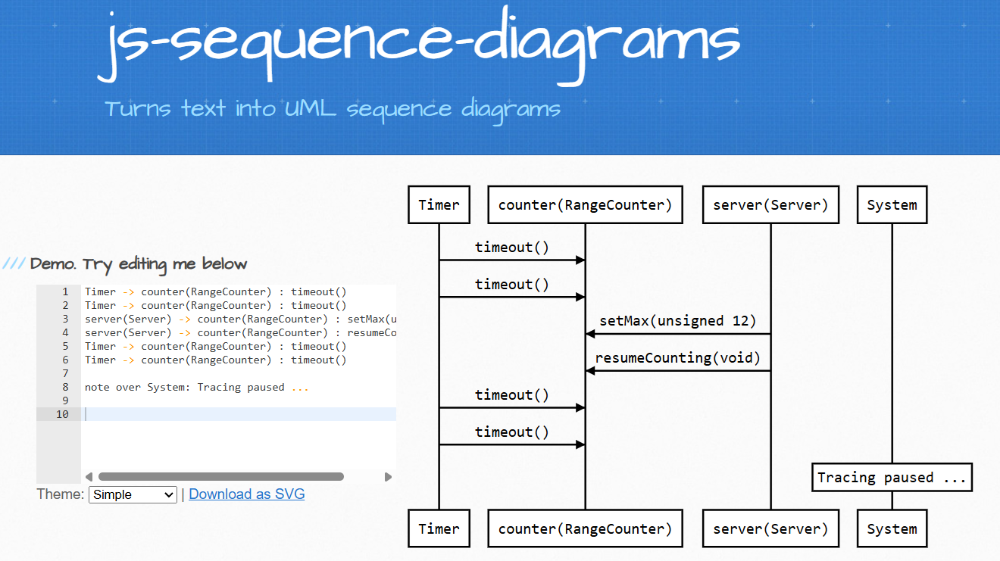
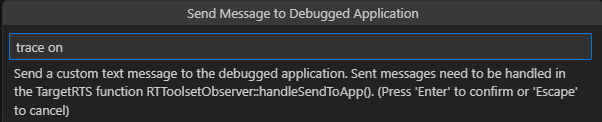
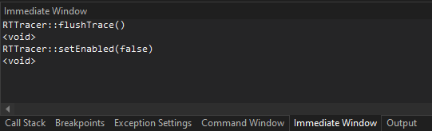

While an application generated by {$product.name$} is running, you can turn on tracing of the messages that are exchanged between capsule instances at run-time. The captured trace will be saved in a text file called `.trace.ms`, placed in the same folder as where the running executable is located. You can then visualize the trace by taking the contents of that file and pass it to the [js-sequence-diagrams](https://bramp.github.io/js-sequence-diagrams/) web service. It will render a sequence diagram for the trace where each capsule instance that received a message during the trace session will be shown as a lifeline, and arrows between lifelines show the messages (with data if present).

Here is an example of a captured trace and how it's visualized as a sequence diagram by [js-sequence-diagrams](https://bramp.github.io/js-sequence-diagrams/):



This particular trace was captured from the [TcpRangeCounter]({$vars.github.repo$}/tree/main/art-samples/TcpRangeCounter) sample. The two lifelines in the middle represent the `counter` and `server` capsule instances and we can see that the `server` sent a message for the `setMax` event with 12 as data to the `counter`. It then sent also the `resumeCounting` event (without any data). The lifeline for a capsule instance has the name of the part that contains it, and within parenthesis we can also see the capsule type.

The `Timer` and `System` lifelines represent components of the TargetRTS that may interact with the capsule instances. `Timer` is the thread that implements timers and you will see when a capsule instance receives a timeout message for a timer that timed out. `System` is used for showing when capsule instances are created and initialized (by sending the `initialize` message). It's also used for showing a note if the tracing was paused for some time to indicate that the sequence diagram doesn't show messages that may have been exchanged during that time.

## Turning Tracing On and Off
By default the tracing capability is enabled in the TargetRTS. You can disable it through the [RTS_TRACE](../target-rts/build.md#rts_trace) configuration setting if you don't plan to capture any traces. This will make your executable slightly smaller.

When your application starts to run, tracing is initially turned off. To start capturing a trace you need to turn it on. There are several ways to do this as described in the sections below. 

While tracing is turned on, trace events will be captured and written to the `.trace.ms` file. However, for performance reasons the file is not immediately flushed. The file will be flushed when the application terminates, but quite often you may want to do it before that. Refer to the sections below for how to force the trace file to be flushed.

Capturing all messages that are exchanged in an application for the whole time it runs will usually lead to very large traces. Such big traces are cumbersome to work with, and sequence diagrams may not be possible to render. And even if they could be rendered, they may not be easy to use due to the size. It's better to only turn on tracing when the application reaches a point when something interesting is about to happen. For example, if you are troubleshooting a bug that occurs when a certain transition runs in a capsule's state machine, you can debug the application with the Art Debugger and [turn on tracing](#from-the-art-debugger) when the source state of that transition is reached. Then you can manually send the event which will trigger the interesting transition, and then turn tracing off. Thereby the trace file will only show what happened when that transition executed, which makes it small and manageable. 

Or you could debug your application with a C++ debugger and put a breakpoint that gets hit before something interesting happens. Then you can [turn on tracing](#from-the-c-debugger) and let the application run until it hits another breakpoint, and then turn off tracing again. The trace then shows you which messages were exchanged in the application between those two breakpoints were hit.

### From the Command Line
If you want to trace what happens in the application from the very beginning you can turn tracing on from the command-line when you launch the application. Launch your executable with the `-URTS_DEBUG` argument as the very first argument. For example:

```shell
./Top.EXE -URTS_DEBUG="trace on;quit"
```

This command will turn on tracing at application start-up and then quit the [RTS Debugger](rts-debugger.md) to let the application run without debugger at full speed. In this case the only way to turn off tracing before the application terminates is to do it [programmatically](#programmatically) using TargetRTS APIs.

You can also launch the application like this:

```shell
./Top.EXE -URTS_DEBUG="trace on;continue" -obslisten=12345
```

The main difference here is that you then later can attach the Art Debugger on the specified port, and [turn off tracing from there](#from-the-art-debugger).

Other [RTS Debugger commands](rts-debugger.md#commands) can of course also be used. For example, to trace the first 5 messages that are sent in the application:

```shell
./Top.EXE -URTS_DEBUG="trace on;go 5"
```

Read more about the `-URTS_DEBUG` argument [here](rts-debugger.md).

### From the RTS Debugger
The [RTS Debugger](rts-debugger.md) provides a command [`trace`](rts-debugger.md#trace) for turning tracing on or off:

```shell
RTS debug: ->trace on
  Tracing is on
```

If you are unsure whether tracing is currently on or off, you can run the command without argument.

A useful side-effect of the [`trace`](rts-debugger.md#trace) command is that it will flush the current trace file, if any. 

### From the Art Debugger
To turn tracing on or off from the [Art Debugger](../running-and-debugging/debugging.md) invoke the **Send to App** command from the command palette. The [`trace`](rts-debugger.md#trace) command [from the RTS Debugger](#from-the-rts-debugger) can be accessed from the popup that appears.



### From the C++ Debugger
Turning tracing on or off when you debug your application in a C++ debugger is often very useful. You do it by using the API provided by the TargetRTS class [RTTracer](../targetrts-api/class_r_t_tracer.html):

* `RTTracer::setEnabled(bool)` Turns tracing on or off.
* `RTTracer::isEnabled()` Returns if tracing is currently turned on or off.
* `RTTracer::flushTrace()` Forces the current trace file, if any, to be flushed, so it contains all trace events received so far.

Exactly how to call these functions depends on which C++ debugger you are using. For example, in the Visual Studio C++ Debugger you do it from the Immediate Window:



A typical workflow may look like this:

1. Build the application and the TargetRTS with debug symbols as described [here](../target-rts/build.md#debug).
2. Place a breakpoint at a place where you want to start tracing.
3. Start the application from the C++ debugger and let it run until the breakpoint is hit.
4. Call `RTTracer::setEnabled(true)` from the C++ debugger to turn tracing on.
5. Place a breakpoint at a place where you want to stop tracing.
6. Resume execution of the application and let it run until the breakpoint is hit.
7. Call `RTTracer::setEnabled(false)` from the C++ debugger to turn tracing off. Or call `RTTracer::flushTrace()` if you want to keep tracing but want to check what the trace contains so far.

### Programmatically
You can turn tracing on or off from your application code by using the API provided by the TargetRTS class [RTTracer](../targetrts-api/class_r_t_tracer.html). See [above](#from-the-c-debugger) for which functions that are available to use.

One scenario where it can be useful to enable tracing programmatically is if your C++ debugger does not support calling functions, or if you need to trace a certain scenario in an application that doesn't have debug symbols. It can also be useful to build tracing functionality into your application and for example use it to trace unexpected error scenarios that may occur. The collected trace files can then help you troubleshoot problems that have occurred when the application ran in the production environment.