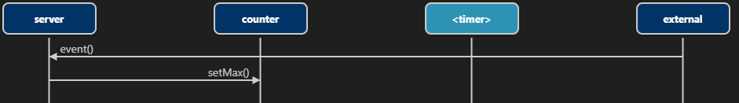
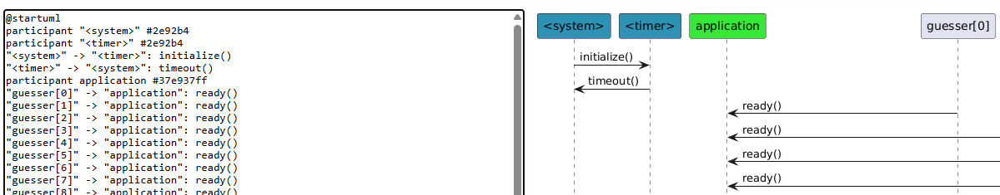

While an application generated by {$product.name$} is running, you can turn on tracing of messages that are exchanged between capsule instances at run-time. Such traces can be visualized graphically as sequence diagrams and can be very useful when troubleshooting certain kinds of bugs in an application such as race conditions, dead-locks, performance problems, unexpected error situations etc. Here are some examples of questions that can be answered by analyzing captured traces:

* Which messages were received by a capsule that caused it to enter a certain state (e.g. an unexpected error state)?
* Why did a capsule instance receive a certain message (e.g. an unexpected error message)?
* Which capsule instances in the application exchange messages most frequently? (For performance reasons you typically want such capsule instances to run in the same thread since intra-thread communication is much faster than inter-thread communication.)
* Are there capsule instances in the application which seem to be unused (and hence could be candidates for removal)?
* Is the handling of messages fast enough, or are there some transitions that are too slow?

A trace captured by {$product.name$} is saved in a file `.trace.art-trace` in the same folder where the running executable is located. You can use this file in 3 different ways:

1. Open the file in {$product.name$} as a [sequence diagram](#view-traces-as-sequence-diagrams) for analysis.
2. Open the file in {$product.name$} as a [text file](#view-traces-as-text) for analysis. 
3. [Process the file programmatically](#process-a-trace-programmatically), for example to analyze it algorithmically or to translate it into another trace file format.

## View Traces as Sequence Diagrams
To view an `.art-trace` file as a sequence diagram right-click on it in the Explorer view, or in the [text editor](#view-traces-as-text), and perform the command **Open Sequence Diagram**. The trace will then be visualized graphically as a sequence diagram. On the top there are **lifelines** which represent the capsule instances in the application. Each lifeline has a vertical line, and between these lines there are arrows that represent messages that were exhanged between capsule instances. The order of the message lines tell you in which order messages were *received* by capsule instances in the application. This means that the arrow heads of message lines are strictly ordered chronologically, from top to bottom.

The image below shows a sequence diagram for an `.art-trace` file captured from the [TcpRangeCounter](../samples.md#tcprangecounter) sample application.


We can see lifelines that represent the `counter` and `server` capsule instances and we can see that the `server` sent a message for the `setMax` event with 12 as data to the `counter`. It then sent also the `resumeCounting` event (without any data). 

The lifeline for a capsule instance has the name of the part that contains the instance. If the part has non-single multiplicity, the lifeline shows the index of the capsule instance within square brackets (`[0]` for the first instance). If you hover over a lifeline a tooltip appears with more information, such as the dynamic type of the capsule instance and its structured path in the application's composite structure. For more information about the capsule instance, double click on the lifeline header to navigate to the `.art-trace` file.

Colors are used to distinguish three types of lifelines:

<ul>
    <li><span style="color: green;">Green</span> for the lifeline that represents the top capsule instance which is created at application start-up. It has the name "application".</li>
    <li><span style="color: darkblue;">Dark blue</span> lifelines represent capsule instances that are created after the top capsule instance has been created, when the application runs.</li>
    <li><span style="color: lightblue;">Light blue</span> lifelines represent certain TargetRTS components that may interact with capsule instances.</li>
</ul>

There are two TargetRTS components that can interact with capsule instances. `<timer>` is the component of the TargetRTS that implements timers and you will see when a capsule instance receives a timeout message for a timer that has timed out. Inside the TargetRTS this capsule instance has the name `specials` and is typed by [RTTimerActor](../targetrts-api/class_r_t_timer_actor.html). The `<system>` lifeline is used for showing when capsule instances are created and initialized (by sending the `initialize` message). 

The sequence diagram may contain note boxes that show if the tracing was paused for some time. This indicates that the sequence diagram doesn't show messages that may have been exchanged during that time.

!!! note
    Even if a sequence diagram also shows a strict ordering of the *sending* of messages, it's important to remember that the messages only are ordered according to the times when they were *received*. In the diagram message lines are horizontal, but that should not be interpreted as that nothing happens between the sending and receiving of a message. It's fully possible that a received message in fact was sent before the message that precedes it in the trace was both received and sent.

If you hover over the message line label you can see the port of the receiver capsule instance on which the message was received. For more information about the message, double-click on the message line to navigate to the message in the `.art-trace` file.

### Messages without Sender
The sender of a message is computed at the time of receiving the message based on checking which port the receiver port is connected to. This means that sometimes the sender is not known, or that only limited information about the sender is available:

* Messages sent by the special TargetRTS instances `<system>` or `<timer>` have no sender port and sometimes also no receiver port.
* Messages that are injected into the application by using the [Art Debugger](debugging.md#send-event) have no sender.
* Messages that are programmatically injected into the application (for example by the [TCP server library]({$vars.github.repo$}/tree/main/art-samples/TcpServer)) have no sender.
* If the sender of a message disconnects the sender port from the receiver port immediately after a message has been sent on the port (and before the controller dispatches the message), it will not be possible for the receiver to know about the sender. This is, however, a quite unusual situation.

A special `external` lifeline is used for representing the unknown sender of a message.



## View Traces as Text
While a sequence diagram can be useful for showing an overview of the run-time interaction between capsule instances, it does not show all information that was captured in the trace. To see all information you can open an `.art-trace` file in the text editor.

The textual representation of a trace uses a domain specific tracing language, where each line tell about something that happens in the application at run-time:

* Tracing starts. Comments are then printed at the beginning of the `.art-trace` file to show the [trace configuration](#trace-configuration) that will be used for the trace. Other information is also printed, for example the current time (according to the chosen [timestamp precision](#timestamp-precision)).

```json
// "trace": {
//     "start_time": "2025-11-13 16:32:40.435320100"
// }
```

* A capsule instance receives a message. The first time a capsule instance receives a message it is declared in the `.art-trace` file using the [`instance`](#instance) keyword. The sending capsule instance is also declared at this time, if it was not already declared previously. The [message](#message) itself appears on a line further below these instance declarations.
* Tracing is paused. A [`note`](#note) is then printed to the `.art-trace` file.

In addition to this domain specific tracing language, extra information may also appear at the end of lines as JSON. What information that is included is decided by the [trace configuration](#trace-configuration).

### Instance
A capsule instance appears in an `.art-trace` file the first time it sends or receives a message. If tracing is turned on when a capsule instance is created, the first message it receives is the `initialize` message from `<system>`. However, if tracing is turned on at a later point in time, after the capsule instance was created, it will not appear in the trace until it either receives or sends a message. Here is an example of how a capsule instance appears in a trace:


* **Memory address** The memory address uniquely identifies the capsule instance throughout its lifetime.
* **Structure path** This shows the location of the capsule instance in the application's composite structure. The first name specifies a part in the top capsule, and subsequent names specify nested parts. For parts with non-single multiplicity the index within that part shows where the capsule instance is located. The structure path of a capsule instance is often the same throughout its lifetime, but with the use of [plugin parts](../art-lang/index.md#part) it's possible to move a capsule instance from one part to another at run-time, and in that case the structure path will change.
* **Dynamic type** This is the actual run-time type of the capsule instance. It's either the same as the capsule that types the part where it is contained, or a capsule that inherits (directly or indirectly) from it. The dynamic type of a capsule instance remains the same throughout its lifetime.
  
In the example above we see a capsule instance at memory address `0x26a59291f60` with the dynamic type `Pinger`. The instance is located at index 1 of the part `ping` (which hence has non-single multiplicity). Its container capsule instance is located in the part `ps` of the top capsule.

You can ++ctrl++-click on underlined part names in the structure path to navigate to a part in the Art file where it's defined. In the same way you can navigate to the capsule that is the dynamic type of the capsule instance.

#### Message
A message appears in an `.art-trace` file when a message is received by a capsule instance. Note that a message is not considered to be received when it's placed by the sender in the message queue of the receiver's controller, but rather when the controller dispatches the message to the receiver capsule instance. Here is an example of how messages appear in a trace:


* **Sender** The sender is identified by its memory address, but the name of the part that contains it is also printed to make the trace more readable.
* **Sender port** This is the port of the sending capsule on which the message was sent. If that port has non-single multiplicity the port index is specified within square brackets.
* **Receiver** The receiver is identified by its memory address, but the name of the part that contains it is also printed to make the trace more readable.
* **Receiver port** This is the port of the receiver capsule on which the message was received. If that port has non-single multiplicity the port index is specified within square brackets.
* **Event** This is the protocol event which the message is an instance of. The receiver port is typed by the protocol that defines this event (or a protocol from which it inherits).
* **Data** This is the data that is carried by the message. By default the message data is represented by its [ASCII encoding](../target-rts/encoding-decoding.md) which is the data type followed by the value. If the message carries no data an empty string is printed (i.e. `event()`). If the event data type cannot be encoded (for example because it has no encode function or the configuration macro [`OBJECT_ENCODE`](../target-rts/build.md#object_decode-and-object_encode) is unset) then `?` is printed.

In the example above we see two messages. The first one was sent from a capsule instance in the `ping` part and received by a capsule instance in the `pong` part, and the other one was sent in the opposite direction. We can see that the first message was sent on the port `pingPort` at index 0, while the second message was sent on the port `pongPort` (which has single multiplicity). The first message was received on the port `pongPort` while the second message was received on the port `pingPort` at index 1. The first message was of the event `ping` and carried an `int` value 0, while the second message was of the event `pong` and carried no data.

You can ++ctrl++-click on underlined addresses to navigate within the trace file to the [instance declaration](#instance) of the sender or receiver capsule instances. There you can see more details about the instances than what is shown in the message itself. You can also ++ctrl++-click on underlined port names to navigate to where the sender or receiver port is defined in an Art file. In the same way you can navigate to the definition of the protocol event.

If the sender of a message is not known (see [Message without Sender](#messages-without-sender)) it's represented in the trace with a fake instance `external` at address `0x0`. This makes it easy to distinguish these "external" messages from others.

#### Note
A note appears in an `.art-trace` file when tracing is turned off but the application keeps running. It serves as a delimiter in the trace file in case tracing later is turned on again. Messages that were received while the tracing was paused will obviously not be included in the trace, and the note shows the place in the trace where this could have happened.

## Turning Tracing On and Off
By default the tracing capability is enabled in the TargetRTS. You can disable it through the [RTS_TRACE](../target-rts/build.md#rts_trace) configuration setting if you don't plan to capture any traces. This will make your executable slightly smaller.

When your application starts to run, tracing is initially turned off. To start capturing a trace you need to turn it on. There are several ways to do this as described in the sections below. 

While tracing is turned on, trace events will be captured and written to the trace file. However, for performance reasons the file is not immediately flushed. The trace file will be flushed when the application terminates, but quite often you may want to do it before that. Refer to the sections below for how to force the trace file to be flushed.

Captured trace files will be placed in the same folder as where the running executable is located and have the name `.trace.art-trace`. If you want to save a previously captured trace file, move or rename it before capturing another trace to avoid overwriting it.

Capturing all messages that are exchanged in an application for the whole time it runs will usually lead to very large traces. Such big traces are cumbersome to work with, and sequence diagrams may not be possible to render. And even if they could be rendered, they may not be easy to use due to the size. It's better to only turn on tracing when the application reaches a point when something interesting is about to happen. For example, if you are troubleshooting a bug that occurs when a certain transition runs in a capsule's state machine, you can debug the application with the Art Debugger and [turn on tracing](#from-the-art-debugger) when the source state of that transition is reached. Then you can manually send the event which will trigger the interesting transition, and then turn tracing off. Thereby the trace file will only show what happened when that transition executed, which makes it small and manageable. 

Or you could debug your application with a C++ debugger and put a breakpoint that gets hit before something interesting happens. Then you can [turn on tracing](#from-the-c-debugger) and let the application run until it hits another breakpoint, and then turn off tracing again. The trace then shows you which messages were exchanged in the application between those two breakpoints were hit.

### From the Command Line
If you want to trace what happens in the application from the very beginning you can turn tracing on from the command-line when you launch the application. Launch your executable with the `-URTS_DEBUG` argument as the very first argument. For example:

```shell
./Top.EXE -URTS_DEBUG="trace on;quit"
```

This command will turn on tracing at application start-up and then quit the [RTS Debugger](rts-debugger.md) to let the application run without debugger at full speed. In this case the only way to turn off tracing before the application terminates is to do it [programmatically](#programmatically) using TargetRTS APIs.

You can also launch the application like this:

```shell
./Top.EXE -URTS_DEBUG="trace on;continue" -obslisten=12345
```

The main difference here is that you then later can attach the Art Debugger on the specified port, and [turn off tracing from there](#from-the-art-debugger).

Other [RTS Debugger commands](rts-debugger.md#commands) can of course also be used. For example, to trace the first 5 messages that are sent in the application:

```shell
./Top.EXE -URTS_DEBUG="trace on;go 5"
```

Read more about the `-URTS_DEBUG` argument [here](rts-debugger.md).

### From the RTS Debugger
The [RTS Debugger](rts-debugger.md) provides a command [`trace`](rts-debugger.md#trace) for turning tracing on or off:

```shell
RTS debug: ->trace on
  Tracing is on
```

If you are unsure whether tracing is currently on or off, you can run the command without argument.

A useful side-effect of the [`trace`](rts-debugger.md#trace) command is that it will flush the current trace file, if any. 

### From the Art Debugger
To turn tracing on or off from the [Art Debugger](../running-and-debugging/debugging.md) invoke the **Send to App** command from the command palette. The [`trace`](rts-debugger.md#trace) command [from the RTS Debugger](#from-the-rts-debugger) can be accessed from the popup that appears.


### From the C++ Debugger
Turning tracing on or off when you debug your application in a C++ debugger is often very useful. You do it by using the API provided by the TargetRTS class [RTTracer](../targetrts-api/class_r_t_tracer.html):

* `RTTracer::setEnabled(bool)` Turns tracing on or off.
* `RTTracer::isEnabled()` Returns if tracing is currently turned on or off.
* `RTTracer::flushTrace()` Forces the current trace file, if any, to be flushed, so it contains all trace events received so far.

Exactly how to call these functions depends on which C++ debugger you are using. For example, in the Visual Studio C++ Debugger you do it from the Immediate Window:


A typical workflow may look like this:

1. Build the application and the TargetRTS with debug symbols as described [here](../target-rts/build.md#debug).
2. Place a breakpoint at a place where you want to start tracing.
3. Start the application from the C++ debugger and let it run until the breakpoint is hit.
4. Call `RTTracer::setEnabled(true)` from the C++ debugger to turn tracing on.
5. Place a breakpoint at a place where you want to stop tracing.
6. Resume execution of the application and let it run until the breakpoint is hit.
7. Call `RTTracer::setEnabled(false)` from the C++ debugger to turn tracing off. Or call `RTTracer::flushTrace()` if you want to keep tracing but want to check what the trace contains so far.

### Programmatically
You can turn tracing on or off from your application code by using the API provided by the TargetRTS class [RTTracer](../targetrts-api/class_r_t_tracer.html). See [above](#from-the-c-debugger) for which functions that are available to use.

One scenario where it can be useful to enable tracing programmatically is if your C++ debugger does not support calling functions, or if you need to trace a certain scenario in an application that doesn't have debug symbols. It can also be useful to build tracing functionality into your application and for example use it to trace unexpected error scenarios that may occur. The collected trace files can then help you troubleshoot problems that have occurred when the application ran in the production environment.

## Trace Configuration
You can configure what information to capture in a trace by providing a trace configuration. This is a JSON file with the name `trace.config`, or file extension `.trace.config`. You need to provide the trace configuration when starting the application by means of the command-line argument `-traceConfig=<trace config JSON file>`. The path to the trace configuration file can either be absolute or relative to the location of the executable. In some command shells you may need to enclose the path in double quotes.

To create a trace configuration file use the command **File - New File - New Trace Configuration**. In the popup that appears specify the name of the trace configuration or keep the suggested default name.

The table below lists all trace configuration properties that can be set in a trace configuration file, and their default values in case they are not set.

| Property | Type | Default Value | 
|----------|:-------------|:-------------|
| [timestamp.mode](#timestamp-mode) | String | "relative"
| [timestamp.precision](#timestamp-precision) | String | "nano"
| [timestamp.time1_send](#send-time) | Boolean | false
| [timestamp.time2_receive](#receive-time) | Boolean | false
| [timestamp.time3_handle](#handle-time) | Boolean | false

### Timestamp Mode
**Type:** String <br>
**Valid values:** `"absolute"`, `"relative"` (default)

Timestamps can either be absolute or relative. An absolute timestamp specifies the time that has passed since Jan 1st 1970 (the Unix epoch), while a relative timestamp specifies the time that has passed since the application was started.

### Timestamp Precision
**Type:** String <br>
**Valid values:** `"milli"`, `"micro"`, `"nano"` (default)

Timestamps are by default given with nano second precision. This applies to both absolute and relative timestamps. For some applications nano second precision may be too high and lead to unnecessary big timestamp numbers, and then you can choose microseconds, or even milliseconds.

### Send Time
**Type:** Boolean <br>
**Valid values:** `true`, `false` (default)

The first timestamp that can be captured for a message exchange, is when the sender puts the message in the message queue of the receiver's controller. This timestamp is referred to as `time1_send`.

!!! note
    This timestamp is currently not supported and the configuration property `time1_send` is ignored.

### Receive Time
**Type:** Boolean <br>
**Valid values:** `true`, `false` (default)

The second timestamp that can be captured for a message exchange, is when the message is delivered to the receiver by its controller. Unless the message will be discarded by the receiver, this timestamp tells when the transition that is triggered by the received message is just about to start executing. This timestamp is referred to as `time2_receive` and appears in JSON at the end of a message in the trace file.

### Handle Time
**Type:** Boolean <br>
**Valid values:** `true`, `false` (default)

The third timestamp that can be captured for a message exchange, is when the message has been handled by the receiver, that is when the triggered transition has ran to completion and control is returned back to the TargetRTS. This timestamp is referred to as `time3_handle` and appears in JSON at the end of a message in the trace file.

The difference between `time3_handle` and `time2_receive` tell how much time it took for the receiver to process a received message. For performance reasons this time should not be too big, because while a capsule instance is processing a dispatched message, no other capsule instances run by the same controller can execute.

Here is an example of a message for which both the timestamps `time2_receive` and `time3_handle` have been captured (with nano second precision). The difference between the timestamps tell that it took 3900 ns for the receiver capsule instance to process this message.

```
0x0 external -> 0x16e4693b390 guesser.numberP : sendAnswer(bool false) { "time2_receive": 1033355200, "time3_handle": 1033359100 }
```

## Process a Trace Programmatically
The parser for `.art-trace` files is open source and available on [GitHub](https://github.com/HCL-TECH-SOFTWARE/art-trace) as well as an [npm package](https://www.npmjs.com/package/art-trace). This makes it easy to write your own scripts (JavaScript or TypeScript) which can read an `.art-trace` file and process it in a custom way.

A few samples are available in the [GitHub repository](https://github.com/HCL-TECH-SOFTWARE/art-trace/tree/main/samples) that you can use as a starting point.

### jsSequenceDiagram
This sample script translates an `.art-trace` file into the textual format that the [js-sequence-diagrams](https://bramp.github.io/js-sequence-diagrams/) web service uses for rendering sequence diagrams. These sequence diagrams contain less details than `.art-trace` sequence diagrams and are mainly intended to serve as documentation that can explain how an application behaves internally in certain situations.


### plantUML
This sample script translates an `.art-trace` file into the textual format that the [plantUML](https://www.plantuml.com/plantuml/uml/) web service uses for rendering sequence diagrams. These sequence diagrams contain less details than `.art-trace` sequence diagrams and are mainly intended to serve as documentation that can explain how an application behaves internally in certain situations. PlantUML supports more styling options than [jsSequenceDiagram](#jssequencediagram).

