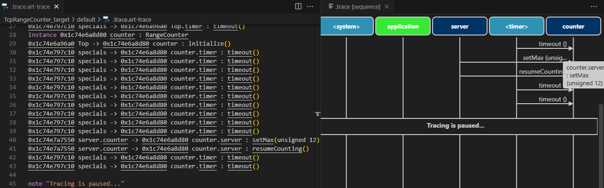
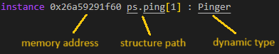
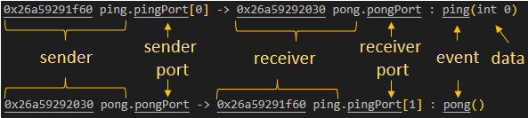
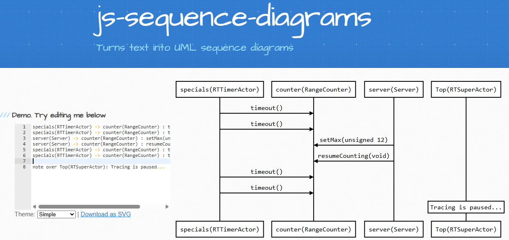
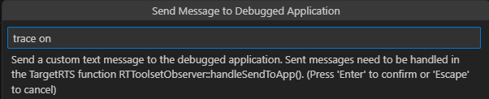
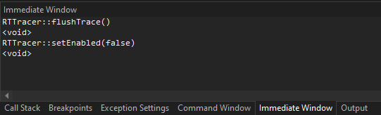

While an application generated by {$product.name$} is running, you can turn on tracing of messages that are exchanged between capsule instances at run-time. Such traces can be visualized graphically as sequence diagrams and can be very useful when troubleshooting certain kinds of bugs in an application such as race conditions, dead-locks, performance problems, unexpected error situations etc. Here are some examples of questions that can be answered by analyzing captured traces:

* Which messages were received by a capsule that caused it to enter a certain state (e.g. an unexpected error state)?
* Why did a capsule instance receive a certain message (e.g. an unexpected error message)?
* Which capsule instances in the application exchange messages most frequently? (For performance reasons you typically want such capsule instances to run in the same thread since intra-thread communication is much faster than inter-thread communication.)
* Are there capsule instances in the application which seem to be unused (and hence could be candidates for removal)?

## Trace File Formats
{$product.name$} supports capturing traces in two different file formats:

1. [`.art-trace`](#art-trace) This is {$product.name$}'s own trace format which is supported by the tool itself. If you open an `.art-trace` file in {$product.name$} you benefit from features such as syntax coloring, navigation etc. You can show an `.art-trace` file graphically in a sequence diagram viewer which is optimized for handling big trace files directly inside {$product.name$}. To open a sequence diagram right-click on the `.art-trace` file in the Explorer view, or in the text editor, and perform the command **Open Sequence Diagram**.
2. [`.ms`](#ms) This trace format is understood by the [js-sequence-diagrams](https://bramp.github.io/js-sequence-diagrams/) web service which can render the trace as a sequence diagram on a web page. These sequence diagrams contain less details than `.art-trace` sequence diagrams and are mainly intended to serve as documentation that can explain how an application behaves internally in certain situations.

### `.art-trace`
The image below shows a small `.art-trace` file which has been captured from the [TcpRangeCounter]({$vars.github.repo$}/tree/main/art-samples/TcpRangeCounter) sample. The sequence diagram shows so called lifelines at the top to represent the capsule instances in the application. We can see lifelines that represent the `counter` and `server` capsule instances and we can see that the `server` sent a message for the `setMax` event with 12 as data to the `counter`. It then sent also the `resumeCounting` event (without any data). 



The lifeline for a capsule instance has the name of the part that contains the instance. If the part has non-single multiplicity, the lifeline shows the index of the capsule instance within square brackets (`[0]` for the first instance). If you hover over a lifeline a tooltip appears with more information, such as the dynamic type of the capsule instance and its structured path in the application's composite structure.

Colors are used to distinguish three types of lifelines:

<ul>
    <li><span style="color: green;">Green</span> for the lifeline that represents the top capsule instance which is created at application start-up. It has the name `application`.</li>
    <li><span style="color: darkblue;">Dark blue</span> lifelines represent capsule instances that are created after the top capsule instance has been created, when the application runs.</li>
    <li><span style="color: lightblue;">Light blue</span> lifelines represent certain TargetRTS components that may interact with capsule instances.</li>
</ul>

There are two TargetRTS components that can interact with capsule instances. `<timer>` is the component of the TargetRTS that implements timers and you will see when a capsule instance receives a timeout message for a timer that has timed out. Inside the TargetRTS this capsule instance has the name `specials` and is typed by [RTTimerActor](../targetrts-api/class_r_t_timer_actor.html). The `<system>` lifeline is used for showing when capsule instances are created and initialized (by sending the `initialize` message). 

The sequence diagram may contain note boxes that show if the tracing was paused for some time. This indicates that the sequence diagram doesn't show messages that may have been exchanged during that time.

#### Instance
A capsule instance appears in an `.art-trace` file the first time it receives or sends a message. If tracing is turned on when a capsule instance is created, the first message it receives is the `initialize` message from `<system>`. However, if tracing is turned on at a later point in time, after the capsule instance was created, it will not appear in the trace until it either receives or sends a message. Here is an example of how a capsule instance appears in a trace:



* **Memory address** The memory address uniquely identifies the capsule instance throughout its lifetime.
* **Structure path** This shows the location of the capsule instance in the application's composite structure. The first name specifies a part in the top capsule, and subsequent names specify nested parts. For parts with non-single multiplicity the index within that part shows where the capsule instance is located. The structure path of a capsule instance is often the same throughout its lifetime, but with the use of [plugin parts](../art-lang/index.md#part) it's possible to move a capsule instance from one part to another at run-time, and in that case the structure path will change.
* **Dynamic type** This is the actual run-time type of the capsule instance. It's either the same as the capsule that types the part where it is contained, or a capsule that inherits (directly or indirectly) from it. The dynamic type of a capsule instance remains the same throughout its lifetime.
  
In the example above we see a capsule instance at memory address `0x26a59291f60` with the dynamic type `Pinger`. The instance is located at index 1 of the part `ping` (which hence has non-single multiplicity). Its container capsule instance is located in the part `ps` of the top capsule.

You can ++ctrl++-click on underlined part names in the structure path to navigate to a part in the Art file where it's defined. In the same way you can navigate to the capsule that is the dynamic type of the capsule instance.

#### Message
A message appears in an `.art-trace` file when a message is received by a capsule instance. By receiving a message we don't mean when it's placed by the sender in one of the controller's message queues, but rather when the controller dispatches the message to the receiver capsule instance.  Here is an example of how messages appear in a trace:



* **Sender** The sender is identified by its memory address, but the name of the part that contains it is also printed to make the trace more readable.
* **Sender port** This is the port of the sending capsule on which the message was sent. If that port has non-single multiplicity the port index is specified within square brackets.
* **Receiver** The receiver is identified by its memory address, but the name of the part that contains it is also printed to make the trace more readable.
* **Receiver port** This is the port of the receiver capsule on which the message was received. If that port has non-single multiplicity the port index is specified within square brackets.
* **Event** This is the protocol event which the message is an instance of. The receiver port is typed by the protocol that defines this event (or a protocol from which it inherits).
* **Data** This is the data that is carried by the message. By default the message data is represented by its [ASCII encoding](../target-rts/encoding-decoding.md) which is the data type followed by the value. If the message carries no data an empty string is printed (i.e. `event()`). If the event data type cannot be encoded (for example because it has no encode function or the configuration macro [`OBJECT_ENCODE`](../target-rts/build.md#object_decode-and-object_encode) is unset) then `?` is printed.

In the example above we see two messages. The first one was sent from a capsule instance in the `ping` part and received by a capsule instance in the `pong` part, and the other one was sent in the opposite direction. We can see the the first message was sent on the port `pingPort` at index 0, while the second message was sent on the port `pongPort` (which has single multiplicity). The first message was received on the port `pongPort` while the second message was received on the port `pingPort` at index 1. The first message was of the event `ping` and carried an `int` value 0, while the second message was of the event `pong` and carried no data.

You can ++ctrl++-click on underlined addresses to navigate within the trace file to the instance declaration of the sender or receiver capsule instances. There you can see more details about the instances than what is shown in the message itself. You can also ++ctrl++-click on underlined port names to navigate to where the sender or receiver port is defined in an Art file. In the same way you can navigate to the definition of the protocol event.

The sender of a message is computed at the time of receiving the message based on checking which port the receiver port is connected to. This means that sometimes the sender is not known, or that only limited information about the sender is available:

* Messages sent by the special TargetRTS instances `<system>` or `<timer>` have no sender port and sometimes also no receiver port.
* Messages that are injected into the application by using the [Art Debugger](debugging.md#send-event) have no sender.
* Messages that are programmatically injected into the application (for example by the [TCP server library](https://github.com/secure-dev-ops/code-realtime/tree/main/art-samples/TcpServer)) have no sender.
* If the sender of a message disconnects the sender port from the receiver port immediately after a message has been sent on the port (and before the controller dispatches the message), it will not be possible for the receiver to know about the sender. This is, however, a quite unusual situation.

When the sender of a message is not known it's represented in the trace by a fake instance `external` at address `0x0`. This makes it easy to distinguish these "external" messages from others.

#### Note
A note appears in an `.art-trace` file when tracing is turned off but the application keeps running. It serves as a delimiter in the trace file in case tracing later is turned on again. Messages that were received while the tracing was paused will obviously not be included in the trace, and the note shows the place in the trace where this could have happened.

### `.ms`
The image below shows the same trace as [above](#art-trace) but this time captured in the `.ms` file format. The [js-sequence-diagrams](https://bramp.github.io/js-sequence-diagrams/) web page is used for rendering the sequence diagram.



Note that this diagram contains less details than an `.art-trace` sequence diagram. For example, there are no colors and no tooltip for showing the structure path of a capsule instance. Another difference is that the note box that shows tracing was paused only appears on one lifeline.

## Turning Tracing On and Off
By default the tracing capability is enabled in the TargetRTS. You can disable it through the [RTS_TRACE](../target-rts/build.md#rts_trace) configuration setting if you don't plan to capture any traces. This will make your executable slightly smaller.

When your application starts to run, tracing is initially turned off. To start capturing a trace you need to turn it on. There are several ways to do this as described in the sections below. 

While tracing is turned on, trace events will be captured and written to the trace file. However, for performance reasons the file is not immediately flushed. The trace file will be flushed when the application terminates, but quite often you may want to do it before that. Refer to the sections below for how to force the trace file to be flushed.

Captured trace files will be placed in the same folder as where the running executable is located. By default traces in the `.art-trace` file format will be captured. To use the `.ms` trace file format you need to start the application with an extra command-line argument `-traceFormat=ms`.

Capturing all messages that are exchanged in an application for the whole time it runs will usually lead to very large traces. Such big traces are cumbersome to work with, and sequence diagrams may not be possible to render. And even if they could be rendered, they may not be easy to use due to the size. It's better to only turn on tracing when the application reaches a point when something interesting is about to happen. For example, if you are troubleshooting a bug that occurs when a certain transition runs in a capsule's state machine, you can debug the application with the Art Debugger and [turn on tracing](#from-the-art-debugger) when the source state of that transition is reached. Then you can manually send the event which will trigger the interesting transition, and then turn tracing off. Thereby the trace file will only show what happened when that transition executed, which makes it small and manageable. 

Or you could debug your application with a C++ debugger and put a breakpoint that gets hit before something interesting happens. Then you can [turn on tracing](#from-the-c-debugger) and let the application run until it hits another breakpoint, and then turn off tracing again. The trace then shows you which messages were exchanged in the application between those two breakpoints were hit.

### From the Command Line
If you want to trace what happens in the application from the very beginning you can turn tracing on from the command-line when you launch the application. Launch your executable with the `-URTS_DEBUG` argument as the very first argument. For example:

```shell
./Top.EXE -URTS_DEBUG="trace on;quit"
```

This command will turn on tracing at application start-up and then quit the [RTS Debugger](rts-debugger.md) to let the application run without debugger at full speed. In this case the only way to turn off tracing before the application terminates is to do it [programmatically](#programmatically) using TargetRTS APIs.

You can also launch the application like this:

```shell
./Top.EXE -URTS_DEBUG="trace on;continue" -obslisten=12345
```

The main difference here is that you then later can attach the Art Debugger on the specified port, and [turn off tracing from there](#from-the-art-debugger).

Other [RTS Debugger commands](rts-debugger.md#commands) can of course also be used. For example, to trace the first 5 messages that are sent in the application:

```shell
./Top.EXE -URTS_DEBUG="trace on;go 5"
```

Read more about the `-URTS_DEBUG` argument [here](rts-debugger.md).

Note that the non-default [`.ms` trace file format](#ms) can only be turned on from the command-line, by means of the `-traceFormat=ms` command-line argument. The trace file format cannot be changed while the application is running.

### From the RTS Debugger
The [RTS Debugger](rts-debugger.md) provides a command [`trace`](rts-debugger.md#trace) for turning tracing on or off:

```shell
RTS debug: ->trace on
  Tracing is on
```

If you are unsure whether tracing is currently on or off, you can run the command without argument.

A useful side-effect of the [`trace`](rts-debugger.md#trace) command is that it will flush the current trace file, if any. 

### From the Art Debugger
To turn tracing on or off from the [Art Debugger](../running-and-debugging/debugging.md) invoke the **Send to App** command from the command palette. The [`trace`](rts-debugger.md#trace) command [from the RTS Debugger](#from-the-rts-debugger) can be accessed from the popup that appears.



### From the C++ Debugger
Turning tracing on or off when you debug your application in a C++ debugger is often very useful. You do it by using the API provided by the TargetRTS class [RTTracer](../targetrts-api/class_r_t_tracer.html):

* `RTTracer::setEnabled(bool)` Turns tracing on or off.
* `RTTracer::isEnabled()` Returns if tracing is currently turned on or off.
* `RTTracer::flushTrace()` Forces the current trace file, if any, to be flushed, so it contains all trace events received so far.

Exactly how to call these functions depends on which C++ debugger you are using. For example, in the Visual Studio C++ Debugger you do it from the Immediate Window:



A typical workflow may look like this:

1. Build the application and the TargetRTS with debug symbols as described [here](../target-rts/build.md#debug).
2. Place a breakpoint at a place where you want to start tracing.
3. Start the application from the C++ debugger and let it run until the breakpoint is hit.
4. Call `RTTracer::setEnabled(true)` from the C++ debugger to turn tracing on.
5. Place a breakpoint at a place where you want to stop tracing.
6. Resume execution of the application and let it run until the breakpoint is hit.
7. Call `RTTracer::setEnabled(false)` from the C++ debugger to turn tracing off. Or call `RTTracer::flushTrace()` if you want to keep tracing but want to check what the trace contains so far.

### Programmatically
You can turn tracing on or off from your application code by using the API provided by the TargetRTS class [RTTracer](../targetrts-api/class_r_t_tracer.html). See [above](#from-the-c-debugger) for which functions that are available to use.

One scenario where it can be useful to enable tracing programmatically is if your C++ debugger does not support calling functions, or if you need to trace a certain scenario in an application that doesn't have debug symbols. It can also be useful to build tracing functionality into your application and for example use it to trace unexpected error scenarios that may occur. The collected trace files can then help you troubleshoot problems that have occurred when the application ran in the production environment.