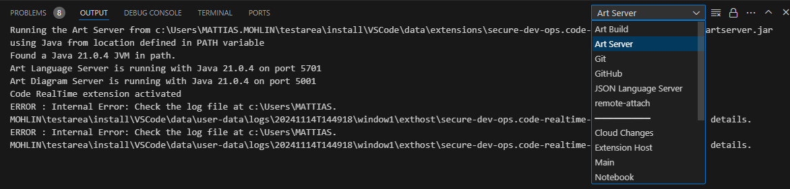

If you find a bug in {$product.name$} please report it with a [GitHub Issue](https://github.com/secure-dev-ops/code-realtime/issues). Please include steps to reproduce and any additional files that can help in troubleshooting. For example, it can be good to include all log files. You can find the location of these logs by invoking the command `Developer: Open Logs Folder`. You can zip the entire logs folder and attach it to the issue. 

You can also find useful information in the Output view. In particular, the following two output logs are relevant:

* **Art Build** Contains messages printed when building a TC. It can sometimes contain diagnostic messages from the Art compiler.

* **Art Server** Contains messages printed by the Art language server. These include [internal errors](validation.md#internal-errors) and other diagnostic messages that you normally would not need to pay attention to, but which can sometimes be useful when troubleshooting a problem. Internal errors are also persisted (together with other diagnostic messages) in an `application.log` file. The path to this log file will be printed when an internal error occurs, but you can at any time open this log file by means of the command `Code RT: Open Log File`.
  
