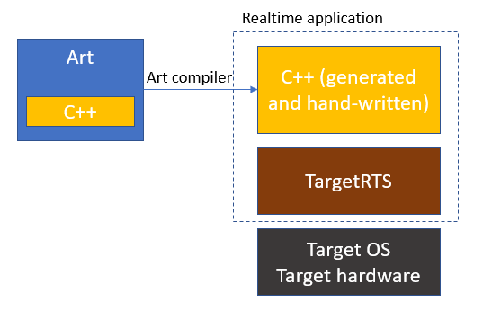

The Target RunTime System (or TargetRTS for short) is a C++ library that is used by the code that is generated by {$product.name$}. When building the realtime application from the generated code, it links with a TargetRTS library that has been prebuilt for the platform (hardware, operating system etc) on which the application will run.

The TargetRTS provides C++ implementations for the concepts of the [Art language](../art-lang/index.md). The [APIs](../targetrts-api/index.html) of these implementations are used by the generated code, but also by the embedded C++ code that you write inside the Art files. This documentation serves the following purposes:

* Provide a general understanding of how the TargetRTS is structured and how it implements important concepts from the Art language.
* Document the [C++ APIs](../targetrts-api/index.html) that you can use in C++ code snippets within an Art file.
* Describe how to build the TargetRTS for a new target platform, including ways to customize it as required.

## Target Configurations
A realtime application runs in a **target environment**, which is comprised of all things that "surround" the application at run-time. Examples include the operating system (if any) and the target hardware. When building the TargetRTS, it's built for a particular target environment, and the resulting TargetRTS libraries become specific for that environment. The {$product.name$} installation includes several TargetRTS libraries that have been prebuilt for common target environments that can be used right away. They have been created for popular combinations of C++ compilers for operating systems such as Windows, Linux, macOS and VxWorks. If none of those prebuilt TargetRTS libraries are sufficient, you can [build your own](build.md#creating-a-new-target-configuration).

Each way of building the TargetRTS for a specific target environment is described by means of a **target configuration**. It provides fixed values for parameters of the target environment, such as

* the operating system (name and if needed also version)
* the threading model (single or multi-threaded)
* the processor architecture
* the C++ compiler (name and version)

These values can be put together to form a string which uniquely describes the target configuration in a compact way. Here is an example of such a string:

The first part of the name is the **target** which identifies the operating system name, version (if significant) and threading model. In the example
above the operating system name is Windows. The version is not specified which
means that the target configuration can work for more than one version of Windows.
The letter 'T' shows that the application will be multi-threaded (for a single-threaded application the letter 'S' is used instead).

The second part of the name, which follows after the dot, is the **libset** which identifies the processor architecture and the compiler. In the example the processor architecture is [x64](https://en.wikipedia.org/wiki/X86-64) and the compiler is Microsoft Visual C++ version 17.0.

When you build your realtime application you need to specify the target configuration to use by means of the TC property [`targetConfiguration`](../building/transformation-configurations.md#targetconfiguration). Valid values for this property is determined by the folder specified in the TC property [`targetRTSLocation`](../building/transformation-configurations.md#targetrtslocation). If this property is not set, it defaults to the `TargetRTS` folder inside the {$product.name$} installation.

## File Organization
TargetRTS files are organized into subfolders under the `TargetRTS` folder in the {$product.name$} installation. If you set the [`targetRTSLocation`](../building/transformation-configurations.md#targetrtslocation) TC property it must point to a folder which follows the same structure.

In addition to the subfolders listed below, you may see folders with names `build-<target_configuration>`. Those folders are output folders produced when building the TargetRTS. See [this chapter](build.md#build) for more information.

### codegen
This folder contains various utilities in the form of Perl scripts and make file fragments. Not all of these are used in the latest version of {$product.name$} but are provided for historic and backwards compatibility reasons.

### config
This folder contains a subfolder for each available target configuration. The contents of this folder defines valid values for the TC property [`targetConfiguration`](../building/transformation-configurations.md#targetconfiguration).

The following files are present in each target configuration subfolder:

* `config.mk` This file is often empty, but can contain overrides of variables defined in the target or libset of the target configuration. See [target](#target) and [libset](#libset) for the list of available variables that can be overridden.
* `setup.pl` This file can set or override Perl variables used by the Perl script [`Build.pl`](build.md#build) that is used when building the TargetRTS. Some of the variables have defaults set in `Build.pl` which you only need to override if required. Others have no values set in `Build.pl` and must be set in `setup.pl`.

### include
This folder contains those TargetRTS header files that is used by generated code and are independent of a specific target. Target specific header files are present in the [target](#target) folder.

This folder contains a file `RTConfig.h` which defines a large set of C++ macros that can be used for configuring the TargetRTS. This file is included by all source files of the TargetRTS. For more information see [Configure or Change the TargetRTS](build.md#configure-or-change-the-targetrts).

### lib
This folder contains the libraries that result from building the TargetRTS. There is one subfolder for each target configuration that has been built. Each subfolder contains two libraries (with prefixes and file extensions according to target-specific conventions):

* `ObjecTimeTypes` Contains the parts of the TargetRTS related to predefined types, encoding and decoding for those types, type descriptors etc. Also contains commonly used utilities such as synchronization primitives, code for TCP communication etc.
* `ObjecTime` Contains everything else, for example implementations of the [Art language](../art-lang/index.md) concepts.

In addition they also contain the `main` object file which contains the implementation of the main function of the application (only used when building an executable).

### libset
This folder contains files related to the libset part of a target configuration, i.e. the processor architecture and the compiler. There is one subfolder for each libset. Each such subfolder have a file `libset.mk` which defines make file variables that have a libset specific value. To avoid repeating variables that are often the same in different libsets, there is a file `default.mk` which defines default values for many of these variables.

For example, the `DEBUG_TAG` variable has the default value `-g`, but is overridden to `/Zi` for Microsoft Visual C++ libsets.

A libset subfolder may also contain a file `RTLibSet.h` which can set libset specific C++ macros. It gets included from the main configuration file `RTConfig.h` (see [include](#include)).

### src
This folder contains the TargetRTS source code (i.e. implementation files). It's only present in the {$product.name$} Commercial Edition. The folder also contains some files needed when [building the TargetRTS from its sources](build.md#build), such as `Build.pl`.

The file `MANIFEST.cpp` defines which source files that should be built. All TargetRTS source files are listed there under groups that decide which library each one should be placed in (see [lib](#lib)). Preprocessor conditions can be used for including or excluding some of the files depending on the target configuration that is built. For example, if a file uses a C++ 11 construct a condition must be specified that will exclude it when building a target configuration that uses a C++ 98 compiler.

The `include` subfolder contains header files that are only used internally within the TargetRTS. Header files that are used by generated code are instead found in [include](#include).

The `target` subfolder contains TargetRTS source code that is specific for a certain target. When you need to build the TargetRTS for a new target (e.g. a new operating system) you need to provide implementations for certain primitives which the TargetRTS uses from the operating system (e.g. to read the system clock, or create a new thread). The `target/sample` subfolder contains template files that can help when doing this. For more information, see [Creating a New Target Configuration](build.md#creating-a-new-target-configuration).

### target
This folder contains files related to the target part of a target configuration, i.e. the operating system, version (if significant) and threading model. There is one subfolder for each target. Each such subfolder have (at least) the following files:

* `target.mk` This file gets included in make files used both when compiling the TargetRTS and a realtime application that uses the TargetRTS. It may define or redefine any make file variable as required, but the following ones are typically target-specific: `TARGETCCFLAGS` (compile options), `TARGETLDFLAGS` (link options), `TARGETLIBS` (link libraries). The values for these variables can use variables from `libset.mk` (see [libset](#libset)).
* `RTTarget.h` Defines target specific preprocessor macros, for example `USE_THREADS` which is set to 1 for multi-threaded targets, and 0 for single-threaded targets. It gets included from the main configuration file `RTConfig.h` (see [include](#include)).

### tools
This folder contains various utility scripts, some of which are used when building the TargetRTS.

