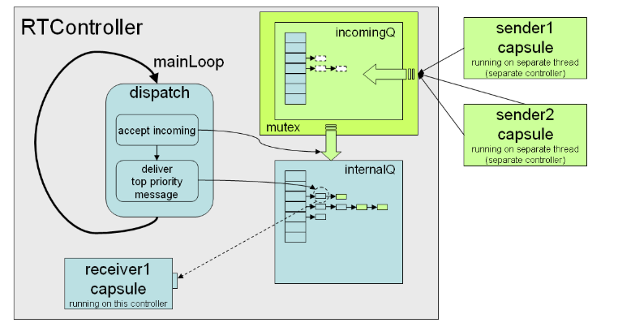
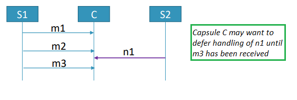
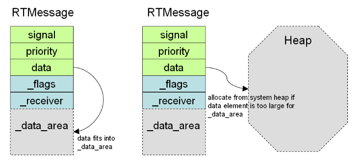

Applications developed with {$product.name$} consist of objects with state machines that communicate by means of messages. This chapter describes the details of how this message-based communication is implemented in the TargetRTS.

## Controllers and Message Queues
As explained in [Threads](threads.md), an application consists of controllers each of which is run by a physical thread and is managing a group of capsule instances. The main responsibility of a controller is to facilitate the exchange of messages from one capsule instance to another. There are two kinds of message exchange:

* **Intra-thread** The sender and receiver capsule instances are managed by the same controller, i.e. they execute in the same thread. 
* **Inter-thread** The sender and receiver capsule instances are managed by different controllers, i.e. they execute in different threads. 

From the application’s perspective, there is no difference between sending a message within a thread and sending a message across threads; the code to send and receive the message is still the same. There is, however, a difference in performance, and message sending across threads is approximately 10-20 times slower than message sending within a thread. You should therefore assign capsule instances to controllers in a way so that those that communicate frequently with each other should be run by the same controller.

Each physical thread in the TC of an application specifies an implementation class that inherits from [RTController](../targetrts-api/class_r_t_controller.html). The default implementation is provided by the [RTPeerController](../targetrts-api/class_r_t_peer_controller.html) class, and it implements a simple event loop (in the `mainLoop()` function) that in each iteration delivers the most prioritized message to the capsule instance that should handle it. Let's explore what happens internally in the TargetRTS when a capsule sends an event on a port:

```cpp
myPort.myEvent().send();
```

1. A message object, of type [RTMessage](../targetrts-api/class_r_t_message.html), is obtained by the controller that runs the sender capsule instance (see [Message Memory Management](#message-memory-management) and [Message Representation](#message-representation)). 
2. The sender port instance ("myPort") should at run-time be bound to a receiver port instance, and the capsule instance to which that receiver port instance belongs is the receiver of the message. Note that it's possible for ports to be unbound, and then message sending fails at this point.
3. The message is now delivered to the controller that runs the receiver capsule instance. This is done by calling `RTController::receive()`. The controller has two message queues where it stores received messages, the **internal queue** and the **incoming queue**. The received message is put in one of these: 
   
    - If the sender and receiver controller is the same (intra-thread communication) the message is placed in the internal queue. 
    - If the sender and receiver controllers are different (inter-thread communication) the message is placed in the incoming queue. The `wakeup()` function of the receiver controller is then called to notify it that a new incoming message is available.

    Note that both the internal and incoming message queue is actually an array of queues, one for each [message priority level](#message-priority). The received message is inserted at the end of the queue that matches the priority of the message as specified by the sender. This ensures that messages are handled in priority order, and, within each level of priority, in a FIFO ("first-in-first-out") manner.

4. If the message was placed in the incoming queue, the call to `wakeup()` signals a semaphore on which the receiver controller is waiting while there are no messages to dispatch from the internal queue. The incoming message then gets transferred to the receiver's internal queue in the beginning of the `RTController::dispatch()` function which is called once in each iteration of the controller's event loop. This happens in the function `RTController::acceptIncoming()`.
5. The rest of the `RTController::dispatch()` function checks the contents of the internal queue, starting with the queue at the highest priority level (`Synchronous`), proceeding with queues at lower priority levels, until the queue at the lowest priority level (`Background`). As soon as it encounters a non-empty queue it dispatches the first message of that queue. 
6. Dispatching a message is done by calling `RTMessage::deliver()`, which eventually leads to a call of the `RTActor::rtsBehavior()` function which implements the capsule state machine in the generated code. 
   
    !!! note 
        The control is not returned to the TargetRTS until the transition which is triggered by the received message has **run to completion**. This includes the triggered transition itself, and also any number of non-triggered transitions that may follow it. It also includes entry and exit actions for states. It may also involve the call of one or several guard functions that are required for determining which transition that should be triggered. Hence, the dispatching of a single message may lead to execution of several code snippets. Before they have all executed it's not possible for the controller to dispatch another message, and it's therefore important that the code that runs operates as efficiently as possible. A long-running operation should be performed by a capsule instance that runs in a different controller, to avoid blocking the execution of other capsule instances.
 
7. Finally, when the message has been dispatched, it's freed (see [Message Memory Management](#message-memory-management)).

From a code snippet of a capsule, such as a transition effect or guard code, you can get the message that was most recently dispatched to the capsule by accessing `RTActor::msg`. You should treat this message object, and all data it contains, as read-only. Since it will be freed when control returns to the TargetRTS after the message has been dispatched, it's not safe to store any pointers to the message or the data it contains and access these at a later time. All data from the message object that you need to keep should be copied. However, if the data is big it's possible to instead move it by setting the property [const_rtdata](../art-lang/index.md#const_rtdata) on a transition.

The picture below illustrates a controller and how messages arriving from capsule instances are placed in the incoming or the internal queue, depending on if those capsule instances run in the same or a different controller. It also shows how these queues actually are arrays of queues organized according to [message priority](#message-priority).



### Asynchronous versus Synchronous Communication
The message exchange described above implements **asynchronous** communication between capsule instances. With this type of communication the sender is not blocked while the sent message is in transit. As soon as it has sent the message (i.e. when it has been placed in the message queue of the receiver's controller) the sender can continue its execution. Asynchronous communication is the most common type of communication between capsule instances. It yields a high throughput of messages with minimal dependencies between the sender and the receiver.

However, in some cases it doesn't make much sense for the sender to continue its execution until the receiver has received and handled the message. The typical example is if the receiver needs to return some data to the sender, which affects the further execution of the sender. In this case you can instead use **synchronous** communication, which means the sender is blocked until the receiver has replied to the message. If no data needs to be passed back to the sender the reply can be implicit, and will then happen as soon as the receiver has processed the message.

The same [protocol event](../art-lang/index.md#protocol-and-event) can be used for both asynchronous and synchronous communiction. The type of communication is decided by the sender when it initiates the message exchange. For asynchronous communication the function `send()` is called while for synchronous communication the function `invoke()` is called instead. If the sender port has non-single multiplicity these functions will broadcast the message, which means that each receiver to which the port is connected will receive a copy of the message. If you only want to communicate with the receiver that is connected at a specific port index you should instead call `sendAt()` or `invokeAt()` which takes the port index as argument.

Protocol events that only are used for synchronous communication are often grouped in the protocol, by giving them the same name, but with the suffix `_reply` for the reply event. For example:

```art
protocol Proto {
    out request(`int`);
    in request_reply(`int`);
};
```

There are four important rules to remember when using synchronous communication:

1. Unless the sender performs an invoke where the reply is implicitly made, the receiver must call the `reply()` function to reply to the sender. This has to be done while the receiver still is in the triggered transition (more precisely, it must be done before control comes back to the TargetRTS and the receiver state machine enters a new state). You can pass a return data with the reply message, which will become available to the sender.
   
2. It is the sender's responsibility to allocate one or many [RTMessage](../targetrts-api/class_r_t_message.html) objects that can hold the reply data (one object for each receiver). The sender is also responsible for deleting these objects when they are no longer needed. You can use `RTMessage::isValid()` to ensure that a reply object corresponds to a valid reply made by the receiver.

3. It is not allowed to use synchronous communication across different threads. If you need to do this you either have to implement it by means of two asynchronous messages (i.e. a "call" message for the request and a "reply" message for the reply) and use a state in the sender's state machine where it can wait until the receiver replies. Or you can use a more low-level synchronization primitive such as a semaphore.

4. It is not allowed to use synchronous communication in a way that leads to cycles. For example, if capsule A invokes capsule B which in turn tries to invoke capsule A, the
last invocation which introduces the cycle will fail with an error message at run-time.

Let's explore what happens internally in the TargetRTS when a sender invokes an event with an `int` parameter and the receiver replies with an event also with an `int` parameter:

```cpp
RTMessage reply;
myPort.intEvent(10).invoke(&reply);

int result = * static_cast<int*>(reply.getData());
```

1. The TargetRTS first checks so that the port at which the invoke takes place is bound to a receiver. It also checks so that the invoke doesn't cross a thread boundary and that it will not introduce a cycle, i.e. that the receiver capsule instance is not currently processing another message (see `RTActor::isActive()`). If any of these checks fail the message invocation fails at this point.
2. An [RTMessage](../targetrts-api/class_r_t_message.html) object is created by the TargetRTS and configured with `System` [priority](#message-priority). Note that the reply message is not used for this purpose since it does not exist in case of an implicit reply (`invoke()` is then called by the sender without argument). If a reply message was provided by the sender it's stored in the controller (`RTController::setReplyBuffer()`).
3. The created message object is directly delivered to the receiver (`RTMessage::deliver()`), *without* first being placed in a message queue. This is the main difference between synchronous and asynchronous communication, and it causes the sender to become blocked while the receiver handles the message.
4. A transition in the receiver's state machine is triggered. Before it has run to completion the receiver must make a reply unless the reply is implicit. Note that the sender and receiver must both agree on which invokes that require an explicit reply. If the sender expects an explicit reply, but the receiver doesn't make one until control is returned back to the TargetRTS, a run-time error will occur.

For the example above the receiver may make the reply like this:

```cpp
replyPort.intEvent_reply(*rtdata + 1).reply(); // Reply data will become 11
```

5. The reply data which the receiver passes when it makes the reply is transferred to the message object that was stored in the controller (`RTController::getReplyBuffer()`).  When control is returned back to the sender it can read the reply data from that message object.

!!! example
    You can find a sample application that uses synchronous communication [here]({$vars.github.repo$}/tree/main/art-comp-test/tests/invoke_reply). It shows how to make explicit and implicit replies, and how to handle multiple replies in case of broadcast invokes.

### Defer Queue
Sometimes a capsule may be designed to handle certain messages in a sequence. If another unrelated message arrives in the middle of the sequence, and it's not urgent to handle that message right away, it can be useful to defer its handling to a later point in time, when the whole message sequence has arrived. This is especially true if the received message is the beginning of another message sequence (processing multiple message sequences with interleaved parallelism can be tricky).



Messages can be deferred by calling the function [RTMessage](../targetrts-api/class_r_t_message.html)::`defer()`. A deferred message is put in the **defer queue** which is a special message queue located either in the capsule instance, or in the controller that runs the capsule instance (see the TargetRTS setting [`DEFER_IN_ACTOR`](build.md#defer_in_actor)). Later, a deferred message can be recalled from the defer queue by calling [RTInSignal](../targetrts-api/struct_r_t_in_signal.html)::`recall()` (to recall only one deferred message) or [RTInSignal](../targetrts-api/struct_r_t_in_signal.html)::`recallAll()` (to recall all deferred messages). A recalled message is moved from the defer queue back to the normal message queue, from where it later will be dispatched again to the receiver capsule instance. By default a recalled message is placed at the end of the message queue as any other received message, but you can also choose to put it at the front of the queue (by passing an argument to `recall()` or `recallAll()`) in order to handle it before other messages that may have arrived while the message waited in the defer queue. Here is a code example:

```cpp
msg->defer(); // Defer the currently processed message (usually done early in a transition)

myPort.myEvent().recall(); // Recall one deferred message and put it at the back of the normal message queue

myPort.myEvent().recall(1); // As above but put the recalled message at the front of the message queue instead

myPort.myEvent().recallAll(); // Recall all deferred messages and put them at the back of the normal message queue
```

`recall()` will recall the first message from the defer queue, i.e. the one that has been deferred the longest. However, only messages that match the port and event (`myPort` and `myEvent` in the above sample) can be recalled. Other messages remain in the defer queue. This is true even when calling `recallAll()`. You can be even more specific about which message(s) to recall by specifying a port index using the function `recallAt()` or `recallAllAt()`. In that case it's required that a recalled message was originally received on the specified port index for it to be recalled.

If you want to recall any deferred message received on a port, regardless of its event, you can call similar functions on the port. For example:

```cpp
myPort.recall(); // Recall one deferred message and put it at the back of the normal message queue

myPort.recallFront(); // As above but put the recalled message at the front of the message queue instead

myPort.recallAll(); // Recall all deferred messages and put them at the back of the normal message queue

myPort.recallAllFront(); // As above but put all recalled messages at the front of the message queue instead
```

Sometimes you may have deferred a message that you later decide to ignore. For example, the capsule may have received another message which makes it unnecessary to handle a deferred message. In that case you can remove a deferred message from the defer queue without recalling it. Call the function [RTInSignal](../targetrts-api/struct_r_t_in_signal.html)::`purge()` to remove all deferred messages that match the port and event, or [RTInSignal](../targetrts-api/struct_r_t_in_signal.html)::`purgeAt()` to also require that the port index matches. To remove deferred messages that match the port only (regardless of event), call instead [RTProtocol](../targetrts-api/class_r_t_protocol.html)::`purge()` or [RTProtocol](../targetrts-api/class_r_t_protocol.html)::`purgeAt()`.

!!! note
    It's recommended to use the defer queue sparingly, and only when really needed. Deferring and recalling messages can make it harder to follow the application logic. Also make sure not to forget any messages in the defer queue. All messages that are deferred should sooner or later be recalled or purged.

!!! example
    You can find a sample application that uses the defer queue [here]({$vars.github.repo$}/tree/main/art-samples/MatMult).

#### sendCopyToMe()
A simpler and more light-weight alternative to using the defer queue, especially for messages without data, is to defer the handling of a received message by letting a capsule instance send a copy of the received message to itself. This allows a capsule to break down the handling of a message into several transitions, each triggered by another copy of the message. The function to call is [RTActor](../targetrts-api/class_r_t_actor.html)::`sendCopyToMe()`. Here is an example where this technique is used for deferring the reply message of an invoked event:

```cpp
RTMessage reply;
myPort.myEvent().invoke(&reply);
sendCopyToMe(&reply);
```

`sendCopyToMe()` can be useful whenever a message cannot be fully handled by a single transition. It's similar to deferring a message and then immediately recall it again.

Note, that even if it's the receiver capsule instance who asks for this to happen (typically by calling `sendCopyToMe(msg)` from a transition effect code snippet), this is really a request for the TargetRTS to re-send a copy of a previously dispatched message again. This means that the sender of the second message will not be the receiver, but the capsule instance which sent the first message. To implement true [self communication](../art-lang/index.md#self-communication), use two connected behavior ports in a capsule.

### Custom Controller
If you want to customize any aspect of how a controller works you can implement your own controller class that inherits from [RTController](../targetrts-api/class_r_t_controller.html). However, implementing a controller completely from scratch requires quite some effort and the TargetRTS therefore provides a class [RTCustomController](../targetrts-api/class_r_t_custom_controller.html) which lets you customize a few key aspects of how a controller works in an easier way. It does this by letting a capsule override two controller functions:

* `waitForEvents()` This is the function where a controller waits for messages to arrive. The default implementation in [RTPeerController](../targetrts-api/class_r_t_peer_controller.html) blocks here (on a semaphore) until a new message arrives for the controller to handle.
* `wakeup()` This is the function that notifies the controller that a new message has arrived (from another controller). The default implementation in [RTPeerController](../targetrts-api/class_r_t_peer_controller.html) unblocks the controller (by signalling the semaphore) so it can process the new message that has arrived.

In addition [RTCustomController](../targetrts-api/class_r_t_custom_controller.html) overrides the `mainLoop()` function and let's the capsule specify a "process" function which will be called each time a message is about to be dispatched. The call takes place *before* the message is dispatched which provides a means for the capsule to prioritize some other work before the regular message dispatching.

The capsule that you choose to use for configuring a custom controller is called a **layer capsule** (it provides a "layer" between the controller and your application code). You register the layer capsule with the custom controller by calling the function [RTCustomController](../targetrts-api/class_r_t_custom_controller.html)::`registerLayer()`. Alternatively you can use a macro called `REGISTER_LAYER`. Here is an example of code to place in a code snippet of a capsule `MyCapsule` in order to register that capsule as the layer capsule of a custom controller that runs it:

```cpp
REGISTER_LAYER( static_cast<RTActorFunction>(&MyCapsule::waitForEvents),
                static_cast<RTActorFunction>(&MyCapsule::wakeup),
                nullptr );
```

In the example above two member functions of `MyCapsule` customize how the custom controller should wait for events and how it should wake up. There is no customization of the "process" function which is why the 3rd macro argument is `nullptr`.

You can use an [RTCustomController](../targetrts-api/class_r_t_custom_controller.html) instead of an [RTPeerController](../targetrts-api/class_r_t_peer_controller.html) whenever you need to "inject" messages into the application from a source other than another controller. That source can for example be a user interface event loop or an inter-process communication (IPC) mechanism such as a socket. It's therefore an alternative to using a capsule with an [external port](integrate-with-external-code.md#external-port) for injecting external messages. The general contract between the registered `waitForEvents()` and `wakeup()` functions is that the former needs to block on something which the latter releases when a new message arrives in the incoming queue. Typical examples on what to block on include a semaphore (`RTSyncObject` in the TargetRTS) or a socket.

!!! important
    If the layer capsule instance is destroyed it must de-register itself from the custom controller. Otherwise the custom controller will call functions on a destroyed object which will cause a run-time exception. Simply call `REGISTER_LAYER(nullptr, nullptr, nullptr)` from the destructor of the layer capsule to de-register it.

Note the following when you design a layer capsule to be used with an [RTCustomController](../targetrts-api/class_r_t_custom_controller.html):

* The registered `wakeup()` function is called from another thread when a new message arrives. It should therefore not access members of the layer capsule directly.
* The other two registered functions are called from the [RTCustomController](../targetrts-api/class_r_t_custom_controller.html) thread so they can safely access members of the layer capsule. However, remember that these functions are called very frequently from the `mainLoop()` function and should therefore return as quickly as possible. In an IPC context one of these functions may for example check if there is something to read on a socket, and if so send a message with the read data to either the layer capsule instance itself or to another capsule instance for handling it later.
* Whether to use the registered "process" function or the `waitForEvents()` function to check for incoming external messages depends on how you want to prioritize them compared to regular messages. If they should be handled at a higher priority use the "process" function since it will be called before any other message is dispatched by the custom controller. If they should be handled at a lower priority use the `waitForEvents()` which only will be called when the controller's message queue has no other messages to dispatch.

!!! example
    Refer to this [sample application]({$vars.github.repo$}/tree/main/art-samples/SocketInterface) which uses an [RTCustomController](../targetrts-api/class_r_t_custom_controller.html) for injecting messages containing data it reads from a socket.

## Message Priority
The sender of a message can choose between the following priority levels:

* **Panic** This is the highest possible priority for user-defined messages. Use this only to handle emergencies.
* **High** This is a higher than normal priority to be used for high-priority messages.
* **General** This is the default priority level which is suitable for most messages.
* **Low** This is a lower than normal priority to be used for low-priority messages.
* **Background** This is the lowest possible priority. Use this to handle background-type of activities.

In addition to these five priority levels, there are two system-level priorities which are higher than all the above; **System** and **Synchronous**. These are used internally by the TargetRTS and cannot be used when sending user-defined messages.

As explained [above](#controllers-and-message-queues), each priority level has its own message queue in the controller, and the controller looks for messages to dispatch starting from the queue with the highest priority. As soon as a message is found, it gets dispatched, and no more messages are dispatched in that iteration of the event loop. This means that if a large number of high priority messages are continously sent, they will prevent (or at least delay) dispatching of low priority events in the same controller. It's therefore best to stick to the default message priority for most messages, and only use higher and lower priority messages when really needed.

## Message Representation
A message is an instance of a protocol event and is represented by an object of the [RTMessage](../targetrts-api/class_r_t_message.html) class. It stores the following information:

* A message id (`signal`). This is a numerical id that uniquely identifies the event for which the message was created within its protocol. 
* A data object. It is stored as an untyped pointer (`void*`) but can safely be casted to a pointer typed by the parameter of the protocol event. In most cases such casts happen automatically in generated code, so that you can access correctly typed data in a transition function. However, if you get the data from the message object by calling `RTMessage::getData()`, or if the event parameter type is `void*`, you need to cast it yourself. See [Message Data Area](#message-data-area) for more information about how the message data is stored, and [Transfer of Message Data from Sender to Receiver](#message-data-transfer-from-sender-to-receiver) for different ways how message data can be managed.
* The [type descriptor](../art-lang/cpp-extensions.md#type-descriptor) of the data object (an [RTObject_class](../targetrts-api/struct_r_t_object__class.html)). Access it by calling `RTMessage::getType()`.
* The [priority](#message-priority) at which the message was sent. Access it by calling `RTMessage::getPriority()`.
* The port on which the message was received. Access it by calling `RTMessage::sap()`.
* The receiver capsule instance. Access it by calling `RTMessage::receiver()`.

As mentioned [above](#controllers-and-message-queues) you should treat a message object, and all data it contains, as read-only and owned by the TargetRTS. The data that is passed with the message object is either a copy of the data provided by the sender or was moved from it. This avoids the risk that both the sender and receiver, which may run in different threads, access the same data object simulatenously.

!!! important
    When you develop an application don't make assumptions about how many times the data object will be copied. In many cases it will only be copied once, but there are situations when multiple copies will need to be created. It is therefore important that any event parameter has a type descriptor where the copy function (e.g. a copy constructor) is able to copy the data object multiple times. Note that copying of the message object may happen even after it has been dispatched. The receiver must therefore not change it in a way that will prevent it from later being copied correctly by the TargetRTS.

### Message Data Transfer from Sender to Receiver
By default the data which the sender sends with a message is copied by the TargetRTS (by calling the copy function of the data's [type descriptor](../art-lang/cpp-extensions.md#type-descriptor)). This is done to ensure that the sender and the receiver cannot access the data simultaneously which could lead to problems if they run in different threads. In many cases message data is small and then this copying doesn't lead to any performance problems. However, if the data is big and/or the message with the data is sent frequently, then it may be too costly to copy it.

#### Sending a Pointer to the Message Data
One way to avoid copying message data is to send a pointer to it. You can do this by typing the protocol event parameter as `void*`. This will allow the sender to pass any pointer when sending the event. It also allows the sender to not provide any data at all, in which case the data will be set to `nullptr`. Even if this approach can be efficient, it could be risky and lead to bugs. You need to think about the following:

* If the sender and receiver runs in different memory spaces, you can obviously not do this as the same memory address will not be valid for both the sender and the receiver.
* There has to be an agreement between the sender and the receiver about how to manage the memory of the data.
* If the sender and receiver runs in different threads, and they both have access to the data object at the same time, it has to be protected so it can be accessed in a thread-safe way, for example by a mutex.

A common approach is to let the sender allocate the object, and let the receiver be responsible for deleting it. Also, as soon as the sender as sent the object it will "forget" about it and never access it again. When the receiver has received the object it will use it for as long as it needs, and then delete it.

!!! example
    You can find a sample application that sends a pointer to an object [here]({$vars.github.repo$}/tree/main/art-comp-test/tests/send_pointer).

#### Moving the Message Data
Another solution to avoid message data to be copied is to move it instead. This requires that the data is movable, which means that its type must have a [type descriptor](../art-lang/cpp-extensions.md#type-descriptor) with a move function. For an automatically generated type descriptor the move function will use the move constructor of the type.

The sender can decide at the time an event is sent if the message data should be copied or moved, based on if an lvalue or rvalue reference to the data is used:

```cpp
myPort.myEvent(data).send(); // Send by copy (lvalue ref to data)
myPort.myEvent(std::move(data)).send(); // Send by move (rvalue ref to data)
```

If you attempt to send the data by move, but it is not movable, the data will anyway be copied. Also note that if you send an event on a replicated port (i.e. a port with multiplicity > 1) the data can only be moved once. In this case the data will be moved for the last port instance send, and copied for all the others.

Note that if the receiver needs to store the message data for later use, it can also avoid a data copy by moving the received data to for example a capsule member variable:

```cpp
capsuleMemberVar = std::move(*rtdata); // Avoid copying the received message data
```

### Message Data Area
Messages that carry data can either store that data inside the [RTMessage](../targetrts-api/class_r_t_message.html) object, in the `_data_area` member variable, or on the system heap. A TargetRTS configuration macro [`RTMESSAGE_PAYLOAD_SIZE`](build.md#rtmessage_payload_size) defines the byte limit which decides where a data object will be stored. Data that is smaller than this limit is stored inside the [RTMessage](../targetrts-api/class_r_t_message.html) object, while bigger data is stored on the system heap. The picture below shows two message objects, one where the data object is small enough to fit in the `_data_area` and another where it's too big to fit there and therefore is instead allocated on the system heap.



As a user you don't need to think about where the message data is placed, because it's still accessed in the same way. However, to obtain optimal performance for the application it's necessary to fine-tune [`RTMESSAGE_PAYLOAD_SIZE`](build.md#rtmessage_payload_size) to find the best trade-off between application memory usage and speed.

## Message Memory Management
When a capsule instance wants to send a message, its controller first needs to get a new [RTMessage](../targetrts-api/class_r_t_message.html) object. The controller gets it by calling `RTController::newMsg()`. The obtained message object will then be given to the controller which manages the receiver capsule instance (which in case of intra-thread communication will be the same controller). That controller inserts the message object into an event queue according to the message priority. When the message has been dispatched to the receiver, the message object is no longer needed and the controller then frees it by calling `RTController::freeMsg()`. 

Dynamically allocating and deallocating memory for each individual message object would impact negatively on application performance. The `newMsg()` and `freeMsg()` functions therefore use a **free list** which is a pool of message objects that are "free" to use (meaning that they are currently not involved in any communication). `newMsg()` obtains the first message of the free list, and `freeMsg()` returns that message to the beginning of the free list.

There is a single free list in the application and it's implemented by the [RTResourceMgr](../targetrts-api/class_r_t_resource_mgr.html) class. At application start-up, when the first message of the application needs to be sent, a block of messages (see [RTMessageBlock](../targetrts-api/struct_r_t_message_block.html)) is allocated from the heap and added to the free list. Subsequent requests to get a message object can therefore be processed quickly, without the need to allocate memory.

If the application needs to send a large number of messages at a faster pace than they can be dispatched, it can happen that the free list becomes empty. In that case another block of messages get allocated.

The size and behavior of the free list is controlled by a few TargetRTS settings:

* **RTMessageBlock::Size** Controls how many messages are contained in each message block.
* **maxFreeListSize** and **minFreeListSize** Controls how messages are freed by `RTController::freeMsg()`. If the size of the free list exceeds **maxFreeListSize** a number of message blocks are freed to reduce the size of the free list to **minFreeListSize**. Hence, the size of the free list is always kept in the range defined by these two constants.

Note that freeing a message doesn't deallocate its memory. Instead it is reset by calling `RTMessage::clear()` so it becomes ready to be used again. This means that the memory occupied by the free list will grow until a certain limit when it's big enough to always contain a free message when the application needs one. That limit is different for different applications, and if you want to avoid dynamic allocation of additional message blocks after application start-up, you may need to adjust the `RTMessageBlock::Size` constant.

!!! hint
    You can compile the TargetRTS with the [`RTS_COUNT`](build.md#rts_count) flag set to collect run-time statistics for your application. Among other things it counts the peek number of messages allocated by each controller. This information can help you configure the free list to have a size that is appropriate for your application.

!!! example
    You can find a sample application that shows how to collect and print statistics [here]({$vars.github.repo$}/tree/main/art-comp-test/tests/message_count)

## Unhandled Messages
In a correctly designed application, under normal circumstances, all messages that are dispatched to a capsule instance lead to the triggering of a transition in its state machine. However, in practise it can happen that a dispatched message is not handled, and therefore is "useless". The most common reason when this happens is that you simply forgot to create a transition with a trigger that matches the received event (with a fulfilled guard condition) in each state that can be active when the message is dispatched. During development of an application, when it still is incomplete and may contain bugs, it's therefore fairly common that some dispatched messages are not handled.

As explained [above](#controllers-and-message-queues) the function [RTActor](../targetrts-api/class_r_t_actor.html)::`rtsBehavior()` implements the capsule state machine in the generated code, and gets called when a message is dispatched to the capsule instance. If there is no enabled transition for the combination of the currently active state, and the port on which the message was received, the `rtsBehavior()` function will treat the message as unhandled and make a call to [RTActor](../targetrts-api/class_r_t_actor.html)::`unhandledMessage()`. In that function two cases are handled:

1. The message was not handled because it was dispatched at an early time in the capsule instance's life, when it hasn't yet been fully initialized. More precisely the initial transition has not yet executed, which in turn means that there isn't yet an active state in the state machine. This is a rather unusual situation and it's handled by calling [RTActor](../targetrts-api/class_r_t_actor.html)::`messageReceivedBeforeInitialized()` which will save the message in the [defer queue](#defer-queue). When later the initial transition runs, the message will be recalled from the defer queue and put back into the normal message queue so it once again can be dispatched to the capsule instance. Thereby the message is not lost, and eventually becomes handled (or at least gets another chance to be handled).
2. The message was not handled because of a missing enabled transition. This is the most common case, especially for applications that are still under development. This situation is handled by calling [RTActor](../targetrts-api/class_r_t_actor.html)::`unexpectedMessage()` which will cause an error message to be logged on `stderr`. See [this chapter](logging.md#targetrts-error-logging) for more information about this error message and how you can use it for understanding what needs to be fixed in the state machine to handle the message.

Both [RTActor](../targetrts-api/class_r_t_actor.html)::`messageReceivedBeforeInitialized()` and [RTActor](../targetrts-api/class_r_t_actor.html)::`unexpectedMessage()` are virtual functions that you can override in your capsule, in case you want to treat unhandled messages in a different way. For example, you can override [RTActor](../targetrts-api/class_r_t_actor.html)::`unexpectedMessage()` if some of the received messages should not be handled by the capsule state machine, but by some other C++ code.

## Waiting for Multiple Messages
Sometimes a capsule state machine may have the need to wait for multiple messages to arrive before transitioning from one state ("source") to another state ("target"). The TargetRTS provides a utility class [RTMultiReceive](../targetrts-api/class_r_t_multi_receive.html) which makes this easy to implement. The steps below outline how this utility should be used:

1. Declare a member variable in your capsule, typed by [RTMultiReceive](../targetrts-api/class_r_t_multi_receive.html). Note that this utility class is not included by default so you also need to add `#include <RTMultiReceive.h>` in the `rt::header_preface` code snippet of the capsule.
2. Initialize the member variable, for example by means of a [capsule constructor](../art-lang/index.md#capsule-constructor). The only mandatory constructor argument is a pointer to the capsule instance itself (i.e `this`), but optionally you can pass a boolean for the `orderMatters` constructor parameter. This flag decides if the order in which the messages arrive should be significant or not. By default the order doesn't matter, and as soon as all messages have arrived (in any order), the capsule will transition to the target state.
3. When entering the source state (e.g. in the entry action of that state), set up the expectations for which messages that must be received, by calling the `expectEvent()` function. For more details on how to do this, see [below](#setting-expectations-on-received-messages).
4. Create an internal transition in the source state with triggers that match all events that should be received. In its effect code snippet call the function `eventReceived()`. You don't need to pass the received message in this call; the function will automatically get it from the capsule.
5. Create the transition from the source state to the target state with triggers that match all events that should be received. In its guard code snippet call the function `isAllEventsReceived()`. It's a boolean function that returns true only when all the expected events have been received. This means that the state machine only can transition from the source state to the target state when it has received messages that match all the expectations that were set-up when entering the source state.

Note the following:

* You can reuse the same [RTMultiReceive](../targetrts-api/class_r_t_multi_receive.html) member variable multiple times for the same capsule. When the transitioning to the target state happens, the utility automatically resets itself so it becomes ready to be used again later.
* If you for some reason need to cancel the waiting for the messages to arrive (e.g. because you receive another message with a higher priority) you can do so by calling the `reset()` function. This will restore the utility to its initial state.
* If you configure the utility so that the order of the received messages should matter, then the transition from the source to the target state only needs a trigger that matches the last received message.

!!! example
    You can find a sample application that uses the [RTMultiReceive](../targetrts-api/class_r_t_multi_receive.html) utility [here]({$vars.github.repo$}/tree/main/art-comp-test/tests/wait_for_multiple_events).

### Setting Expectations on Received Messages
Expectations on which messages that must be received, before the transition to the target state can trigger, are expressed by calling [RTMultiReceive](../targetrts-api/class_r_t_multi_receive.html)::`expectEvent()`. The argument to this function is an [RTEventReceptionInterface](../targetrts-api/class_r_t_event_reception_interface.html) object. Two subclasses are provided for this abstract class:

* [RTEventReception](../targetrts-api/class_r_t_event_reception.html). This class lets you set up the expectation on the received event statically by checking certain properties of a received message. The following can be checked by passing appropriate arguments to the constructor (some are optional and can be omitted):
    * The port ([RTProtocol](../targetrts-api/class_r_t_protocol.html)) where the message should be received. If omitted it can arrive on any of the capsule's ports.
    * The event of the message that should be received. You can specify the event either by message id (i.e. signal), or by its name. If you do it by id then you also must provide the port, since message ids are not globally unique. If you don't specify the event, then a message for any event can be received.
    * The data of the message that should be received, specified by its ASCII [encoding](encoding-decoding.md). If omitted the received message can have any data (including no data).

* [RTEventReceptionMsg](../targetrts-api/class_r_t_event_reception_msg.html). This class lets you set up the expectation on the received event by means of a predicate function that you can provide as a lambda. The predicate function gets the received message as argument and can dynamically check if it fulfills the expectation. Note that this class requires a compiler that supports C++ 11 or newer.

Call the `expectEvent()` function once for each message that must be received. If you have configured the [RTMultiReceive](../targetrts-api/class_r_t_multi_receive.html) object so that the order of received messages matter, then the expected order is defined by the order of your function calls.

Here are a few examples on how to set-up the expectations on what messages that must be received before the capsule can move from the source to the target state:

```cpp
// Expect 2 messages (order doesn't matter)
multiReceive.expectEvent(new RTEventReception()); // any event on any port with any data
multiReceive.expectEvent(new RTEventReception()); // any event on any port with any data

// Expect 4 messages (order matters)
multiReceive.setOrderMatters(true); // or set this flag using the constructor parameter
multiReceive.expectEvent(new RTEventReception(&p)); // any event on port "p" with any data
multiReceive.expectEvent(new RTEventReception(&p, MyProtocol::Base::rti_inE1)); // event "inE1" on port "p" with any data
multiReceive.expectEvent(new RTEventReception(&q, MyProtocol::Conjugate::rti_outE1, "int 5")); // event "outE1" on port "q" (conjugated) with data that is an integer with value 5
multiReceive.expectEvent(new RTEventReception(nullptr, "anotherEvent")); // event named "anotherEvent" on any port with any data 

// Expect a message that has a higher priority than General
multiReceive.expectEvent(new RTEventReceptionMsg([](const RTMessage* m){return m->getPriority() > General;}));
```

Note that the objects you create as argument in the calls of `expectEvent()` will be automatically deleted by the [RTMultiReceive](../targetrts-api/class_r_t_multi_receive.html) utility.