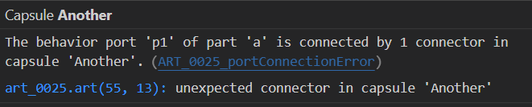
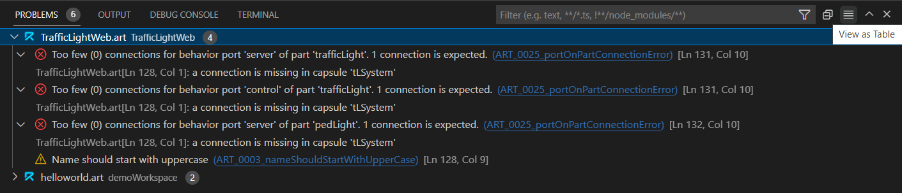
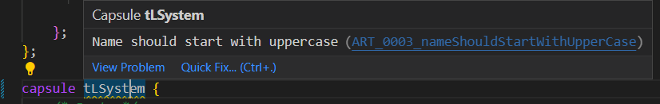
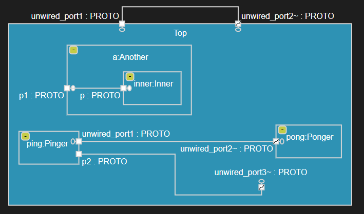
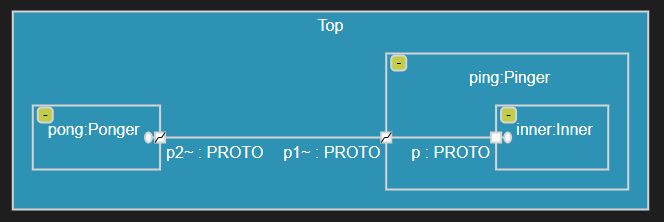

{$product.name$} checks for semantic problems in your application. It does this by running a large number of validation rules each time an Art file or a TC file has been changed. The rules run automatically as soon as you have made a change to the file (even before saving it). This ensures that errors and warnings (i.e. potential problems) are found as early as possible.

## Problem Severity
Each validation rule has a default severity which will be used for the problems that are reported by the rule:

* **Error**
  An error is a problem that is severe enough to prevent building a correct application. Errors must be fixed, and it will not be possible to build the Art files into a C++ application until all errors have been resolved.

* **Warning**
  A warning is a potential problem, which you may or may not choose to fix. It can for example indicate a deviation from common conventions and best practises and it can indicate that the application will not behave as you may expect.

* **Information**
  An information is just a message that you should be aware of. It doesn't really indicate a problem, and you don't need to fix it.

You can customize the default severity of any validation rule, and you can also choose to completely disable a certain validation rule that you don't think provides any value. See [Configuring Validation](#configuring-validation) for more information.

## Problem Reporting
When a validation rule has found a problem in an Art file, it is marked by underlining one or several Art elements in the file. The underlining is red for errors, yellow for warnings and blue for information messages. For example, in the capsule shown below one warning and two errors have been found.


You can hover the cursor over these underlinings to get a tooltip with information about the problem. Every problem has a message that describes it. Often this message gives enough information for understanding how to fix the problem. If this is not the case you can go to the [documentation](#validation-rules) about the validation rule to find more information, examples and suggestions for how the problem can be fixed. To easily find the documentation click the hyperlink that consists of the unique id of the validation rule (it starts with a prefix such as "ART_", followed by a 4 digit number and a name). Alternatively you can search for the validation rule id on this page.



Often a problem may be associated with more than one Art element. There is a main element on which the problem will be shown, but there often also are other elements that are related to the problem in one way or another. You can navigate to related elements to get a better understanding of why a problem is reported and how to fix it. In the screenshot above the problem has a single related element (the capsule `tlSystem`) but in general a problem can have an arbitrary number of related elements.

Problems are also reported by means of icons in diagrams. Below are three states with problems of different severity:


A problem icon has a tooltip that shows the message of the problem. You can disable problem reporting in diagrams by means of a configuration setting `rtistic.diagram.showDiagnostics`.

For a TC file, all properties it contains will be validated, and problems that are found during this validation are shown by underlining TC properties. You can hover 


## Problems View
Too see all problems found in all Art files and all TC files in the workspace, open the Problems view. The total number of problems found are shown in the Problems view heading. By default problems are shown in a tree grouped by the files where they were found. However, you can also view them as a flat table instead (but note that related elements can only be seen when using the tree view).



If there are many problems, it can help to filter the Problems View by typing some text in the filter box. For example, you can filter using a regular expression that matches only some of the files in the workspace, to reduce the number of problems shown.

## Quick Fix
Some problems have one or several typical solutions that are possible to apply automatically by means of "code actions". If a problem has at least one such code action defined, a yellow light bulb icon will appear and a Quick Fix command will be available in the problem tooltip. 




Note that most semantic errors cannot be automatically resolved like this, but in some simple cases it's possible. 

## Configuring Validation
Validation can be configured to change which rules that should run, and what severity they should report found problems with. By default every [validation rule](#validation-rules) is enabled and uses a predefined severity level. Validation rules can be configured either globally by means of a setting, or locally by means of a property [rule_config](../art-lang#rule_config). In both cases the rule configuration consists of a comma-separated list of 5 letter strings where the first letter specifies if the rule is disabled and it's severity (X,I,W,E) and remaining letters specify the rule id. For example, the rule configuration `X0003,I0004,W0009,E0005` means the following:

* The rule [ART_0003_nameShouldStartWithUpperCase](#art_0003_nameshouldstartwithuppercase) is disabled
* The rule [ART_0004_nameShouldStartWithLowerCase](#art_0004_nameshouldstartwithlowercase) has its severity set to Information
* The rule [ART_0009_invalidProperty](#art_0009_invalidproperty) has its severity set to Warning
* The rule [ART_0005_choiceWithoutElseTransition](#art_0005_choicewithoutelsetransition) has its severity set to Error

To configure validation rules globally, use the configuration setting `rtistic.validation.ruleConfiguration`. A global configuration will apply for all Art files in the workspace, and all Art elements within those files, unless a local rule configuration has been set on an element.

To configure validation rules locally, set the property [rule_config](../art-lang#rule_config) on an Art element. It will affect the validation of that Art element itself, as well as all elements contained within that Art element. Here is an example of how to disable the validation rule [ART_0003_nameShouldStartWithUpperCase](#art_0003_nameshouldstartwithuppercase) on a capsule. Note that it also will disable this rule for elements contained within the capsule, such as states.

``` art
capsule customCapsule // no warning even if capsule name is not capitalized
[[rt::properties(
    rule_config="X0003"
)]]{

    statemachine {
        state customState; // no warning here too
        initial -> customState;
    };
};
```

!!! note 
    Certain validation rules cannot be disabled or have their severity changed. These are known as ["core validation rules"](#core-validation-rules) and they run **before** semantic validation starts (which is why they cannot be customized).

!!! note 
    Local configuration of validation rules is only supported for Art files. For TC validation you cannot provide a local rule configuration in the TC file.

## Validation Rules
This chapter lists all validation rules which {$product.name$} checks your Art application against. These rules find problems in Art files and all problems found have the "ART_" prefix.

### ART_0001_invalidNameCpp
| Severity | Reason | Quick Fix
|----------|:-------------|:-------------
| Error | An Art element has a name that is not a valid C++ name, or a name that will cause a name clash in the generated code. | N/A

Art elements are translated to C++ elements without changing the elements' names. Hence you need to choose names for Art elements that are valid in C++. For example, [C++ keywords](../art-lang#names-and-keywords) cannot be used. 

Furthermore, names of such Art elements must not clash with global names used by the [TargetRTS](target-rts/index.md) or names within generated C++ files.

If you ignore this error you can expect errors when compiling the generated C++ code.

``` art
protocol InvalidNameProtocol {
    in virtual(); // ART_0001 ("virtual" is a C++ keyword)
};

capsule Exception { // ART_0001 ("Exception" is a name reserved for use by the TargetRTS)

};
```

### ART_0002_duplicateNamesInScope
| Severity | Reason | Quick Fix
|----------|:-------------|:-------------
| Error | Two or more Art elements in the same scope have the same names or signatures.  | N/A

Names of Art elements must be unique within the same scope. The following is checked:

* Top-level elements in the global scope (either defined in the same Art file, or in different Art files built by the same TC). The corresponding C++ elements will have names in the global namespace and must hence be unique.
* Events of a protocol. Note that in-events and out-events are checked separately, since an in-event and an out-event will have the same name when you define a symmetric event (see [Protocol and Event](../art-lang#protocol-and-event)).
* [Parts](../art-lang#part) of a capsule.
* [Ports](../art-lang#port) of a capsule.
* [States](../art-lang#state) and pseudo states (collectively referred to as "vertices") of a state machine.
* [Transitions](../art-lang#transition) of a state machine.
* Trigger operations of a [class](../art-lang#class-with-state-machine). Note that several trigger operations may have the same name as long as their signatures are unique.

All elements with clashing names or signatures will be reported as related elements. Use this to find the element(s) that need to be renamed.

``` art
protocol DupProto {
    in inEvent1(); // ART_0002
    in inEvent1(); // ART_0002
    out inEvent1(); // OK (symmetric event)
};

class DNIS {
    trigger op1(`int` p);
    trigger op1(); // OK (signatures are unique)
    statemachine {
        state State;
        initial -> State;
    };
};
```

### ART_0003_nameShouldStartWithUpperCase
| Severity | Reason | Quick Fix
|----------|:-------------|:-------------
| Warning | An Art element's name doesn't follow the naming convention to start with uppercase.  | Capitalize Name

Just like in most languages Art has certain conventions on how elements should be named. The following elements should have names that start with an uppercase letter:

* [Capsule](../art-lang#capsule)
* [Class](../art-lang#class-with-state-machine)
* [Protocol](../art-lang#protocol-and-event)
* [State](../art-lang#state)

A Quick Fix is available that will fix the problem by capitalizing the name. Note, however, that it will only update the element's name, and not all references. If you have references to the element you may instead want to fix the problem by performing a Rename.

``` art
capsule myCapsule { // ART_0003
    statemachine {
        state sstate; // ART_0003
        initial -> sstate; 
    };
};
```

In this context an underscore (`_`) is considered a valid upper case character, so all names that start with underscore are accepted by this validation rule. 

### ART_0004_nameShouldStartWithLowerCase
| Severity | Reason | Quick Fix
|----------|:-------------|:-------------
| Warning | An Art element's name doesn't follow the naming convention to start with lowercase.  | Decapitalize Name

Just like in most languages Art has certain conventions on how elements should be named. The following elements should have names that start with a lowercase letter:

* [Event](../art-lang#protocol-and-event)
* [Port](../art-lang#port)
* [Part](../art-lang#part)
* [Trigger operation](../art-lang#class-with-state-machine)
* [Choice and junction points](../art-lang#choice-and-junction-points)
* [Entry and exit points](../art-lang#hierarchical-state-machine)
* [Transition](../art-lang#transition)

A Quick Fix is available that will fix the problem by decapitalizing the name. Note, however, that it will only update the element's name, and not all references. If you have references to the element you may instead want to fix the problem by performing a Rename.

``` art
protocol LowerCaseTestProtocol {
    out MyEvent(); // ART_0004
};
```

In this context an underscore (`_`) is considered a valid lower case character, so all names that start with underscore are accepted by this validation rule. 

### ART_0005_choiceWithoutElseTransition
| Severity | Reason | Quick Fix
|----------|:-------------|:-------------
| Warning | A choice lacks an outgoing else-transition. | N/A

If no outgoing transition of a choice is enabled at runtime (because no outgoing transition has a guard condition that is fulfilled) then the state machine will get stuck in the choice for ever. To avoid this you should ensure that at least one outgoing transition is enabled. A good way to do this is to use 'else' as the guard condition for one of the outgoing transitions. Such an else-transition will then execute if no other outgoing transition of the choice is enabled.

``` art
capsule ChoiceSample {
    statemachine {
        state State;
        initial -> State;
        choice x; // ART_0005
        State -> x;
        x -> State when `return getVal() == 5;`;
    };
};
```

Note that a transition without any guard condition is equivalent to a transition with a guard condition that is always fulfilled (i.e. a guard condition that returns true). An outgoing transition from a choice or junction without any guard is therefore also an else-transition.

### ART_0006_choiceWithoutOutgoingTransitions
| Severity | Reason | Quick Fix
|----------|:-------------|:-------------
| Error | A choice has no outgoing transitions. | N/A

A choice should typically have at least two outgoing transitions to be meaningful. Having only one outgoing transition is possible if it is an else-transition (i.e. a transition with an 'else' guard, or without any guard at all). However, a choice without any outgoing transition is not allowed since the state machine always will get stuck when reaching such a choice.

``` art
capsule ChoiceSample {
    statemachine {
        state State;
        initial -> State;
        choice x; // ART_0006
        State -> x;        
    };
};
```

### ART_0007_choiceWithTooManyElseTransitions
| Severity | Reason | Quick Fix
|----------|:-------------|:-------------
| Error | A choice has more than one outgoing else-transition. | N/A

It's good practise to have an outgoing else-transition (i.e. a transition with an 'else' guard, or without any guard at all) for a choice since it will prevent the state machine from getting stuck in the choice at runtime. However, there should not be more than one such else-transition defined, since otherwise it's ambiguous which one of them to trigger in the case none of the other outgoing transitions from the choice are enabled.

``` art
capsule ChoiceSample {
    statemachine {
        state State, State2;
        initial -> State;
        choice x; // ART_0007
        State -> x;
        x -> State;
        x -> State2 when `else`;
    };
};
```

### ART_0008_initialTransitionCount
| Severity | Reason | Quick Fix
|----------|:-------------|:-------------
| Error | A state machine has too many initial transitions, or no initial transition at all. | N/A

A state machine of a capsule or class must have exactly one initial transition. A common reason for this error is that you have introduced inheritance between two capsules which both have state machines with an initial transition. Because of that the derived capsule will have two initial transitions (the one it defines itself locally plus the one it inherits from the base capsule). In this case the error can be fixed by either deleting or excluding the initial transition from the derived capsule, or to let it redefine the initial transition from the base capsule. 

``` art
capsule InitTransCap2 {
    statemachine {
        state State;
        initial -> State;
    };
};

capsule InitTransCap3 : InitTransCap2 {
    statemachine {
        state State;
        initial -> State; // ART_0008
    };
};
```

Note that if the initial transition in the base capsule has no name, the derived capsule cannot exclude or redefine it. It's therefore good practise to name the initial transition if you expect your capsule to be inherited from.

### ART_0009_invalidProperty
| Severity | Reason | Quick Fix
|----------|:-------------|:-------------
| Error | A non-existing property is set for an element. | Remove Property

Most Art elements have [properties](../art-lang#art_properties) that can be set to change their default values. Different elements have different properties and if you get this error it means you have referenced a non-existing property for an Art element. 

A Quick Fix is available for removing the setting of the invalid property. Use Content Assist (++ctrl+space++) to get a list of valid properties for an Art element.

``` art
protocol IP_PROTO [[rt::properties(
    no_property = 4 // ART_0009 (A protocol has no property called "no_property")
)]] {
};
```

### ART_0010_invalidPropertyValue
| Severity | Reason | Quick Fix
|----------|:-------------|:-------------
| Error | A property is set to a value of incorrect type. | N/A

Most Art elements have [properties](../art-lang#art_properties) and every property has a type that is either boolean, integer, string or an enumeration. The type of the value assigned to a property must match the property's type. For example, you cannot assign an integer value to a boolean property. 

``` art
capsule IPV_Cap [[rt::properties(
    generate_file_header=4 // ART_0010 ("generate_file_header" is a boolean property)
)]]{
    statemachine {
        state State;
        initial -> State;
    };
};  
```

### ART_0011_propertySetToDefaultValue
| Severity | Reason | Quick Fix
|----------|:-------------|:-------------
| Warning | A property is set to its default value. | Remove Property

Most Art elements have [properties](../art-lang#art_properties) and every property has a default value. It's unnecessary to explicitly set a property to its default value. 

A Quick Fix is available for removing the setting of the property. 

``` art
class C_PropDefaultValue [[rt::properties(
    const_target_param_for_decode=false // ART_0011
)]] {
    statemachine {
        state State;
        initial -> State;
    };
};  
```

### ART_0012_invalidCodeSnippet
| Severity | Reason | Quick Fix
|----------|:-------------|:-------------
| Error | A code snippet is invalid in one way or the other. | Remove Code Snippet

A [code snippet](../art-lang#embedded-c-code)'s kind is specified after the prefix `rt::`. Different Art elements may have different kinds of code snippets. Also, some Art elements may have multiple code snippets of a certain kind, while others only may have one code snippet of each kind. 

A Quick Fix is available for removing the invalid code snippet. 

``` art
[[rt::header_preface]] // ART_0012 (code snippet for capsule/class placed at file level)
`
    // YourCodeHere
`

capsule Name {
    [[rt::unknown]] // ART_0012 (non-existing kind of code snippet)
    `
        // YourCodeHere
    `

    part x : OtherCap 
    [[rt::createFunction]]
    `
        return new DemoCap(rtg_rts, rtg_ref);
    `
    [[rt::createFunction]] // ART_0012 (duplicated code snippet)
    `
        return new DemoCap(rtg_rts, rtg_ref);
    `;

    statemachine {
        state State;
        initial -> State;
    };
};  
```


### ART_0013_partMultiplicityError
| Severity | Reason | Quick Fix
|----------|:-------------|:-------------
| Error | The part's lower multiplicity must be less than its upper multiplicity. | N/A

If a [part](../art-lang#part) has a multiplicity that specifies a range (i.e. both a lower and upper multiplicity), then the lower multiplicity must be less than the upper multiplicity.

``` art
capsule PME_Cap {
    part myPart : OtherCap [2..2]; // ART_0013
    
    statemachine {
        state State;
        initial -> State;
    };
};
```

### ART_0014_partKindMultiplicityInconsistency
| Severity | Reason | Quick Fix
|----------|:-------------|:-------------
| Warning | The part's kind is inconsistent with its multiplicity. | N/A

The multiplicity of a capsule [part](../art-lang#part) must match the part's kind. The following is checked:

* A fixed part must have a multiplicity greater than zero. This is because when the container capsule is incarnated at least one capsule instance must be incarnated into the fixed part.
* An optional part must have a lower multiplicity of zero. This means that when the container capsule is incarnated no capsule instances will be incarnated into the optional part. Hence, this is what makes the part optional.

In case any of these inconsistencies is detected, the faulty multiplicity will be ignored and a default multiplicity (see [Part](../art-lang#part)) will be used instead.

``` art
capsule PKMI_Cap { 
    fixed part myPart : OtherCap [0..2]; // ART_0014 (Fixed part should not have lower multiplicity 0)
    optional part myPart2 : OtherCap [1..5]; // ART_0014 (Optional part should not have lower multiplicity > 0)
    
    statemachine {
        state State;
        initial -> State;
    };
};
```

### ART_0015_internalTransitionOutsideState
| Severity | Reason | Quick Fix
|----------|:-------------|:-------------
| Error | An internal transition is defined outside a state, in the top state machine. | N/A

An [internal transition](../art-lang#internal-transition) specifies events that can be handled while a state machine is in a certain state without leaving that state. Hence it's only possible to define an internal transition inside a state. It does not make sense to define an internal transition directly in the top state machine.

``` art
capsule IntTransOutsideState {
    service port timer : Timing;

    statemachine {
        state State {
            t1 : on timer.timeout ` `;           
        };
        initial -> State;
        terror : on timer.timeout ` `; // ART_0015
    };
};
```

### ART_0016_circularInheritance
| Severity | Reason | Quick Fix
|----------|:-------------|:-------------
| Error | A capsule, class or protocol inherits from itself directly or indirectly. | N/A

When you use inheritance for capsules, classes and protocols you need to ensure there are no inheritance cycles. Cyclic inheritance means that an element would inherit from itself, directly or indirectly, which is not allowed. 

!!! note 
    Both capsules and classes, but not protocols, may have C++ base classes specified by means of C++ code snippets. Such inheritance relationships are not checked by this validation rule, but by the C++ compiler.

The elements that form the inheritance cycle will be reported as related elements. Use this to decide how to break the inheritance cycle.

``` art
protocol PR1 : PR2 { // ART_0016
    
};

protocol PR2 : PR1 { // ART_0016
    
};

class C1 {    
    statemachine {
        state State;
        initial -> State;
    };
};

class C2 : C1 {
    statemachine {
        state State;
        initial -> State;
    };
};

class C3 : C2, C4 { // ART_0016
    statemachine {
        state State;
        initial -> State;
    };
};

class C4 : C3 { // ART_0016
    statemachine {
        state State;
        initial -> State;
    };
};
```

### ART_0017_circularComposition
| Severity | Reason | Quick Fix
|----------|:-------------|:-------------
| Error | A capsule contains itself through a cycle in the composition hierarchy. | N/A

[Parts](../art-lang#part) of a capsule must form a strict composition hierarchy. At run-time the root of this hierarchy is the top capsule instance, and all other capsule instances in the application must be directly or indirectly owned by that capsule instance. For a fixed part the creation of contained capsule instances happen automatically when the container capsule is incarnated. It's therefore possible to statically analyze the fixed parts and check for cycles in the composition hierarchy.

!!! note 
    Only the static type of fixed capsule parts are used when looking for composition cycles. If a part has a [capsule factory](../art-lang#part-with-capsule-factory) that specifies a create function using C++ code, then a different dynamic type may be specified for the created capsule instances for that part. This opens up for more possibilities of introducing cycles in the composition hierarchy that will not be detected by this validation rule.

The fixed parts that form the composition cycle will be reported as related elements. Use this to decide how to break the composition cycle.

``` art
capsule CComp2 {    
    fixed part p2 : CComp3; // ART_0017
    
    statemachine {
        state State;
        initial -> State;
    };
};

capsule CComp3     
    part p3 : CComp2; // ART_0017
    
    statemachine {
        state State;
        initial -> State;
    };
};
```

### ART_0018_circularTransitions
| Severity | Reason | Quick Fix
|----------|:-------------|:-------------
| Error | A state machine has a cycle in the transitions that execute when leaving a junction. | N/A

A [junction](../art-lang#choice-and-junction) can split an incoming transition flow into multiple outgoing transition flows based on evaluating guard conditions for the outgoing transitions. If care is not taken it's possible to introduce cycles in the outgoing transition flows. Such cycles could lead to infinite recursion when the state machine executes, depending on what guard conditions will be fulfilled at runtime. You should therefore ensure there are no such transition cycles.

The transitions that form the cycle will be reported as related elements. Use this to decide how to break the transition cycle.

``` art
capsule CT_cap {
    statemachine { // ART_0018
        state S1;
        initial -> S1;
        junction j1, j2;
        t1: S1 -> j1;
        t2: j1 -> j2;
        t3: j2 -> j1;
    };
};
```

### ART_0019_unwiredPortBothPublisherAndSubscriber
| Severity | Reason | Quick Fix
|----------|:-------------|:-------------
| Error | An unwired port is declared as being both a subscriber and publisher at the same time. | N/A

An [unwired port](../art-lang#unwired-port) can at runtime be connected to another unwired port. One of the connected ports will be a publisher port (a.k.a SPP port) while the other will be a subscriber port (a.k.a SAP port). An unwired port can either be statically declared as being a publisher or subscriber port, or it can be dynamically decided at port registration time if the port should be a publisher or subscriber. The same port can not be both a subscriber and a publisher port at the same time.

``` art
capsule UnwiredCapsule {  
    subscribe publish port p1 : UnwiredProtocol; // ART_0019

    statemachine {
        state State;
        initial -> State;
    };
};
```

### ART_0020_wiredPortWithUnwiredProperties
| Severity | Reason | Quick Fix
|----------|:-------------|:-------------
| Warning | A property that only is applicable for an unwired port is specified for a wired port. | N/A

An [unwired port](../art-lang#unwired-port) may have properties that control how it will be registered at runtime (see [registration](../art-lang#registration) and [registration_name](../art-lang#registration_name)). These properties have no meaning and will be ignored for wired ports. 

``` art
capsule UnwiredCapsule2 {
    port p1 [[rt::properties(
        registration_name="hi"
    )]]: UnwiredProtocol; // ART_0020
  
    statemachine {
        state State;
        initial -> State;
    };
};
```

### ART_0021_unwiredPortRegNameSameAsPortName
| Severity | Reason | Quick Fix
|----------|:-------------|:-------------
| Warning | An unwired port is set to use a registration name that equals the name of the port. | N/A

When an [unwired port](../art-lang#unwired-port) is registered a name is used that by default is the name of the port. The property [registration_name](../art-lang#registration_name) can be used for specifying another name. It's hence unnecessary to use that property for specifying the name of the port, since it is the default name that anyway would be used. 

``` art
capsule UnwiredCapsule3 {
    unwired behavior port p1~ [[rt::properties(
        registration_name = "p1"
    )]]
    : UnwiredProtocol; // ART_0021 

    statemachine {
        state State;
        initial -> State;
    };
};
```

### ART_0022_ruleConfigProblem
| Severity | Reason | Quick Fix
|----------|:-------------|:-------------
| Warning | The [rule_config](../art-lang#rule_config) property has a malformed value. | N/A

The [rule_config](../art-lang#rule_config) property can be set on Art elements to configure which validation rules to run for that element (and for all elements it contains). It can also be used for setting a custom severity for those rules. The value of the [rule_config](../art-lang#rule_config) property should be a comma-separated list of 5 letter strings where the first letter specifies if the rule is disabled and it's severity (X,I,W,E) and remaining letters specify the rule id. See [Configuring Validation](#configuring-validation) for more information and examples.

``` art
capsule RCP [[rt::properties(
    rule_config="X0000" // ART_0022 (a validation rule with id 0000 does not exist)
)]]{
    statemachine {
        state State;
        initial -> State;
    };
};
```

### ART_0023_entryExitCodeCount
| Severity | Reason | Quick Fix
|----------|:-------------|:-------------
| Error | A state has too many entry and/or exit actions. | N/A

A state can at most have one entry and one exit action. Solve this problem by merging all entry and exit actions of the state to a single entry and exit action that performs everything that should be done when the state is entered and exited.

``` art
capsule CX {
    statemachine {
        state Composite {
            entry // ART_0023
            `
                entry1();
            `;
            entry // ART_0023
            `
                entry2();
            `;
        };
        initial -> Composite;
    };
};
```

### ART_0024_unwiredPortNotBehavior
| Severity | Reason | Quick Fix
|----------|:-------------|:-------------
| Error | An unwired port is not defined as a behavior port. | Make Behavior Port, Make Wired Port

An [unwired port](../art-lang#unwired-port) cannot be connected to another port by means of a [connector](../art-lang#connector). Hence, it's required that an unwired port is defined to be a behavior port. Otherwise it would not be possible for the owner capsule to send and receive events on an unwired port.

Two Quick Fixes are available for fixing this problem. Either the port can be turned into a behavior port, or it can be turned into a wired port.

``` art
capsule Pinger {
    service unwired port p1 : PROTO; // ART_0024

    statemachine {
        state State1;
        initial -> State1;
    };
};
```

### ART_0025_portOnPartConnectionError
| Severity | Reason | Quick Fix
|----------|:-------------|:-------------
| Error | A wired port is not properly connected, or an unwired port is connected. | N/A

An [unwired port](../art-lang#unwired-port) must not be connected to another port by means of a [connector](../art-lang#connector). Instead you should register such a port dynamically so that it can be connected at runtime with another matching port.

A wired port, however, must be connected. A service port that is not a behavior port must be connected both on the "inside" and on the "outside" by two connectors. That is because the purpose of such a relay port is to simply relay communication from one port to another. By "inside" we mean the composite structure of the capsule that owns the port, and by "outside" we mean the composite structure to which the part that is typed by the capsule belongs. If the service port is instead a behavior port, it should only be connected on the "outside".

``` art
capsule Top {    
    part ping : Pinger, // ART_0025 (not connected in capsule Top)
    pong : Ponger; // ART_0025 (not connected in capsule Top)
    
    statemachine {
        state t21;
        initial -> t21;
    };
};

capsule Inner {
    service behavior port p : PROTO;

    statemachine {
        state State;
        initial -> State;
    };
};

capsule Pinger {
    service port p1 : PROTO;      
    part inner : Inner;
    connect p1 with inner.p;    
    
    statemachine {
        state State1;
        initial -> State1;
    };
};

capsule Ponger {
    service behavior port p2~ : PROTO;    
    
    statemachine {
        state State1;                    
        initial -> State1;
    };
};
```



In the above picture we can more easily understand the two errors reported for the `Top` capsule's two parts `ping` and `pong`. Port `Ponger::p2` is a behavior port so one connection is expected for that port (but none is present), while port `Pinger::p1` is a non-behavior port so two connections are expected for that port (but only one is present, on its "inside"). Both problems can be solved by adding a connector in `Top` which connects these ports on their "outside".

### ART_0026_connectedPortsWithIncompatibleConjugations
| Severity | Reason | Quick Fix
|----------|:-------------|:-------------
| Error | A connector connects two ports with incompatible conjugations. | N/A

Ports connected by a [connector](../art-lang#connector) must have compatible conjugations. If the ports are at the same level in the capsule's structure (e.g. both ports belong to capsules typing capsule parts owned by the same capsule), then the connected ports must have the opposite conjugation. This is because events that are sent out from one of the ports must be able to be received by the other port. However, if the ports are at different levels in the capsule's structure (e.g. one of them belongs to a capsule typing a capsule part owned by the capsule and the other belongs to the capsule itself), then the ports must have the same conjugation. This is because in this case events are simply delegated from one capsule to another.

``` art
capsule Top {    
    part ping : Pinger, pong : Ponger; 
    connect ping.p1 with pong.p2; // ART_0026 (same port conjugations but should be different)
    
    statemachine {
        state t21;
        initial -> t21;
    };
};

capsule Inner {
    service behavior port p : PROTO;

    statemachine {
        state State;
        initial -> State;
    };
};
capsule Pinger {    
    service port p1~ : PROTO;  
    part inner : Inner;
    connect p1 with inner.p; // ART_0026 (different port conjugations but should be same)

    statemachine {
        state State1;
        initial -> State1;
    };
};

capsule Ponger {
    service behavior port p2~ : PROTO;    

    statemachine {
        state State1;                    
        initial -> State1;
    };
};
```



Here we see that both connectors are invalid. Port `p2` and port `p1` are at the same level in `Top`'s structure so their conjugations should be different, while port `p1` and port `p` are at different levels in `Top`'s structure so their conjugations should be the same.

### ART_0027_incompatibleProtocolsForConnectedPorts
| Severity | Reason | Quick Fix
|----------|:-------------|:-------------
| Error | A connector connects two ports with incompatible protocols. | N/A

Ports connected by a [connector](../art-lang#connector) must have compatible protocols. For {$product.name$} this means that the protocols must be the same.

!!! note 
    {$rtist.name$} uses a different criteria for protocol compatibility. There two protocols are compatible if all events that can be sent by a port typed by the source protocol can be received by the other port typed by the target protocol. Also in {$rtist.name$} the most common case is that the source and target protocols are the same, but they can also be different as long as all their events (both in-events and out-events) match both by name and parameter data type. This is a legacy behavior which is not recommended, and hence not supported by {$product.name$}.

``` art
protocol PROTO1 {    
    in pong();    
    out ping();
};

protocol PROTO2 {
    in pong();
    out ping();
};

protocol PROTO3 {    
    in pong();    
    out ping3();
};

capsule Top {
    service port p1 : PROTO1;    
    service port p2~ : PROTO2;
    service port p3~ : PROTO3;
    
    connect p1 with p2; // ART_0027 (but OK in {$rtist.name$})
    connect p1 with p3; // ART_0027 (also not OK in {$rtist.name$} due to event ping3)
    
    statemachine {
        state t21;
        initial -> t21;
    };
};
```

### ART_0028_superfluousTrigger
| Severity | Reason | Quick Fix
|----------|:-------------|:-------------
| Warning | A transition has a trigger which can never be triggered at runtime since there is another trigger on a transition from the same state that is identical. | N/A

Triggers for outgoing transitions of a state must be different. If two triggers specify the same event and port, and neither of them has a guard condition, then both of them will be enabled at the same time. In this case only one of the triggers will trigger the transition at runtime and the other one is superfluous. You can fix this problem either by removing the superfluous trigger, or to add a guard condition to one or both of the triggers or transitions. This validation rule is not run when the trigger or its transition has a guard, since it's then not possible to statically determine whether a trigger is superfluous or not.

``` art
capsule Base_27 {
    service port timer : Timing;
    
    statemachine {
        state BS;
        initial -> BS;
        _XTRANS: BS -> BS on timer.timeout;
    };
};

capsule SC27 : Base_27 {
    statemachine {
        state State, State2;
        redefine _XTRANS : BS -> State on timer.timeout;
        BS -> State2 on timer.timeout; // ART_0028
        State -> State2 on timer.timeout;
    };
};
```

### ART_0029_transitionToCompositeStateNoEntry
| Severity | Reason | Quick Fix
|----------|:-------------|:-------------
| Warning | A composite state is entered without using an entry point. | N/A

If a composite state is entered without using an entry point, the behavior may be different the first time the state is entered compared to subsequent times it's entered. The first time the initial transition of the composite state will execute, while after that it will be entered using [deep history](../art-lang#deep-history) (i.e. directly activate the substate that was previously active in the composite state). This difference in behavior is not evident just by looking at the state diagram, and can therefore be surprising and cause bugs. It's therefore recommended to always enter a composite state using an entry point. See [Hierarchical Statemachines](../art-lang#hierarchical-state-machine) for more information.

``` art
capsule Cap {
    statemachine {
        state BS {
            entrypoint ep1;
            initial -> Nested;
            state Nested;
        };
        _Initial: initial -> BS; // ART_0029
    };
};
```

### ART_0030_transitionToCompositeStateNoEntryNoInitialTrans
| Severity | Reason | Quick Fix
|----------|:-------------|:-------------
| Error | A composite state is entered without using an entry point, and its state machine has no initial transition. | N/A

This validation rule is related to [ART_0029_transitionToCompositeStateNoEntry](#art_0029_transitiontocompositestatenoentry). If a composite state is entered without using an entry point, and the nested state machine of the composite state has no initial transition, then it is undefined what to do when entering the state. This is therefore not allowed.

``` art
capsule Cap {
    statemachine {
        state BS {
            entrypoint ep1;            
            state Nested;
        };
        _Initial: initial -> BS; // ART_0030
    };
};
```

### ART_0031_portBothNonServiceAndNonBehavior
| Severity | Reason | Quick Fix
|----------|:-------------|:-------------
| Error | A port is both a non-service and a non-behavior port at the same time. | N/A

A [port](../art-lang#port) that is not a service port is internal to a capsule. For such a port to be useful it must be a behavior port; otherwise the capsule cannot send and receive events on the port. Hence, a non-service port cannot at the same time be a non-behavior port.

``` art
capsule C31 {
    port fp : Proto; // ART_0031

    statemachine {
        state State;
        initial -> State;
    };
};
```

### ART_0032_unrecognizedColor
| Severity | Reason | Quick Fix
|----------|:-------------|:-------------
| Warning | A color is specified for an element but the color was not recognized. | N/A

A [color](../art-lang#color) can be assigned to most elements and will be used when showing the element on a diagram. Colors should be specified as RGB values using 6 hexadecimal digits. In case the color value is on another format it will not be recognized and will be ignored when rendering the diagram.

``` art
capsule C32 {
    behavior port frame [[rt::properties(color="#gd1d1d")]]: Frame; // ART_0032 (invalid hex digit 'g')
    behavior port p [[rt::properties(color="#cc")]] : Proto; // ART_0032 (too few digits)

    statemachine {
        state State [[rt::properties(color="#5d04040")]]; // ART_0032 (too many digits)
        initial -> State;
    };
};
```

### ART_0033_connectedNonServicePortOnPart
| Severity | Reason | Quick Fix
|----------|:-------------|:-------------
| Error | A connector connects a port on a part but the port is not a service port. | N/A

A [port](../art-lang#port) is only visible from the outside of a capsule if it is a service port. Hence, a connector cannot connect a port on a part unless the port is a service port.

``` art
capsule C33 {
    optional part thePart : Other;
    behavior port bp : Proto; 
    connect bp with thePart.bp2; // ART_0033

    statemachine {
        state State;
        initial -> State;
    };
};

capsule Other {
    behavior port bp2 : Proto;
    
    statemachine {
        state State;
        initial -> State;
    };
}
```

### ART_0034_servicePortWithoutEvents
| Severity | Reason | Quick Fix
|----------|:-------------|:-------------
| Warning | A service port is typed by a protocol that doesn't have any events. | N/A

A service [port](../art-lang#port) is part of the externally visible communication interface for a capsule. Hence the protocol that types a service port should have at least one event, otherwise the service port doesn't add any value. The only exception is a notification port which receives the `rtBound` and `rtUnbound` events when the port gets connected or disconnected to another port at runtime. This means that a notification port can be useful even if its protocol doesn't contain any events.

``` art
protocol EmptyProtocol {
};

capsule C34 {
    service port myPort : EmptyProtocol; // ART_0034

    statemachine {
        state State;
        initial -> State;
    };
};
```

### ART_0035_timerServicePort
| Severity | Reason | Quick Fix
|----------|:-------------|:-------------
| Warning | A timer port is a declared to be a service port. | Make Behavior Port

A timer [port](../art-lang#port) is typed by the predefined [Timing](../targetrts-api/struct_timing.html) protocol. It has one event `timeout` which is sent to the port after a certain timeout period (either once or periodically). Other capsules cannot send the `timeout` event to the capsule that owns the timer port. Hence a timer port should always be a non-service behavior port.

A Quick Fix is available that will change a service timer port to become a behavior port.

``` art
capsule C35 {
    service port t : Timing; // ART_0035

    statemachine {
        state State;
        initial -> State;
    };
};
```

## Code Generation Validation Rules
Some problems in an Art file cannot be detected until it's translated to C++ code. The code generator implements validation rules for detecting and reporting such problems. 

!!! note
    When an Art file is edited in the UI code generation validation rules run just after the Art [validation rules](#validation-rules). However, they will only run if there is an active TC, since otherwise code generation will not happen.
    
    When you run the [Art Compiler](building/art-compiler.md) and the Art validation rules found at least one problem with Error severity, then code generation will not happen and hence these validation rules will not run.

Validation rules that are related to code generation can be enabled and disabled, and have their severity customized, in the same way as the Art validation rules. Code generation validation rules have the prefix "CPP" and ids in the range starting from 4000 and above. They are listed below.

### CPP_4000_eventTypeWithoutTypeDescriptor
| Severity | Reason | Quick Fix
|----------|:-------------|:-------------
| Warning | An event type has a type for which no type descriptor could be found. | N/A

If an event has a data parameter the type of this parameter must have a [type descriptor](art-lang/cpp-extensions.md#type-descriptor). Otherwise the TargetRTS doesn't know how to copy or move the data at run-time when the event is sent. The TargetRTS provides type descriptors for most predefined C++ types. For user-defined types the code generator assumes a type descriptor will be available for it (either [automatically generated](art-lang/cpp-extensions.md#automatically-generated) by means of the `rt::auto_descriptor` attribute, or [manually implemented](art-lang/cpp-extensions.md#manually-implemented)). It's necessary that such a user-defined type is defined so that it can be referenced from the event without use of qualifiers. Use a typedef or type alias to give a name to an existing type that is defined in a different namespace.

If the code generator doesn't find a type descriptor for the event parameter type, this warning will be reported, and the C++ function that is generated for the event will have void type (i.e. the same as if the event doesn't have a data parameter).

``` art
protocol PROT {
    out threadId(`std::string`); // ART_4000
};
```

### CPP_4001_unreachableTransition
| Severity | Reason | Quick Fix
|----------|:-------------|:-------------
| Warning | One or many transitions are unreachable due to ambiguous triggers. | N/A

If there are multiple outgoing transitions from a state with identical triggers (i.e. having the same port and the same event, and no guard condition), then it's ambiguous which one of them that will be triggered. In this situation the code generator will pick one of them to execute, and report the other ones as unreachable. The unreachable transitions will be reported as related elements so you can navigate to them and decide how to resolve the ambiguity. 

Common solutions for this problem is to add a guard condition, either on the trigger or the transition. With a guard condition the ambiguity is resolved, but it's of course then important to ensure that guard conditions are mutually exclusive so that only one of the transitions can execute. The code generator cannot ensure this, since guard conditions are evaluated at run-time.

``` art
capsule XCap {   
    behavior port t : Timing;
    statemachine {
        state State1, State2;
        initial -> State1 
        `
            t.informIn(RTTimespec(1,0));
        `;
        t1: State1 -> State2 on t.timeout;
        t2: State1 -> State2 on t.timeout; // CPP_4002
    };
};
```

Code for calling unreachable transitions will still be generated, but preceeded with a comment. Here is an example:

``` cpp
case Timing::Base::rti_timeout:
    chain2_t1(  );
    return ;
    // WARNING: unreachable code;
    chain3_t2(  );
    return ;
```

### CPP_4002_guardedInitialTransition
| Severity | Reason | Quick Fix
|----------|:-------------|:-------------
| Error | The initial transition leads to a junction where all outgoing transitions have guard conditions. | N/A

The initial transition is the first transition that executes in a state machine. It must always lead to the activation of a state where the state machine will stay until it receives its first event. It is allowed to use junctions in the initial transition to let guard conditions decide which state that should be activated. However, in this case it's required that there is at least one junction transition without a guard condition (or with an `else` guard). If all transition paths are guarded there is a risk that none of the guard conditions will be fulfilled, which would mean that no state will be activated. That would effectively break the functioning of the state machine.

``` art
capsule N {    
    statemachine {
        state State;
        junction j;
        initial -> j;
        j -> State when `x == 5`; // CPP_4002
    };
};
```

## TC Validation Rules
TC files are validated to detect problems related to TC properties. The rules that perform this validation can be enabled and disabled, and have their severity customized, in the same way as the Art [validation rules](#validation-rules). They use the prefix "TC" and ids in the range starting from 7000 and above. These rules are listed below.

### TC_7000_wrongValueType
| Severity | Reason | Quick Fix
|----------|:-------------|:-------------
| Error | A TC property has the wrong type of value. | N/A

Each TC property has a type as shown in [this table](../building/transformation-configurations/#properties). The value provided for a TC property must have the expected type. Here are some examples where TC property values have types that don't match the types of these TC properties:

``` js
tc.copyrightText = true; // TC_7000 (expects a string, and not a boolean)
tc.cppCodeStandard = 98; // TC_7000 (expects an enum string such as "C++ 98", and not a number)
tc.sources = ''; // TC_7000 (expects a list of strings, and not a single string)
```

### TC_7001_tcPropertyNotYetSupported
| Severity | Reason | Quick Fix
|----------|:-------------|:-------------
| Warning | A TC property is assigned a value, but {$product.name$} does not yet support this property. | N/A

TC files are not only used by {$product.name$} but also by {$rtist.name$}. Even if the format of TC files is the same in these products, there are certain TC properties which are supported by {$rtist.name$}, but not yet supported by {$product.name$}. You can still assign values to such properties but they will be ignored.

``` js
tc.compilationMakeInsert = ''; // TC_7001
```

### TC_7002_propertyNotApplicableForLibraryTC
| Severity | Reason | Quick Fix
|----------|:-------------|:-------------
| Warning | A TC property that is only applicable for an executable TC is used in a library TC. | N/A

Certain TC properties are only meaningful if used in a TC that builds a library. For example, setting [`linkCommand`](building/transformation-configurations.md#linkcommand) does not make sense on a library TC since a library is not linked.

``` js
let tc = TCF.define(TCF.CPP_TRANSFORM);
// The "topCapsule" property is not set, which means this is a library TC
tc.linkCommand = 'ld'; // TC_7002
```

### TC_7003_prerequisitePathError
| Severity | Reason | Quick Fix
|----------|:-------------|:-------------
| Error | A prerequisite TC cannot be resolved. | N/A

TCs that are specified as prerequisites must exist. If the path cannot be resolved to a valid TC file then it must either be corrected or deleted. A relative path is resolved against the location of the TC where the [`prerequisites`](building/transformation-configurations.md#prerequisites) property is set.

``` js
tc.prerequisites = ["../../TestUtils/testlibX.tcjs"]; // TC_7003 (referenced TC file does not exist)
```

### TC_7004_invalidTopCapsule
| Severity | Reason | Quick Fix
|----------|:-------------|:-------------
| Error | The specified top capsule cannot be found. | N/A

The [`topCapsule`](building/transformation-configurations.md#topcapsule) property is mandatory for executable TCs. In fact, it's the presence of this property that makes it an executable TC. A capsule with the specified name must exist in one of the Art files that is built by the TC (directly or indirectly). If you specify a top capsule that cannot be found, make sure you have spelled it correctly (use Content Assist in the TC editor so you can avoid typos). Also make sure that the Art file where the top capsule is defined is not excluded from the build by use of the [`sources`](building/transformation-configurations.md#sources) property.

``` js
tc.topCapsule = 'TopCap'; // TC_7004 (referenced TC file does not exist)
```

### TC_7005_invalidUnitName
| Severity | Reason | Quick Fix
|----------|:-------------|:-------------
| Error | The `unitName` property contains characters that are illegal in a file name. | N/A

The [`unitName`](building/transformation-configurations.md#unitname) property specifies the name of the generated unit files (by default called `UnitName.h` and `UnitName.cpp`). Hence, it cannot contain characters that are not allowed in a file name. Different operating systems have different rules that a valid file name must adhere to.

``` js
tc.unitName = 'UnitName:1'; // TC_7005 (colon is not a valid file name character on Windows)
```

### TC_7006_invalidTargetRTSLocation
| Severity | Reason | Quick Fix
|----------|:-------------|:-------------
| Error | The specified path to the TargetRTS does not exist or is invalid. | N/A

The [`targetRTSLocation`](building/transformation-configurations.md#targetrtslocation) property must specify a folder that exists and contains a TargetRTS to compile generated code against. 

``` js
tc.targetRTSLocation = "C:\\MyTargets\\"; // TC_7006 (if that folder does not exist)
```

### TC_7007_invalidTargetConfig
| Severity | Reason | Quick Fix
|----------|:-------------|:-------------
| Error | The specified target configuration does not exist. | N/A

The [`targetConfiguration`](building/transformation-configurations.md#targetconfiguration) property must specify the name of a target configuration that exists in the folder specified by the [`targetRTSLocation`](building/transformation-configurations.md#targetrtslocation) property. If you specify a target configuration that cannot be found, make sure you have spelled it correctly (use Content Assist in the TC editor so you can avoid typos).

``` js
tc.targetConfiguration = "WinT.x64-MinGW-12.2.0"; // TC_7007 (misspelled "MinGw")
```

### TC_7008_invalidCodeStandard
| Severity | Reason | Quick Fix
|----------|:-------------|:-------------
| Error | The specified C++ code standard does not exist. | N/A

The [`cppCodeStandard`](building/transformation-configurations.md#cppcodestandard) property must specify a valid C++ code standard. If you specify a code standard that cannot be found, make sure you have spelled it correctly (use Content Assist in the TC editor so you can avoid typos).

``` js
tc.cppCodeStandard = "C++ 18"; // TC_7008 (there is no C++ language standard C++ 18)
```

### TC_7009_invalidTargetFolder
| Severity | Reason | Quick Fix
|----------|:-------------|:-------------
| Error | The specified target folder is invalid. | N/A

The [`targetFolder`](building/transformation-configurations.md#targetfolder) property specifies the folder where to place generated files. The folder doesn't have to exist, since it will be created automatically by the code generator if needed. However, it's required that the folder has a name that is valid. Different operating systems have different rules that a valid folder name must adhere to.

``` js
tc.targetFolder = 'capsule_cpp_inheritance_target:'; // TC_7009 (invalid character ':' in target folder)
```

### TC_7010_physicalThreadWithoutLogicalThread
| Severity | Reason | Quick Fix
|----------|:-------------|:-------------
| Warning | A physical thread has no logical thread mapped to it. | N/A

A physical thread is referenced through a logical thread that is mapped to it in the TC. Multiple logical threads can be mapped to the same physical thread, but if a physical thread has no logical threads mapped to it, it's useless since it then cannot be referenced by the application. Note that this rule does not apply for the default MainThread and TimerThread.

Solve this problem either by deleting the Thread object that represents the physical thread from the TC, or map a logical thread to it using the `logical` property.

See the [`threads`](building/transformation-configurations.md#threads) property for more information.

``` js
tc.threads = [
{
    name: 'MyThread',
    logical: [ ] // TC_7010
}
];
```

### TC_7011_duplicatePhysicalThreadName
| Severity | Reason | Quick Fix
|----------|:-------------|:-------------
| Error | There are multiple physical threads with the same name. | N/A

The names of physical threads in an application must be unique. See the [`threads`](building/transformation-configurations.md#threads) property for more information.

``` js
tc.threads = [
{
    name: 'MyThread',    
    logical: [ 'L1' ] 
},
{
    name: 'MyThread', // TC_7011 (MyThread already defined)
    logical: [ 'L2' ] 
}
];
```

### TC_7012_duplicateLogicalThreadName
| Severity | Reason | Quick Fix
|----------|:-------------|:-------------
| Error | There are multiple logical threads with the same name. | N/A

The names of logical threads in an application must be unique. In a library TC the logical threads are specified as a list of strings in the [`threads`](building/transformation-configurations.md#threads) property and this list should not contain duplicates. In an executable TC the logical threads are instead defined implicitly when mapping them to physical threads using the `logical` property on the Thread object. Also in this case, the same logical thread name should not be used more than once.

``` js
tc.threads = [
{
    name: 'MyThread',    
    logical: [ 'L1', 'L1', 'L2' ] // TC_7012 (L1 defined (and mapped to MyThread) twice)
},
{
    name: 'MyThread2', 
    logical: [ 'L2' ] // TC_7012 (L2 already mapped to MyThread above)
}
];
```
A special situation is when an executable TC has several library TCs as prerequisites (direcly or indirectly). These library TCs may define logical threads with clashing names. You must make sure that names of logical threads in all prerequisite libraries are unique. One way to accomplish this could be to prefix a logical thread in a library with the name of the library.

### TC_7013_physicalThreadsInLibrary
| Severity | Reason | Quick Fix
|----------|:-------------|:-------------
| Warning | Physical threads are defined in a library TC. | N/A

In a library TC you should only define logical threads. These must be mapped to physical threads in the executable TC which has the library TC as a prerequisite. If you anyway define physical threads in a library TC, they will be ignored.

See the [`threads`](building/transformation-configurations.md#threads) property for more information.

``` js
// tc.topCapsule not defined, i.e. this is a library TC
tc.threads = [ // TC_7013
{
    name: 'MyThread',    
    logical: [ 'L1' ] 
}
];
```

### TC_7014_incorrectThreadProperty
| Severity | Reason | Quick Fix
|----------|:-------------|:-------------
| Error | A thread property is incorrectly specified. | N/A

This problem is reported if the [`threads`](building/transformation-configurations.md#threads) property contains a value of unexpected type. For an executable TC this property should be set to a list of Thread objects representing physical threads, while for a library TC it should be set to a list of strings which are the names of the logical threads defined in the library.

The problem is also reported if a Thread object for a physical thread has a property of unexpected type. All properties of such a Thread object should be of string type, except `logical` which should be a list of strings.

``` js
tc.threads = [ 
{
    name: 'MyThread',
    priority: 20000 // TC_7014 (the priority should be specified as a string and not a number)
    logical: [ 'L1' ] 
}
];
```

### TC_7015_libraryThreadNotMappedToPhysicalThread
| Severity | Reason | Quick Fix
|----------|:-------------|:-------------
| Error | A logical thread in a library TC is not mapped to a physical thread. | N/A

A library TC uses the [`threads`](building/transformation-configurations.md#threads) property for specifying logical threads. When an executable TC uses a library TC as its prerequisite, all logical threads of the library must be mapped to physical threads. Read more about library threads [here](../target-rts/threads/#library-threads).

``` js
// In a library TC lic.tcjs:
tc.threads = [ 'LibThread1', 'LibThread2' ];

// In an executable TC exe.tcjs:
tc.prerequisites = ["lib.tcjs"];
tc.threads = [ 
{
    name: 'MyThread',
    logical: [ 'LibThread1' ] // TC_7015 (library logical thread 'LibThread2' not mapped)
}
];
```

## Core Validation Rules
There are certain core rules that run before the semantic validation rules mentioned above. They are responsible for making sure that the Art file is syntactically correct and that all references it contains can be successfully bound to valid Art elements.

Since these rules run before semantic [validation rules](#validation-rules) they cannot be disabled or have their severity changed. Core validation rules have ids in the range starting from 9000 and above and are listed below.

### ART_9000_syntaxError
| Severity | Reason | Quick Fix
|----------|:-------------|:-------------
| Error | Parsing of the Art file failed due to a syntax error. | N/A

If an Art file contains a syntax error, it cannot be parsed into valid Art elements and the parser will then report this error. There are many ways to introduce syntax errors in an Art file and the error message from the parser will usually help you understand what is wrong by telling you both what incorrect thing was encountered and what is instead expected at that position.

``` art
capsule A {    
    state machine // ART_9000 (mismatched input 'state' expecting 'statemachine')
};

capsule B {    
    statemachine {
        state State;
        initial -> State;
    };
    prt // ART_9000 (extraneous input 'prt' expecting '}')
};
```

### ART_9001_unresolvedReference
| Severity | Reason | Quick Fix
|----------|:-------------|:-------------
| Error | A referenced Art element cannot be found. | N/A

For an Art file to be well-formed, all references it contains must be possible to resolve to valid Art elements (located either in the same Art file, or in another Art file in the workspace). Aside from simple spelling mistakes, the most common reason for this error is that you forgot to add the folder that contains the Art file with the target Art element into the workspace. Also note that if the referenced Art element is in a different workspace folder you must have an active TC which specifies a TC in that workspace folder as a prerequisite.

``` art
capsule C {    
    port p : Unknown; // ART_9001 (Couldn't resolve reference to Protocol 'Unknown'.)

    statemachine {
        state State;
        initial -> State;
    };
};
```

## Internal Errors
A special validation rule is used for detecting and reporting so called internal errors. These are errors that should never occur, but if they still do they are caused by a defect in {$product.name$}. If you encounter an internal error please report it as described [here](../support).

### ART_9999_internalError
| Severity | Reason | Quick Fix
|----------|:-------------|:-------------
| Error | An internal error has occurred. | N/A

Internal errors may arise from bugs and often result from unexpected situations. While it may be possible to workaround an internal error, the problem can only be fully solved by updating {$product.name$}. Therefore, the first thing you should do if you get an internal error is to make sure you are running the latest version of {$product.name$} (see [Releases](../releases)). If you don't, then please uplift to the latest version as there is a chance the problem has been fixed in that version. If that doesn't help, please report the internal error as described [here](../support).

