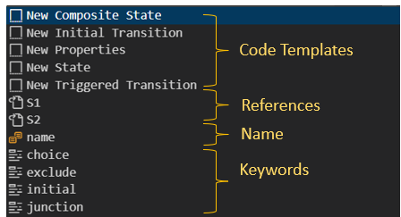
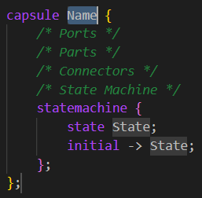
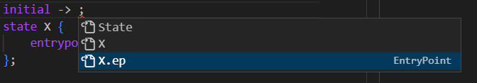
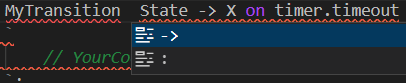

You can use any text editor for editing Art files, but it's highly recommended to edit them in {$product.name$}. Thereby you will have access to features such as [syntax coloring](#syntax-coloring), [content assist](#content-assist) and semantic [validation](../validation.md).

## Syntax Coloring
{$product.name$} provides color themes that have been specifically designed for being used for editing Art files. Activate one of these color themes from **File - Preferences - Color Theme**.

* **Art Dark** This is a dark theme that colorizes Art keywords, properties and comments. All embedded C++ code will be shown in gray color. This theme can be useful if you mostly edit C++ code snippets in generated files and propagate those changes back to the Art files automatically (see [Making Changes in Generated C++](../building/index.md#making-changes-in-generated-c)). Showing C++ code in gray color makes it easier to see what parts you have to edit in the Art file, and what parts (i.e. the C++ code) that you can edit in generated files.


* **Art Dark++** This is a dark theme that colorizes Art keywords, properties and comments. In addition it colorizes embedded C++ code using the same colors as are used for a C++ file. To help in separating Art from C++, all Art code uses a bold font, while C++ code uses a regular font. This theme can be useful if you prefer to edit both Art and C++ code in the Art file.


* **Art Light** This is a light theme that uses the same colors as Art Dark.


* **Art Light++** This is a light theme that uses the same colors as Art Dark++.


## Content Assist
This feature, which also is known as IntelliSense or Code Completion, helps you when editing an Art file by proposing commonly used Art constructs that are valid at the current cursor position. Invoke Content Assist by pressing ++ctrl+space++. Depending on where the cursor is placed you will get different proposals to choose from. There are four kinds of proposals as shown in the picture below:



* **Code Templates** are complete Art elements, for example a capsule, protocol or state. The inserted code template often has variables that you should replace as you find appropriate. For example, the code template for a capsule contains one variable for the capsule name and another for the name of the state which its state machine contains. Press ++tab++ to move forward from one variable to the next and if needed ++shift+tab++ to move backwards to a previous variable. Note that the same variable may occur in multiple places, like the `State` variable for the capsule code template which occurs both in the state definition and as a state reference in the initial transition. All occurrances of a variable are updated simultaneously when you replace the variable with a string.



* **References** are references to existing Art elements, for example a state, event or capsule. All Art elements of the correct kind which are visible from the cursor position will be available. References may have a qualifier if necessary, for example when referencing an entry point.



* **Name** represents an identifier used as the name of an Art element. It appears as a proposal at positions where the Art language allows a named element. Choosing this proposal just inserts the string "name" which probably is not so useful. However, the presence of a `name` item in the proposals list tells you that you can use an arbitrary identifier as the name of an Art element at that position. For example, in the proposals list shown in the picture above `name` appears since a triggered transition may have an optional name before its declaration. The code template for the triggered transition will not insert a name, since many transitions don't have names, but you can manually add it afterwards:

``` art
MyTransition: State -> X on timer.timeout
```

* **Keywords** are keywords from the Art language that are valid to use at the cursor position. This also includes lexical tokens such as `:` or `.` where applicable. For example, after you have typed the name for the triggered transition shown above you can use Content Assist to learn that it may be followed by either a `->` or `:` token:



## Renaming Elements
To rename an Art element place the cursor on the element's name and press ++"F2"++ (or invoke the command **Rename Symbol** from the context menu). This performs a "rename refactoring" that updates all references to the renamed element too.

!!! note 
    Avoid renaming an element by simply editing its name. For {$product.name$} to understand that you want to rename an element, you need to use the approach described above.