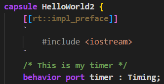
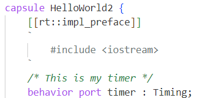
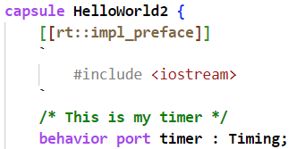

You can use any text editor for editing Art files, but it's highly recommended to edit them in {$product.name$}. Thereby you will have access to features such as [syntax coloring](#syntax-coloring), [content assist](#content-assist) and semantic [validation](../validation.md).

## Syntax Coloring
{$product.name$} provides color themes that have been specifically designed for being used for editing Art files. Activate one of these color themes from **File - Preferences - Color Theme**.

* **Art Dark** This is a dark theme that colorizes Art keywords, properties and comments. All embedded C++ code will be shown in gray color. This theme can be useful if you mostly edit C++ code snippets in generated files and propagate those changes back to the Art files automatically (see [Making Changes in Generated C++](../building/index.md#making-changes-in-generated-c)). Showing C++ code in gray color makes it easier to see what parts you have to edit in the Art file, and what parts (i.e. the C++ code) that you can edit in generated files.

* **Art Dark++** This is a dark theme that colorizes Art keywords, properties and comments. In addition it colorizes embedded C++ code using the same colors as are used for a C++ file. To help in separating Art from C++, all Art code uses a bold font, while C++ code uses a regular font. This theme can be useful if you prefer to edit both Art and C++ code in the Art file.

* **Art Light** This is a light theme that uses the same colors as Art Dark.

* **Art Light++** This is a light theme that uses the same colors as Art Dark++.

## Content Assist

