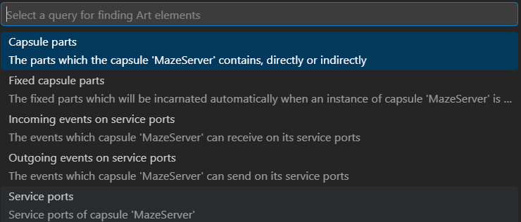
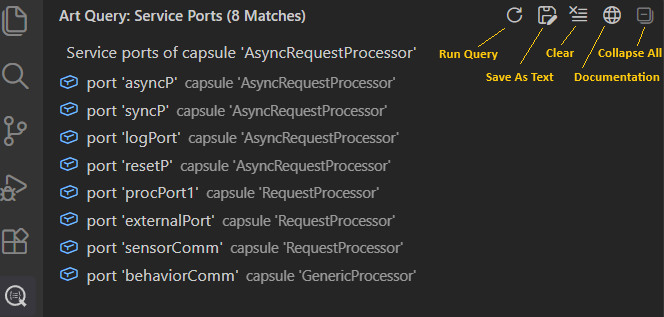
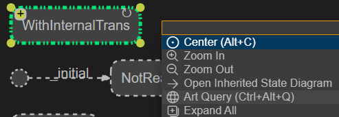
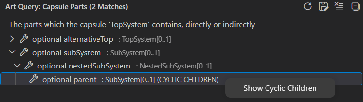
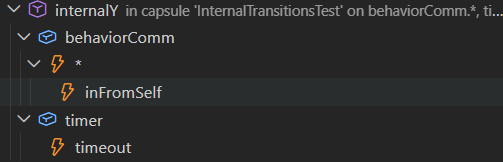

The Art Query view shows the result of running a **query** on an Art element in order to find other Art elements that are related to it. {$product.name$} provides several useful queries for finding Art elements that are defined in the Art files of your workspace. You can use these queries to

* find Art elements that are not easy to find with the regular **Find** or **Find in Files** commands
* navigate to Art elements in a more efficient way than what is possible in the Art editor or in diagrams
* get a better overview of the Art elements in your application than what is possible with the [Outline view](outline-view.md)
* get a more focused view by only looking at some of all the elements that are shown in a big state or structure diagram

To run a query, right-click in an Art file where an Art element is defined and perform the context menu command **Art Query**. All queries that can be run on the selected Art element appears:

Note that for some kinds of Art elements there may not be any applicable queries, and in that case the **Art Query** command will do nothing. See [Queries](#queries) for a list of available queries and what Art elements each query can be run on.

The result of running a query is shown in the Art Query view either as a flat list or as a hierarchical tree. Click on an Art element to navigate to its definition in an Art file. Here is an example of running the [Service Ports](#service-ports) query which lists found Art elements in a flat list.

The following buttons are available in the Art Query view toolbar:

* **Run Query** Runs the current query again. Use this button if you have changed some Art files and want to refresh the Art Query view with up-to-date information without having to invoke the **Art Query** command for the same query again.
* **Save As Text** Creates a text document with a textual representation of the contents of the Art Query view. You can choose to save the document as a text file, copy it into the clipboard or just keep the document open as long as you need the query result.
* **Clear** Clears the Art Query view and shows documentation about all available [queries](#queries).
* **Documentation** Shows documentation about the current query in a web browser.
* **Collapse All** This button is enabled if the query result is a hierarchical tree, and will then collapse the tree so only the root elements are shown.

You can also invoke the **Art Query** command from diagrams. Select the symbol or line that represents the Art element you want to run a query on and then press ++ctrl+space++ to open the diagram context menu. If there is at least one query that is applicable for the Art element, the **Art Query** command will be available.

## Cyclic Query Results
Queries that result in a hierarchical tree may contain cycles. This happens if a child Art element is the same as one of its direct or indirect parents. The Art Query view will detect such cycles by appending the string "(CYCLIC CHILDREN)" after the description of the element whose children form the cycle. You can see the cyclic children in the query result tree by invoking the context menu command **Show Cyclic Children**.

For example, the query [Capsule Parts](#capsule-parts) will produce a cyclic query result if a capsule directly or indirectly contains an optional part that is typed by the capsule itself. In the picture below this is the case for the `SubSystem` capsule which is the type of the `subSystem` part which is an indirect parent of the `parent` part. The command **Show Cyclic Children** can be used on the `parent` part to navigate to the `subSystem` part.

## Queries
The table below lists all queries that are available. Each query is described in a section of its own below the table.

| Query | Applicable For | Description | 
|----------|:-------------|:-------------|
| [Capsule Parts](#capsule-parts) | Capsule | Finds the capsule parts directly or indirectly owned by a capsule
| [Fixed Capsule Parts](#fixed-capsule-parts) | Capsule | Finds the fixed capsule parts directly or indirectly owned by a capsule
| [Incoming Events on Service Ports](#incoming-events-on-service-ports) | Capsule | Finds all events a capsule can receive on its service ports
| [Internal Transitions](#internal-transitions) | State | Finds all internal transitions of a state
| [Outgoing Events on Service Ports](#outgoing-events-on-service-ports) | Capsule | Finds all events a capsule can send on its service ports
| [Redefined Elements](#redefined-elements) | State, Transition, Part, Port or Event | List the elements which are redefined by an element
| [Service Ports](#service-ports) | Capsule | Finds all service ports of a capsule

### Capsule Parts
This query traverses the composite structure of a capsule and collects all capsule parts it contains. The query result is a tree where the root elements are the parts which are directly owned by the capsule. You can expand each capsule part in the tree to further explore the nested parts which are indirectly owned by the context capsule. 

The query result will be [cyclic](#cyclic-query-results) if an optional or plugin part is typed by one of the capsules that contain the part, directly or indirectly.

### Fixed Capsule Parts
This query traverses the composite structure of a capsule and collects all fixed capsule parts it contains. These are the capsule parts that will be automatically incarnated with one or many capsule instances (as decided by the upper multiplicity of the part) when an instance of the capsule is created. The query result is a tree where the root elements are the fixed parts which are directly owned by the capsule. You can expand each fixed capsule part in the tree to further explore the nested parts which are indirectly owned by the context capsule.

The query result will normally not be [cyclic](#cyclic-query-results), since it's not allowed to have a fixed capsule part typed by a capsule that owns the part, directly or indirectly (see the error reported by [ART_0017_circularComposition](../validation.md#art_0017_circularcomposition)). However, if this error exists in your application, the query result may be cyclic.

### Incoming Events on Service Ports
This query finds all events which a capsule can receive on its service ports. For non-conjugated ports these are in-events, while for conjugated ports they are out-events. Each reported event can be expanded to see the service port(s) where it can be received.

For [notifying ports](../art-lang/index.md#notifying-port) the events `rtBound` and `rtUnbound` are included in the query result since the TargetRTS will inject them on a notifying port when it gets bound or unbound.

### Internal Transitions
This query finds all [internal transitions](../art-lang/index.md#internal-transition) of a state (which should be a composite state; other states cannot have internal transitions). The query result is a tree where the root elements are the internal transitions, either defined locally in the state or inherited from a base state. They are ordered so that locally defined transitions come first.

For a state in a capsule state machine the internal transitions are triggered on events that arrive on ports. For each internal transition in the query result, the ports that are referenced by its triggers are listed as child nodes (sorted alphabetically). Below each port you can see the events that must be received on that port in order to trigger the internal transition. The special events `rtBound` and `rtUnbound` are also shown in the query result, but contrary to regular events you cannot navigate to them since they are implicitly defined in all protocols.

If an internal transition has a "receive-any" trigger (i.e. a trigger that uses an asterisk (`*`) for matching any received event on a port), an event `*` will appear in the query result. You can expand it to view all events the trigger can match.

For a state in a [class state machine](../art-lang/index.md#class-with-state-machine) the internal transitions are triggered by calling trigger operations. For each internal transition in the query result, the trigger operations that may trigger it are listed as child nodes (sorted alphabetically).

### Outgoing Events on Service Ports
This query finds all events which a capsule can send on its service ports. For non-conjugated ports these are out-events, while for conjugated ports they are in-events. Each reported event can be expanded to see the service port(s) where it can be sent.

### Redefined Elements
This query can be invoked on an element that is redefining another element. Such elements are declared with the **redefine** keyword in the Art file, and are either states, transitions, ports, parts or events. The query traverses the inheritance hierarchy and reports the **redefinition chain** of the element. The first element in this chain is the element that is redefined by the redefining element. If that element is itself redefining another element, the traversal continues upwards in the inheritance hierarchy until the root element of the redefinition chain is found, i.e. an element that does not further redefine another element.

Listing all redefined elements in the Art Query view can give a better overview of how elements redefine other elements in a hierarchy of inherited state machines, composite structures or protocol.

### Service Ports
This query finds all service ports of a capsule. This includes those that are locally defined in the capsule and those that are inherited from a base capsule (unless they are redefined in the derived capsule). Excluded service ports are not included.

Service ports constitute the externally visible communication interface for a capsule, and together they define which events can be sent to the capsule, and which events the capsule can send out for other capsules to receive. To list those events use the queries [Incoming Events on Service Ports](#incoming-events-on-service-ports) or [Outgoing Events on Service Ports](#outgoing-events-on-service-ports).

