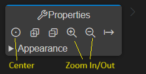
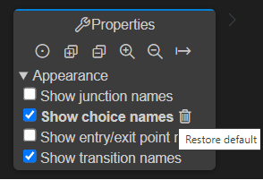
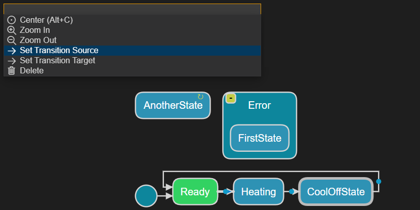
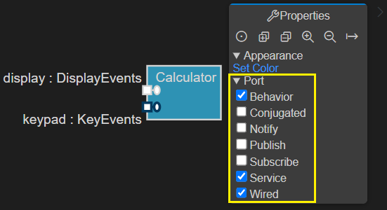
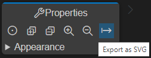

Art is a textual language but there is also a graphical notation for many parts of the language. You can therefore visualize (and in many cases also edit) some of the Art elements using graphical diagrams. The following diagrams can be used:

* **State Diagram** Shows the state machine of a capsule or class. A single diagram can show all states, pseudo states and transitions also for hierarchical state machines.
* **Structure Diagram** Shows the composite structure of a capsule. A single diagram can show all parts, ports and connectors also for hierarchical composite structures.
* **Class Diagram** Shows how capsules, classes and protocols are related by means of inheritance and composition relationships. Also shows ports and parts of capsules and events of protocols.

The picture below shows an example of what these diagrams may look like:

## Opening Diagrams
To open a diagram from an Art file place the cursor inside an Art element. Bring up the context menu and invoke a command for opening a diagram for the Art element: **Open State Diagram**, **Open Structure Diagram** or **Open Class Diagram**. Note that all these three commands are always available, but if the selected Art element cannot be shown in the selected kind of diagram, you will get an error and no diagram will open.

If the cursor is placed on an Art element that has a graphic representation in the form of a symbol or line in the diagram, for example a state in a state diagram, the symbol or line will be highlighted in the opened diagram by selecting it. You can use this feature as a way to navigate from an element in an Art file to the corresponding symbol or line in a diagram. If the diagram is already open, it will be made visible and the selection will be updated.

You can also open diagrams from the context menu of an Art file in the Explorer view. In this case the Art file will be searched for an element that can be shown in the selected kind of diagram. If more than one such Art element is found, you will be prompted to pick the one to show in the diagram. For example:

The same prompting happens if you open a diagram from an Art file when the cursor position doesn't indicate which Art element to open the diagram for. All valid Art elements in the file will be listed and you can choose which one to open the diagram for.

You can open multiple diagrams of the same kind in one go by selecting multiple Art files in the Explorer view, and then invoke a command for opening diagrams from the context menu. However, in this case only diagrams for the first element found in each file will be opened (i.e. in this case you will not be prompted in case a file contains multiple elements for which the selected kind of diagram could be opened).

### Related Diagrams
If you already have a diagram open, you can open another diagram that is related to that diagram. And if a symbol or line is selected on the diagram, diagrams related to the selected symbol or line can be opened. Press ++ctrl+space++ to open the diagram's pop-up menu. If the diagram, or the selected symbol or line, has any related diagrams you may see the following commands:

- **Open State Diagram** 
    - From a structure diagram that shows a capsule's composite structure, the state diagram of the capsule will be opened. If a part symbol is selected, the state diagram of the capsule that types the part will be opened.
    - From a class diagram that shows relationships for a class or capsule, the state diagram of the class or capsule will be opened. If another class or capsule is selected on the diagram, the state diagram of that selected class or capsule will be opened.
- **Open Structure Diagram**
    - From a structure diagram where a part symbol is selected, the structure diagram of the capsule that types the part will be opened.
    - From a state diagram of a capsule, the structure diagram of the capsule will be opened.
    - From a class diagram that shows relationships for a capsule, the structure diagram of the capsule will be opened. If another capsule is selected on the diagram, the structure diagram of that selected capsule will be opened.
- **Open Class Diagram**
    - From a structure diagram that shows a capsule's composite structure, the class diagram of the capsule will be opened. If a part symbol is selected, the class diagram of the capsule that types the part will be opened.
    - From a state diagram of a class or capsule, the class diagram of the class or capsule will be opened.
    - From a class diagram where a class, capsule or protocol is selected, the class diagram of that selected class, capsule or protocol will be opened.

For a capsule that inherits from another capsule you can open the state diagram of the inherited base capsule by means of the command **Open Inherited State Diagram**. If this command is performed on an element that is inherited, redefined or excluded in the state diagram, then the corresponding element in the base capsule will be highlighted. This command is therefore useful for navigating in an inherited state machine.

## Automatic vs Manual Layout
By default diagrams are rendered using automatic layout. This means that all symbols are automatically positioned, with default sizes, and lines between symbols are routed in a direct way without bendpoints (in most cases). The main benefit with automatic layout is that you don't need to spend time manually creating and maintaining the layout, something that can be rather time consuming, especially for big diagrams. However, automatic layout also has its drawbacks and limitations:

* A good layout of a diagram can help to understand it better. For example, you may want to group elements that are logically related close to each other.
* Small changes in an Art file can lead to rather big graphical changes when automatic layout is used. For example, adding a transition between two states can cause the states themselves to move to a different position to achieve a compact overall diagram layout. While editing an Art file this can give a "jumpy" feeling to diagrams where symbols move around a lot while typing.
* Auto-layouted diagrams may sometimes not be as aesthetically nice as ones that you layout manually.

If you want to use manual layout for a diagram, click in the diagram background, expand the **Layout** section in the Properties view, and mark the **Manual** checkbox. 

!!! note 
    Manual layout is currently an experimental feature. You are welcome to try it out but the feature is still under development and may not fully work in all situations.

Once you have turned on manual layout for a diagram you can start to move symbols around as you like. When you save the diagram the layout information is stored in a JSON file under a `layouts` subfolder in the workspace folder. There will be one such file for each diagram that uses manual layout.

If you want to go back from manual to automatic layout, just uncheck the **Manual** checkbox. You will be prompted for confirmation, and if you proceed the JSON file with the layout information for the diagram will be deleted. This operation is not undoable!

Alternatively you can delete the JSON file from the Explorer view. In this case, the operation is undoable.

## Navigating from Diagram to Art File
If you double-click a symbol or a line in a diagram, the Art element that corresponds to that symbol or line will be highlighted in the Art file. Note that you need to double-click on the symbol or line itself, and not on a text label shown in the symbol or on the line. However, as an alternative you can instead hold down the ++ctrl++ key and then click on the text label. It will then become a hyperlink that navigates to the Art element that corresponds to that text label. You need to use this approach in case a symbol has multiple text labels each of which represent different Art elements. For example:

In state diagrams you can also double-click on icons that are shown for transitions that contain effect and/or guard code. The presence of effect code is indicated by a blue icon, and guard code with a yellow icon.

Double-clicking these icons will highlight the code snippets in the Art file.

## Working with Diagrams

### Zooming and Panning
When a diagram is opened it is initially centered and with medium zoom level which makes all text labels big enough for reading. However, if the diagram is big then all contents may not be visible unless you zoom out. You can zoom the diagram using either the mouse scroll wheel or by means of the two-finger zoom gesture on a touch pad. You can also zoom using the buttons in the Properties view toolbar. There you will also find a **Center** button which will restore the diagram to its original zoom level.

Alternatively you can use the command **Fit to Screen** which will set the zoom level so that the entire diagram fits the size of the diagram editor. Note that this command must be invoked from the general Command Palette or by means of the keyboard shortcut ++ctrl+shift+"F"++.

It's also possible to work with a big diagram without zooming, but instead panning the viewport so that a different part of the diagram becomes visible. To pan the viewport click anywhere on the diagram and drag while holding down the mouse button. Note that there are no limits to panning which means you can move the viewport as far away from the center of the diagram as you like. Use the **Center** or **Fit to Screen** command for panning back the viewport to its original position. Note that if a symbol or line is selected, the **Center** command will move the viewport so that the selected symbol or line appears in the middle.

### Collapsing and Expanding Symbols
State and structure diagrams can be hierarchical. A state diagram is hierarchical if it contains a composite state with a nested state machine. A structure diagram is hierarchical if it contains a part typed by another capsule with nested parts or ports. By default symbols that contain nested symbols are collapsed to minimize the size of the diagram:

To expand a collapsed symbol click the yellow button. The symbol will then be resized to show the nested symbols. Click the button again to collapse the symbol and hide the nested symbols. You can use the **Expand All** and **Collapse All** buttons in the Properties view toolbar to expand or collapse all symbols so that the full hierarchical diagram becomes visible or hidden.

Information about which symbols that are currently expanded will be remembered if you save the diagram. This information is stored in the file `.vscode/art_diagram_settings.json`.

### Invoking Diagram Commands from Keyboard
Many diagram commands mentioned above can be invoked using the keyboard. Press ++ctrl+space++ in a diagram to open a pop-up menu from where you can invoke a diagram command.

In this pop-up menu you also find convenient commands for [navigating to related diagrams](#related-diagrams). For example, from the state diagram of a capsule you can navigate to the structure and class diagrams of that same capsule.

### Diagram Appearance
Certain properties on Art elements control how they will appear in a diagram. Currently it's possible to configure which color to use for most elements in diagrams. See the [color](../art-lang/index.md#color) property for more information.

### Diagram Filters
To avoid cluttered diagrams with too many text labels, certain information is by default hidden. If you click in the background of the diagram, the Properties view will show various filters that you can turn on or off for showing or hiding such additional information. Here is an example of the filters available for a state diagram:

Information about applied filters will be remembered if you save the diagram. This information is stored in the file `.vscode/art_diagram_settings.json`.

Diagram filter properties that have been modified are shown in boldface, and a "Restore default" button appears for them. You can click this button to restore the filter property to its default value.

You can also set diagram filters globally using [diagram settings](../settings.md#diagram). Such filters will apply to all diagrams unless a more specific filter has been set on an individual diagram. You can find these settings by filtering on `code-rt.diagram` in the Settings editor:

Note that some diagram filters can only be set globally, and not for individual diagrams.

### Elements in the Properties View
The Properties view can show additional Art elements when you select a symbol or a line. For example, it shows internal transitions of a state.

Showing such elements in the diagram itself would risk making it cluttered, especially when there is a large number of elements.

You can double-click the Art elements in the Properties view to highlight them in the Art file. For internal transitions the same blue and yellow dots are shown as for regular transitions in diagrams. Double-click the blue dot to navigate to the transition effect code and the yellow dot for navigating to the transition guard code.

### Renaming Elements
You can rename an Art element shown in a diagram by double-clicking on the text label that shows its name. Alternatively select the symbol or line to which the text label belongs and press ++"F2"++.

Note that this is a "rename refactoring" and all references to the renamed element will be updated too. 

### Creating and Editing Elements
!!! note
    Creating and editing elements is supported in state and structure diagrams but not in class diagrams.

To create a new element in a diagram use one of the **New ...** commands in the pop-up menu that appears when you press ++ctrl+space++. These commands are the same as appear when you use Content Assist in the Art text editor. Which commands that are available depends on what is currently selected in the diagram. If an element is selected in the diagram, a new element will be created inside that element. Otherwise the new element will be created as a top-level element (possible in state diagrams but not in structure diagrams).

To edit an existing element, select it in the diagram and use the Properties view for editing it. There are certain properties that are common for many elements, such as the [color](../art-lang/index.md#color) property, but most properties are specific for the element that is selected.

Elements are created and edited by updating the Art file, which in turn will update the diagram. Just like when you use Content Assist in the Art text editor a created element will initially get default values for its properties, for example the name. The default value becomes selected so you can directly type to replace it with something else. 

You can of course undo a change by pressing ++ctrl+"z"++ (**Undo**) in the Art text editor.

#### State Diagram Editing
In a state diagram where nothing is selected, the **New ...** commands will create new top-level elements directly in the state machine.

If a state is selected you can create the following elements inside it (turning the state into a composite state, if it was not already composite).

To create a transition in a state diagram you first need to select the source state (or pseudo-state) and then the target state (or pseudo-state). Then press ++ctrl+space++ and perform either **New Triggered Transition** or **New Non-Triggered Transition** (depending on if the transition needs any triggers or not).

You can redirect a transition, i.e. to change either its source (state or pseudo-state) or its target (state or pseudo-state). You can do it from a state diagram by selecting both the transition and the new source or target. Then press ++ctrl+space++ and perform either **Set Transition Source** or **Set Transition Target**. This will redirect the transition by changing its source or target. If you want to change both the source and target just repeat the procedure once more.

For example, in the diagram below we have selected the transition between states Ready and Heating and also the CoolOffState. We then select **Set Transition Source** in the menu. This will redirect the transition to instead go from state CoolOffState to state Heating.

#### Structure Diagram Editing
In a structure diagram it's not possible to create anything unless something is selected in the diagram. This is because a structure diagram always has a single capsule as its top-level element. If the capsule is selected you can create parts and ports in it.

If a part is selected you can create a port in the capsule that types the part. In the example below a port will be created in capsule BB.

Both parts and ports have several properties that can be edited using the Properties view.

### Deleting Elements
!!! note
    Deleting elements is supported in state and structure diagrams but not in class diagrams.

You can delete an Art element shown in a diagram by selecting the symbol or line that represents the element and then press the ++"Delete"++ key. Alternatively use the command **Delete** in the ++ctrl+space++ pop-up menu. Multiple symbols or lines can be selected in order to delete many Art elements in one go. 

Note that elements are deleted by removing them from the Art file, which in turn will update the diagram. All content within the deleted element will be lost, including any comments. However, you can of course undo the deletion by pressing ++ctrl+"z"++ (**Undo**) in the Art text editor.

## Exporting Diagrams as SVG
Diagrams can be exported as SVG files. This makes it possible to include diagrams in documents such as reports and presentations. SVG (Scalable Vector Graphics) is a scalable vector format which lets exported diagrams be zoomed and resized without losing image quality. Exporting a diagram as SVG is therefore much better than taking a screenshot of it.

To export a diagram as SVG follow these steps:

1. Open the diagram
2. Set-up the diagram to display the information you want to include in the exported SVG file. For example, apply [diagram filters](#diagram-filters) and [collapse or expand symbols](#collapsing-and-expanding-symbols).
3. Click the "Export as SVG" button in the Properties view toolbar. You will be prompted for where to save the SVG file.

Alternatively, the command `Code RT: Export as SVG` (available in the Command Palette) can be used. It will export the diagram that is open in the currently active editor.

You can export all diagrams for an Art element, or even all diagrams for all Art elements defined in a certain Art file, by means of another command `Code RT: Export Diagrams as SVG`. For the latter scenario you can also do it by means of a context menu command that is available for Art files in the Explorer view:

When you export multiple diagrams the SVG files will be saved in a sub folder `DiagramsAsSVG` within the workspace folder.