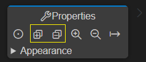

Art is a textual language but there is also a graphical notation for many parts of the language. You can therefore visualize (and to some extent also edit) some of the Art elements using graphical diagrams. The following diagrams can be used:

* **State Diagram** Shows the state machine of a capsule or class. A single diagram can show all states, pseudo states and transitions also for hierarchical state machines.
* **Structure Diagram** Shows the composite structure of a capsule. A single diagram can show all parts, ports and connectors also for hierarchical composite structures.
* **Class Diagram** Shows how capsules, classes and protocols are related by means of inheritance relationships. Also shows ports and parts of capsules and events of protocols.

The picture below shows an example of what these diagrams may look like:

## Opening Diagrams
To open a diagram from an Art file place the cursor inside an Art element. Bring up the context menu and invoke a command for opening a diagram for the Art element: **Open State Diagram**, **Open Structure Diagram** or **Open Class Diagram**. Note that all these three commands are always available, but if the selected Art element cannot be shown in the selected kind of diagram, you will get an error and no diagram will open.

If the cursor is placed on an Art element that has a graphic representation in the form of a symbol or line in the diagram, for example a state in a state diagram, the symbol or line will be highlighted in the opened diagram by selecting it. You can use this feature as a way to navigate from an element in an Art file to the corresponding symbol or line in a diagram. If the diagram is already open, it will be made visible and the selection will be updated.

You can also open diagrams from the context menu of an Art file in the Explorer view. In this case the Art file will be searched for an element that can be shown in the selected kind of diagram. If more than one such Art element is found, you will be prompted to pick the one to show in the diagram. For example:

The same prompting happens if you open a diagram from an Art file when the cursor position doesn't indicate which Art element to open the diagram for. All valid Art elements in the file will be listed and you can choose which one to open the diagram for.

## Navigating from Diagram to Art File
If you double-click a symbol or a line in a diagram, the Art element that corresponds to that symbol or line will be highlighted in the Art file. Note that you need to double-click on the symbol or line itself, and not on a text label shown in the symbol or on the line. However, as an alternative you can instead hold down the ++ctrl++ key and then click on the text label. It will then become a hyperlink that navigates to the Art element that corresponds to that text label. You need to use this approach in case a symbol has multiple text labels each of which represent different Art elements. For example:

In state diagrams you can also double-click on icons that are shown for transitions that contain effect and/or guard code. The presence of effect code is indicated by a blue icon, and guard code with a yellow icon.

Double-clicking these icons will highlight the code snippets in the Art file.

## Working with Diagrams

### Zooming and Panning
When a diagram is opened it is initially centered and with medium zoom level which makes all text labels big enough for reading. However, if the diagram is big then all contents may not be visible unless you zoom out. You can zoom the diagram using either the mouse scroll wheel or by means of the two-finger zoom gesture on a touch pad. To get back to the original zoom level you can click the **Center** button in the Properties view.

Alternatively you can use the command **Fit to Screen** which will set the zoom level so that the entire diagram fits the size of the diagram editor. Note that this command must be invoked from the general Command Palette or by means of the keyboard shortcut ++ctrl+shift+"F"++.

It's also possible to work with a big diagram without zooming, but instead panning the viewport so that a different part of the diagram becomes visible. To pan the viewport click anywhere on the diagram and drag it in the direction you want to make visible. Note that there are no limits to panning which means you can move the viewport as far away from the center of the diagram as you like. Use the **Center** or **Fit to Screen** command for panning back the viewport to its original position. Note that if a symbol or line is selected, the **Center** command will move the viewport so that the selected symbol or line appears in the middle.

### Collapsing and Expanding Symbols
State and structure diagrams can be hierarchical. A state diagram is hierarchical if it contains a composite state with a nested state machine. A structure diagram is hierarchical if it contains a part typed by another capsule with nested parts. By default symbols that contain nested symbols are collapsed to minimize the size of the diagram:

To expand a collapsed symbol click the yellow button. The symbol will then be resized to show the nested symbols. Click the button again to collapse the symbol and hide the nested symbols. You can use the **Expand All** and **Collapse All** buttons in the Properties view to expand or collapse all symbols so that the full hierarchical diagram becomes visible.

Information about which symbols that are currently expanded will be remembered if you save the diagram. This information is stored in the file `.vscode/art_diagram_settings.json`.

### Diagram Appearance
Certain properties on Art elements control how they will appear in a diagram. Currently it's possible to configure which color to use for certain transitions. Set the [color](../art-lang.md#color) property for more information.

### Diagram Filters
To avoid cluttered diagrams with too many text labels, certain information is by default hidden. If you click in the background of the diagram, the Properties view will show various filters that you can turn on or off for showing or hiding such additional information. Here is an example of the filters available for a state diagram:

Information about applied filters will be remembered if you save the diagram. This information is stored in the file `.vscode/art_diagram_settings.json`.

You can also set diagram filters globally using configuration settings. Such filters will apply to all diagrams unless a more specific filter has been set on an individual diagram. You can find these configuration settings by filtering on `rtistic.diagram` in the Settings:

### Elements in the Properties View
The Properties view can show additional Art elements when you select a symbol or a line. For example, it shows internal transitions of a state.

Showing such elements in the diagram itself would risk making it cluttered, especially when there is a large number of elements.

You can double-click the Art elements in the Properties view to highlight them in the Art file. For internal transitions the same blue and yellow dots are shown as for regular transitions in diagrams. Double-click the blue dot to navigate to the transition effect code and the yellow dot for navigating to the transition guard code.

### Renaming Elements
You can rename an Art element shown in a diagram by double-clicking on the text label that shows its name. Alternatively select the symbol or line to which the text label belongs and press ++"F2"++.

Note that this is a "rename refactoring" and all references to the renamed element will be updated too. 