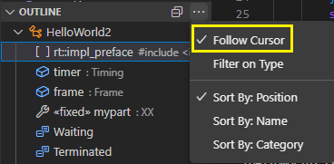

The Outline view shows information about the Art elements that are defined in an Art file. You can see the most important information for each element, such as its name and other important properties. You can also see the containment hierarchy, i.e. which elements that contain other elements. Below is an example of what it can look like:

You can use the Outline view for getting an overview of what elements an Art file contains, and for [searching](#searching) and [navigating](#navigating) to elements.

## Navigating
To navigate to an element in the Art file, double-click on the element in the Outline view. The cursor will be placed just before the element's name in the Art file (or where the name would be in case it has no name).

You can also single-click on elements to just make the clicked element visible in the Art editor, without changing the cursor position. In this case the element is marked with a thin rectangle:

If you hold down the ++ctrl++ key when clicking, a new Art editor showing the same Art file will open to the side, in a new editor area to the right. The element will then be made visible and marked in that new editor. This can be useful if you don't want to change the original Art editor, for example when comparing two elements located in the same Art file.

It's also possible to navigate in the other direction, i.e. from the Art editor to the Outline view. To do this, set the Outline view to follow the cursor:

Now the Outline view will automatically highlight the element that corresponds to the cursor position in the Art editor.

## Searching
You can use the Outline view when searching for one or many Art elements, as an alternative to searching textually in the Art editor. Start by selecting the element shown first in the Outline view, and then type quickly the first few characters of the element name. After every keystroke the selection will move downwards to an element with a name that matches the typed characters. If you make a brief pause, you can then start to type again to proceed searching further down in the Outline view.

Another way to search is to press ++ctrl+"f"++ when the Outline view has focus. A small popup will then appear where you can type a few characters. Nodes in the Outline view with a label that matches the typed characters will be highlighted. The matching allows additional characters between the typed characters which is why the typed string "init" also matches the transition `Waiting -> Terminated`:

When the search has matched a few elements that look interesting you can press the **Filter** button next to the text field to filter the Outline view so it only shows the matching elements. This can avoid lots of scrolling if the matching elements are far apart.