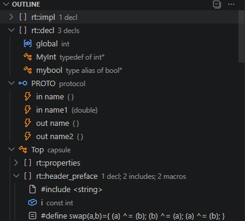
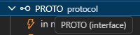
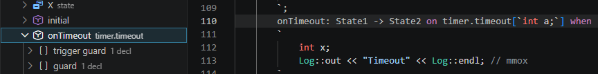
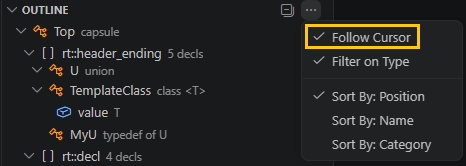
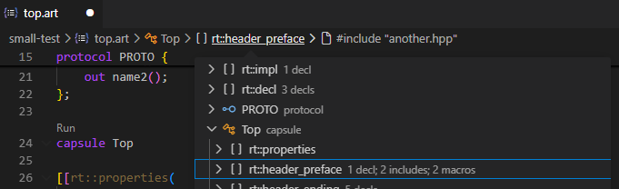
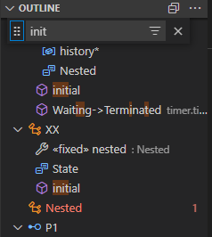
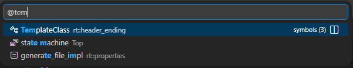

The Outline view shows information about the Art elements that are defined in an Art file. You can see the most important information for each element, such as its name. You can also see the containment hierarchy, i.e. which elements that contain other elements. Furthermore, the Outline view shows C++ elements of code snippets, below each Art element to which the code snippet belongs. Below is an example of what it can look like:

You can use the Outline view for getting an overview of what Art and C++ elements an Art file contains, and for [searching](#searching) and [navigating](#navigating) to elements within the file.

More information about the Outline view, including its many settings, can be found [here](https://code.visualstudio.com/docs/getstarted/userinterface#_outline-view).

!!! note 
    Every node in the Outline view has a so called [symbol kind](https://microsoft.github.io/language-server-protocol/specifications/lsp/3.17/specification/#symbolKind) which decides its icon and tooltip. The mapping of Art and C++ language concepts to these symbols kinds is in most cases straightforward, but sometimes not so obvious. For example, an Art protocol has the symbol kind "interface" and a C++ include statement has the symbol kind "file". Use the tooltip of a node to see its symbol kind. In the Settings you can filter the contents of the Outline view based on symbol kind. This can be useful if you think the Outline view shows too many details. For example, to hide C++ include statements from the Outline view turn off the setting `outline.showFiles`.
    
    

## Navigating
To navigate to an Art or C++ element, click the element in the Outline view. 

* If you double-click the element will be selected in the Art file. Depending on the kind of element either its name, or another property of the element, or the entire element will be selected.
* If you single-click the element will become visible, without changing the cursor position. In this case the element is marked with a thin rectangle:

If you hold down the ++ctrl++ key when clicking, a new Art editor showing the same Art file will open to the side, in a new editor area to the right. The element will then be made visible and marked or selected in that new editor. This can be useful if you don't want to change the original Art editor, for example when comparing two elements located in the same Art file.

It's also possible to navigate in the other direction, i.e. from the Art editor to the Outline view. To do this, set the Outline view to follow the cursor:

Now the Outline view will automatically highlight the element that corresponds to the cursor position in the Art editor.

The Outline view's path to the currently focused element in the Art file is also shown in the [breadcrumbs](https://code.visualstudio.com/docs/editing/editingevolved#_breadcrumbs), at the top of the Art text editor. Any name in that path can be clicked to view a subset of the tree from the Outline view:

## Searching
You can use the Outline view when searching for one or many Art elements, as an alternative to searching textually in the Art editor. Start by selecting the element shown first in the Outline view, and then type quickly the first few characters of the element name. After every keystroke the selection will move downwards to an element with a name that matches the typed characters. If you make a brief pause, you can then start to type again to proceed searching further down in the Outline view.

Another way to search is to press ++ctrl++ ++alt+"f"++ (or ++f3++) when the Outline view has focus. A small popup will then appear where you can type a few characters. Nodes in the Outline view with a label that matches the typed characters will be highlighted. The matching allows additional characters between the typed characters which is why the typed string "init" also matches the transition `Waiting -> Terminated`:

When the search has matched a few elements that look interesting you can press the **Filter** button next to the text field to filter the Outline view so it only shows the matching elements. This can avoid lots of scrolling if the matching elements are far apart.

Sometimes a good alternative to searching with the Outline view is the command **Go to Symbol in Editor** (default keybinding ++ctrl++ ++shift+"O"++). It shows the same elements as the Outline view but as a flat list that can be filtered to find the element you are looking for.

