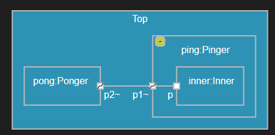

## Overview of Validation
When validation runs

Related elements

Using the Problems view

Quick fix

## Configuring Validation
Validation can be configured to change which rules that should run, and what severity they should report found problems with. By default every [validation rule](#validation-rules) is enabled and uses a predefined severity level. Validation rules can be configured either globally by means of a setting, or locally by means of a property [rule_config](../art-lang#rule_config). In both cases the rule configuration consists of a comma-separated list of 5 letter strings where the first letter specifies if the rule is disabled and it's severity (X,I,W,E) and remaining letters specify the rule id. For example, the rule configuration `X0003,I0004,W0009,E0005` means the following:

* The rule [ART_0003_nameShouldStartWithUpperCase](#art_0003_nameshouldstartwithuppercase) is disabled
* The rule [ART_0004_nameShouldStartWithLowerCase](#art_0004_nameshouldstartwithlowercase) has its severity set to Information
* The rule [ART_0009_invalidProperty](#art_0009_invalidproperty) has its severity set to Warning
* The rule [ART_0005_choiceWithoutElseTransition](#art_0005_choicewithoutelsetransition) has its severity set to Error

To configure validation rules globally, use the setting **Validation: Rule Configuration**. A global configuration will apply for all Art files in the workspace, and all Art elements within those files, unless a local rule configuration has been set on an element.

To configure validation rules locally, set the property [rule_config](../art-lang#rule_config) on an Art element. It will affect the validation of that Art element itself, as well as all elements contained within that Art element. Here is an example of how to disable the validation rule [ART_0003_nameShouldStartWithUpperCase](#art_0003_nameshouldstartwithuppercase) on a capsule. Note that it also will disable this rule for elements contained within the capsule, such as states.

``` art
capsule customCapsule // no warning even if capsule name is not capitalized
[[rt::properties(
    rule_config="X0003"
)]]{

    statemachine {
        state customState; // no warning here too
        initial -> customState;
    };
};
```

## Validation Rules
This chapter lists all validation rules which {{product.name}} checks your Art application against. All these checks run automatically as soon as you have made a change to an Art file (even before saving it). This ensures that errors and potential problems are found as early as possible.

### ART_0001_invalidNameCpp
| Severity | Reason | Quick Fix
|----------|:-------------|:-------------
| Error | An Art element has a name that is not a valid C++ name. | N/A

Art elements are translated to C++ elements without changing the elements' names. Hence you need to choose names for Art elements that are valid in C++. For example, [C++ keywords](../art-lang#names-and-keywords) cannot be used. If you ignore this error you can expect errors when compiling the generated C++ code.

``` art
protocol InvalidNameProtocol {
    in virtual(); // ART_0001 ("virtual" is a C++ keyword)
};
```

### ART_0002_duplicateNamesInScope
| Severity | Reason | Quick Fix
|----------|:-------------|:-------------
| Error | Two or more Art elements in the same scope have the same names or signatures.  | N/A

Names of Art elements must be unique within the same scope. The following is checked:

* Top-level elements within an Art file. Note that even top-level elements in different Art files should have unique names since the corresponding C++ elements all will be within the global namespace, but this is currently not checked (but will be detected by the C++ linker).
* Events of a protocol. Note that in-events and out-events are checked separately, since an in-event and an out-event will have the same name when you define a symmetric event (see [Protocol and Event](../art-lang#protocol-and-event)).
* [Parts](../art-lang#part) of a capsule.
* [Ports](../art-lang#port) of a capsule.
* [States](../art-lang#state) and pseudo states (collectively referred to as "vertices") of a state machine.
* [Transitions](../art-lang#transition) of a state machine.
* Trigger operations of a [class](../art-lang#class-with-state-machine). Note that several trigger operations may have the same name as long as their signatures are unique.

All elements with clashing names or signatures will be reported as related elements. Use this to find the element(s) that need to be renamed.

``` art
protocol DupProto {
    in inEvent1(); // ART_0002
    in inEvent1(); // ART_0002
    out inEvent1(); // OK (symmetric event)
};

class DNIS {
    trigger op1(`int` p);
    trigger op1(); // OK (signatures are unique)
    statemachine {
        state State;
        initial -> State;
    };
};
```

### ART_0003_nameShouldStartWithUpperCase
| Severity | Reason | Quick Fix
|----------|:-------------|:-------------
| Warning | An Art element's name doesn't follow the naming convention to start with uppercase.  | Capitalize Name

Just like in most languages Art has certain conventions on how elements should be named. The following elements should have names that start with an uppercase letter:

* [Capsule](../art-lang#capsule)
* [Class](../art-lang#class-with-state-machine)
* [Protocol](../art-lang#protocol-and-event)
* [State](../art-lang#state)

A Quick Fix is available that will fix the problem by capitalizing the name. Note, however, that it will only update the element's name, and not all references. If you have references to the element you may instead want to fix the problem by performing a Rename.

``` art
capsule myCapsule { // ART_0003
    statemachine {
        state sstate; // ART_0003
        initial -> sstate; 
    };
};
```

In this context an underscore (`_`) is considered a valid upper case character, so all names that start with underscore are accepted by this validation rule. 

### ART_0004_nameShouldStartWithLowerCase
| Severity | Reason | Quick Fix
|----------|:-------------|:-------------
| Warning | An Art element's name doesn't follow the naming convention to start with lowercase.  | Decapitalize Name

Just like in most languages Art has certain conventions on how elements should be named. The following elements should have names that start with a lowercase letter:

* [Event](../art-lang#protocol-and-event)
* [Port](../art-lang#port)
* [Part](../art-lang#part)
* [Trigger operation](../art-lang#class-with-state-machine)
* [Choice and junction points](../art-lang#choice-and-junction-points)
* [Entry and exit points](../art-lang#hierarchical-state-machine)
* [Transition](../art-lang#transition)

A Quick Fix is available that will fix the problem by decapitalizing the name. Note, however, that it will only update the element's name, and not all references. If you have references to the element you may instead want to fix the problem by performing a Rename.

``` art
protocol LowerCaseTestProtocol {
    out MyEvent(); // ART_0004
};
```

In this context an underscore (`_`) is considered a valid lower case character, so all names that start with underscore are accepted by this validation rule. 

### ART_0005_choiceWithoutElseTransition
| Severity | Reason | Quick Fix
|----------|:-------------|:-------------
| Warning | A choice lacks an outgoing else-transition. | N/A

If no outgoing transition of a choice is enabled at runtime (because no outgoing transition has a guard condition that is fulfilled) then the state machine will get stuck in the choice for ever. To avoid this you should ensure that at least one outgoing transition is enabled. A good way to do this is to use 'else' as the guard condition for one of the outgoing transitions. Such an else-transition will then execute if no other outgoing transition of the choice is enabled.

``` art
capsule ChoiceSample {
    statemachine {
        state State;
        initial -> State;
        choice x; // ART_0005
        State -> x;
        x -> State when `return getVal() == 5;`;
    };
};
```

Note that a transition without any guard condition is equivalent to a transition with a guard condition that is always fulfilled (i.e. a guard condition that returns true). An outgoing transition from a choice or junction without any guard is therefore also an else-transition.

### ART_0006_choiceWithoutOutgoingTransitions
| Severity | Reason | Quick Fix
|----------|:-------------|:-------------
| Error | A choice has no outgoing transitions. | N/A

A choice should typically have at least two outgoing transitions to be meaningful. Having only one outgoing transition is possible if it is an else-transition (i.e. a transition with an 'else' guard, or without any guard at all). However, a choice without any outgoing transition is not allowed since the state machine always will get stuck when reaching such a choice.

``` art
capsule ChoiceSample {
    statemachine {
        state State;
        initial -> State;
        choice x; // ART_0006
        State -> x;        
    };
};
```

### ART_0007_choiceWithTooManyElseTransitions
| Severity | Reason | Quick Fix
|----------|:-------------|:-------------
| Error | A choice has more than one outgoing else-transition. | N/A

It's good practise to have an outgoing else-transition (i.e. a transition with an 'else' guard, or without any guard at all) for a choice since it will prevent the state machine from getting stuck in the choice at runtime. However, there should not be more than one such else-transition defined, since otherwise it's ambiguous which one of them to trigger in the case none of the other outgoing transitions from the choice are enabled.

``` art
capsule ChoiceSample {
    statemachine {
        state State, State2;
        initial -> State;
        choice x; // ART_0007
        State -> x;
        x -> State;
        x -> State2 when `else`;
    };
};
```

### ART_0008_initialTransitionCount
| Severity | Reason | Quick Fix
|----------|:-------------|:-------------
| Error | A state machine has too many initial transitions, or no initial transition at all. | N/A

A state machine of a capsule or class must have exactly one initial transition. A common reason for this error is that you have introduced inheritance between two capsules which both have state machines with an initial transition. Because of that the derived capsule will have two initial transitions (the one it defines itself locally plus the one it inherits from the base capsule). In this case the error can be fixed by either deleting or excluding the initial transition from the derived capsule, or to let it redefine the initial transition from the base capsule. 

``` art
capsule InitTransCap2 {
    statemachine {
        state State;
        initial -> State;
    };
};

capsule InitTransCap3 : InitTransCap2 {
    statemachine {
        state State;
        initial -> State; // ART_0008
    };
};
```

Note that if the initial transition in the base capsule has no name, the derived capsule cannot exclude or redefine it. It's therefore good practise to name the initial transition if you expect your capsule to be inherited from.

### ART_0009_invalidProperty
| Severity | Reason | Quick Fix
|----------|:-------------|:-------------
| Error | A non-existing property is set for an element. | Remove Property

Most Art elements have [properties](../art-lang#art_properties) that can be set to change their default values. Different elements have different properties and if you get this error it means you have referenced a non-existing property for an Art element. 

A Quick Fix is available for removing the setting of the invalid property. Use Content Assist (++ctrl+space++) to get a list of valid properties for an Art element.

``` art
protocol IP_PROTO [[rt::properties(
    no_property = 4 // ART_0009 (A protocol has no property called "no_property")
)]] {
};
```

### ART_0010_invalidPropertyValue
| Severity | Reason | Quick Fix
|----------|:-------------|:-------------
| Error | A property is set to a value of incorrect type. | N/A

Most Art elements have [properties](../art-lang#art_properties) and every property has a type that is either boolean, integer, string or an enumeration. The type of the value assigned to a property must match the property's type. For example, you cannot assign an integer value to a boolean property. 

``` art
capsule IPV_Cap [[rt::properties(
    generate_file_header=4 // ART_0010 ("generate_file_header" is a boolean property)
)]]{
    statemachine {
        state State;
        initial -> State;
    };
};  
```

### ART_0011_propertySetToDefaultValue
| Severity | Reason | Quick Fix
|----------|:-------------|:-------------
| Warning | A property is set to its default value. | Remove Property

Most Art elements have [properties](../art-lang#art_properties) and every property has a default value. It's unnecessary to explicitly set a property to its default value. 

A Quick Fix is available for removing the setting of the property. 

``` art
class C_PropDefaultValue [[rt::properties(
    const_target_param_for_decode=false // ART_0011
)]] {
    statemachine {
        state State;
        initial -> State;
    };
};  
```

### ART_0012_invalidCodeSnippet
| Severity | Reason | Quick Fix
|----------|:-------------|:-------------
| Error | A code snippet is invalid in one way or the other. | Remove Code Snippet

A [code snippet](../art-lang#embedded-c-code)'s kind is specified after the prefix `rt::`. Different Art elements may have different kinds of code snippets. Also, some Art elements may have multiple code snippets of a certain kind, while others only may have one code snippet of each kind. 

A Quick Fix is available for removing the invalid code snippet. 

``` art
[[rt::header_preface]] // ART_0012 (code snippet for capsule/class placed at file level)
`
    // YourCodeHere
`

capsule Name {
    [[rt::unknown]] // ART_0012 (non-existing kind of code snippet)
    `
        // YourCodeHere
    `

    part x : OtherCap 
    [[rt::createFunction]]
    `
        return new DemoCap(rtg_rts, rtg_ref);
    `
    [[rt::createFunction]] // ART_0012 (duplicated code snippet)
    `
        return new DemoCap(rtg_rts, rtg_ref);
    `;

    statemachine {
        state State;
        initial -> State;
    };
};  
```


### ART_0013_partMultiplicityError
| Severity | Reason | Quick Fix
|----------|:-------------|:-------------
| Error | The part's lower multiplicity must be less than its upper multiplicity. | N/A

If a [part](../art-lang#part) has a multiplicity that specifies a range (i.e. both a lower and upper multiplicity), then the lower multiplicity must be less than the upper multiplicity.

``` art
capsule PME_Cap {
    part myPart : OtherCap [2..2]; // ART_0013
    
    statemachine {
        state State;
        initial -> State;
    };
};
```

### ART_0014_partKindMultiplicityInconsistency
| Severity | Reason | Quick Fix
|----------|:-------------|:-------------
| Warning | The part's kind is inconsistent with its multiplicity. | N/A

The multiplicity of a capsule [part](../art-lang#part) must match the part's kind. The following is checked:

* A fixed part must have a multiplicity greater than zero. This is because when the container capsule is incarnated at least one capsule instance must be incarnated into the fixed part.
* An optional part must have a lower multiplicity of zero. This means that when the container capsule is incarnated no capsule instances will be incarnated into the optional part. Hence, this is what makes the part optional.
* It's only possible to specify the part multiplicity using a C++ expression if the part is fixed.

In case any of these inconsistencies is detected, the faulty multiplicity will be ignored and a default multiplicity (see [Part](../art-lang#part)) will be used instead.

``` art
capsule PKMI_Cap { 
    fixed part myPart : OtherCap [0..2]; // ART_0014 (Fixed part should not have lower multiplicity 0)
    optional part myPart2 : OtherCap [1..5]; // ART_0014 (Optional part should not have lower multiplicity > 0)
    optional part myPart3 : OtherCap [`5`]; // ART_0014 (Only a fixed part may have its multiplicity specified with a code expression)
    
    statemachine {
        state State;
        initial -> State;
    };
};
```

### ART_0015_internalTransitionOutsideState
| Severity | Reason | Quick Fix
|----------|:-------------|:-------------
| Error | An internal transition is defined outside a state, in the top state machine. | N/A

An [internal transition](../art-lang#internal-transition) specifies events that can be handled while a state machine is in a certain state without leaving that state. Hence it's only possible to define an internal transition inside a state. It does not make sense to define an internal transition directly in the top state machine.

``` art
capsule IntTransOutsideState {
    service port timer : Timing;

    statemachine {
        state State {
            t1 : on timer.timeout ` `;           
        };
        initial -> State;
        terror : on timer.timeout ` `; // ART_0015
    };
};
```

### ART_0016_circularInheritance
| Severity | Reason | Quick Fix
|----------|:-------------|:-------------
| Error | A capsule, class or protocol inherits from itself directly or indirectly. | N/A

When you use inheritance for capsules, classes and protocols you need to ensure there are no inheritance cycles. Cyclic inheritance means that an element would inherit from itself, directly or indirectly, which is not allowed. 

!!! note 
    Both capsules and classes, but not protocols, may have C++ base classes specified by means of C++ code snippets. Such inheritance relationships are not checked by this validation rule, but by the C++ compiler.

The elements that form the inheritance cycle will be reported as related elements. Use this to decide how to break the inheritance cycle.

``` art
protocol PR1 : PR2 { // ART_0016
    
};

protocol PR2 : PR1 { // ART_0016
    
};

class C1 {    
    statemachine {
        state State;
        initial -> State;
    };
};

class C2 : C1 {
    statemachine {
        state State;
        initial -> State;
    };
};

class C3 : C2, C4 { // ART_0016
    statemachine {
        state State;
        initial -> State;
    };
};

class C4 : C3 { // ART_0016
    statemachine {
        state State;
        initial -> State;
    };
};
```

### ART_0017_circularComposition
| Severity | Reason | Quick Fix
|----------|:-------------|:-------------
| Error | A capsule contains itself through a cycle in the composition hierarchy. | N/A

[Parts](../art-lang#part) of a capsule must form a strict composition hierarchy. At run-time the root of this hierarchy is the top capsule instance, and all other capsule instances in the application must be directly or indirectly owned by that capsule instance. For a fixed part the creation of contained capsule instances happen automatically when the container capsule is incarnated. It's therefore possible to statically analyze the fixed parts and check for cycles in the composition hierarchy.

!!! note 
    Only the static type of fixed capsule parts are used when looking for composition cycles. If a part has a [capsule factory](../art-lang#part-with-capsule-factory) that specifies a create function using C++ code, then a different dynamic type may be specified for the created capsule instances for that part. This opens up for more possibilities of introducing cycles in the composition hierarchy that will not be detected by this validation rule.

The fixed parts that form the composition cycle will be reported as related elements. Use this to decide how to break the composition cycle.

``` art
capsule CComp2 {    
    fixed part p2 : CComp3; // ART_0017
    
    statemachine {
        state State;
        initial -> State;
    };
};

capsule CComp3     
    part p3 : CComp2; // ART_0017
    
    statemachine {
        state State;
        initial -> State;
    };
};
```

### ART_0018_circularTransitions
| Severity | Reason | Quick Fix
|----------|:-------------|:-------------
| Error | A state machine has a cycle in the transitions that execute when leaving a junction. | N/A

A [junction](../art-lang#choice-and-junction) can split an incoming transition flow into multiple outgoing transition flows based on evaluating guard conditions for the outgoing transitions. If care is not taken it's possible to introduce cycles in the outgoing transition flows. Such cycles could lead to infinite recursion when the state machine executes, depending on what guard conditions will be fulfilled at runtime. You should therefore ensure there are no such transition cycles.

The transitions that form the cycle will be reported as related elements. Use this to decide how to break the transition cycle.

``` art
capsule CT_cap {
    statemachine { // ART_0018
        state S1;
        initial -> S1;
        junction j1, j2;
        t1: S1 -> j1;
        t2: j1 -> j2;
        t3: j2 -> j1;
    };
};
```

### ART_0019_unwiredPortBothPublisherAndSubscriber
| Severity | Reason | Quick Fix
|----------|:-------------|:-------------
| Error | An unwired port is declared as being both a subscriber and publisher at the same time. | N/A

An [unwired port](../art-lang#unwired-port) can at runtime be connected to another unwired port. One of the connected ports will be a publisher port (a.k.a SPP port) while the other will be a subscriber port (a.k.a SAP port). An unwired port can either be statically declared as being a publisher or subscriber port, or it can be dynamically decided at port registration time if the port should be a publisher or subscriber. The same port can not be both a subscriber and a publisher port at the same time.

``` art
capsule UnwiredCapsule {  
    subscribe publish port p1 : UnwiredProtocol; // ART_0019

    statemachine {
        state State;
        initial -> State;
    };
};
```

### ART_0020_wiredPortWithUnwiredProperties
| Severity | Reason | Quick Fix
|----------|:-------------|:-------------
| Warning | A property that only is applicable for an unwired port is specified for a wired port. | N/A

An [unwired port](../art-lang#unwired-port) may have properties that control how it will be registered at runtime (see [registration](../art-lang#registration) and [registration_name](../art-lang#registration_name)). These properties have no meaning and will be ignored for wired ports. 

``` art
capsule UnwiredCapsule2 {
    port p1 [[rt::properties(
        registration_name="hi"
    )]]: UnwiredProtocol; // ART_0020
  
    statemachine {
        state State;
        initial -> State;
    };
};
```

### ART_0021_unwiredPortRegNameSameAsPortName
| Severity | Reason | Quick Fix
|----------|:-------------|:-------------
| Warning | An unwired port is set to use a registration name that equals the name of the port. | N/A

When an [unwired port](../art-lang#unwired-port) is registered a name is used that by default is the name of the port. The property [registration_name](../art-lang#registration_name) can be used for specifying another name. It's hence unnecessary to use that property for specifying the name of the port, since it is the default name that anyway would be used. 

``` art
capsule UnwiredCapsule3 {
    unwired behavior port p1~ [[rt::properties(
        registration_name = "p1"
    )]]
    : UnwiredProtocol; // ART_0021 

    statemachine {
        state State;
        initial -> State;
    };
};
```

### ART_0022_ruleConfigProblem
| Severity | Reason | Quick Fix
|----------|:-------------|:-------------
| Warning | The [rule_config](../art-lang#rule_config) property has a malformed value. | N/A

The [rule_config](../art-lang#rule_config) property can be set on Art elements to configure which validation rules to run for that element (and for all elements it contains). It can also be used for setting a custom severity for those rules. The value of the [rule_config](../art-lang#rule_config) property should be a comma-separated list of 5 letter strings where the first letter specifies if the rule is disabled and it's severity (X,I,W,E) and remaining letters specify the rule id. See [Configuring Validation](#configuring-validation) for more information and examples.

``` art
capsule RCP [[rt::properties(
    rule_config="X0000" // ART_0022 (a validation rule with id 0000 does not exist)
)]]{
    statemachine {
        state State;
        initial -> State;
    };
};
```

### ART_0023_entryExitCodeCount
| Severity | Reason | Quick Fix
|----------|:-------------|:-------------
| Error | A state has too many entry and/or exit actions. | N/A

A state can at most have one entry and one exit action. Solve this problem by merging all entry and exit actions of the state to a single entry and exit action that performs everything that should be done when the state is entered and exited.

``` art
capsule CX {
    statemachine {
        state Composite {
            entry // ART_0023
            `
                entry1();
            `;
            entry // ART_0023
            `
                entry2();
            `;
        };
        initial -> Composite;
    };
};
```

### ART_0024_unwiredPortNotBehavior
| Severity | Reason | Quick Fix
|----------|:-------------|:-------------
| Error | An unwired port is not defined as a behavior port. | Make Behavior Port, Make Wired Port

An [unwired port](../art-lang#unwired-port) cannot be connected to another port by means of a [connector](../art-lang#connector). Hence, it's required that an unwired port is defined to be a behavior port. Otherwise it would not be possible for the owner capsule to send and receive events on an unwired port.

Two Quick Fixes are available for fixing this problem. Either the port can be turned into a behavior port, or it can be turned into a wired port.

``` art
capsule Pinger {
    service unwired port p1 : PROTO; // ART_0024

    statemachine {
        state State1;
        initial -> State1;
    };
};
```

### ART_0025_portOnPartConnectionError
| Severity | Reason | Quick Fix
|----------|:-------------|:-------------
| Error | A wired port is not properly connected, or an unwired port is connected. | N/A

An [unwired port](../art-lang#unwired-port) must not be connected to another port by means of a [connector](../art-lang#connector). Instead you should register such a port dynamically so that it can be connected at runtime with another matching port.

A wired port, however, must be connected. If the port is not a behavior port, it must be connected both on the "inside" and on the "outside" by two connectors. That is because the purpose of such a relay port is to simply relay communication from one port to another. By "inside" we mean the composite structure of the capsule that owns the port, and by "outside" we mean the composite structure to which the part that is typed by the capsule belongs. If the port is a behavior port, it should only be connected on the "outside".

``` art
capsule Top {    
    part ping : Pinger, // ART_0025 (not connected in capsule Top)
    pong : Ponger; // ART_0025 (not connected in capsule Top)
    
    statemachine {
        state t21;
        initial -> t21;
    };
};

capsule Inner {
    service behavior port p : PROTO;

    statemachine {
        state State;
        initial -> State;
    };
};

capsule Pinger {
    service port p1 : PROTO;      
    part inner : Inner;
    connect p1 with inner.p;    
    
    statemachine {
        state State1;
        initial -> State1;
    };
};

capsule Ponger {
    service behavior port p2~ : PROTO;    
    
    statemachine {
        state State1;                    
        initial -> State1;
    };
};
```


In the above picture we can more easily understand the two errors reported for the `Top` capsule's two parts `ping` and `pong`. Port `Ponger::p2` is a behavior port so one connection is expected for that port (but none is present), while port `Pinger::p1` is a non-behavior port so two connections are expected for that port (but only one is present, on its "inside"). Both problems can be solved by adding a connector in `Top` which connects these ports on their "outside".

### ART_0026_illegalConnection
| Severity | Reason | Quick Fix
|----------|:-------------|:-------------
| Error | A connector connects two ports with incompatible conjugations. | N/A

Ports connected by a [connector](../art-lang#connector) must have compatible conjugations. If the ports are at the same level in the capsule's structure (e.g. both ports belong to capsules typing capsule parts owned by the same capsule), then the connected ports must have the opposite conjugation. This is because events that are sent out from one of the ports must be able to be received by the other port. However, if the ports are at different levels in the capsule's structure (e.g. one of them belongs to a capsule typing a capsule part owned by the capsule and the other belongs to the capsule itself), then the ports must have the same conjugation. This is because in this case events are simply delegated from one capsule to another.

``` art
capsule Top {    
    part ping : Pinger, pong : Ponger; 
    connect ping.p1 with pong.p2; // ART_0026 (same port conjugations but should be different)
    
    statemachine {
        state t21;
        initial -> t21;
    };
};

capsule Inner {
    service behavior port p : PROTO;

    statemachine {
        state State;
        initial -> State;
    };
};
capsule Pinger {    
    service port p1~ : PROTO;  
    part inner : Inner;
    connect p1 with inner.p; // ART_0026 (different port conjugations but should be same)

    statemachine {
        state State1;
        initial -> State1;
    };
};

capsule Ponger {
    service behavior port p2~ : PROTO;    

    statemachine {
        state State1;                    
        initial -> State1;
    };
};
```



Here we see that both connectors are invalid. Port `p2` and port `p1` are at the same level in `Top`'s structure so their conjugations should be different, while port `p1` and port `p` are at different levels in `Top`'s structure so their conjugations should be the same.

### ART_0027_incompatibleProtocolsForConnectedPorts
| Severity | Reason | Quick Fix
|----------|:-------------|:-------------
| Error | A connector connects two ports with incompatible protocols. | N/A

Ports connected by a [connector](../art-lang#connector) must have compatible protocols. For {{product.name}} this means that the protocols must be the same.

!!! note 
    {{rtist.name}} uses a different criteria for protocol compatibility. There two protocols are compatible if all events that can be sent by a port typed by the source protocol can be received by the other port typed by the target protocol. Also in {{rtist.name}} the most common case is that the source and target protocols are the same, but they can also be different as long as all their events (both in-events and out-events) match both by name and parameter data type. This is a legacy behavior which is not recommended, and hence not supported by {{product.name}}.

``` art
protocol PROTO1 {    
    in pong();    
    out ping();
};

protocol PROTO2 {
    in pong();
    out ping();
};

protocol PROTO3 {    
    in pong();    
    out ping3();
};

capsule Top {
    service port p1 : PROTO1;    
    service port p2~ : PROTO2;
    service port p3~ : PROTO3;
    
    connect p1 with p2; // ART_0027 (but OK in {{rtist.name}})
    connect p1 with p3; // ART_0027 (also not OK in {{rtist.name}} due to event ping3)
    
    statemachine {
        state t21;
        initial -> t21;
    };
};
```

### ART_0028_superfluousTrigger
| Severity | Reason | Quick Fix
|----------|:-------------|:-------------
| Warning | A transition has a trigger which can never be triggered at runtime since there is another trigger on a transition from the same state that is identical. | N/A

Triggers for outgoing transitions of a state must be different. If two triggers specify the same event and port, and neither of them has a guard condition, then both of them will be enabled at the same time. In this case only one of the triggers will trigger the transition at runtime and the other one is superfluous. You can fix this problem either by removing the superfluous trigger, or to add a guard condition to one or both of the triggers or transitions. This validation rule is not run when the trigger or its transition has a guard, since it's then not possible to statically determine whether a trigger is superfluous or not.

``` art
capsule Base_27 {
    service port timer : Timing;
    
    statemachine {
        state BS;
        initial -> BS;
        _XTRANS: BS -> BS on timer.timeout;
    };
};

capsule SC27 : Base_27 {
    statemachine {
        state State, State2;
        redefine _XTRANS : BS -> State on timer.timeout;
        BS -> State2 on timer.timeout; // ART_0028
        State -> State2 on timer.timeout;
    };
};
```

### ART_0029_transitionToCompositeStateNoEntry
| Severity | Reason | Quick Fix
|----------|:-------------|:-------------
| Warning | A composite state is entered without using an entry point. | N/A

If a composite state is entered without using an entry point, the behavior may be different the first time the state is entered compared to subsequent times it's entered. The first time the initial transition of the composite state will execute, while after that it will be entered using [deep history](../art-lang#deep-history) (i.e. directly activate the substate that was previously active in the composite state). This difference in behavior is not evident just by looking at the state diagram, and can therefore be surprising and cause bugs. It's therefore recommended to always enter a composite state using an entry point. See [Hierarchical Statemachines](../art-lang#hierarchical-state-machine) for more information.

``` art
capsule Cap {
    statemachine {
        state BS {
            entrypoint ep1;
            initial -> Nested;
            state Nested;
        };
        _Initial: initial -> BS; // ART_0029
    };
};
```

### ART_0030_transitionToCompositeStateNoEntryNoInitialTrans
| Severity | Reason | Quick Fix
|----------|:-------------|:-------------
| Error | A composite state is entered without using an entry point, and its state machine has no initial transition. | N/A

This validation rule is related to [ART_0029_transitionToCompositeStateNoEntry](#art_0029_transitiontocompositestatenoentry). If a composite state is entered without using an entry point, and the nested state machine of the composite state has no initial transition, then it is undefined what to do when entering the state. This is therefore not allowed.

``` art
capsule Cap {
    statemachine {
        state BS {
            entrypoint ep1;            
            state Nested;
        };
        _Initial: initial -> BS; // ART_0030
    };
};
```

### ART_0031_portBothNonServiceAndNonBehavior
| Severity | Reason | Quick Fix
|----------|:-------------|:-------------
| Error | A port is both a non-service and a non-behavior port at the same time. | N/A

A [port](../art-lang#port) that is not a service port is internal to a capsule. For such a port to be useful it must be a behavior port; otherwise the capsule cannot send and receive events on the port. Hence, a non-service port cannot at the same time be a non-behavior port.

``` art
capsule C31 {
    port fp : Proto; // ART_0031

    statemachine {
        state State;
        initial -> State;
    };
};
```